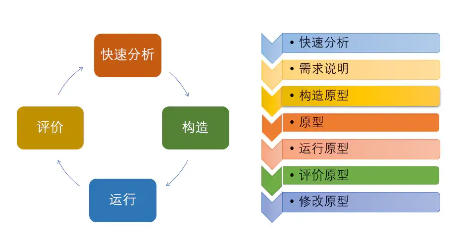

## 概要

这篇文章的目的是指导Link-Cooperation项目的管理和开发过程，内容不会涉及到具体的开发技术，不过可能会探讨一些开发时使用的设计模式。团队打算从**传统软件开发模型**、**OKR管理方法**、**DevOps开发方法论**、**敏捷开发过程**（Scrum和看板）以及**极限编程[^XP]的技术实践**等多方面借鉴、吸取、融合制定适合团队自身的敏捷过程。本文有个人的见解，也参考部分书籍、资料，这些会在文末标注出。关于敏捷方面的知识主要来自：《**Scrum精髓：敏捷转型指南**》。

这篇**指导性文章**即使在本项目结束后也**永远不会被定义为最终形态**，这与Scrum**敏捷过程没有“完成”的定义**是一致的（**敏捷没有成熟度模型，这是一种持续改进形式**，它的使用始终都要与动态的软件开发世界保持一致），该文章将会在不断的冲刺中持续的改进和完善，因为不能够保证文章的当前版本是否存在错误，也不能够保证在实际的项目冲刺时文章的指导方法能够适用。

文章的结构分成两大部分：

- 在前面部分整理相关的知识（可能非常全面细致），主要包括：OKR、传统开发模型、敏捷相关知识和DevOps等内容
- 总结提出适用于Link-Cooperation的敏捷开发过程

要注意的是：文章中的内容用在指导开发过程时也**不需要盲目地遵守**，要**根据实际情况灵活的变动**。

## 为什么需要方法论或软件工程，或者说为什么要写这篇文章？

软件开发需要有一个适合项目的流程驱动指导方法

否则有可能把项目做坏。。。。。。。

避免流程僵化

规避不必要的风险

让开发流程可控

不仅团队项目

个人项目


## OKR（Objectives & Key Results）

OKR（Objectives & Key Results），即“**目标与关键结果法**”，是一套**明确**和**跟踪目标**及其**完成情况**的管理工具和方法，它使组织能够有效地**设定目标**并**跟踪其进度**。

它与KPI“自上而下”的核心推动方向不一样，OKR的核心推动方向是“**由下而上**”的，并**混合“自上而下”**，先由上级定下一个目标，然后让下级一起思考，要达到这个目标需要完成哪些任务，确保组织的所有人都清楚了解这个目标为什么制定，以及要如何去完成。

OKR不仅适合**企业管理**，同样适合作为**个人生活的目标管理**。

OKR可以精炼为一句话：**我将会完成【O】，使用的衡量指标为【KR】**。

### OKR组成

- O（Objective）：**目标**，即我们想要达成的某件事
- KR（Key Result）：**关键结果**，要达成目标，需要完成哪些关键结果
- Todo：把关键结果分解成一个个**具体的行动和任务**

### 制定O（Objective，目标）原则

- 尽量用**简短的**、**突出重点**一句话描述出来，
- **有价值**、振奋人心的
- 具有**挑战性**
- **具体的**
- **可量化的**
- **控制目标的数量**，尽量不要超过5个
- 有**时间限制**的
- 由自己**主动思考、提出**

### 制定KR（Key Result，关键）原则

- 遵循**S.M.A.R.T原则**
- 能够**承接目标**
- 有**明确的负责人**
- 每个O（目标）的KR（关键结果）**最多设置3~5个**
- 由**自己主动思考、制定**
- 需要**能够感知到执行的进度**
- KR是基于结果的，要**描述的是结果，而不是任务**
- 先进行关键结果设计，再推定**任务清单**

### 实施OKR的关键

在OKR执行过程中**定期跟踪**和**定期复盘回顾**，是实施OKR的关键，这关系到OKR落地的成败。

在每个周期末，**对OKR进行评级**（可以采用**计分**的方式）也至关重要，这有助于成员**了解自己实现目标方面的表现**。

### OKR对组织的好处

- **快速设定可行动的目标**（Save Time For Setting Goals）：OKR的内建格式使团队能够轻松地开始设定并持续改进其OKR
- **轻松设定延伸目标**（Stretching）：若想挑战自己，可以考虑将至少一个关键结果设为延伸目标，它指的是没有100%把握能够达成的挑战性目标，因此就算没有十足的把握也没关系
- **方便跟踪**（Tracking）：关键指标是由许多具备价值基础（Value - Based）的项目组合成的，因此团队成员能够随时掌握执行进度并且时刻策略性调整
- **促进跨部门协作**（Alignment）：目标时常会牵涉不同部门，OKR提供了整个团队的共同目标，跨团队即便在不同层级，也都朝着同一个最终目标前进
- **提升组织成员的参与度**（Engagement）：由于一个目标可能包含多个关键结果，因此在设定OKR 时，许多团队会采用混合式的方法。组织上级负责设定目标，接着由个别的团队或成员设定有助于实现这些目标的关键结果。这种混合式方法混合了“上至下”与“自上而下”的概念，能帮助成员参与目标设定的流程，成员将会了解他们的关键结果实际上是如何帮助团队达成顶层的目标，并可以使该关键结果在此OKR 的周期中保持首要考虑的地位
- **共同承诺**（Commitment）：为了达成最终目标，会切割许多关键指标到多个团队中，而参与的各团队则**自行承诺**能够达成的关键指标，以及执行时坚持优先顺序

### OKR与敏捷结合

OKR 和敏捷有非常多的文化底蕴是一致的，比如：价值驱动，透明公开，持续适应，学习试错等。但如下图所示，我们也要意识到从根本上来说，他们的基因是不同的：


<center><font size="2"><a href="https://www.infoq.cn/article/OFx8xxEVXtsIpYXldsqA">该图来自：《深入浅出了解 OKR（十）：OKR 在敏捷转型中的实践》 by 大叔杨</a></font></center>

在很多行为方式上，OKR与敏捷（比如Scrum），也有非常多相似性，把它们结合使用的时候，可以**互相借鉴行为上的做法**。比如，在给Backlog进行优先级排序的时候，可以借鉴到OKR中，对OKR的目标进行优先级划分。

除了互相借鉴外，它们的共同使用，其实相当于**建立起了大小迭代模型**（显然是OKR的周期会比敏捷的冲刺要长）。**大迭代（OKR）**一般以季度为单位进行，而**小迭代（敏捷）**则以冲刺为单位。季度规划可以非常明确的提出短期目标和结果，以便于大家的聚焦和小成就的积累。

OKR 和 Scrum共同使用，最直接的收益就是**迭代目标非常清楚**，版本目标和成果展现也不用再纠结。由 OKR 驱动，价值可以直接穿透到个人，上达到 CEO，增加团队业务价值理解的深度和广度。

综上，在运用得当的情况下，把OKR与敏捷过程融合起来使用，它们可以创造出以价值为驱动的团队，改变团队的工作方式。

### 关于OKR更详细的文章推荐

这里不讨论OKR执行的具体过程，需要详细了解OKR的，可以读读下面几篇文章。

关于OKR：

- [OKR vs. KPI 一次读懂两大观念！](https://www.hububble.co/blog/okr)
- [OKR落地全流程解析](https://zhuanlan.zhihu.com/p/400696166)
- [大叔杨的InfoQ博客](https://www.infoq.cn/profile/70587A8F155972/publish/article)

关于OKR与敏捷的结合：

- [深入浅出了解 OKR（九）：OKR 和 Scrum 共舞](https://www.infoq.cn/article/fWkaSm2JFTlFLwKXIkVp)
- [深入浅出了解 OKR（十）：OKR 在敏捷转型中的实践](https://www.infoq.cn/article/OFx8xxEVXtsIpYXldsqA)
- [OKR与敏捷 | 瀑布式目标与敏捷的冲突](https://mp.weixin.qq.com/s?__biz=Mzg2MDA0NjAzNw==&mid=2247485046&idx=2&sn=97310e4293adacd623befbd9b5ba1a62&chksm=ce2d11ccf95a98da1e4c662e60bfa6689b22302c1c5262deeab9e408316a692e6961e062b117&scene=21#wechat_redirect)
- [敏捷与OKR实践（如何让OKR与敏捷计划共存）](https://www.jianshu.com/p/6c06b288dbdc) ，[英文原文](https://blog.crisp.se/2019/12/03/jimmyjanlen/make-okrs-and-forecasts-come-alive)

## 制定目标相关的原则

S.M.A.R.T：

5W2H：

二八原则：

## DevOps

https://azure.microsoft.com/zh-cn/solutions/devops/tutorial/#understanding

## 面向对象开发原则

## 策略设计模式

## 传统软件开发过程

### 瀑布模型（Waterfall Model of Software Development）

瀑布模型，也叫预测型生命周期模型、完全计划驱动型生命周期模型，如下图所示，一般瀑布模型将开发流程**自上而下分**为以下阶段：


<center><font size="2"><a href="https://kruschecompany.com/waterfall-software-development-methodology/">该图来自：《What is the Waterfall software development methodology and is it still relevant?》</a></font></center>

- 可行性分析与计划
- 需求分析与定义
- 软件设计
  - 概要设计
  - 详细设计
- 编码实现
  - 编码
  - 单元测试
- 测试
  - 集成测试
  - 系统测试
- 运维

原则上，瀑布模型的各项活动**严格按照线性方式进行**，并**以文档来驱动**，每个阶段的结果作为一个**里程碑，是一个或多个经过核准的文档**，直到上一个阶段完成，下一个阶段才能启动。在实际过程中，这些阶段经常是重叠和彼此间有信息交换的。

经典的瀑布模型的**线性过程过于理想化**，**迭代瀑布模型**可被认为是对其进行的必要修改，使其可实际用于软件开发项目，迭代瀑布模型提供了从每个阶段到其前一阶段的**反馈路径**，这是与经典瀑布模型的主要区别。软件过程不是一个简单的线性模型，它包括对开发活动的多个反复，每一个阶段产生的文档在后续阶段都可能被修改以反映发生了变化，当某一个阶段出现了不可控的问题的时候，就会导致返工，返回到上一个阶段，甚至会延迟下一个阶段。现实中的瀑布模型流程可能像下图这样：


改进意见 : **沿用瀑布模型的线性思想，在每个阶段进行迭代操作**

#### 优点

- 有利于大型软件开发过程中人员的组织、管理，有利于软件开发方法和工具的研究，从而提高了大型软件项目开发的质量和效率。
- 降低了软件开发的复杂程度，而且提高了软件开发过程的透明性，提高了软件开发过程的可管理性
- 推迟了软件实现，强调软件实现前必须进行分析和设计工作
- 各阶段文档齐全，减少沟通成本
- 以项目的阶段评审和文档控制为手段有效地对整个开发过程进行指导，为项目提供了按阶段划分的检查点，每个阶段评审通过才开始下一阶段，能够及时发现并纠正开发过程中存在的缺陷，从而能够使产品达到预期的质量要求
- 对其它开发模型（比如：迭代）有提供参考或者应用价值
- 从测试的角度看来，瀑布模式比截至到目前为止的其他模式更有优势。瀑布模式所有一切都有完整细致的说明。当软件提交到测试小组时，所有细节都已确定并有文档记录，而且实现在软件之中。由此，测试小组得以制定精确的计划和进度。
- 开发的各个阶段清楚，方便统筹和管理
- 早期的计划以及需求调研要做的比较充分，以便应对后期的需求变更
- 适合项目的需求等比较成熟稳定

#### 缺点

- 瀑布模型的突出缺点是不适应用户需求的变化，开发过程一般不能逆转，否则代价太大，如果需求变更，那么之前所有阶段都必须调整
- 通过过多的强制完成日期和里程碑来跟踪各个项目阶段，很难严格按该模型进行
- 模型缺乏灵活性，特别是无法解决软件需求不明确或不准确问题，很难在开发前期完全清楚地给出所有的需求。
- 瀑布模型中的软件活动是文档驱动的，各个阶段的划分完全固定，阶段之间产生大量的文档，管理困难，工作量大。而且当管理人员以文档的完成情况来评估项目完成进度时，往往会产生错误的结论
- 模型的风险控制能力较弱，由于开发模型是线性的，用户只有等到整个过程的末期才能见到开发成果，等使用后再提出变更，变更成本非常大，从而增加了开发风险。
- 在瀑布模型中，测试被认为是在软件开发过程的后期阶段进行的“一次性”活动，这带来一个巨大的缺点，因为测试仅在最后进行，所以一些根本性问题可能出现在早期，但是直到准备发布产品时才可能发现。
- 对于早期的需求调查所占比例很高，不适应敏捷开发等模型
- 流程单一，不太容易可逆
- 风险拖到后期发现，成本不可控
- 前期问题的积累导致整个项目失败

#### 合适什么样的项目？

- 开发需求特别明确的需求，用户的需求非常清楚全面且在开发过程中没有或很少变化，对软件的应用领域很熟悉
- 用户的使用环境非常稳定并且开发工作对用户参与的要求很低

比如：嵌入式系统、关键性系统、大型软件系统这类系统用户需求非常明确，往往都是政府驱动资金、人员配套充足适合瀑布模型。

### 快速原型模型（Rapid Prototype Model of Software Development）

快速原型模型又称**原型模型**，它是**增量模型**的另一种形式。

在需求分析阶段对软件进行初步而非完全的需求分析和定义，在真实的系统开发之前，迅速构造一个早期可运行的**软件原型（Prototype）**，它反映最终系统的部分重要特性，让用户通过使用原型来了解目标系统并进行评估，以便理解和澄清问题，使开发人员与用户达成共识，之后在原型的基础上，不断修改完善，逐渐完成整个系统的开发。一旦用户认为原型系统满足了他们的所有**真实需求**，开发人员就可以根据现有的原型书写**规格说明文档**，根据这份文档开发出的软件可以满足用户的真实需求。

它的流程可以参考下面三张图：



<center><font size="2"><a href="https://www.jianshu.com/p/39b6d8a10e0a">该图来自：《码歌老薛聊聊软件开发模型(瀑布模型、快速原型、螺旋以及敏捷开发模式)》</a></font></center>


<center><font size="2"><a href="https://www.rocheindustry.com/guide-to-rapid-prototyping/">该图来自：《THE COMPLETE GUIDE TO RAPID PROTOTYPING FOR PRODUCT DEVELOPMENT》</a></font></center>


<center><font size="2"><a href="https://universityinnovation.org/wiki/Resource:Rapid_Prototyping">该图来自：《Rapid Prototyping》</a></font></center>

快速原型的本质是"**快速**"。开发人员应**尽可能快地建造出原型系统**，以加速软件开发过程，节约软件开发成本。另外原型的**真正用途**是**为了获知用户的真实需求**，一旦需求确定了，那么原型是可以被**抛弃**掉（**探索型原型、实现型原型**），或者基于原型来**进化演变**成最终的软件系统（**进化型原型**）。

#### 原型的类型和策略

上面有提到原型可以选择被**抛弃**或者**保留**，这是根据不同类型的原型采用的不同策略决定的。

类型：

- **探索型**：这种原型目的是要弄清对目标系统的要求，确定所希望的特性，并探讨多种方案的可行性
- **实验型**：这种原型用于大规模开发和实现之前，考核方案是否合适，规格说明是否可靠
- **进化型**：这种原型的目的不在于改进规格说明，而是将系统建造得易于变化，在改进原型的过程中，逐步将原型进化成最终系统

策略：

- **抛弃策略**：将原型用于开发过程的某个阶段，促使该阶段的开发结果更加完整、准确、一致、可靠，该阶段结束后，原型随之作废。探索型和实验型就是采用此策略的

- **附加策略**：将原型用于开发的全过程，原型由最基本的核心开始，逐步增加新的功能和新的需求，反复修改反复扩充，最后发展为用户满意的最终系统，演化型快速原型就是采用此策略

采用何种形式、何种策略运用快速原型主要取决于软件项目的特点、可供支持的原型开发工具和技术等，根据实际情况的特点决定

### 螺旋模型（Spiral Model of Software Development）

## 软件测试过程

软件测试模型跟软件开发模型一样，**由一个模型来指导整个软件测试过程**，软件测试模型根据不同的被测对象、测试背景、被测对象质量要求、项目进度要求等，可以采用不同的测试模型实施测试活动，来指导软件测试活动安排。

### V模型

### W模型

### X模型

### H模型

### 前置测试模型

### 敏捷测试模型

## 迭代和增量（Iterative and Incremental）

Scrum基于迭代开发和增量开发，这两个术语经常被用作一个概念，但它们实际是有区别的。

**迭代开发（Iterative Development）**承认我们在把事情做对之前有可能做错，在把事情做好之前有可能做坏。迭代是一种**有计划的修改策略**，通过多次开发来改善正在构建的特性，逐步得出一个完善的解决方案。例如，对于一个知之甚少的产品，开始时可以先通过**创建原型**以获得重要知识，接着在每次迭代时**根据上一个版本的反馈**，决定下一个版本需要对那些部分进行改进或者丢弃某些特性，创建一个更好一点的修订版本。在产品开发中，迭代开发是改进产品的一种非常好的方法，它最大的**缺点**是在遇到不确定因素时，很难事先确定（计划）需要改进多少次。示意图如下（来自：[difference between incremental and iterative][difference between incremental and iterative]）：


**增量开发（Incremental Development）**则是把产品**分解成更小的特性**，**先构建一部分**，在每次增量过程中了解它们在目标使用环境的具体情形，然后根据更多的理解来做出调整，**构建更多的特性，直到最后组成项目的整体**。它最大的**缺点**是逐步构建的过程中，有迷失全局的风险（见木不见林）。示意图如下（来自：[difference between incremental and iterative][difference between incremental and iterative]）：


下面是一张给迭代与增量做对比，非常形象的一张图，同样来自：[difference between incremental and iterative][difference between incremental and iterative]


### 敏捷中的迭代和增量

Scrum**综合迭代和增量这两种开发方式的优点**，消除了单独使用其中任何一种方式的缺点。Scrum使用一系列**固定时长的适应性迭代**来同时利用这两种方法的思想，这种迭代方式便是**冲刺**。

冲刺采用**蜂拥式（all-at-once）**的开发方法，在每个冲刺都执行所有的必要活动，创建可工作的产品增量（产品的一部分而不是全部），**每个冲刺完成一部分分析、设计、构建、集成和测试工作**。这样的好处是可以快速验证我们在开发产品特性时所作的假设。


在Scrum中，并不是每次做一个阶段的工作，而是每次做一个特性，这样一来，在冲刺结束时就可以创建一个有价值的产品增量（产品的部分特性但不是全部）。

在收到对冲刺结果的反馈后，我们可以进行调整，在接下来的冲刺中可以选择开发其他特性或是修改用于构建下一组特性的过程。

在某些情况，冲刺完成的产品增量实际上并没有达到要求，作为对迭代开发和持续改进承诺的一部分，在今后的冲刺中可以安排重新修改这个特性，**这有助于解决事先不知道需要改进多少次的问题**。Scrum不需要事先确定迭代次数，在增量开发产品时，持续不断的反馈能做到迭代次数合理，经济合理。

## 关于敏捷过程（Agile Development）

这里主要以Scrum方法为切入点来看敏捷过程。


### 价值观

#### 敏捷软件开发宣言

- <font size="5">个体和交互</font> <font size="5">**胜过**</font> 过程和工具
- <font size="5">可以工作的软件</font>  <font size="5">**胜过**</font>  面面俱到的文档
- <font size="5">客户合作</font> <font size="5">**胜过**</font> 合同谈判
- <font size="5">响应变化</font> <font size="5">**胜过**</font> 遵循计划

#### Scrum价值观

- 诚实
- 开放
- 勇气
- 尊重
- 专注
- 信任
- 授权
- 合作

### 原则

#### 敏捷宣言遵循的原则

- 我们最优先要做的是通过**尽早的、持续的交付有价值的软件**来使客户满意。
- 即使到了开发的后期，也**欢迎改变需求**、敏捷过程利用变化来为客户创造竞争优势。
- **经常性地交付**可以工作的软件，交付的间隔可以从几个星期到几个月，**交付的时间间隔越短越好**。
- 在整个项目开发期间，业务人员和开发人员必须天天都**在一起工作**。
- 围绕被**激励**起来的个体来构建项目。给他们提供所需的环境和支持，并且**信任**他们能够完成工作。
- 在团队内部，最具有效果并且富有效率的传递信息的方法，就是**面对面的交谈**。
- **工作的软件**是首要的**进度度量标准**。
- 敏捷过程提倡可持续的开发速度。责任人、开发者和用户应该能够**保持一个长期的、恒定的开发速度**。
- 不断地关注优秀的技能和好的设计会增强敏捷能力。
- 简单----使未完成的工作最大化的艺术----**简单是敏捷流程的根本**。
- 最好的架构、需求和设计出自于**自组织的团队**。
- 每隔一定时间，团队会在如何才能更有效地工作方面进行**反省**，然后相应地对自己的行为进行**调整**。

#### Scrum原则

- 可变性和不确定性
  - 积极采用有帮助的可变性
  - 采用**迭代**和**增量开发**
  - 通过检验、调整、适应和透明来利用可变性
  - 同时减少各种形式的不确定因素
- 预测和适应
  - **不到最后时刻，不轻易决定**
  - **承认无法一开始就把事情做对**
  - 偏好适应性、探索式的方法
  - 用经济合理的方法接受变化
  - 在预测型事前工作和适应型刚好及时的工作之间做出平衡
- 经验认知
  - 快速验证重要的假设
  - 利用多个认知循环并行的优势
  - 组织工作流程以获得快速反馈
- WIP[^WIP]（Work In Process，已开始但未完成的工作）
  - 使用经济合理的批量大小
  - 识别并管理库存以达到良好的流动
  - 关注闲置工作（工作停滞，没人干），而非闲置人员（没活儿干）
- 进度
  - 适应实时的信息并重新制定计划
  - 通过验证流动资产来测量进度
  - 专注于**以价值为中心的交付**
- 执行
  - **快速前进，但不匆忙**
  - 以质量为魂
  - **选用最小、够用的仪式**

### 敏捷过程与传统开发过程的区别

瀑布流程waterfall

快速原型模型

快速原型模型又称原型模型，它是[增量模型](http://baike.baidu.com/view/1449573.htm)的另一种形式


螺旋模型

V（快速应用开发，rapid application development），软件测试的V模型

V模型大体可以划分为以下几个不同的阶段步骤：客户**需求分析、软件需求分析、概要设计、详细设计、软件编码、单元测试、集成测试、系统测试、验收测试。**


左边的下划线分别代表了需求分析、概要设计、具体设计、编码。

右边的上划线代表了单元測试、集成測试、系统測试与验收測试。

看起来V模型就是一个对称的结构，它的重要意义在于。很明白的表明了測试过程中存在的不同的级别。而且很清晰的描写叙述了这些測试阶段和开发阶段的相应关系。


### 敏捷与传统瀑布模型各自适用的场景


p6页


### 没有标签的敏捷（Agile Without The Label）

在展开工作后，我们不需要声称或者强调自己是敏捷的并且尽可能的避免使用敏捷用语。

引用：https://www.forbes.com/sites/stevedenning/2019/05/23/understanding-fake-agile/?sh=7280f7394bbe

### 真敏捷的三定律

### 对于敏捷的误解

敏捷（Agile）这个翻译其实有一定的问题，敏捷形容的就是动作灵活迅速~快，而敏捷过程并非强调快。

### 伪敏捷


### 敏捷落地的关键

### 敏捷过程弱点或不稳定的地方


敏捷过程过于依赖个人能力，对沟通能力要求高

由于轻文档，随着项目深入，可能会出现混乱，新进入团队的成员可能难上手


**很难准确的定义“轻量的“或必要的文档**


**很难把握整体产品的一致性**


尽管敏捷方法一直在促进开发，但是在部署流程方面仍然存在差异，仍然采用瀑布方法。尽管开发人员使用Agile降低了风险并提高了效率，但部署仍停留在线性瀑布式结构上，减慢了交付速度，并将测试留到了流程的最后，这是错误地分割所有权的流程。这在交付周期中造成了巨大的瓶颈，因为如果在部署快要结束时发现问题，开发人员将需要从头开始。


虽然敏捷开发大幅提升了软件开发的效率和版本更新的速度，但是它的效果仅限于开发环节。我们发现，运维那边，非常落后的手动部署上线，就成了新的瓶颈。

运维工程师，和开发工程师有着完全不同的思维逻辑。运维团队的座右铭，很简单，就是“稳定压倒一切”。运维的核心诉求，就是不出问题。

什么情况下最容易出问题？发生改变的时候最容易出问题。所以说，运维非常排斥“改变”。

于是乎，矛盾就在两者之间集中爆发了。

这个时候，神秘的主角DevOps，隆重登场了。

## 技术债

技术债务既指我们有意**选择的捷径**，又指许多损害软件系统的**不良实践**，这通常是由**糟糕的软件架构**，或者是为了加速软件开发速度，在应该采用最佳方案时**作出妥协导致**的。技术债是要还的，也需要支付利息，通常以将来额外再补做开发工作的形式，技术债**可能无法避免**，重要的是**管理**和**适时偿还技术债**。

### 技术债的种类

技术债有三种类型：低级技术债(或混乱或无心的技术债)、不可避免的技术债、策略性的技术债。

 - **低级技术债**

   指的是由不成熟或流程缺陷导致**设计粗糙**，工程实践糟糕和测试不足。通过适当的培训这种技术债是可以消除的。该类型的技术债比如：不合适或者糟糕的设计、缺陷（已知有问题但还没时间处理）、测试覆盖不充分、手工测试过多（该转自动化测试的时候还在手动测试）、集成和版本管理不善、缺乏平台经验等等。

 - **不可避免的技术债**

  这种技术债通常无法预测和预防。比如，我们**无法事前完美预测产品和设计随着时间推演是怎么演进**的，这样一来，随着后面完成重要的认识循环并获得经验知识，可能修改早期做出的设计和实现决策，这种受影响而必须要做的改动就是不可避免的技术债。再比如，我们使用第三方组件，在使用时可能良好的运作，但该组件的接口也是在不断的演化，之后未必能继续良好的运作，尽管可以预测到这种债务但无法避免。

 - **策略性技术债**

  它是一种工具用来帮助组织从经济角度更好的量化和权衡重要的决策，这种决策往往是实效性很强的决策。比如说产品有未做成钱却烧光的风险，因此，削减初期开发资金，把带有技术债的产品先推出市场，等有收益后再筹备资金进行后续开发。

### 技术债导致的后果

- 爆发点不可预测
- 交付时间延长
- 缺陷数量大增
- 开发和支持成本上升
- 产品萎缩
- 可预测性降低
- 团队表现越来越差
- 团队挫败感四处弥漫
- 客户满意度降低

### 技术债的起因

- 如期完工的**压力**
- 试图**以错误的方式提高速率**
- 进入减少测试可以提高速率的误区
- **债累债**，旧债如果不还，很快会积累新债

### 管理技术债

- 管理应计技术债

  - 使用良好的技术实践
  - 使用**强完成**定义，尽量避免弱完成定义导致积累的技术债
  - 正确理解技术债经济

- 让技术债可见

  - 让技术债在业务层面可见
  - 让技术债在技术层面可见
    - 把技术债当作缺陷录入缺陷跟踪系统
    - 为技术债创建[^PBI]插入产品列表中，通常在技术债偿还成本很高的时候采取这种方法
    - 专门的技术债列表

- 维护（偿还）技术债 

  - 并非所有技术债都应偿还，与其以下这些原因欠下的技术债，还不如承担高风险以高成本开发新产品，这样做更有意义
    - 行将就木的产品
    - 一次性原型
    - 短命产品
  - 应用童子军规则（既**有债就还**）
  - 分期偿还高息技术债
  - 一边做有客户价值的工作，一边偿还技术债

### 技术债在冲刺中需要注意

  - 避免什么专门的技术债冲刺或重构冲刺，更好的做法是分期还清债务
 - 技术债整理为随时可见的列表，在冲刺计划会议上，在挑选冲刺的条目时，关注技术债务板上的卡片，看计划中条目是否还涉及某块技术债的领域，如果有就取下来放入冲刺计划中
 - 在一次冲刺完成之后需要讨论积累的技术债

## Scrum敏捷框架图


## 角色

Scrum过程中存在以下三种角色：

- 产品负责人
- ScrumMaster
- 开发团队

其中**产品负责人**和**ScrumMaster**，可以兼任多个项目的产品负责人和ScrumMaster，也可以兼任其它角色比如开发人员，但是**最好不要同时兼任产品负责人和ScrumMaster**。

ScrumMaster与产品负责人的关系类似运动团队中，**教练**和**团队负责人**的关系，所以ScrumMaster担任的是**领导者**，而产品负责人担任的是**管理者**。

### 产品负责人

产品负责人是有授权的**产品领导力中心**，他是**唯一有权决定**要构建哪些特性并以何种顺序构建这些特性的人。产品负责人要保持一个清晰的构想并把它传达给每一为参与者，他的身份决定着他要对正在开发或维护的解决方案**全面负责**。如果项目较大，可以使用产品负责人组，但最好有一个人做决策和承担责任

#### 主要职责

- 管理经济效益
  - 版本层面的经济考量
  - 冲刺级别的经济考量
  - 产品列表的经济考量
- 参与规划活动
- 梳理产品列表
- 定义接收标准并验证这些标准是否得到满足
- 与开发团队协作
- 与利益干系人协作

#### 特征/能力

- 领域能力
  - 有预见性
  - 知道有些事是无法预见的
  - 具备业务和领域专长
- 人际交往能力
  - 和利益干系人关系好
  - 促成谈判/达成一致意见
  - 良好的沟通能力
  - 有正能量，会激励人
- 决策力
  - 得到授权，可以指定决策
  - 关键时刻敢于拍板
  - 有决断力
  - 从经济的视角权衡业务/技术能力
- 责任心
  - 承担产品责任
  - 参与并随时可以到场
  - 充当Scrum团队成员

### ScrumMaster（教练）

ScrumMaster帮助每个参与者理解并接受Scrum的价值观、原则和实践。

作为**教练**有**不断完善敏捷过程的义务**，也充当**润滑剂**，通过对产品负责人和开发团队这两个角色进行**指导**，**消除产品负责人和开发团队的隔阂**，使产品负责人能直接驱动开发团队。

作为**变革者**，他需要帮助团队**定义并遵守适合团队自己的敏捷流程**，从而确保工作完成。并且必须**积极推动变革**，帮助大家转变思维。

作为**辅助者**，还有责任保护团队不受外界干扰（“**保护伞**”），发挥领导作用，清楚阻碍团队生产率的障碍（为“**清道夫**”）。

另外需要注意ScrumMaster是领导者而不是管理者，他**没有管理权力**。

#### 主要职责

- 教练
- 服务型领导
- 过程权威
- “保护伞”
- “清道夫”
- “变革代言人”

#### 特征/能力

- 见多识广
- 善于提问
- 有耐心
- 有协作精神
- 保护团队
- 公开透明

### 开发团队

传统软件开发方法定义了不同的工作类型，如架构师、程序员、测试员、数据库管理员和界面设计师等。而Scrum定义的是开发团队的角色，这是一个由几种职位的人组成的**多样化跨职能团队**，简单来说就是前面提到的那几类人的**跨技能集合**。负责产品的设计、构建和测试。

开发团队进行**自我组织**，确定采用哪种最佳方式来实现产品负责人设定的目标。团队成员作为一个整体，必须具备多种技能以构建高质量、可工作的软件。

所以采用Scrum方法其实对开发成员的素质是有一定要求的，跨职能多样化的团队成员自组织，以最合适的方式完成工作。

#### 主要职责

开发团队的大部分时间都花在**冲刺执行**上

- 每日检视和调整
- 梳理产品列表
- 冲刺规划
- 检视和调整产品与过程

#### 特征/能力

- **自组织**：开发团队成员“**自组织**”的决定实现冲刺目标的**最佳方式**，没有项目经理告诉团队要怎么开展工作，自组织是系统自下而上，自发的属性，没有外部统治力量采用传统的自上而下，命令与控制的管理方式。举例子就是**大雁成群**的**V字飞行**，它们没有所谓的经理鸟，而是不同个体采用不同的方式彼此交互，遵循一个简单的，局部的，在不断反馈环境下作用的规则。这类系统拥有**非凡的稳定性**和**惊人的新颖性**。
- **跨职能**的多样化和全面化：团队成员拥有合适的技能，覆盖各个专业领域，并且总体上技能有一些重叠，团队有额外的灵活性，团队成员能够做多种类型的任务。
  - 跨职能、多样化
    - 跨职能的团队成员
    - 不同的学科背景
  - 多样化视角
    - 理解
    - 策略/启发
    - 心智模型
    - 偏好
  - 更好的成果
    - 更快的解决方案
    - 更好的解决方案
    - 更出色的判断
- **T型技能**：综合性T型技能团队，指有一定核心领域外的工作能力（**广度**，T的水平方向），核心领域内的职责，学科，特长（**深度**，T的垂直方向）
- **火枪手态度**：既“**人人为我，我为人人**”的态度，这强化这样一个观点：团队成员共同承担完成工作的责任，成败是整个团队的事情。没人会说：“我那部分做完了，你那部分没有，所以我们失败了”。这突出团队齐心协力的重要性。
- 高带宽沟通（广泛）
- 透明沟通
- 团队规模适中
- 专注、有责任感
- 工作节奏可持续
- 团队成员未定

## 团队结构

Scrum的关键价值在于团队，正如敏捷宣言的核心价值之一是“**个体与交互**”。对于团队成员，如前面提到的开发团队所应该具备的能力时提到过：“**团队成员拥有合适的技能，覆盖各个专业领域，并且总体上技能有一些重叠，团队有额外的灵活性，团队成员能够做多种类型的任务**”。

### 团队规模问题

每个团队的规模要适中，按照Scrum过程，一般规则团队最好有五到九名成员。

对于团队**负责的产品数量问题**，团队需要**保持专注**、**有责任感**，同时兼顾多个产品很难做到保证质量和专注度，所以最好**不要同时负责超过两个产品**。

### 团队类型

团队组织方式可以有**特性团队**和**组件团队**两种。

#### 特性团队

特性团队是一个跨职能，跨组件的团队，能够从产品列表中抽取并完成最终客户想要的特性。

#### 组件团队

组件团队专注于开发组件或子系统，这些组件或子系统只能实现最终客户想要的部分特性，组件团队也只完成需要集成到最终用户特性中的部分工作。

#### 选择特性团队还是组件团队？

由上面可见，**特性**其实范围是比**组件**要大的。对于Scrum是更倾向于组件特性团队的，不过大多数团队都更喜欢组件团队，这往往是因为他们认为对于特定的代码区域，只有专业团才能做出安全而有效的改动。

对于是选择特性团队还是组件团队，没有一个普遍适用的方法。而大多数成功的组织采用的是**混合模式**，这样的效果可能更好，**以特性团队为主**， 把**组件团队作为资源集中使用**时更加经济合理，偶尔有个别组件团队。

### 协调多个团队活动的方法

#### SoS（Scrum of Scrums）

如下图所示，SoS作为一种协调多个团队之间工作的方法，其实**是一种**类似Scrum团队在冲刺时每日例会的**会议**。只不过每日例会时只包含团队内的成员，而SoS是由各个团队的代表组成用来协调工作的。各个团队的参会者应当是**当时团队的最佳代言人**，另外SoS的会议时间长度最好**不要超过15分钟**。


#### 版本火车（Agile Release Train，ART）

版本火车根据按照一个共同的节奏协调跨团队的合作，使多个团队的愿景、规划和相互依赖关系保持一致。火车的隐喻暗示特性“**出站**”时间有一个**公开的时刻表**，所有参与产品开发的团队都需要在约定的时间把东西放到火车上，版本火车总是准时出发，谁也不等，但是错过了本轮版本火车不要紧，因为后面还有下一列火车定点出发。

如下图（来自：Scrum精髓：敏捷转型指南），参与版本火车的团队所有冲刺持续期都一样长，并且所有冲刺的步调都一致，在完成几个固定数量的冲刺后，就可以得到[^PSI]。


另外，我认为在只有一个团队，然后一个大解决方案存在多个项目的时候，也可以参考版本火车的做法。

## Scrum敏捷活动

一次Scrum完整的产品活动包括**规划**和**冲刺**。Scrum的**主要活动**是一次次的**冲刺**，在执行冲刺之前会执行**适度的规划**。

### 规划

需要承认的是，我们可能**无法事先制定完美的计划**，这可能是由于考虑不周到、认知不足或中途需求发生变更等因素导致的，所以事先规划是有帮助的，但不宜过度。

#### 规划原则

- **假设事先无法制定完美计划**：我们不相信能够在前期做好计划，因此也不会试图在前期做所有规划文件，但仍然需要在早期制定一些规划，以**取得前期规划与及时规划的平衡**。
- **事先规划有帮助，但不宜过度**
- **最后责任时刻才敲定计划**（不到最后责任时刻不做决定选择）：不成熟的决策除了代价非常高之外，还很危险。为了达到前期规划与及时规划之间的良好平衡，必须要**遵守最后责任时刻前仍可改变重要选项的原则**。这意味着我们会把适合<u>及时进的规划</u>留到有了最佳信息时再做。
- **注重响应变化和重新规划胜于遵循前期计划**，可以理解为**要重视持续规划**，而不要过于强调前期规划
- 正确管理WIP[^WIP]
- **提倡更小、更频繁的发布**
- 计划快速学习并在必要时调头：在获得认知或快速反馈后，如果我们判断出计划不可行，就应该转型或改变方向。

#### 多层级规划

如下图，Scrum在开发产品时，需要在多个层级上制定计划。其中每层规划会根据**输入**工件进行规划活动，然后**输出**规划成果。基本上高层规划的输出可能会作为低层规划的输入，不过这不是绝对的。比如冲刺规划，本轮冲刺的成果可能会作为下次冲刺规划的输入，这就发生在同一层级的规划上。又比如，产品级规划的输出正是组合规划的重要输入。


##### 战略规划（Strategy Planning）

处于最高层的战略规划，是组织根据市场、业务等因素在产品战略方向上制定的规划。

##### 组合规划（Portfolio Planning）

组合规划（或组合管理），**组合**二字表明了，处理的是一个**集合**。这个规划活动用来确定组合中要完成哪些条目、按照**什么顺序完成**以及**持续多久时间**，这些条目可以是产品、产品增量或项目。组合规划是一个永无休止的活动，只要有产品需要研发或维护，就需要进行组合管理。


###### 输入

- **新构想的产品**（组合列表中的候选）：附带新产品构想阶段收集到的各种数据，例如成本、时限、价值和风险等。
- **流程中的产品**：附带流程中的产品自己的一套数据（例如中间顾客的反馈、更新成本、进度安排和范围预估等）、技术债的债务状况和有助于找到产品未来出路的市场相关数据等。

###### 输出

- **组合列表**：既已经确定优先顺序的未来产品的具体工作事项清单，它已经通过批准但未开始进行开发。
- **一系列活动中的产品**：包括已经批准并立即开发的新产品，也包括目前处于生产过程中的产品和已经批准可以继续开发的产品。

###### 活动

- **进度安排**
- **管理流入**
- **管理流出**
- **管理流程中的产品**

###### 流程相关策略

- 进度安排策略

  - **优先考虑生命周期利润**：生命周期利润指的是产品整个生命过程中可能产生的**所有利润总和**，评估它的两个最重要变量是**延期成本**和**持续时间**（常用来替代工作量和产品规模）。我们需要确定使用哪个变量来衡量有利于**判断优化组合内各个产品的优先顺序**是有效的，以确定**进度安排方法**（最短任务优先、延期成本高的优先或加权最短任务优先），使产品的整个生命周期利润最大化。
  - **计算延期成本**
  - **估算要准确，不比精确**：为了正确安排组合列表中各条目的优先顺序，需要理解它们的工作量或成本（因为成本影响着生命周期），在估算组合列表的成本时，**需要准确，而不是精确**，因为在做初始估算时，我们得到的数据很有限。可以考虑使用**T恤衫尺码**而非精确数字的方式来估算，每个**T恤尺寸（XS、S、M、L、XL）**对应于一个范围（根据实际情况来设定每个尺寸对应的范围）。这样做的好处是**快**，通常也**比较准确**，还能在组合层面提供可操作的信息，并且能够消除时间上的浪费，不会让人产生太高的期望或有一种不真实的安全感。

- 流入策略

  - 应用经济过滤器：根据设定的经济指标来讨论，保留或否决新的构想。
  - 到达率和离开率要平衡：控制好组合列表的规模，避免超载，导致不堪重负。
  - 快速拥抱新涌现的机会
  - **为更小、更频繁发布做计划**

- 流出策略

  - **关注闲置工作，而不是闲置人员**：闲置工作比闲置人员更浪费。在明确以下两点之后，才开始做新产品：新产品的良好开发流程；新产品不会扰乱其它WIP的流程。这种策略与下面的“设立WIP限制”结合使用。
  - **设立WIP[^WIP]限制**：量力而行，不要从组合列表里取出超过我们能力范围的产品。以团队为生产能力单位来设定WIP限制，已知有多少Scrum团队，已知他们有能力做哪些类型的产品，就可以推算出可以同时进行多少开发工作、做哪些类型的开发工作。
  - **等待整个团队一起行动**：Scrum的生产能力单位是团队，如果团队不完整，那就不应该开始做新的产品。

- WIP[^WIP]管理策略

  - **边际效益[^边际效益]透镜**

    - 行动决策
      - 保留：继续开发产品
      - 交付：停止产品开发，上市
      - 转向：接受我们学到的东西，然后改变方向
      - 终止：停止开发，结束这个产品
    - 决策流程示意图

    

##### 产品规划（Product Planning）

**产品级规划**也可以称为**构想（Envisioning）**，目的是**获得潜在产品的基本特性**并为创建该产品而**制定大致计划**。不论构建什么产品，在快要结束产品级规划时，都应当有一个**产品愿景**、一个**概要产品列表**（含有经过估算的用户故事）和一个**产品路线图**（可选），可能还会产出其它工件，让决策者能够信心十足地着手开发产品。

在Scrum中，我们认为**事先无法（或应该尝试）了解产品的所有细节**。但是：不提出产品构想，通常得不到拨款；需要细节相当丰富，足以帮助我们理解客户、特性和概要解决方案；需要大致了解产品需要多少成本。

我认为构想其实可以理解为立项，但**不要把**Scrum项目的**产品构想与**“重量级、重仪式、计划密集的**立项活动**”**混为一谈**。我们**不会花过多时间或精力来构想产品**，因为我们希望**快速前进**，**越过猜想阶段**（在这个阶段，我们<u>认为</u>自己知道客户的需要和可能的解决方案），**进入快速反馈阶段**（在一系列连续的冲刺中创造客户价值）。毕竟只有真正开始通过持续与复杂环境交互的循环来实现解决方案，我们才能基于实际情况获取经验认知，使产品得以存在并进而茁壮成长，而越早开始构建有形的产品，就越早能验证我们的理解和假设。

产品级规划同样是一项**持续性的活动**，构想开始于团队某人对产品产生的某个**构思**，只要该构思通过了战略过滤器的筛选，就值得进一步研究和投入，然后就可以进入初步的构想了。

在构想阶段可以考虑执行一次**知识获取冲刺**，以获取必要的知识。


###### 输入

所有构想的输入是要同时考虑的，而不是按顺序考虑：

- **初始想法或转型的想法**
- 规划期
- 完成日期
- 预算/资源
- **信心门槛**（Confidence Threshold），它指的是针对构想“完成的定义”的一系列信息，决策者有这些信息作为依据才有足够信心做出**批准/驳回**投资后续开发的**决策**。信心门槛应该设置到恰到好处，不能过高也不能过低。

###### 输出

- **产品愿景**：描述要从哪些方面为用户或客户之类的利益干系人提供商业价值。愿景流行的格式一般有：
  - **电梯游说**：写一份30秒或1分钟的产品愿景快速宣传语。想象你和一个风投步入了电梯，必须把你的产品愿景讲给他听，争取在搭乘电梯这么短的时间内做到。
  - 产品数据表
  - **产品愿景盒子**：画出一个盒子，里面放着要交付的产品，提出三四个要点进行说明。
  - 用户大会简报
  - **新闻稿**：一有产品，就写一份新闻稿，写得好的新闻稿可以在一页或更少的篇幅内清楚传达出有报道价值的内容。
  - 杂志评论：草拟一份虚构的杂志评论。
- **概要产品列表**[^PBI]：产品规划产生的PBI，一般是粗略的、**初始史诗级别**的。描述PBI的方式有很多，比如用户故事（User Story）。
- **产品路线图**：它传递的信息是产品随着时间的推移如何以增量的方式构建和交付，以及驱动每一个版本的重要因素，可以采用**版本火车图表**来描述产品路线图。我们要关注的是**最小可发布特性集**[^MRF]的每一个版本，并且每个版本都有明确定义的**版本目标**，说明版本的目的和期望的产出。在制定产品路线图时，还要考虑概要架构或技术问题。对于时间跨度也需要考虑，可以考虑使用**固定周期的版本策略**。
- **其他工件**

###### 活动

- 建立愿景
- 创建概要产品列表
- 定义产品路线图，但如果只是为了一个单独的小版本制定计划，那么不需要产品路线图
- 其他活动以获得知识，这有助于达到目标信心阀值

###### 从经济合理的角度构想产品

构想经济要合理，准确（并不需要精确），总之尽可能的让构想合理与简化，刚好够用的事前计划和知识获取工作，做出当下最好的决策。

- 瞄准一个实际的信心阀值
- 关注短期收益
- 动作要快
- 花钱买经验认知
- 使用增量/誓行的资助方式
- 快速学习并调头（转向），即快速失败

##### 版本规划（Release Planning）

**产品规划**的目的是构想产品愿景（**包含哪些特性**），而**版本规划**的目的是**确定达成产品目标需要采取哪些具体的步骤**并且针对**增量交付**取得范围、日期和估算之间的**平衡**。


###### 版本发布节奏

不同组织不同产品采用的版本发布节奏不尽相同，但每个组织、产品都必须确定一个合适的节奏，有规律地向客户交付特性，一般有以下几种节奏：

- **在完成多个冲刺后合并为一个版本发布**
- **每个冲刺发布一次**
- **在完成每个特性完成后立即发布**，这种其实就是所谓的**持续部署**（或**持续交付**）

###### 版本时间维度

版本计划必须有相关联的**时间维度**，可以用**完成该版本所需的冲刺数**来表达，大多数版本都比较大，包含的特性得在多个冲刺中完成

###### 版本规划的时间安排

版本规划不是一次性的，它是经常性的、每个冲刺都要做的**例行活动**。一个比较**合理的时间点**是，在构想/产品级规划之后就开始做版本规划。

初步的版本计划可能不完整或不精确，在做版本相关工作期间，随着经验认知“浮出水面”，**版本计划是可以改变的**。版本规划的修改可以在**每次冲刺评审时进行，也可以在平时为后续每一个冲刺做准备或执行每一个冲刺时进行**。

###### 版本规划的同义词

- **长期规划**：表明目标放眼于多个冲刺

- **里程碑[^Milestone]驱动的规划**：采用这个术语，是因为各版本一般与重大里程碑保持一致，例如与完成一个最小可行（适销）特性集[^MRF]保持一致。

###### 版本线

让**版本发布可视化**的一个简单方法是**在产品列表中画线**，线上方的所有条目是这个版本计划要做的，线下方的所有条目是这个版本不计划做的。在对产品有更深入的了解后，可以在产品列表中上下移动这条线。


###### 输入

- **产品构想**
- **产品列表**
- **产品路线图**
- **团队速率**：对于老团队，使用其已知速率。对于新团队，则需要在版本规划期间**预测团队的速率**，要注意的是，速率的估算要**准确但不需要精确**。

###### 输出

版本规划的输出统称为“**版本计划**”。

- 【**特性范围、固定成本**】或【**冲刺范围、成本范围**】：不同的**版本约束**，产出不同
- 明确的**最小可发布特性集**[^MRF]：每个版本都要有一个明确的MRF，在构想产品期间，可能已经定义了它最初的最小可发布特性集，即便如此，也要在版本规划期间审核各个MRF，确保它们从客户角度来看的确能够代表最小可行（适销）产品。
- **冲刺图**：说明冲刺包含的PBI[^PBI]。

###### 版本约束

版本规划的目标是确定下一个版本中最有价值的特性，确定预期质量。而**范围、日期和预算**等是最影响到达目标的重要变量。

我们可以根据产品规划来确定其中一个或多个约束，在Scrum中，我们认为**不可能事前确定所有特性和范围**，因此传统的计划驱动式预测开发方式的“固定一切”这种方式是行不通的，在做版本规划时，这些变量**至少有一个是可变的**。

可行的约束组合是**固定时间**或**固定范围**，其它可变。而**固定时间**大多数人认为**是最符合Scrum原则的**，一句话，日期和预算可以固定，但**范围必须灵活**。这与Scrum强调的**时间盒限制**高度吻合，为版本设置一个固定的时限，可以限定我们能够完成的工作量并强制人们在举棋不定的时候强制确定PBI[^PBI]的优先顺序。

持续版本规划的一个重要环节是**利用当前认知重新考虑约束条件（更新约束）**，看是否会再次取得平衡。开发任何产品期间中，我们都必须持续做出决定、重新考虑并进而推翻之前的决定。

确定了版本约束之后，就可以比较容易的**计算成本**了。

###### 梳理产品列表【活动】

版本规划的一个**基本活动**是**梳理产品列表**，使其能够体现我们的目标价值和质量。我们在构想（产品规划）阶段确定了一个**概要产品列表（也许是史诗故事）**并用它定义每个版本的最小可发布特性集[^MRF]。

如果产品规划产出的概要产品列表条目[^PBI]太大，不能用，为了**细化**可以组织一次用户故事写作研讨会。可以把它纳入版本计划会或者单独安排。

一旦故事足够小，团队就可以**进行估算**并交流彼此对成本的**初步想法**，接下来根据版本目标和约束对估算过的**故事排列优先顺序**，并确保最小可发布特性集[^MRF]始终能够被识别出来并得到大家的一致认同。

###### 细化最小可发布特性[^MRF]【活动】

版本规划活动的一个重要工作是反复细致地重新评估和细化当前版本真正必须要有的MRF[^MRF]，从冲刺中得到快速反馈并获得经验认知后，我们会持续调整MRF。

在Scrum中由**产品负责人最终定义MRF**，也可以与合适的成员一起定义。

###### 冲刺映射（PBI归位）【活动】

**使近期PBI[^PBI]快速、尽早映射（或插入）特定的冲刺中**是很有帮助的。在进行**冲刺映射**之前，需要产品列表[^PBI]具有这三个特征：**详略得当的**、**估算合理**以及**排定优先顺序的**。


###### 版本进展沟通手段

主要使用某种形式的**燃尽图**和/或**燃烧图**和/或**产品列表倒置的燃烧图**作为主要的信息雷达，用它来显示版本的状态。

##### 冲刺规划与每日规划（Sprint Planning and Daily Planning）

这部分内容放到冲刺活动中记录

## 冲刺

Scrum敏捷开发在最长一个月的迭代或周期中安排工作，这些迭代或周期称为“**冲刺（Sprint）**”。冲刺是在**时间盒**内完成的，**持续时间短且长度一致**，一般来说，冲刺开始后就要**锁定冲刺目标**，不允许对范围或人员等目标进行更改，最后每个冲刺都要完成一个**潜在可发布产品增量[^PSI]**，并且要达到团队一致认同的**完成定义**中要求的最终状态。

大多数团队在初采用敏捷过程时，前几个冲刺都不会做得很好，这没有关系，只希望下一个冲刺都能比前一个冲刺做得好。

冲刺活动流程与相关工件如下面两张图所示：


### 冲刺规划（Sprint Planning）

每个冲刺都从**冲刺规划**开始，对Scrum团队在下一个冲刺中做哪些特定PBI[^PBI]达成一致意见，每个PBI[^PBI]会被分解成一系列经过估算的任务，这些任务共同组成了计划。而这些为完成PBI[^PBI]而必须完成的**任务级工作**，团队会为它们建立**冲刺列表**。这通常都遵循一个有用的**任务分解规则**，即分解后的任务都不会超过8个小时的工作量，有一些可能会稍微大一点。


#### 输入

- **产品列表**：在冲刺计划前，最重要的PBI已经梳理到**就绪状态**（关于PBI的就绪状态，看产品列表篇中的定义），可以理解为足够详细和细化
- **团队速率**：团队的**历史速率**是团队在一个冲刺里能**实际完成多少任务的指标**
- 约束：识别出业务或技术的限制，这些限制可能严重影响团队的交付能力
- 团队生产能力（容量）：生产能力要考虑到团队成员，每个团队成员都有哪些技能以及下个冲刺中他们的可用情况
- **初始冲刺目标**：产品负责人希望在这个冲刺内完成的**业务目标**

#### 输出

- **冲刺目标**：可以理解为业务目标
- **冲刺列表**：分解后的**任务级工作**

#### 冲刺规划的两种方式

##### 两段式冲刺规划

在第1阶段（**确定工作内容【选择条目】**），开发团队确定其完成工作内容的**生产能力**，预估在冲刺结束时能完成的PBI[^PBI]，主要以**故事点**的数目为单位。

然后在第2阶段（**确定工作方式【获得交付信心】**），通过**制定计划**来获得有能力完成第1阶段预测条目的**信心**。具体是把PBI[^PBI]分解成一系列任务，估算每个任务需要的工作量，然后团队比较任务估算的小时数和团队以小时计的生产能力，看是否满足第1阶段承诺的生产能力。

如果团队发现选区的条目太多或太少，或者选取的条目由于种种原因限制而实际不能在一个冲刺里一起开发，则可以**调整预期**或**重新细化冲刺目标**，以满足现有生产能力和相关约束。


##### 一次性冲刺规划

这是最常见的一种方法，即**选择条目**和**获得交付信心**这两个活动**交替进行**。

使用这种方式时，开发团队先确定自己有多少生产能力可以用于完成工作。基于可用的生产能力，冲刺目标可能需要细化。接着，团队选择一个PBI[^PBI]，然后表示有信心在当前冲刺做完它。**重复这个过程**，直到团队没有余力再做更多工作，这时最终敲定承诺，结束冲刺规划活动。


#### 活动

##### 确定生产能力

每次冲刺规划要根据上一轮和实际情况**调整生产能力**（或者**团队速率**）。

**总体生产能力的组成**：

- **在该冲刺内用于完成PBI任务的生产能力**
- **其它冲刺活动**：冲刺规划、冲刺评审、冲刺回顾、产品列表梳理
- 其它冲刺无关的活动：支持、维护、做其他项目
- **冲刺缓冲**：需要预留一些缓冲时间，以防有些事情的进展不如计划的那么顺利
- 个人休假

**表示生产能力的做法**：

- 用**故事点**来表示
- 用**工时**来表示

##### 选取PBI

挑选PBI[^PBI]时不一定必须选取PBI顶部优先级高的，需要根据实际情况，如果它太大（尝试先细化），或者由于技术等原因暂时无法开始，那么可以先挑选其它合适的PBI。一个规则是：**绝对不开始做“完不成条目”**。

##### 获得信心

使用预测速率来看承诺是否实际

##### 细化冲刺目标

冲刺目标总结了冲刺的业务目标和价值，产品负责人要带着初步冲刺目标参加冲刺规划活动。不过，初始目标可以在冲刺规划期间重新优化，因为冲刺规划的参与者可以一起决定实际能够交付哪些PBI。

##### 敲定承诺

在完成冲刺规划之后，开发团队敲定承诺，表明团队在冲刺结束时能够交付业务价值。冲刺目标和选取的PBI就是这个承诺的具体体现。

### 每日规划（Daily Planning）

**每日规划**出现在团队的**每日例会**上，这是一个关键的**每日检视-调整活动**，每日例会有一定的时间范围，**最好不要超过15分钟**。这**不是用来解决问题**的，而是每人轮流回答以下问题，通过每日的**快速反馈**，让集体了解有多少工作要做、要开始做哪些条目以及各成员之间如何以最好的方式组织工作。

- 在上次每日例会之后我**完成了什么**？
- 在下次每日例会之前我**计划做什么工作**？
- 有什么**障碍**让我无法取得进展？

### 冲刺执行（Sprint Execution）

在Scrum团队完成冲刺计划并就下一个冲刺的内容达成一致意见后，开发团队就要在ScrumMaster的指导下，执行为了完成特性而所需的所有**任务级工作**。

冲刺执行有点像一个**迷你项目**，为了交付一个**潜在可发布产品增量[^PSI]**而必须完成所有的工作。在冲刺执行期间，开发团队成员**自组织**并想方设法达成**冲刺规划期间确定的目标**。**ScrumMaster**不会为团队分配工作或具体指导团队开展工作，**自组织团队**必须自己想办法。而**产品负责人**负责回答需要澄清的问题、检视工作进展、为团队提供反馈、在条件允许时讨论冲刺目标调整并验证PBI是否满足接收条件。

冲刺执行的理想原则是**见机行事**，充分利用团队的技能，**逐步明确任务规划**，而不是试着事先列出一个完整而详细的工作计划。在冲刺执行期，团队为了适应环境变化，**可以持续进行任务规划**。


#### 工作流程管理

##### 并行工作和蜂拥式

管理工作流程的一个重要环节是确定团队应该**并行做多少个PBI[^PBI]**才能最大化冲刺结束时交付的价值。同时做多个或少个都有可能造成浪费，为了达到合理的平衡，团队需要**做适量的条目**，力求充分利用团队的**T型技能**和**可用生产力**，但又**不至于负担过重**。目标是**减少完成单个条目的时间**，同时**最大化冲刺期间交付的总体价值**。

这种就是所谓的**蜂拥式（all-at-once，Swarming）**的开发方法。指**有余力的团队成员聚在一起合力完成一个已经开始的条目之后再继续转做其他条目**。拥有**火枪手态度**和**T型技能的团队**会采用**蜂拥式**。蜂拥式有助于团队保持**对目标的专注**，而不是任务，这意味着能更快完成更多工作。另外不要误以为蜂拥式是一个保证团队成员都100%忙碌的策略。

**蜂拥式**在每个冲刺都执行所有的必要活动，创建可工作的产品增量（产品的一部分而不是全部），**每个冲刺完成一部分分析、设计、构建、集成和测试工作**。这样的好处是可以快速验证我们在开发产品特性时所作的假设。


另外**不能**把**瀑布式思维**应用于冲刺级别，这是一种为**危险的方式**，把冲刺执行当做一个**迷你瀑布项目**，如果使用这种方式，我们一开始就会同时做所有PBI，首先分析这次冲刺要做的所有条目，然后按顺序完成设计、编码和测试。这十分危险，到最后可能每个特性只完成了90%，而没有任何一个特性完成到100%。

另外在执行单个任务时也尽量避免瀑布式的思维。

##### 从哪个PBI开始

一般选择产品负责人认为优先级别最高的条目，但由于技术依赖或技术能力的限制，可能无法按照这个顺序来选，所以开发团队需要见机行事并做出合适的选择。

##### 如何安排任务

我们需要关注**价值交付思维**，拥有这个思维的团队成员**灵活**，组织任务并安排合适的人选来做这些任务。这样一来，等待时间少了，工作交换的规模和频率也少了。使用**快速循环**来创建测试、创建代码、执行测试、优化测试和代码，然后重复这个循环。这种方式能够使工作一直流动（没有阻塞的工作），也支持**快速反馈**，因此能够快速发现问题和解决问题，并使团队成员有机会**发展T型技能**，进而能够以**蜂拥式**完成一个条目。

#### 每日例会

**每日规划**出现在团队的**每日例会**上，这是一个关键的**每日检视-调整活动**，得到**快速反馈**，可以帮助团队以更快、更灵活的工作流完成解决方案。

#### 任务执行：强调技术实践

**敏捷开发**积极采用良好的**技术实践**，敏捷社区把一些成熟的技术实践总结起来并称为“**极限编程[^XP]**”，以下是极限编程总结的**十二个最佳实践**：

- 完整团队、现场客户 ( On-site Customer )：XP项目的所有参与者（开发人员，业务分析师，测试人员等）一起工作在一个开放的场所中，他们是同一个团队的成员，这个场所的墙壁上随意悬挂着大幅的、显著的图表以及其他一些显示他们进度的东西。还可以将使用正在构建的系统的一个或多个客户分配给开发团队，客户有助于指导开发，并有权优先考虑，还可以说明需求并回答开发人员可能遇到的任何问题。这确保了与客户进行有效的沟通，这样需要的文件就更少了。
- 规划策略、计划游戏（The Planning Game）：计划是持续的、循序渐进的。每两周，开发人员就为下两周估算候选特性的成本，而客户则根据成本和商务价值来选择要实现的特性。
- 客户测试（Customer Tests）：作为选择每个所期望的特性的一部分，客户定义出自动验收测试来表明该特性可以工作。
- **简单设计**（Simple Design）：团队保持设计恰好和当前的系统功能相匹配，它通过了所有的测试，不包含任何重复，表达出了编写者想表达的所有东西，并且包含尽可能少的代码。
- 结对编程（Pair Programming）：所有的产品软件都是由两个软件、并排坐在一起在同一台机器上构建的。
- **测试驱动开发**（TDD，Test-Driven Development）：程序员以非常短的循环周期工作，他们先增加一个失败的测试，然后使之通过。
- **代码重构**（Refactoring）：随时改进糟糕的代码。保持代码尽可能的干净、具有表达力。
- **持续集成**（CI，Continuous Integration）：团队总是使系统完整地集成。
- 集体代码所有权（Collective Ownership）：任何结对的程序员都可以在任何时候改进任何代码。
- 编码标准、代码规范（Code Standards）：系统中所有的代码看起来就好像是被单独一个“**非常值得胜任的**”人编写的。
- **隐喻**（System Metaphor）：团队提出一个程序工作原理的公共景象。每个项目都有一个“名称系统”和描述，有助于指导各方之间的发展过程和交流。XP相信每个应用程序都应该具有基于简单隐喻的概念完整性，这就解释了系统工作的本质。例如，一个大的XP项目是克莱斯勒的工资系统。 这个项目的隐喻是，工资系统就像一条装配线，其中小时零件被转换成美元零件，所有零件都被组装并产生薪水。
- 可持续的速度、小型发布（Small Release）：团队只有持久才有获胜的希望，他们以能够长期维持的速度努力工作，他们保持精力，他们把项目看作是马拉松长跑，而不是全速短跑。

#### 沟通

冲刺执行时的沟通和传递信息，可以用任务版和/或燃尽图和/或燃烧图作为主要的信息雷达，它们配合使用。

##### 任务版（Task Board）

对于任务版，另一种敏捷方法“**看板（Kanban）**”，它使用**详细信息来可视化工作流的不同阶段**，可以配合使用


##### 冲刺燃尽图（Sprint Burnup Chart）


##### 冲刺燃烧图（Sprint Burndown Chart）


### 冲刺评审（Sprint Review）

临近冲刺结束时，团队要进行两个重要的“**检视-调整**”活动：**冲刺评审**的重点是**产品本身**，**冲刺回顾**考查的是**团队的产品构建过程**。

在冲刺评审期间，我们检视（并调整）工作成果（**潜在可发布产品增量[^PSI]**），冲刺评审发生在每个冲刺周期快要结束时，在冲刺执行之后、冲刺回顾之前（偶尔也发生在冲刺回顾之后）。

冲刺评审使每个可以对产品开发工作提出建议的人有机会**检视和调整当前构建的产品**。冲刺评审让人们清楚看到产品当前的状态，包括各种让人头疼的真相。此时可以提问、发表见解或给出建议，讨论结合当前实际最好采取哪些措施。

因为冲刺评审有助于确保组织正在创建成功的产品，所以它是Scrum框架中**最重要的认知循环之一**。而且，因为冲刺持续期很短，所以这个循环也很快，能够频繁**校正路线**，让产品开发沿着正确的方向前进。如果把这种反馈推迟到很后期，并且假设所有工作都要以某个基线计划来进展，我们会像很多人习以为常的那样惊讶、失望和沮丧。

执行冲刺评审的常见方法是：总结或概要说明冲刺目标中哪些完成了、哪些没有完成；演示潜在可发布产品增量[^PSI]；讨论产品当前状态；调整产品未来方向。


#### 准备工作

- 确定邀请谁参加
- 安排活动日程
- 确定冲刺工作已经完成：满足认同的完成的定义
- 为演示做准备
- 确定谁做什么

#### 活动

- 总结：概述在冲刺中实际产生的产品增量，这些信息以总结或概述的方式说明当前冲刺的成果，与冲刺目标进行对比。如果结果与目标不符，Scrum团队要给出解释。评审的目的是描述完成的目标，然后利用这些信息确定最佳前进路线。
- 演示：冲刺评审只允许演示已完成的内容，所以必须在冲刺评审之前执行**接收测试[^AT]**，让团队知道哪些特性满足“**完成的定义**”
- 讨论
- 调整

### 冲刺回顾（Sprint Restrospective）

**冲刺回顾**考查的是**团队的产品构建过程**。冲刺回顾使整个Scrum团队有机会停下急促的步伐，思考片刻。在回顾期间内，团队可以无拘无束地检查发生的事情，分析自己的工作方式，找出改进方法，制定改进计划。任何影响团队产品构建方式的事情都可以仔细检查、讨论，包括过程、实践、沟通、环境、工件、工具等。

冲刺回顾可以很简单，它是用来反思流程的，集体可以头脑风暴来提出了解，比如讨论以下问题：
1.  这个冲刺哪些地方做得好，需要继续发扬？
2.  这个冲刺哪些地方做得不好，今后要避免？
3.  我们要开始做什么或改进什么？

根据这些讨论，团队成员定制出一些可实施的改进措施，然后用改进后的过程开始下一个冲刺。

冲刺回顾时参与者还要花一些时间复查上次回顾之后改进措施的落实情况。

冲刺回顾中确定的改进行动，把每个行动所对应的任务填入冲刺列表，为了确保落实改进行动，不要把二者分开，一定要整合。


#### 准备工作

- 定义回顾重点：在回顾开始之前，确定重点并进行交流
- 选择练习活动
- 收集客观数据
- 安排回顾日程

#### 活动

- 营造氛围：让人们在表达意见时必须要有安全感
- 建立共同背景
- 事件时间线
- 得出见解：使用见解卡片，选择见解，确定改进措施
- 确定采取行动
- 贯彻执行

#### 冲刺回顾的十宗罪

冲刺回顾可能存在的问题：

- 不做回顾或参加的人很少
- 不着边际、空洞无物
- 对重大问题视而不见
- 引导者无能
- 郁闷
- 指责游戏
- 代替特定的过程改进
- 野心勃勃
- 没有贯彻执行

### 估算与冲刺速率

在规划和管理产品开发过程中，我们可能需要确定这些问题：“将要完成多少个特性？”、“什么时候做完？”、“需要花多少钱？”。为了回答这些问题，我们需要**估算**产品的**工作量大小**并测量出**工作速率**。

一个冲刺中其所有PBI[^PBI]**单个估值**相加即为该**版本的近似大小**。在一个冲刺内所有已完成PBI [^PBI]的大小之和即为该冲刺的**团队速率**。有了**大小估值**和**速率**，就可以用**大小除以速率**的方式，推导出**持续期**。

#### 估算

##### 估算的时机和单位

为了做好计划，大多数组织会在三个不同的细节层面做估算：

- **组合列表**：使用粗略、相对的估算，比如使用**T恤衫尺寸**
- **产品列表**：使用**故事点**或者**理想天数**，需要注意的是理想天不能直接对应自然天
- **冲刺列表**：其实就是估算冲刺时的任务大小，一般可以使用**工时**

常见单位：

- **故事点**
- **理想天**：需要注意的是理想天不能直接对应自然天

##### PBI估算的原则

- 团队估算：大家一起估算
- 估算不是承诺
- 要准确，而不是精确：错误的、过于精确的估算纯属浪费
- 使用相对值，而不是绝对值：人们更擅长相对大小的估算

##### 规划扑克

对PBI[^PBI]大小进行评估时可以使用规划扑克，**规划扑克**是按大小排列PBI[^PBI]的一种技术，它基于**共识**来估算工作量。每个人根据自己的评估之后亮牌，如果不一致则进行讨论，他的价值在于讨论和分享各自的理解，激发团队个人对PBI[^PBI]细节的思考。

规划扑克基本概念：

- 基于共识
- 专家意见
- 激烈的讨论
- 相对大小
- 准确的分组或装箱
- 利用估算历史的优势

为了进行规划扑克活动，团队必须决定用什么数字范围或者序列来给估算进行赋值。因为目标是准确但不过分精确，所以我们并不倾向于使用所有的数字。相反，我们倾向于使用这样一组数值范围：在这个范围内的小的一端有更多数字，而在这个范围内的大的一端则有较少数字，它们之间的间隔更大。

在规划扑克中，我们不用平均数，也不使用数值范围（牌）之外的数字。目标不是为了妥协，而是让开发团队从团队的角度对故事的整体大小（工作量）达成共识。

下面是一个规划扑克，扑克牌的例子：


#### 冲刺速率

**速率**是**每个冲刺完成的工作量**。速率是在冲刺结束时**由已完成的所有PBI[^PBI]大小之和来衡量**的。一个PBI要么已完成，要么未完成，产品负责人从未完成的条目中得不到任何价值，所以速率并不包含未完成的PBI的大小。

速率**衡量的是产出（交付的大小）**，而不是成果（交付的价值）。使用速率有**两个重要的目的**：

1. **版本大小**除以团队的**平均速率**就可以算出**需要多少个冲刺才能完成这个版本**
2. 速率可以用来帮助**确定团队在下一个冲刺中能完成多少工作量**

为便于做计划，速率用**范围**来表示往往最有用，例如：”这个团队通常每个冲刺能完成25到30个点。“，**使用范围值可以使我们准确但同时又不至于过分精确**。

对于有**历史速率数据**的团队，可以直接用来预测未来的速率。

而没有历史速率数据的，**预测团队速率**的一种常用方法是，让团队执行**冲刺计划（冲刺规划）**，确定团队能在一个单独的冲刺中完成承诺交付的PBI。如果承诺靠谱，我们就可以简单地把承诺完成的各个PBI估算结果的大小累加在一起，用它来作为团队的**预测速率**。

因为我们**真正需要的是速率范围**，所以可以让团队为**两个冲刺**做计划，然后把其中一个预估的速率数作为较大值，而另一个作为较小值（两个预估值很可能不一样）。或者我们可以凭直觉根据其他团队的历史数据来调整预估速率，然后把一个预估值转换成有两个预估值的范围。

一旦团队做过一个冲刺，我们就可以得到一个**实际的速率**了，此时应该**丢弃预测速率**而**使用实际速率**。而且，随着团队逐步建立实际的速率历史，我们应该计算平均值或者使用其他的统计方法，得到一个**速率范围**。

## Scrum敏捷工件

PBI

## Link-Cooperation敏捷流程

DevOps


我们打算参考OKR、敏捷、极限编程以及传统瀑布流程等多方面来定制自己团队的开发过程，我们不声称自己是敏捷的。

下面会尽量**避免使用敏捷的相关术语**，这是为了避免“**声称**”或者“**强调**”我们是敏捷的。我认为如果滥用敏捷的术语或者教条化的过分强调敏捷，最终会导致团队所谓的敏捷过程会变成**形式化**的**伪敏捷**。同时这也是为了让团队可以**跳出所谓敏捷的范畴**，使团队能从其它方法中吸取更多的实践经验


使用 scrum 管理敏捷软件开发、使用看板以及使用仪表板直观呈现进度


### 基本愿景

人数、产品规模、目标

希望从过程中得到什么

约束（时间精力，周期.......）

### 团队规模

团队只有两人，这里分别称为John[^John]和Phan[^Phan]。

### 角色分工

参考Scrum，分出以下三个角色：

- 产品负责人：产品领导力中心，决定要构建哪些特性并以何种顺序构建这些特性。对正在开发或维护的解决方案**全面负责**。
- 项目流程监管（对应Scrum的ScrumMaster）：充当教练和领导角色，负责监管和指导整个开发流程，调教和优化开发流程，协调产品负责人和开发人员。
- 开发人员（对应Scrum的开发团队）：包括设计、开发、部署、测试等多项工作。**自组织**并且**跨职能多样化**的综合性**T型技能**开发团队。

与Scrum过程一样，产品负责人和项目流程监管不同时兼任，但是它们都可以兼任开发人员。在这个项目上，John担任产品负责人和开发人员，Phan担任项目流程监管和开发人员。

### 项目拆分

Link-Cooperation拆分成四个子项目：

- Link-Cooperation Server：服务端
- Link-Cooperation Web Manager Server：Link-Cooperation服务器集群的管理界面，放在master上，用于管理服务（启动、停止、重启）、监控服务器的资源（CPU、内存、网络、磁盘空间）、管理集群、数据统计等
- 小程序端（主要用作移动端）
- 跨平台桌面端（Windows、MacOS、Linux【主要考虑Ubuntu、Kali、CentOS的X环境】）

其中Link-Cooperation Web Manager Server可以保留到后续的版本再提上来。

### 活动

### 工件

### 规划

在提出项目之后，最好尽快进入，准备并开始阶段，不然对项目的热情可能很快被消耗没了

强完成定义

31、85页

“完成-完成”

## 


对于版本规划，可以在pbi列表上用线，规划出不同的版本，并与产品路线图关联起来


### 冲刺

#### 冲刺规划

#### 每日例会

每两日一次五分钟左右简短的例会(直接微信文本)，沟通本次例会之前做了啥，例会之后准备做啥，以及疑点难点

最详尽的计划出现在团队的每日例会上。每日例会上，每个人会讲述在上次例会后做了什么，今天准备做什么，是否遇到任何阻碍

#### 冲刺执行

#### 冲刺评审

做次代码审查（Code Review）


#### 冲刺回顾

### 文档

与传统开发方法一样，文档在敏捷过程中同样是重要的，文档存在的本质目的其实就是**用于沟通**（与用户沟通、开发团队内部沟通、与接口使用者沟通...）。只不过敏捷开发强调**轻量级**、并且**具有价值**的文档。

敏捷开发宣言告诉我们要**“重沟通，轻文档”**，千万不能误解，这个**轻**并不是指”轻视、不需要“的意思，而是**轻量级**的意思。

文档可用于沟通，让开发人员有迹可循。例如，对于某个SDK，如果没有一分尽可能详细文档来描述API，随着时间的推移，SDK维护者可能会遗忘了SDK的大量细节，而对于SDK的使用者，在使用的时候可能根本无从下手。

我们的文档不需要面面俱到，更不需要拘泥于一些可有可无的细节，只在“**必要的时候**”留下“**准确**”、“**精简**”和“**有价值**”的文档。

product backlog、sprint backlog、todo、user story...

### 代码注释

注释是对代码的解释和说明，本质目的是为了**增强代码的可读性和可解释性**。对于注释我们也采用与文档类似的方式对待，尽可能的采用轻量的文档，不在没必要的地方留下**无用的注释**，留下的注释也要描述足够的**精简、准确、清晰明了**。

对于**内部接口**，在大多数时候注释都可以足够的轻量，甚至文档注释都可以省略掉。但是对于像SDK API，这些的**外部公开接口**，就需要尽可能的保留有用的注释，并且接口的文档注释也得描述清楚，不然别人可能根本无法使用。

如何**区分是否有必要留下注释**，需要一定经验，有些看起来可有可无的注释，其实是非常有必要的。比如，有些注释是用来**给代码逻辑做层次切割**的，如果少了，那么在阅读的时候，因为缺少了结构分层，会加大阅读难度，下面这段代码是一个例子：

```c++
Window create_main_view()
{
    // 实例化main view
    Window main_view;
    main_view.set_title("main view");
    main_view.set_size(500, 500);
    
    // 配置main view菜单
    Menu menu;
    menu.add_action("退出", on_quit);
    menu.add_action("打开", on_open);
    main_view.set_menu(menu);
    
    //
    // 配置客户区空间
    //
    
    // 加入画布
    Canvas canvas;
    canvas.set_size(300, 300);
    canvas.set_background(Black);
    main_view.add_widget(canvas);
    
    // 加入操作面板
    Panel panel;
    panel.add_action("放大", on_zoom_in);
    panel.add_action("缩小", on_zoom_out);
    main_view.add_widget(panel);
    
    return main_view;
}
```

试试把上面代码中的注释去掉，对比会发现，由于注释的存在分割了代码的层次，可以一眼就看完这个函数到底做了啥，而去掉注释后还得花更多的时间。

需要补充的一点是，对于代码的某些地方，比如一个函数，未实现但需要留下一个存根（桩），又或者在未来需要加入某些改动，最好补充一个todo注释。下面是一个例子：

```c++
/**
 * @fn shutdown
 *
 * @todo 加入关闭系统实现（包括Windows、Linux、OSX）
 */
void shutdown()
{
    throw Stub("shutdown function's stub");
}
```

### 版本控制

我们使用git来做版本控制，托管平台可能使用Github或者Gitee，但需要讨论过后才做决定。


需要强调的是：

commit消息。。。。

git flow

rebase、merge、squash


### 管理平台

项目整体

​	飞书？

​	pingcode？

个人todo

​	微软的todo

### 工具

#### 产品列表

就绪的定义

127页


就绪的定义和完成的定义，可以视为PBI在一个冲刺周期中的两种状态

127页


用户故事

#### 时间盒

72页

#### 燃尽图

#### 燃烧图

#### 文档沟通工具

Product Backlog

Sprint Backlog（或Sprint Todo）

User Story

#### 开发工具

logview

### 应用极限编程实践

极限编程XP的12个最佳实践

### 接下来要做什么？

进行一次认知冲刺，细化我们自己的敏捷过程

## 词汇表

[^XP]: 极限编程（ExtremeProgramming，简称XP）
[^John]: 兼任产品负责人和开发团队成员
[^Phan]: 兼任ScrumMaster和开发团队成员
[^PBI]: Product Backlog Item，产品列表条目
[^PSI]: Potentially Shippable Product Increment，潜在可交付增量

[^WIP]: Work In Process，积压的工作，进入开发过程但并没有完成，对客户或用户来说也不可用的工作。指产品或服务的所有当前在做得或在排队等待做的资产或工作成果

[^MMF]: Minimum Marketable Features，最小适销特性集（MMFs），与一个特性相关的最小功能集合，交付时客户必须能认可其价值（适销）。与“最小可发布特性集MRF”相对
[^MRF]: Minimum Releasable Features，最小可发布特性集（MRFs），（1）一个发布必须包含的特性的最小集合，使此版本能够发布。（2）由一组最小适销的特性组成的特性集。与“必须有的特性集（MVP）”同义
[^MVP]: Minimum Viable Product，最小可行产品（MVP），只包含能够部署的特性、没有其他特性的产品
[^边际效益]:经济学上的概念，最需要的时候，效益是最大的，往后不断递减
[^UAT]: User Acceptance Test，用户接收测试，它支撑用户或客户
[^AT]: Acceptance Test，接收（验收，最好用接收的译法）测试，在敏捷过程中，它并不是在最后阶段才执行的，而是在开发过程中持续执行的，从在敏捷方法中所发挥的作用来看，接收测试时支撑团队和开发过程的，而UAT则是支撑用户或客户的，出现在开发过程之后。UAT侧重于验收，有已通过检验、可以付款的意思，而AT侧重于引导团队与干系人之间的沟通，指引开发过程沿着正确的方向前进。
[^Milestone]: 里程碑

## 引用链接

[difference between incremental and iterative]: https://www.zentao.pm/agile-knowledge-share/Scrum-what-the-difference-between-incremental-and-iterative-development-845.html	"Scrum: what's the difference between incremental and iterative development?"
[Scrum of Scrums]: https://www.atlassian.com/agile/scrum/scrum-of-scrums	"Scrum of Scrums"

## 参考书籍

- 敏捷软件开发
- Scrum精髓：敏捷转型指南，官方内容样本https://innolution.com/essential-scrum/table-of-contents
- 