## 概要

这篇文章的**目的**是指导Link-Cooperation项目的管理和开发过程，内容不会涉及到具体的开发技术，也不讨论产品的性能和安全性问题，不过可能会探讨一些开发时使用的方法、设计模式。团队打算从**传统软件开发模型**、**OKR管理方法**、**DevOps开发方法论**、**敏捷开发过程**（Scrum和看板）以及**极限编程[^XP]的技术实践**等多方面借鉴、吸取、融合制定适合团队自身的敏捷过程。本文有个人的见解，也参考部分书籍、资料，这些会尽量在文末标注出来。关于敏捷方面的知识主要来自：《**Scrum精髓：敏捷转型指南**》和《**看板实战**》。

这篇**指导性文章**即使在本项目结束后也**永远不会被定义为最终形态**，这与Scrum**敏捷过程采用或转型工作没有“完成”的定义**是一致的（**敏捷没有成熟度模型，这是一种持续改进形式**，它的使用始终都要与动态的软件开发世界保持一致），该文章将会在不断的冲刺中持续的改进和完善，因为不能够保证文章的当前版本是否存在错误，也不能够保证在实际的项目冲刺时文章的指导方法能够完全适用。

文章的结构分成两大部分：

- 在前面部分整理相关的知识（不会做到全面细致，但尽量保证正确性），主要包括：OKR、传统开发模型、软件测试模型、敏捷相关知识和DevOps等内容
- 总结并提出适用于Link-Cooperation项目的**初步敏捷开发过程**

> Notes：文章中的内容，用在指导开发过程时也**不需要盲目地遵守**，要**根据实际情况灵活的变动**。另外很多知识，光靠文章中这点不完全保证正确性的总结性内容，可能是远远不够的，最好是直接找与特定内容相关的、比较权威的**书籍**来看看。
>
> Notes：文章中很多术语会附带对应的英文，这是为了能够方便的到外网查资料

## 为什么要写这篇文章？

为什么要写这篇文章？换种说法应该是：**为什么需要制定Link-Cooperation项目专门的项目开发流程**？

为了让Link-Cooperation项目能够顺利、流畅、稳定的进行下去，最终产出具有价值的产品，避免Link-Cooperation最终做坏，导致项目失败。照之前协作的项目失败的经验来看，我们需要一个能够控制项目、控制团队、使产品开发流程可控的、避免流程僵化、规避不必要的风险的开发方法，同时要兼顾轻量、灵活性。另外在项目上线之后，产品的运维同样非常重要，如何监控产品的质量问题、线上服务器的状态等方面，都需要制定一些良好的实践和指导方法。

但既然在软件开发、产品运维方面已经存在了很多的指导方法和模型，**为什么不直接使用而需要“重新制定适合Link-Cooperation专门的项目开发流程”呢？**

不管是传统开发模型还是敏捷开发模型，它们基本上都不是一个可直接应用于任何团队、任何项目的标准化过程，不能保证项目可以有条不紊地按照步骤一步一步按照模型执行之后，就能在指定的时间和预算内产出让客户满意的高质量产品。

在用于特定的团队的特定项目时都需要进行适当的调整，可在模型基本框架的基础上，补充一些特定的价值观、实践、方法和原则，甚至可对不合适的地方进行修改，使其能够适应团队和项目的真实情况，形成项目特有的开发过程版本。

同时希望在这篇文章指导下执行的Link-Cooperation项目所留下的经验，可以指导以后的协作项目和个人项目，并且不断的完善。

## OKR（Objectives & Key Results）

OKR（Objectives & Key Results），即“**目标与关键结果法**”，是一套**明确**和**跟踪目标**及其**完成情况**的管理工具和方法，它使组织能够有效地**设定目标**并**跟踪其进度**。

它与KPI“自上而下”的核心推动方向不一样，**OKR的核心推动方向**是“**由下而上**”的，并**混合“自上而下”**，先由上级定下一个目标，然后让下级一起思考，要达到这个目标需要完成哪些任务，确保组织的所有人都清楚了解这个目标为什么制定，以及要如何去完成。

> OKR不仅适合**企业管理**，同样适合作为**个人生活的目标管理**。

OKR可以精炼为一句话：**我将会完成【O】，使用的衡量指标为【KR】**。

### OKR组成

- O（Objective）：**目标**，即我们想要达成的某件事
- KR（Key Result）：**关键结果**，要达成目标，需要完成哪些关键结果
- Todo：把关键结果分解成一个个**具体的行动和任务**

### 制定O（Objective，目标）的原则

- 尽量用**简短的**、**突出重点**一句话描述出来
- **有价值**、振奋人心的
- 具有**挑战性**
- **具体的**
- **可量化的**
- **控制目标的数量**，尽量不要超过5个
- 有**时间限制**的
- 由自己**主动思考、提出**

### 制定KR（Key Result，关键）的原则

- 遵循**S.M.A.R.T原则**
- 能够**承接目标**
- 有**明确的负责人**
- 每个O（目标）的KR（关键结果）**最多设置3~5个**
- 由**自己主动思考、制定**
- 需要**能够感知到执行的进度**
- KR是基于结果的，要**描述的是结果，而不是任务**
- 先进行关键结果设计，再推定**任务清单**

### 实施OKR的关键

在OKR执行过程中**定期跟踪**和**定期复盘回顾**，使用同伴评审（Peer Review），是实施OKR的关键，这关系到OKR落地的成败。

在每个周期末，**对OKR进行评级**（可以采用**计分**的方式）也至关重要，这有助于成员**了解自己实现目标方面的表现**。

### OKR对组织的好处

- **快速设定可行动的目标**（Save Time For Setting Goals）：OKR的内建格式使团队能够轻松地开始设定并持续改进其OKR
- **轻松设定延伸目标**（Stretching）：若想挑战自己，可以考虑将至少一个关键结果设为延伸目标，它指的是没有100%把握能够达成的挑战性目标，因此就算没有十足的把握也没关系
- **方便跟踪**（Tracking）：关键指标是由许多具备价值基础（Value - Based）的项目组合成的，因此团队成员能够随时掌握执行进度并且时刻策略性调整
- **促进跨部门协作**（Alignment）：目标时常会牵涉不同部门，OKR提供了整个团队的共同目标，跨团队即便在不同层级，也都朝着同一个最终目标前进
- **提升组织成员的参与度**（Engagement）：由于一个目标可能包含多个关键结果，因此在设定OKR 时，许多团队会采用混合式的方法。组织上级负责设定目标，接着由个别的团队或成员设定有助于实现这些目标的关键结果。这种混合式方法混合了“上至下”与“自上而下”的概念，能帮助成员参与目标设定的流程，成员将会了解他们的关键结果实际上是如何帮助团队达成顶层的目标，并可以使该关键结果在此OKR 的周期中保持首要考虑的地位
- **共同承诺**（Commitment）：为了达成最终目标，会切割许多关键指标到多个团队中，而参与的各团队则**自行承诺**能够达成的关键指标，以及执行时坚持优先顺序

### OKR与敏捷结合

OKR 和敏捷有非常多的文化底蕴是一致的，比如：价值驱动，透明公开，持续适应，学习试错等。但如下图所示，我们也要意识到从根本上来说，他们的基因是不同的：


<center><font size="2"><a href="https://www.infoq.cn/article/OFx8xxEVXtsIpYXldsqA">该图来自：《深入浅出了解 OKR（十）：OKR 在敏捷转型中的实践》 by 大叔杨</a></font></center>

在很多行为方式上，OKR与敏捷（比如Scrum），也有非常多相似性，把它们结合使用的时候，可以**互相借鉴行为上的做法**。比如，在给Backlog进行优先级排序的时候，可以借鉴到OKR中，对OKR的目标进行优先级划分。

除了互相借鉴外，它们的共同使用，其实相当于**建立起了大小迭代模型**（显然是OKR的周期会比敏捷的冲刺要长）。**大迭代（OKR）**一般以季度为单位进行，而**小迭代（敏捷）**则以冲刺为单位。季度规划可以非常明确的提出短期目标和结果，以便于大家的聚焦和小成就的积累。

OKR 和 Scrum共同使用，最直接的收益就是**迭代目标非常清楚**，版本目标和成果展现也不用再纠结。由 OKR 驱动，价值可以直接穿透到个人，上达到组织高层，增加团队业务价值理解的深度和广度。

综上，在运用得当的情况下，把OKR与敏捷过程融合起来使用，它们可以创造出以价值为驱动的团队，改变团队的工作方式。

> 如果与Scrum结合的话，**Sprint Backlog Item可以视为OKR中的Todo列表**，而**Product Backlog Item可以视为OKR中的KR**。

### 关于OKR更详细的文章推荐

这里不讨论OKR执行的具体细节与过程，需要详细了解OKR的，可以读读下面几篇文章。

关于OKR：

- [OKR vs. KPI 一次读懂两大观念！](https://www.hububble.co/blog/okr)
- [OKR落地全流程解析](https://zhuanlan.zhihu.com/p/400696166)
- [大叔杨的InfoQ博客](https://www.infoq.cn/profile/70587A8F155972/publish/article)

关于OKR与敏捷的结合：

- [深入浅出了解 OKR（九）：OKR 和 Scrum 共舞](https://www.infoq.cn/article/fWkaSm2JFTlFLwKXIkVp)
- [深入浅出了解 OKR（十）：OKR 在敏捷转型中的实践](https://www.infoq.cn/article/OFx8xxEVXtsIpYXldsqA)
- [OKR与敏捷 | 瀑布式目标与敏捷的冲突](https://mp.weixin.qq.com/s?__biz=Mzg2MDA0NjAzNw==&mid=2247485046&idx=2&sn=97310e4293adacd623befbd9b5ba1a62&chksm=ce2d11ccf95a98da1e4c662e60bfa6689b22302c1c5262deeab9e408316a692e6961e062b117&scene=21#wechat_redirect)
- [敏捷与OKR实践（如何让OKR与敏捷计划共存）](https://www.jianshu.com/p/6c06b288dbdc) ，[英文原文](https://blog.crisp.se/2019/12/03/jimmyjanlen/make-okrs-and-forecasts-come-alive)

## 制定、拆分和执行目标的相关原则

### S.M.A.R.T原则

这是一个用于检查目标合理性的制定原则

- **S（Specific，具体的）**：目标的范围是明确的，而不是宽泛、笼统的
- **M（Measurable，可测量）**：指标可量化
- **A（Attainable，可达到）**：目标需要是可达成的
- **R（Relevant，相关联）**：目标于其它目标是关联的，不能是一个架空、随机的目标
- **T（Time-Bound，时效性）**：达成目标应该由时间限制

### 5W2H

- **What**：做什么？做哪些工作内容？需要达成什么目标？
- **Why**：为什么要做？
- **Who**：由谁来做？谁来负责？
- **When**：在什么时机做？
- **Where**：在哪做？
- **How**：用什么方法做？如何提高效率？如何实施？
- **How Much**：需要做到什么程度？达成什么样的效果？需要多少成本？

### 二八原则

二八原则也叫帕累托法则（Pareto Principle），**成果的80%价值是由总消耗的20%所形成的**。这告诉我们，在工作时要善于抓住主要矛盾，把资源用在最重要、最紧迫、优先级最高的事情上。

### PDCA循环规则（PDCA Cycle）

PDCA将质量管理分为以下四个阶段：

- **P（Plan，计划）**：制定目标和计划
- **D（Do，执行）**：任务展开，实现计划中的内容
- **C（Check，检查）**：检查、总结执行计划的结果
- **A（Action，改进行动）**：对总结检查的结果进行处理，纠正偏差，对成果进行标准化，并确定新的目标，制定下一轮计划

每一项工作，都是一个PDCA循环，都需要计划、执行、检查并改进，然后进入下一轮计划循环，以良性循环的量变引发质变，到达新的高度。

> Notes：敏捷的冲刺就遵守着这个规则

### WBS分解法（Work Breakdown Structure）

WBS为**工作分解结构（Work Breakdown Structure）**，就是把一个目标，按一定原则逐步分解，即把一个目标最终拆解成一个个可执行的活动（目标->任务->工作->活动），直到不能再细化为止。

### MECE原则

MECE原则是一个**思考工具**，是Mutually Exclusive Collectively Exhaustive的缩写，意思为 ”**相互独立、完全穷尽**“（**不重叠、不遗漏**）。

它必须保证对目标进行划分后，各部分符合以下要求：

- 各部分之间相互独立（Mutually Exclusive）：意味着目标的细分处在同一个维度上，并且有明确区分、不可重叠的
- 所有部分完全穷尽（Collectively Exhaustive）：意味着全面、周密、无遗漏

它分为四步走：

- 确定目标范围
- 寻找切入点
- 继续细化
- 确认检查是否遗漏

> Notes：MECE的其中一种思考方式是”**二分法**“，即将获得的信息分成A或非A两个部分

### SWOT分析法

SWOT是基于**内外部竞争环境**和**竞争条件**下的态势分析，帮助团队清晰地把握全局并根据研究结果制定相应的发展战略、计划以及对策等。

- S（Strengths，优势）
- W（Weaknesses，劣势）
- O（Opportunities，机会）
- T（Threats，威胁）

SWOT分析模型分为两部分：

- SW（优势与劣势分析）：主要用来分析内部条件
- OT（机会与威胁分析）：主要用来分析外部条件

## 面向对象设计原则

- 单一职责原则（SRP，Single Responsibility Principle）：一个类**只负责一个功能领域中的相应职责**，该原则用于**控制类的粒度大小**，另外这条原则是实现高内聚、低耦合的指导方针。就一个类而言，应该仅有一个引起它变化的原因
- 开放-封闭原则（OCP，Open-Closed Principle）：即对**扩展开放，对修改关闭**，这是达成可复用性设计的重要原则，**抽象化**是达成OCP原则的关键。一个非常典型的例子是，在为一系列的if else进行优化时，由于条件判断的数目非常的多并且在未定不确定的时间，可能会再次加入新的条件判断，如果合适的话，可以采用**策略设计模式（Strategy）**来对这部分逻辑进行封装，即实现了对扩展开放，对修改关闭的要求
- 里氏代换原则（LSP，Liskov Substitution Principle）：所有**引用基类的地方必须能透明地使用其子类的对象**，这也是达成OCP原则的重要方式之一
- 迪米特法则（LoD，Law of Demeter）：一个实体应当尽可能少地与其他实体发生相互作用，符合LoD法则的系统中，某一个模块发生修改时会尽量少地影响其它模块，这**限制了实体之间的通信**，**降低了系统的耦合度**，使类与类之间保持松散的耦合关系，使扩展起来更容易
- 接口隔离原则（ISP，Interface Segregation Principle）：我们需要的是**高内聚的接口**，不应该强迫客户依赖于它们不用的方法，接口属于客户而非它所在的类层次结构。这强调的是应该对**”胖“接口**进行分解，分解成多组**职责不同且高内聚**的**”瘦“接口**，这可让客户可以使用多个专门的单接口，而非复合性的组合接口
- 依赖倒置原则（DIP，Dependence Inversion Principle）：抽象不应该依赖于细节，而细节应该依赖于抽象。简单说它强调的是，**程序要依赖于抽象接口**，而不要依赖于具体实现，这可以大大降低客户程序与实现细节的耦合度。（Don't call us, we'll call you）。如果觉得难以理解，可以参考下使用**依赖注入（DI）**实现**控制反转（IoC）**的例子，这非常的类似

> Notes：大多数情况下，开闭原则（OCP）、里氏代换原则（LSP）和依赖倒置原则（DIP）会同时出现，**开闭原则（OCP）是目标**，**里氏代换原则（LSP）是基础**，**依赖倒置原则（DIP）是手段**

以上就是所谓核心的**SOLID原则**，下面补充一部分其它原则。

复用相关原则：

- 重用发布等价原则（REP，Reuse-Release Equivalence Principle）：重用的粒度等于发布的粒度

- 共同封闭原则（CCP，Common Closure Principle）：包中的所有类对于同一类性质的变化应该是共同封闭的。一个变化若对一个包产生影响，则将对该包中的所有类产生影响，而对于其他包不造成影响

- 共同重用原则（CRP，Common Reuse Principle）：尽量**优先考虑**使用组合或者聚合等**关联关系来实现多态性和代码复用**，其次才考虑使用继承关系来实现。一个包中的所有类应该是共同复用的，如果重用了包中的一个类，那么就要重用保重的所有类

  

<center><font size="2"><a href="https://blog.csdn.net/hello_ejb3/article/details/124003535">该图来自：《聊聊软件开发的REP、CCP、CRP原则》</a></font></center>

其它原则：

- 无环依赖原则（ADP，No-Annulus Dependency Principle）：在包的依赖关系图中不允许存在环
- 稳定依赖原则（SDP，Steady Dependency Principle）：包之间应该朝着稳定的方向进行依赖，**包要依赖的包要比自己更具有稳定性**
- 稳定抽象原则（SAP，Steady Abstract Principle）：包的抽象程度应该和其稳定程度一致，最稳定的包应该是最抽象的包，不稳定的包应该是具体的包，即**包的抽象程度跟它的稳定性成正比**

## 设计模式

这里只讨论一下**策略设计模式（Strategy Pattern）**的应用，它可以使一个类的行为或其算法在运行时切换，属于**行为型设计模式**。

先看以下伪代码片段：

```c++
void Graphics::paint(Widget& widget)
{
    //
    // 使用if else
    //
    
    if (widget.type() == T_BUTTON) {
        paint_button(widget);
	} else if (widget.type() == T_LABEL) {
        paint_label(widget);
	} else if (widget.type() == T_EDIT) {
        paint_edit(widget);
	}
    
    //
    // 或使用switch
    //
    
    switch (widget.type()) {
        case T_BUTTON:
            paint_button(widget);
            break;
        case T_LABEL:
            paint_label(widget);
            break;
        case T_EDIT:
            paint_edit(widget);
            break;
	}
}
```

以上的if else或switch，目前只有三个条件判断，看起来好像没什么问题。但是如果在之后需要引入一个新的Widget类型的paint操作的话，存在两个问题：

- 后续可能会不断引入新的Widget，paint函数的代码将会越来越长，充斥着大量类似的代码，**导致阅读困难和维护麻烦**
- 每加入一个新的Widget，就需要修改paint函数，这违反了**开闭原则（OCP）**

应对这样的问题，有很多种优化方法（比如：责任树模式），这里讨论使用策略模式进行优化，一种简单的手段是使用map预先给widget的类型与对应的paint调用进行映射，然后在paint根据映射取得widget对应的paint操作，然后调用，以下是一个伪代码例子：

```c++
void Graphics::init()
{
    Graphics::paint_operation_map = {
        T_BUTTON: paint_button,
        T_LABEL:  paint_label,
        T_EDIT:   paint_edit
    };
}

void Graphics::add_paint_operation(WidgetType type, Function op)
{
    Graphics::paint_operation_map[type] = op;
}

void Graphics::paint(Widget& widget)
{
    Function fn_paint = Graphics::paint_operation_map.get(widget.type());
	if (fn_paint.is_none()) {
        return;
    }
    
    fn_paint(widget);
}

// 后续扩展可以在外部调用add_paint_operation或者直接修改Graphics::init
```

只要有这种类似的思想就够了，应该要怎么实现，具体情况具体分析。

> Notes：不需要所有if else或者switch都考虑使用类似的方法进行优化，具体情况具体分析，如果能够预见在未来会不断加入新的条件判断，那么可以提前这么做

## Cynefin（Snowden and Boone）框架

Cynefin框架用于描述问题、环境与系统，说明什么环境适合使用什么解决方案。

Cynefin框架包括以下五个域：

- **简单（Simple）**
- **复杂（Complex）**
- **混乱（Chaotic）**
- **繁杂（Complicated）**
- **无序（Disorder）**


软件开发和支持活动的很多方面都不可能只是与某一个Cynefin域相吻合。软件开发工作内容丰富，各方面又有重叠，所以各个活动可能属于不同域。因此，虽然大多数软件开发工作都处于复杂域或繁杂域，但如果冒然说软件开发活动是一个复杂域，是不太准确的，特别是，如果我们定义的软件开发活动包含从创新产品开发、现有产品维护到运营与支持等各种工作，情况就更是这样了。

### 简单域（Simple）

在处理简单问题时，因果关系是显而易见的。通常，正确的答案明显而且毫无争议。这是合乎常规的最佳实践域。有已知的解决方案，我们对情况做出评估后，就可以正确使用哪种最合适的解决方案。Scrum可以用来解决简单的问题，但对这类问题可能并不是最有效的工具。更适合使用一组明确、可重复的、已知能够解决问题的步骤。例如，如果需要重复性生产同样的产品，一个明确的、流水线过程就优于Scrum。或者如果是在第100个客户环境中部署同一个商用（COTS）软件，最好重复使用一套明确的、经过证明的产品安装和配置步骤。

### 复杂域（Complex）

在处理复杂域问题时，不可预测性大于可预测性。如果有正确答案，我们也只可能事后知道。这是涌现域。需要在研究之后才能认识问题，然后根据我们的认知来检视和调整。在复杂域中工作时，需要采取创造性的、创新的方法。常规、轻而易举的解决方案是不适用的。我们需要为试验活动建立一个容忍失败的环境，以便发现重要信息。在这个环境中，大量的互动与交流是必不可少的。创新的产品开发活动属于这个类别，通过创新的新特性改进已有产品也属于这个类别。

Scrum特别适合复杂域，在这个环境中，探索（研究）、感知（检视）和响应（调整）的能力非常重要。

### 混乱域（Chaotic）

混乱问题需要快速做出响应。我们深陷危机，需要立即采取行动以防止进一步扩大并至少需要重新建立一定的秩序。比如说，假设某所大学发表一篇文章称我们产品中的算法存在缺陷，会造成计算错误。客户在我们产品上已经投入了一大笔资金，针对我们给他们造成的巨大损失，他们正准备提起诉讼。我们的首席算法设计师正在加里曼丹岛的丛林中度假，两周后才能赶回来。对于这种情况，Scrum不是最佳解决方案。我们没有兴趣排列优先顺序并确定下一个迭代要做什么工作。我们需要能够立即采取行动，果断止损。对于混乱问题，需要有人控制局面并采取行动。

### 繁杂域（Complicated）

繁杂问题是专家控制的良好实践域，可能有很多正确答案，但是需要专家诊断并找出这些答案。Scrum当然能够处理这些问题，但可能不是最优的解决方案。例如，性能优化工作需要调整参数来找出系统的最佳整体性能，这个工作最好能找到专家，让他们评估情况，调研集中备选方案，根据良好的实践作出相应。很多日常软件维护（处理一系列的产品支持或缺陷问题）都属于这一类别。虽然很多类似于六西格玛等策略性量化方法也适合简单域，但这些方法最适合繁杂域。

### 无序域（Disorder）

如果不知道自己处于哪个域，就说明是在无序域中。因为无法理解自己的处境，所以这个域很危险。此时，人们一般会根据个人的行为偏好进行解释并采取行动。在软件开发工作中，很多人都熟悉适合解决简单问题的、基于阶段的顺序方法，也因此喜欢使用它们。但遗憾的是，一般来说，那些方法并适合大多数软件开发工作。如果处于无序域，摆脱无序就只能依赖是把问题分解为一些小的组成部分并分配到另外四种域之一。要考虑的不是在无序域中如何使用Scrum，而是要尽量摆脱这个域。

## 产品环境

项目处于生命周期的不同阶段，会运行在不同的**产品环境**中（有时会重叠），以下上常见的产品环境的安排方式：

- **开发环境（Dev，Development Environment）**：开发人员使用的环境，版本变动很大
- **测试环境（Test，Testing Environment）**：模拟真实生产环境（Prod）并专门用于测试的环境

- 回归环境（Regression Testing Environment）：修复缺陷后，用于回归验证缺陷的环境

- **预发布环境（Pre， Pre-Production Environment）**：使用生产环境相同的配置，通常会**连接正式生产环境的数据库**（需要避免引入脏数据），另外一般**会使用不同的域名来与非生产环境的机器隔离开来**。该环境的存在是为了，避免由于测试环境可能受到的一些限制，导致一些流程或者数据没有被测试到。它的存在可以保证测试与生产环境保持质量同步，另外也可以做一些测试环境通常做不了的测试，比如说**性能测试**
- 灰度测试环境（Grayscale Release Environment）：在灰度发布后执行灰度测试的环境，一般会接到生产环境，不过只会部署在生产环境的部分机器中

- **生产环境（Prod，Production Environment）**：即真实的产品线上环境

## 缺陷（Bug）划分

不同的缺陷管理平台，对缺陷使用的划分方法各不相同，一般可以采用以下方式进行划分。

**按优先级进行划分**：

- 【P1】Immediate（最高优先级）：缺陷导致完全不能满足产品需求，基本功能明显未实现或不可用，**需要立即解决**，否则阻塞测试流程与进度
- 【P2】Urgent（紧急优先级）：急需处理的缺陷，关系到**产品的主要功能**是否能正常使用
- 【P3】High（高优先级）：高度重视，一有时间需要马上处理，产品的功能与预期相差较大，但**不影响主要的核心功能**
- 【P4】Normal（正常优先级）：按照正常规划安排处理，影响较小的缺陷
- 【P5】Low（低优先级）：缺陷修复与否，不明显影响用户体验，可延后进行处理

**按严重等级进行划分（这里采用四级）**：

- Fatal（致命）：系统出现崩溃、无法执行、产品运行不稳定
- Critical（严重）：主要功能存在严重缺陷，但不会影响产品系统稳定性
- Major（一般）：基本功能存在缺陷，但不影响基本正常使用
- Minor（次要）：易用性以及建议性的问题

**缺陷解决关键字**：

- Fixed（已经修复）
- Wontfix（无法修复）：不会被修复，或者该缺陷牵扯的面太广，暂时无法修复
- Later（下个版本修复）：不会在这个版本中解决
- Remind（无法确定）：可能不在这个版本解决，也可能会
- Duplicate（重复的）：该缺陷已经存在并记录过了
- Incomplete（无法重现的）：缺陷难以复现
- Not Bug（测试错误）：并非Bug，而是正常的软件过程
- Invalid（无效）：属于测试人员输入错误

## 技术债

技术债务既指我们有意**选择的捷径**，又指许多损害软件系统的**不良实践**，这通常是由**糟糕的软件架构**，或者是为了加速软件开发速度，在应该采用最佳方案时**作出妥协导致**的。技术债是要还的，也需要支付利息，通常以将来额外再补做开发工作的形式，技术债**可能无法避免**，重要的是**管理**和**适时偿还技术债**。

### 技术债的种类

技术债有三种类型：低级技术债(或混乱或无心的技术债)、不可避免的技术债、策略性的技术债。

 - **低级技术债**

   指的是由不成熟或流程缺陷导致**设计粗糙**，工程实践糟糕和测试不足。通过适当的培训这种技术债是可以消除的。该类型的技术债比如：不合适或者糟糕的设计、缺陷（已知有问题但还没时间处理）、测试覆盖不充分、手工测试过多（该转自动化测试的时候还在手动测试）、集成和版本管理不善、缺乏平台经验等等。

 - **不可避免的技术债**

   这种技术债通常无法预测和预防。比如，我们**无法事前完美预测产品和设计随着时间推演是怎么演进**的，这样一来，随着后面完成重要的认识循环并获得经验知识，可能修改早期做出的设计和实现决策，这种受影响而必须要做的改动就是不可避免的技术债。再比如，我们使用第三方组件，在使用时可能良好的运作，但该组件的接口也是在不断的演化，之后未必能继续良好的运作，尽管可以预测到这种债务但无法避免。

 - **策略性技术债**

   它是一种工具用来帮助组织从经济角度更好的量化和权衡重要的决策，这种决策往往是实效性很强的决策。比如说产品有未做成钱却烧光的风险，因此，削减初期开发资金，把带有技术债的产品先推出市场，等有收益后再筹备资金进行后续开发。

### 技术债导致的后果

- 爆发点不可预测
- 交付时间延长
- 缺陷数量大增
- 开发和支持成本上升
- 产品萎缩
- 可预测性降低
- 团队表现越来越差
- 团队挫败感四处弥漫
- 客户满意度降低

### 技术债的起因

- 如期完工的**压力**
- 试图**以错误的方式提高速率**
- 进入减少测试可以提高速率的误区
- **债累债**，旧债如果不还，很快会积累新债

### 管理技术债

- 管理应计技术债

  - 使用良好的技术实践
  - 使用**强完成**定义，尽量避免弱完成定义导致积累的技术债
  - 正确理解技术债经济
- 让技术债可视化
- 让技术债可见
  - 让技术债在业务层面可见
  - 让技术债在技术层面可见
    - 把技术债当作缺陷录入缺陷跟踪系统
    - 为技术债创建[^PBI]插入产品列表中，通常在技术债偿还成本很高的时候采取这种方法
    - 专门的技术债列表
- 维护（偿还）技术债 

  - 并非所有技术债都应偿还，与其以下这些原因欠下的技术债，还不如承担高风险以高成本开发新产品，这样做更有意义
    - 行将就木的产品
    - 一次性原型
    - 短命产品
  - 应用童子军规则（既**有债就还**）
  - 分期偿还高息技术债
  - 一边做有客户价值的工作，一边偿还技术债

### 技术债在敏捷冲刺中需要注意

  - 避免什么专门的技术债冲刺或重构冲刺，更好的做法是分期还清债务
 - 技术债整理为随时可见的列表，在冲刺计划会议上，在挑选冲刺的条目时，关注技术债务板上的卡片，看计划中条目是否还涉及某块技术债的领域，如果有就取下来放入冲刺计划中
 - **在一次冲刺完成之后需要讨论积累的技术债**

## 需求与用户故事

与以前事先拟定“详尽完整的”的需求文档不同，在敏捷过程中，我们为需求创建“**占位符**”，即“**PBI**[^PBI]”。

每个PBI代表客户期待的一个业务价值，最开始的时候，PBI的个头都很大（代表大块业务价值），相关细节很少。随着时间推移，经由利益干系人、产品负责人及开发团队围绕这些PBI所进行的一系列对话，它们被修订成了更小、更详细的PBI。最终，一个PBI应该足够小并且足够详细，可以放入一个冲刺中，完成设计、构建与测试。然而，就算是进入了冲刺，也还会有更多细节在产品负责人与开发团队之间的对话中冒出来。

Scrum并未给PBI指定任何标准格式，但多数团队都选择使用**用户故事**来记录PBI，有的使用用例，还有的使用自定义格式来记录PBI。

### 逐步细化

> Notes：在**顺序产品开发**中，所有需求必须同时达到相同的详细程度。具体而言，已批准的需求文档必须详细描述每一个需求，以便做设计、构建和测试工作的团队能够理解如何做才能符合这些需求说明，不把任何细节留到日后再加。

在使用Scrum时，并非所有需求都必须在相同时间做到同样详细。即将要做的需求比一段时间内不准备开发的需求更小更细。我们**采取逐步细化的策略**，及时把庞大、较少细节的需求分解成一组更小、更细的条目。

### 用户故事是什么？

用户故事是一种描述PBI[^PBI]（即需求）的**轻量级方法**。用户故事的结构很简单，为会话提供了一个理想的占位符，可以编写颗粒度各不相同且易于逐步细化的用户故事，另外用户故事作为主要占位符，可附加上其他认为相关且助于细化需求的信息。

#### 用户故事格式三要素

一个好的用户故事的格式，包含三个要素：

- **角色（Who）**：**谁**将使用这个功能
- **活动（What）**：要完成什么样的**功能**
- **价值（Value）**：为什么需要这个功能，这个功能带来了什么样的**价值**

> 因此，用户故事通常按照如下的格式来表达：
>
> 中文：作为一个<用户角色>，我想要<完成什么的活动>，以便于<实现什么样的价值>
>
> 英文：As a <role>, I want to <do something>, so that <value>.

#### 用户故事的描述方法

Ron Jeffries给出了一个简单有效的方法来帮助理解用户故事，即**3C**：

- 卡片（Card）
- 会话（Conversation）
- 确认（Confirmation）

##### 卡片（Card）

可以在可视化的**卡片**、一些管理软件的卡片上编写用户故事。用户故事采用一个通用模板格式，即写明**用户种类（用户角色）**、这**些用户想要达成什么（目标）**以及用户为什么想达成此目标（收益）。

> Notes：Kanban过程的**任务卡片**一个可视化记录故事的很好选择


<center><font size="2">该图来自：《Scrum精髓：敏捷转型指南》</font></center>

卡片不是为了捕获需求的所有组成信息而设的。实际上，我们故意使用空间有限的小卡片，目的就是让用户故事尽可能简洁。卡片上应该只用寥寥数语来点名需求的精髓或目的，它存在的意义是提醒利益干系人、产品负责人及开发团队进行更深入的讨论。

##### 会话（Conversation）

会话主要依靠口头语言交流，但仍然可以、而且经常借助于文档。利益干系人、产品负责人及开发团队会在对话中发现并探讨需求的细节，会话通常都不是一次性事件，而是持续的深度交谈。写用户故事时、修订时、估算时、冲刺规划会议时都有会话，最终冲刺中间在设计、构建并测试用户故事时都有持续对话。

敏捷中并没有因为偏爱用户故事及故事卡而抛弃所有文档。用户故事是一个不错的起点，引出所期望内容的本源，并设置提醒以便合适的时候再继续讨论需求细节。始终，用户故事都可以也应该辅以其他任何有助于澄清期望相关内容的书面信息。

##### 确认（Confirmation）

用户故事还要包含**确认信息**，它体现为**满意条件的形式**，是**接收标准**。利用它们，开发团队可以更好地理解要构建和测试什么，产品负责人可以**确认用户故事的实现是否符合预期**。


<center><font size="2">该图来自：《Scrum精髓：敏捷转型指南》</font></center>

这些满足条件也可以看作是高一级的接收测试。当然，开发故事的时候，肯定不会只运行这几个测试。实际上，虽然跟用户故事挂钩的接收测试只有几个，但团队还有数量比它多得多的具体技术层面的测试，是产品负责人不知道的。

这些与故事挂钩的接收测试之所以存在，是因为**从产品负责人的角度看**，它们是捕获及沟通信息、确定故事是否已正确实现的重要方式之一。

可以借助于这些测试创建初始故事并等到有更多细节之后再细化它们。这种方式有时候也可以叫“**实例化需求**”或“**接收测试驱动开发（ATDD）**”。

### 故事的详细程度

可以编写**不同抽象层级的用户故事**来捕获客户及用户需求：


<center><font size="2">该图来自：《Scrum精髓：敏捷转型指南》</font></center>

- **史诗（Epic）**：最大的故事**以月为单位**，约为一两个到好几个月的大小，可跨越一整个或多个版本，可以被称为“**史诗级的故事**”
- **特性**：第二级别故事的大小通常**以周为单位**，对单个冲刺来说还是有点大，有些团队把这称为”特性“
- **故事**：最小的用户故事通常直接称之为“**故事**”，但为了避免与同样是“故事”的史诗、特性或其它大的条目相冲突，也可称作为“**冲刺故事**”或“**可实现故事**”，暗示它们的大小**以天为单位**，足够小，**可以放入一个冲刺做完**，需要注意，在写故事时需要**避免任务级的细节**
- **任务**：位于故事下面一级，**通常是一个人独立完成的工作**，或者也有可能是两个人结对完成。完成任务所需要的时间一般**以小时为单位**。在任务这一级，我们要详细地**说明如何构建而非构建什么**。**任务不是故事，因此我们在写故事时必须要避免任务级细节！！！**

> **主题（Theme）**：有些团队也使用“主题”这个术语来指代一组相关联的故事。主题用一种便捷的方式来表明一串故事是有共性的，比如说属于同一个功能域

### 好故事的INVEST原则

- 独立（Independent）
- 可协商（Negotiable）
- 有价值（Valuable）
- 可估算（Estimatable）
- 大小合适（Small）
- 可测试（Testable）

### 非功能性需求（Non-Functional Requirement）

非功能性需求代表了**系统级约束**，所有非功能性需求都是团队**应该纳入完成定义的主要目标**，应尽可能把非功能性需求**纳入完成定义**。如果一直到开发工作后期才开始测试非功能性需求，就会延误获取系统性能关键特征之快速反馈的最佳时机。


<center><font size="2">该图来自：《Scrum精髓：敏捷转型指南》</font></center>

### 知识获取型故事

有时我们需要创建一个**专注于知识获取的PBI**[^PBI]。比如在缺乏足够的产品或产品构建流程相关知识而驻足不前时，我们需要探索。这种探索有许多名字：**原型**、**概念验证**、**试验**、**学习**、**探针**等，它们基本上都是包含获取信息在内的探索活动。

可以把用户故事用作探索工作的占位符：


<center><font size="2">该图来自：《Scrum精髓：敏捷转型指南》</font></center>

### 收集故事

以下两种方法可以用于收集用户故事

- 用户故事写作研讨会
- 绘制故事地图

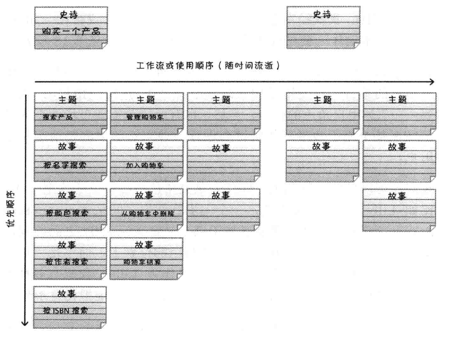

<center><font size="2">该图来自：《Scrum精髓：敏捷转型指南》 - 故事地图例子</font></center>

## 产品列表

产品列表是一个**按优先顺序排列的、预期产品功能列表**。产品列表由各个待办事项组成，即**PBI（Product Backlog Item）[^PBI]**或简称为**条目**。

### PBI类型

| PBI的类型 | 例子                                                         |
| --------- | ------------------------------------------------------------ |
| 特性      | 作为客户服务代表，我希望为客户支持问题创建一个记录卡，这样可以记录和管理客户的支持请求 |
| 变更      | 作为客户服务代表，我希望搜索结果在默认情况下按照姓氏排序，不要按记录卡号排序，这样可以更容易查找支持记录卡 |
| 缺陷      | 修复缺陷耿总系统中的缺陷#256，这样可以使客户在搜索项中输入特殊字符时不会出现异常 |
| 技术改进  | 迁移到最新版Oracle数据库管理系统                             |
| 获取知识  | 为两种架构同时创建原型或概念验证，执行三次测试，这样可以确定哪种方法更合适产品 |

### 产品列表的四大特征（DEEP）

- **详略得当**（Detailed Appropriately）
- **涌现**的（Emergent）：只要有正在开发或维护的产品，产品列表就永远不会完成或冻结，它会根据**不断涌入**的、具有**经济价值**的信息**持续更新**
- 做过**估算**的（Estimated）
- **排列优先顺序**的（Prioritized）


<center><font size="2">该图来自：《Scrum精髓：敏捷转型指南》 - PBI排列优先级例子</font></center>

### 梳理

#### 什么是梳理？

梳理指三大重要的活动：

- 确立并细化PBI（增加PBI的细节）
- 对PBI进行估算
- 为PBI排列优先顺序

#### 由谁来梳理？

梳理产品列表是一个**持续不断**、**合作完成**的活动，由产品负责人牵头，包括外部利益干系人中的主要参与者，还包括Scrum Master和开发团队，但**最终决策者是产品负责人**。

#### 何时梳理？

为了保证灵活、快速地交付业务价值，相比确定何时进行梳理活动，**确保梳理活动能够紧密集成到Scrum开发流程更重要**。

### PBI在冲刺中的状态

**就绪的定义[^DoR]**和**完成的定义[^DoD]**，可以视为**PBI**在一个**冲刺周期**中的**两种状态**。

就绪和完成的定义都是针对工作制定的**检查表**，只有在完成检查表之后，才可以认为PBI分别进入就绪或完成状态。

> Notes：关于完成的定义，前面已经记录过，这里不再重复

#### 就绪的定义（DoR）

**就绪的定义（Definition of Ready，DoR）**，一个包含条件的检查列表，在冲刺规划过程中，认为一个产品列表已经就绪可以放入一个冲刺之前，这个检查列表中的条件**必须满足**。


<center><font size="2">该图来自：《Scrum精髓：敏捷转型指南》</font></center>

梳理产品列表时，应当确保列表顶部的条目已就绪，可以放入冲刺中让开发团队有信心做相关的工作并在冲刺结束时完成。为“就绪”确定一个**有说服力的定义**，将极大提升Scrum团队成功实现冲刺目标的几率。

> 对于PBI列表中**就绪条目的合理存量**，最好是**两到三个冲刺的故事量**，比如：如果团队一次冲刺能完成五个PBI，那么团队在梳理列表的时候，任何时候最好总有大约十到十五个PBI是准备就绪的。

> 对于所有PBI，都需要**制定接收标准**，并把该接收标准**纳入其“就绪定义”检查表中的一项验证内容**。

### 工作流管理

#### 版本

产品列表的梳理活动必须支持持续版本规划活动，版本可以看作是穿过一条产品列表的线。**版本线**上方的所有PBI都预计在这个版本中完成，线下方的条目则不再这个版本中。

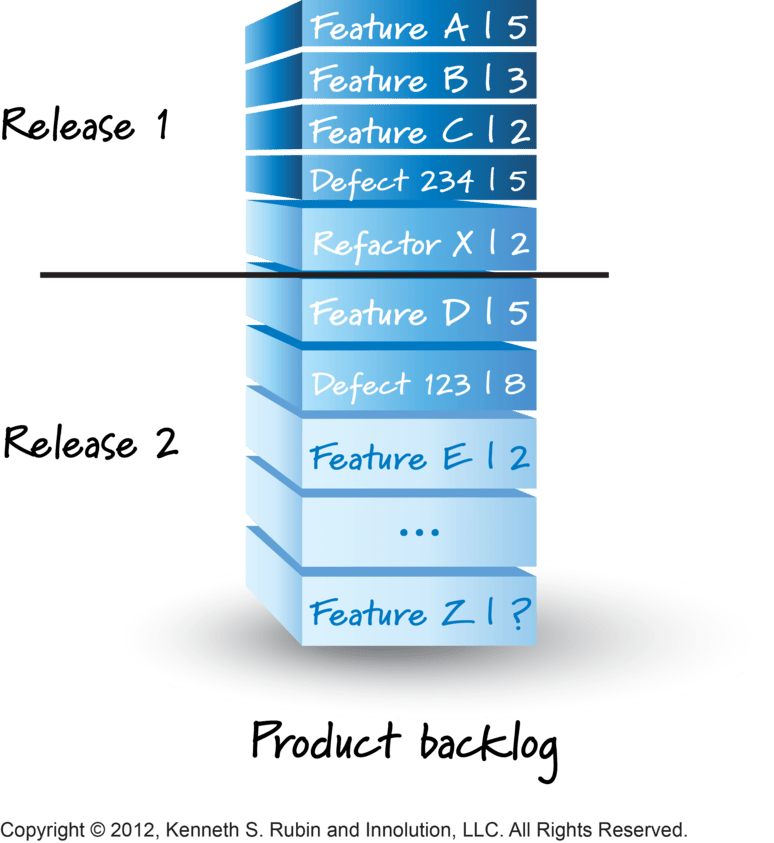

不过每个版本用两条线来划分产品列表很有用，这两条线把产品列表分成三段：“**必须有的**”、“**最好有的**”和“**不会有的**”。

#### 冲刺

对于有效进行冲刺规划并使特性流入冲刺，产品列表梳理活动发挥着至关重要的作用。如果产品列表有适当的详细描述，列表顶部的条目就是描述清晰的、可测试的。

在做梳理活动以达到良好的冲刺工作流时，这个方法有帮助：把产品列表视为管道中的需求，它们流入冲刺（准备就绪），由团队设计、构建并测试。


<center><font size="2">该图来自：《Scrum精髓：敏捷转型指南》</font></center>

### 产品列表有哪些，应该有多少？

在确定需要建立哪些以及建立多少个产品列表时，有一个简单的原则：**一个产品，一个产品列表**，即每个产品都应当有自己单独的一个产品列表，提供对整个产品的描述并对需要完成的工作**排列优先顺序**。

## 传统软件开发过程

### 瀑布模型（Waterfall Model of Software Development）

瀑布模型，也叫预测型生命周期模型、完全计划驱动型生命周期模型，如下图所示，一般瀑布模型将开发流程**自上而下分**为以下阶段：


<center><font size="2"><a href="https://kruschecompany.com/waterfall-software-development-methodology/">该图来自：《What is the Waterfall software development methodology and is it still relevant?》</a></font></center>

- 可行性分析与计划
- 需求分析与定义
- 软件设计
  - 概要设计
  - 详细设计
- 编码实现
  - 编码
  - 单元测试
- 测试
  - 集成测试
  - 系统测试
- 运维

原则上，瀑布模型的各项活动**严格按照线性方式进行**，并**以文档来驱动**，每个阶段的结果作为一个**里程碑，是一个或多个经过核准的文档**，直到上一个阶段完成，下一个阶段才能启动。在实际过程中，这些阶段经常是重叠和彼此间有信息交换的。

经典的瀑布模型的**线性过程过于理想化**，**迭代瀑布模型**可被认为是对其进行的必要修改，使其可实际用于软件开发项目，迭代瀑布模型提供了从每个阶段到其前一阶段的**反馈路径**，这是与经典瀑布模型的主要区别。软件过程不是一个简单的线性模型，它包括对开发活动的多个反复，每一个阶段产生的文档在后续阶段都可能被修改以反映发生了变化，当某一个阶段出现了不可控的问题的时候，就会导致返工，返回到上一个阶段，甚至会延迟下一个阶段。现实中的瀑布模型流程可能像下图这样：


改进意见 : **沿用瀑布模型的线性思想，在每个阶段进行迭代操作**。

#### 优点

- 有利于大型软件开发过程中人员的组织、管理，有利于软件开发方法和工具的研究，从而提高了大型软件项目开发的质量和效率。
- 降低了软件开发的复杂程度，而且提高了软件开发过程的透明性，提高了软件开发过程的可管理性
- 推迟了软件实现，强调软件实现前必须进行分析和设计工作
- 各阶段文档齐全，减少沟通成本
- 以项目的阶段评审和文档控制为手段有效地对整个开发过程进行指导，为项目提供了按阶段划分的检查点，每个阶段评审通过才开始下一阶段，能够及时发现并纠正开发过程中存在的缺陷，从而能够使产品达到预期的质量要求
- 对其它开发模型（比如：迭代）有提供参考或者应用价值
- 从测试的角度看来，瀑布模式比截至到目前为止的其他模式更有优势。瀑布模式所有一切都有完整细致的说明。当软件提交到测试小组时，所有细节都已确定并有文档记录，而且实现在软件之中。由此，测试小组得以制定精确的计划和进度。
- 开发的各个阶段清楚，方便统筹和管理
- 早期的计划以及需求调研要做的比较充分，以便应对后期的需求变更
- 适合项目的需求等比较成熟稳定

#### 缺点

- 瀑布模型的突出缺点是不适应用户需求的变化，开发过程一般不能逆转，否则代价太大，如果需求变更，那么之前所有阶段都必须调整
- 通过过多的强制完成日期和里程碑来跟踪各个项目阶段，很难严格按该模型进行
- 模型缺乏灵活性，特别是无法解决软件需求不明确或不准确问题，很难在开发前期完全清楚地给出所有的需求。
- 瀑布模型中的软件活动是文档驱动的，各个阶段的划分完全固定，阶段之间产生大量的文档，管理困难，工作量大。而且当管理人员以文档的完成情况来评估项目完成进度时，往往会产生错误的结论
- 模型的风险控制能力较弱，由于开发模型是线性的，用户只有等到整个过程的末期才能见到开发成果，等使用后再提出变更，变更成本非常大，从而增加了开发风险。
- 在瀑布模型中，测试被认为是在软件开发过程的后期阶段进行的“一次性”活动，这带来一个巨大的缺点，因为测试仅在最后进行，所以一些根本性问题可能出现在早期，但是直到准备发布产品时才可能发现。
- 对于早期的需求调查所占比例很高，不适应敏捷开发等模型
- 流程单一，不太容易可逆
- 风险拖到后期发现，成本不可控
- 前期问题的积累导致整个项目失败

#### 适合的情景范围

- 开发需求特别明确的需求，用户的需求非常清楚全面且在开发过程中没有或很少变化，对软件的应用领域很熟悉
- 用户的使用环境非常稳定并且开发工作对用户参与的要求很低

比如：嵌入式系统、关键性系统、大型软件系统这类系统用户需求非常明确，往往都是政府驱动资金、人员配套充足适合瀑布模型。

### 快速原型模型（Rapid Prototype Model of Software Development）

快速原型模型又称**原型模型**，它是**增量模型**的另一种形式。

在需求分析阶段对软件进行初步而非完全的需求分析和定义，在真实的系统开发之前，迅速构造一个早期可运行的**软件原型（Prototype）**，它反映最终系统的部分重要特性，让用户通过使用原型来了解目标系统并进行评估，以便理解和澄清问题，使开发人员与用户达成共识，之后在原型的基础上，不断修改完善，逐渐完成整个系统的开发。一旦用户认为原型系统满足了他们的所有**真实需求**，开发人员就可以根据现有的原型书写**规格说明文档**，根据这份文档开发出的软件可以满足用户的真实需求。

快速原型的本质是"**快速**"。开发人员应**尽可能快地建造出原型系统**，以加速软件开发过程，节约软件开发成本。另外原型的**真正用途**是**为了获知用户的真实需求**，一旦需求确定了，那么原型是可以被**抛弃**掉（**探索型原型、实现型原型**），或者基于原型来**进化演变**成最终的软件系统（**进化型原型**）。

#### 流程

它的流程可以参考下面三张图：


<center><font size="2"><a href="https://www.jianshu.com/p/39b6d8a10e0a">该图来自：《码歌老薛聊聊软件开发模型(瀑布模型、快速原型、螺旋以及敏捷开发模式)》</a></font></center>


<center><font size="2"><a href="https://www.rocheindustry.com/guide-to-rapid-prototyping/">该图来自：《THE COMPLETE GUIDE TO RAPID PROTOTYPING FOR PRODUCT DEVELOPMENT》</a></font></center>

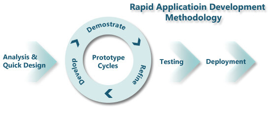

<center><font size="2"><a href="https://universityinnovation.org/wiki/Resource:Rapid_Prototyping">该图来自：《Rapid Prototyping》</a></font></center>

流程：

- 快速分析
- 原型需求说明
- 构造原型
- 运行原型
- 评估原型
- 修改原型（根据用户反馈）
- **最终软件设计**
- **最终软件实现、测试和部署**

#### 原型的类型和策略

上面有提到原型可以选择被**抛弃**或者**保留**，这是根据不同类型的原型采用的不同策略决定的。

类型：

- **探索型**：这种原型目的是要弄清对目标系统的要求，确定所希望的特性，并探讨多种方案的可行性
- **实验型**：这种原型用于大规模开发和实现之前，考核方案是否合适，规格说明是否可靠
- **进化型**：这种原型的目的不在于改进规格说明，而是将系统建造得易于变化，在改进原型的过程中，逐步将原型进化成最终系统

策略：

- **抛弃策略**：将原型用于开发过程的某个阶段，促使该阶段的开发结果更加完整、准确、一致、可靠，该阶段结束后，原型随之作废。探索型和实验型就是采用此策略的

- **附加策略**：将原型用于开发的全过程，原型由最基本的核心开始，逐步增加新的功能和新的需求，反复修改反复扩充，最后发展为用户满意的最终系统，演化型快速原型就是采用此策略

采用何种形式、何种策略运用快速原型主要取决于软件项目的特点、可供支持的原型开发工具和技术等，根据实际情况的特点决定。

#### 优点

- 克服了瀑布模型的缺点，更好的满足用户的需求并且减少了由于软件需求不明确导致的开发风险，适合事先不能确切定义需求的软件系统的开发
- 快速原型模型是不带反馈环的，软件产品的开发基本上是按线性顺序进行的。但原型系统已经通过与用户交互而得到验证，据此产生的规格说明正确地描述了用户需求，因此，在开发过程的后续阶段不会因为发现了规格说明文档的错误而进行较大的返工。
- 开发人员通过建立原型系统已经学到了许多东西（至少知道了“系统不应该做什么，以及怎么不去做不该做的事情”），因此，在设计和编码阶段发生错误的可能性也比较小，这自然减少了在后续阶段需要改正前面阶段所犯错误的可能性。

#### 缺点

- 所选用的开发技术和工具不一定符合主流的发展
- 快速建立起来的系统结构加上连续的修改可能会导致产品质量低下。
- 使用这个模型的前提是要有一个展示性的产品原型，因此在一定程度上可能会限制开发人员的创新。
- 不适合大型的系统开发，适合中小型、灵活度要求比较高的项目。

#### 适合的情景范围

不适合大型的系统开发，适合**预先不能确切定义需求**的**中小型**、**灵活度要求比较高**的项目。

### 螺旋模型（Spiral Model of Software Development）

螺旋模型是一种**演化型**的软件开发模型，这种模型**计划赶得上变化**，它从**瀑布模型**和**快速原型模型**发展而来的，兼顾了**快速原型的迭代特征**以及**瀑布模型的系统化与严格监控**，并**引入了其他模型不具备的风险分析**，使软件在无法排除重大风险时有机会停止，以减小损失，在每个迭代阶段构建原型是螺旋模型用以减小风险的途径。理解这种模型的一个简单方法，是把它看做在每个阶段之前都增加了风险分析过程的快速原型模型。

它的具体原理是：螺旋模型是快速原型模型**以进化的开发方式为中心**，在每个项目阶段使用瀑布模型法，螺旋模型的流程图如下所示：


该模型的**每一个象限都代表了一个活动**，每一个周期都包括：

- **制定计划**：确定软件目标，选定实施方案，弄清并制定项目开发的约束条件
- **风险分析**：分析评估所选方案，考虑如何识别和消除风险
- **实现工程**：实施软件开发和验证
- **客户评估**：评价开发工作，提出修正建议，制定下一步计划

由以上四个阶段进行迭代，软件开发过程每迭代一次，软件开发又前进一个层次，每次产生的新模型都是从之前到版本提炼出来。

螺旋模型在“瀑布模型”的每一个开发阶段前引入一个非常严格的**风险识别**、**风险分析**和**风险控制**，它把软件项目分解成一个个小项目。每个小项目都标识一个或多个主要风险，直到所有的主要风险因素都被确定。

螺旋模型**强调风险分析**，使得开发人员和用户对每个演化层出现的风险有所了解，继而做出应有的反应，因此特别**适用于庞大、复杂并具有高风险的系统**。

另外可以看到项目是从螺旋的中点，经过多个原型逐步向外，直到最后构建实际的软件系统。

#### 优点

- 对可选方案和约束条件的强调有利于已有软件的重用，也有助于把软件质量作为软件开发的一个重要目标
- 减少了过多测试（浪费资金）或测试不足（产品故障多）所带来的风险
- 在螺旋模型中维护只是模型的另一个周期，在维护和开发之间并没有本质区别

#### 缺点与限制

- 采用螺旋模型的主要优势在于它是**风险驱动**的，所以螺旋模型需要具有**相当丰富的风险评估经验**和**专门知识**，在风险较大的项目开发中，**如果未能够及时标识风险，势必造成重大损失**
- 过多的迭代次数会增加开发成本，延迟提交时间

#### 适合的情景范围

螺旋模型特别适用于**庞大而且复杂**，很**高风险**的项目，不过主要**适用于内部开发的大规模软件项目**。这是因为本质上螺旋模型就是一种**风险驱动体系**，每个阶段的时候必须首先进行风险评估。另外如果执行风险分析将大大影响项目的利润，那么进行风险分析毫无意义。

## 软件测试过程

软件测试模型跟软件开发模型一样，**由一个模型来指导整个软件测试过程**，软件测试模型根据不同的被测对象、测试背景、被测对象质量要求、项目进度要求等，可以采用不同的测试模型实施测试活动，来指导软件测试活动安排。

### 软件测试分类

#### 按阶段性划分

- **单元测试（Unit Testing）**，也叫模块测试：对软件中的最小可测试单元进行检查和验证，通常采取以白盒测试为主，黑盒测试为辅的方法，并以一般由开发人员自测（即**开发自测**）的方式执行，也可以配合自动化完成。一般包含以下活动：
  - **代码审查**（**Code Review**，别名：代码复审、代码走查、代码走读）
  - **静态分析**（Static Analysis）：配合lint工具对代码进行静态分析，检查代码中潜在的问题
  - **动态分析**（Dynamic Analysis）
- **集成测试（Integration Testing）**：它用于测试各个单元模块之间的接口，侧重于技术的角度。实施可采用自底向上集成测试、自顶向下集成测试等方法
- **确认测试（Confirmation Testing）**：也叫**有效性测试**，在模拟环境下，验证功能、非功能等方面是否满足需求，采用黑盒测试的运行方式。通过了确认测试之后，才具备进入系统测试阶段的资质
- **系统测试（System Testing）**：采用**黑盒**的方式在实际运行环境中对整个软件系统的测试， 验证最终软件系统是否满足用户规定的需求，侧重于业务角度
- **验收测试（Acceptance Testing[^AT]）**：又叫**交付测试**，同样采用**黑盒**的方式，在测试小组的协助下，由用户代表执行测试，测试过后由用户决定是否接收交付。验收测试又分为以下几个阶段：
  - **Alpha测试（α测试）**：即**内测**，不对外发布，一般供内部测试使用
  - **Beta测试（β测试）**：即**公测**，也叫**用户验收测试（UAT[^UAT]，User Acceptance Testing）**，由**软件的实际用户**在软件真实使用环境下进行测试，这个版本也会一直加入新的功能
  - **Gamma测试（λ测试）**：也叫**发布候选版本（Release Candidate，RC）**，基于Beta版本，比Beta版本更稳定，并且几乎不会再加入新功能，主要用于对缺陷的测试和修复。修复完缺陷之后，就可以转为正式版本（Release to Manufacture，RTM）了

#### 按代码可见性划分

- 白盒测试（White-Box Testing）：检查程序内部的每条逻辑路径是否能按预定的要求正确工作，比如代码审查（Code Review）就属于白盒测试范围
- 黑盒测试（Black-Box Testing）：不关心内部结构，只关注软件的输入和输出是否正确
- 灰盒测试（Gray-Box Testing）：介于白盒测试和黑盒测试之间，多用于集成测试阶段，不仅关注输入、输出的正确性，同时也关注程序内部的每条逻辑路径是否能按预定的要求正确工作

#### 按动静态划分

- 静态测试（Static Testing），不需要执行程序进行测试，主要包括：
  - 代码审查（Code Review）
  - 静态结构分析
  - 代码质量度量
- 动态测试（Dynamic Testing）：主要通过构造测试用例、执行程序、分析输出结果

#### 以是否为功能划分

- 功能测试（Functional Testing）：采用黑盒测试方法，检查软件是否符合用户的功能性需求
- 非功能测试（Non Functional Testing）：一般采用自动化工具辅助完成，用来检查软件的性能、安全、负载、兼容性、可用性等多方面是否符合用户的非功能性需求

#### 开发自测

由开发人员在开发时，自行执行测试

#### 回归测试（Regression Testing）

代码修改过后，重新执行测试，以确认修改没有导致引入新的错误，采用**自动化回归测试**可以缩减成本。

#### 探索性测试（Exploratory Testing）

探索性测试是一种**测试思维**，而不是测试技术，它通常情况下仅作为其他测试方法的补充，不能成为独立的测试方法。

探索性测试**无须事先制定测试计划或设计**，有经验的测试工程师可**在测试执行时**，根据自己的思维活动及对被测对象的理解，边学习、边设计、边执行、边思考，**根据具体情况随时调整测试策略**，在测试计划之外发现更多的软件错误，避免把大量时间花费在编写测试文档上，导致真正用于测试的时间减少。

#### 构建验证测试（Build Verification Test，BVT）

构建验证测试，可以理解为在一个新版本执行深度测试前的一个”**哨兵**“，在每一个版本构建（Build）成功之后执行（如果Build失败，不会执行BVT），它**是一个测试活动而非测试阶段**，它只完成一组最基本的测试，**主要用于对新版本在优先高的主要功能和特性上的验证**，**不会进行深入的测试**，它**持续的时间短**、**覆盖率低**。通常会按照设定的计划或者条件触发（CI），**自动化**的构建并执行测试。

BVT是**进入深度的集成测试前的一个门槛（哨兵）**，只有通过了BVT，集成测试才可以**被提测**。如果BVT失败或者未执行BVT的Build，则不得提交集成测试，需要提Bug返工，并等待下一次构建（Build）。

BVT好处在于，**节约测试的时间成本，减少不必要的测试轮数**。这是因为对于BVT，只验证了软件最基本的功能，如果最基本的功能测试不通过，那么是没必要继续后续的测试的，这样就减少了时间成本上的浪费。

#### 冒烟测试（Smoke Testing）

冒烟测试最初是**硬件测试**上的概念，从电路板的测试中得来的，当电路板做好之后，首先会加电测试，如果电路板没有冒烟就可以进行详细的测试，否则需要返工重来。

在软件研发领域上，冒烟测试是微软首先提出的一个概念，这与微软一直提倡的**每日构建（Daily Build或Nightly Build）**有密切联系。即在每日构建后，对最基本的功能进行简单的测试，而不会对具体功能进行更深度的测试。它充当这个”**哨兵**“的作用，如果冒烟测试失败，即最基本的功能测试不通过，那么是没有必要进行更详细的测试的，这就减少了很多不必要的浪费。

> Notes：**每日构建（Daily Build或Nightly Build）**是连续集成的一个最佳实践，即每日最少构建一次。但由于构建的可能需要很长的时间并消耗大量的计算机资源，所以每日构建通常是在夜间进行的，所以每日构建也叫**Nightly Build**。

冒烟测试是一种**测试活动**，而非测试阶段。当冒烟测试**发生在集成测试时，它是等同于构建验证测试（Build Verification Test，BVT）的**。

它**与BVT的区别**是，BVT只在构建（Build）完成时执行并且由其决定是否提交集成测试，通常是自动化完成的。而冒烟测试是各个阶段都可以有的测试活动，与构建（Build）的验证无关，并且不影响其它日常测试工作，通常由程序员来执行。

#### A/B测试（A/B Testing）

**A/B测试（也称分割测试、桶测试）**，这本质上是一个实验，即**为同一个目标制定两个不同版本**，这两个版本只有某个方面不一样，其它方面保持一致。然后确定**实验组（A版本）**和**对照组（B版本）**，然后同时测试这两个版本，**根据设定的目标，分析判断哪个版本更好、收益更高**。

#### 灰度测试（Grayscale Testing）

通过**灰度发布（Grayscale Release，金丝雀发布）**，部署在**灰度测试环境**上的一种用于平滑过渡的发布测试，由灰度发布开始（灰）到结束（黑）期间的这段时间称为**灰度期**。

它在产品的新功能正式发布前，**选择特定的人群试用**，收集用户反馈，及时发现并纠正缺陷，并慢慢放量，直到覆盖线上的所有用户，逐步过渡到正式发布。通常**可以采用A/B Testing的发布方式**，灰度测试也是A/B测试的超集，也就是说A/B测试其实是灰度测试众多方法中的一种。

不管是灰度测试还是A/B测试，它们的目的都是为了减少产品正式发布之后，出现的各种问题。

#### **自动化测试（Automated Test）**

通过定制**测试脚本（Testing Script）**，然后通过自动化测试工具来自动完成测试

### V模型

**V模型**是**从瀑布模型演化而来**的，V的**左边表示传统的瀑布开发模型**，**右边表示对应的测试阶段** 。它明确地将测试分为不同的级别或阶段，每个阶段都与开发的各阶段相对应。V 模型的测试策略包括**低层测试**和**高层测试**，**低层测试**是为了**源代码的正确性**，**高层测试**是为了整个系统满足**用户的需求**。


<center><font size="2"><a href="https://blog.csdn.net/MXB_1220/article/details/124845092">该图来自：《软件测试模型有哪些？》</a></font></center>

#### 特点

- 测试阶段划分得很清楚
- 每个开发阶段都有相应的测试对其进行验证

#### 缺点

- 测试与开发是串行进行的而不是并行，也就是测试需要等开发完成后再开始
- 测试是开发之后的一个阶段。实际应用中容易导致需求阶段的错误一直到最后系统测试阶段才被发现
- 测试的对象就是程序本身，而不包括需求等其他的说明书。忽视了测试活动对需求分析，系统设计等活动的验证和确认的功能，直到后期的验收测试才被发现
- 过程是线性的、顺序的，不能反复和迭代
- V 模型是瀑布模型的变种，瀑布模型存在的问题V 模型也存在

#### 使用的情景范围

V模式是一种传统软件开发模型，一般适用于一些传统信息系统应用的开发，而一些高性能高风险的系统、互联网软件或一个系统难以被具体模块化的时候，就比较难做成V模式所需的各种构件，需要更强调迭代的开发模型或者敏捷开发模型。

### W模型

**W模型**又称**双V模型**，**从V模型演化而来**。它提出的**初衷是为了解决V模型的缺陷**，即：

- 测试与开发是串行进行的而不是并行，导致测试活动滞后于研发活动
- 可能只包含了程序层面的测试，而可能忽略了需求、功能、设计等其他方面

W模型提出了**测试活动与研发活动并行**的概念，**强调测试伴随着整个软件开发周期**，并且在生产流程演进过程中，增加了验证与确认活动。而且**测试的对象不仅仅是程序，需求、功能和设计同样要测试**。

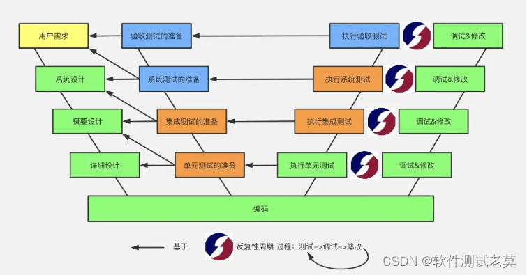

<center><font size="2"><a href="https://blog.csdn.net/MXB_1220/article/details/124845092">该图来自：《软件测试模型有哪些？》</a></font></center>

#### 优点

- 测试伴随着整个软件开发周期，而且测试的对象不仅仅是程序，需求、功能和设计同样要测试
- 体现“**尽早地和不断地进行软件测试**”的原则
- 在 V 模型中增加软件和开发阶段应同步进行的测试

#### 缺点

W 模型中，需求、设计、编码等活动被视为**串行**的，同时，测试和开发活动也保持着一种线性的前后关系，上一阶段完全结束，才可正式开始下一个阶段工作。这样就无法支持迭代的开发模型。

### X模型

X 模型的基本思想是由Marick 提出的，后由Robin F.Goldsmith引用Marick 的一些想法，经过重新组织形成了“**X 模型**”。这并不是为了和V 模型相对应而选择这样的名字，是由于X 通常代表未知，而Marick 也认为他的观点并不足以支撑一个模型的完整描述，但具备一个模型所需要的主要内容，其中包括了**探索性测试（Exploratory Testing）**见解。

#### Marick 对V模型提出质疑

X模型与W模型一样，提出的**初衷都是解决V模型的缺点**，即**测试活动滞后于研发活动**，无法尽早地开展测试活动。

Marick认为V 模型必须按照一定顺序严格执行开发步骤，而这样很可能**无法反映实际的实践过程**。很多项目在立项时需求并不完整，但V模型还是从需求处理开始，要求对各开发阶段中已经得到的内容进行测试，但它没有规定需要取得多少内容，如果没有任何的需求资料，开发人员知道他们要做什么吗？或者需求不完善，开发工程师做出来的功能就不完善，必须不断地修改。他主张**在X模型中需要足够的需求，并且需求至少进行一次发布**。

Marick 也质疑**单元测试和集成测试的区别**，很多软件开发团队会直接跳过单元测试，甚至跳过集成测试，直接进行系统测试。而**X模型则没有强制要求在进行集成测试之前，必须对每个程序片段进行单元测试**，但是X 模型并没有提供是否跳过单元测试的判断准则。

#### 模型说明


<center><font size="2"><a href="https://blog.csdn.net/MXB_1220/article/details/124845092">该图来自：《软件测试模型有哪些？》</a></font></center>

X模型**左边**表明针对单独的程序片段n进行独立的编码和测试活动，右边是功能的集成测试，以此为基本过程，不断迭代，通过集成活动最终成为可执行程序，然后再对这些可执行程序进行测试。通过集成测试的成品可以进行封装并提交给系统测试环节或直接给用户，也可以作为更大规模和范围内集成的一部分。多条并行的曲线表示变更可以在各个部分发生。

X模型提出了**探索性测试**的概念，探索性测试与常规的测试方法不同，**其无须事先制定测试计划或设计**，有经验的测试工程师可根据自己的思维活动及对被测对象的理解，在测试计划之外发现更多的软件错误，避免把大量时间花费在编写测试文档上，导致真正用于测试的时间减少。但探索性测试通常情况下仅作为其他测试方法的补充，因其消耗测试资源较多，且受制于测试工程师的经验，所以**不能成为独立的测试方法**。

X 模型提倡公司**根据自身的实际情况确定是否要进行单元测试和集成测试**，并不是所有的研发公司都会先做单元测试和集成测试，更多的是直接做系统测试。在X 模型中还显示了测试步骤，包括测试设计、工具配置、执行测试三个步骤，虽然这个测试步骤并不很完善，但是毕竟将一些主要的内容表现出来了。

#### 特点

- 这个模型有一个很大的优点是它呈现了一种**动态测试**的过程中，也就是测试是一个不断迭代的过程中，这更符合企业实际情况，其他模型更像一个静态的测试过程。
- 团队可以根据自身情况确定是否要做单元测试，还是直接做系统测试
- 测试应该是一个不断迭代的过程，直到封版发布
- 提倡探索性测试

### H模型


<center><font size="2"><a href="https://blog.csdn.net/MXB_1220/article/details/124845092">该图来自：《软件测试模型有哪些？》</a></font></center>

**真正的测试级别之间不存在严格的次序关系**，各阶段间可以反复触发、迭代、增量。为了解决 V 模型和 W 模型存在的问题，有专家提出了 H 模型。

H模型与W模型一样，揭示了**软件测试活动应该是一个独立的软件生产流程**，H模型将**测试活动**与**其他研发流程**独立，**形成一个完全独立的流程**，**测试贯穿产品整个生命周期**，与其他流程（计划、需求分析、用例设计、环境搭建、提交缺陷、评估总结等）**并发地进行**，不需要等到程序全部开发完成才开始执行测试。

H模型将测试活动分为**测试准备**与**测试执行**两个部分，以便于测试设计与测试执行活动定义，如上图所示。**测试准备活动**包括测试需求分析、测试计划、测试设计、测试编码、测试验证等。**测试执行**包括测试运行、测试报告、测试结果分析、确认回归测试等。

软件测试是根据被测物的不同而**分层次进行**的，不同层次的测试活动可以是按照某个次序先后进行的，当一次测试工作后产品质量无法达到要求时，可以反复进行多次测试。

H模型演示了在整个生命周期中某个层次上一次软件测试的“**微循环**”。测试活动应该**尽早准备、尽早执行**，当**测试准备**工作完成后，一旦到达**测试就绪点**（即进入**测试就绪**状态，也就是测试有一个准入条件），就可开展**测试执行**活动，**不会受制于研发活动**。

H模型中还有一个“**其他流程**”的测试，这个观点强调了测试包含的不一定要是常见的应用程序，也可以其他的内容，这可以理解为**整个产品包中所有的对象**，包括开发阶段的一些设计流程，这样将测试的范围直接扩展到整个产品，而非W模型中提到的代码、需求或其他相关说明书。

#### 测试准入条件检查

通常情况下判断测试是否达到准入条件，应该检查以下几部分内容是否已经完成：

- 该开发流程对应的测试策略是否完成
- 测试方案是否完成
- 测试用例是否完成

- 测试环境是否搭建好
- 相关输入件、输出件是否明确

#### 特征

- 测试是一个独立的过程
- 测试达到准入条件，才可以执行
- 测试对象是整个产品包，而不仅仅是程度、需求或相关说明书

### 前置测试模型（Proactive Testing Model）

前置测试模型是一个将**测试和开发紧密结合**的模型，该模型提供了轻松的方式，可使你的项目加快速度。前置测试模型体现了以下的要点：

- **将开发和测试的生命周期整合在一起**，并在开发阶段以【**编码->测试->编码->测试...->编码->测试**】的方式来体现，**反复交替的开发和测试**
- 对**每一个交付内容进行测试**，每一个交付的开发结果都必须通过一定的方式进行测试
- 在设计阶段进行测试计划和测试设计，设计阶段是作测试计划和测试设计的最好时机
- 让**验收测试**和**技术测试**保持相互独立，验收测试应该独立于技术测试，这样可以提供双重的保险，以保证设计及程序编码能够符合最终用户的需求

### 敏捷测试模型（Agile Testing Model）

敏捷测试是伴随着敏捷开发过程所有质量相关活动的一种**测试实践**，包含了敏捷开发方法所需的**测试流程、方法和实践**，它**遵守敏捷开发方法的原则**，并由**跨职能**型敏捷团队的**所有人员共同参与**。

敏捷测试的目标也不再是为了发现更多的Bug，而是随着敏捷开发流程的进行，**持续**地对软件质量问题进行**及时（Just-In-Time）反馈**，以保证有价值的高质量软件的**持续交付**，力求达到**质量和效率的平衡**。

> 高质量产品不是检测出来的，在产品生产出来时就已经确定了。因此，提高产品质量需要将**质量内建**到产品中，而不是通过在后期测试、对缺陷进行修补

#### 敏捷测试的特点

敏捷测试采用**更短的周期**、**更灵活的计划**。提倡**尽早测试**、**持续测试**、**具备条件即测试**、**高效的自动化测试**、**预防缺陷重于发现缺陷**。

它的核心内涵是：

- 【**强调遵守**】**遵守敏捷开发的原则**，抛开敏捷开发谈敏捷测试没有意义
- 【**强调融合**】敏捷测试不独立存在，而是把**测试融合入整体开发流程中**
- 【**强调协作**】强调协作的**跨职能团队**，敏捷测试不仅仅是测试人员的工作，而是**整个团队的活动**

#### 敏捷测试的价值

- 缩短价值交付周期
- 更早更及时地测试风险
- 强调质量是属于团队每个人的责任
- 化繁为简节省成本

#### 采取的实践

- **质量内建**：**将质量内建到产品中**，这是一种**质量保障体系**。这使我们可**提前预防缺陷**，而不是等开发完成后才发现更多的问题，缺陷发现的越早，解决的成本越低
  - **质量左移**（**测试左移**）：这要求测试在软件开发周期的**前期（左侧）尽早介入**，借助工具和测试手段更早、更及时地**发现问题**和**预防问题**，以下列举几个手段：
    - 自动化持续测试
    - 开发自测
    - 代码质量检测（比使用lint执行静态代码分析）
    - 测试驱动开发（TDD）
    - 等等
  - **质量右移**（**测试右移**）：产品版本发布上线（或处于灰度环境、预发布环境）后仍然需要持续对线上进行**监控**和**预警**，及时发现并解决问题，降低影响范围，通常采用的手段有：
    - **灰度发布**（Grayscale Release，金丝雀发布）：即部署于灰度环境，进行线上持续测试
    - **监控**：合理的性能监控、数据监控和预警机制
    - **用户反馈**
- **测试驱动开发**[^TDD]：
  - **单元测试驱动开发（UTDD）**：先写单元测试，以此驱动产品功能代码的开发
  - **验收测试驱动开发（ATDD）**：先实现自动化的功能验收测试，在功能开发完后，要求所有验收测试都能通过
  - **行为驱动开发（BDD，Behavior-Driven Development）**：它是测试驱动开发的延申，强调的是不同角色之间的协作，更好的理解和澄清用户需求，确保需求理解达成一致。它其实不是关于测试的，可以没有测试，但可指导测试，通常可以基于BDD的方式实现自动化测试
- **尽早测试**，**持续测试**
- **持续反馈**
- **自动化测试**：可考虑通过CI/CD平台执行测试脚本
- 关注**探索性测试**、**组合交互性测试**和**用户场景测试**
- **加强团队的交流和协作**：这是为了使测试人员全程参与需求、产品功能设计等讨论，使其能够及时、持续的对产品质量进行反馈
- 增加**产品走查（Product Work-Through）**环节：团队一起从头到尾把新功能看一遍，更直观、快速地发现问题
- 侧重**单元测试**、**验收测试**以及**强调用户参与**：单元测试采用测试驱动开发[^TDD]的方式，单元测试通过之后完成集成，再由客户进行验收测试

#### 敏捷测试矩阵

敏捷测试矩阵由Brain Marick提出，如下图所示：


敏捷测试矩阵包含四个维度：**面向技术**、**面向开发团队**、**面向业务**、**面向评价产品**。由这四个维度划分出**四个象限**，代表了不同类型的测试有不同的目的与方向，**敏捷测试中的涉及的所有测试类型都归集到这四个象限中**。

- Q1：面向技术、开发团队的测试：主要由**开发人员**执行，目标是**验证单元模块是否正确**
- Q2：面向业务、开发团队的测试：主要由**测试人员**执行，目标是验证一个功能或用户故事**是否符合验收标准（完成的定义[^DoD]）**
- Q3：面向业务、评价产品的测试：主要由**业务验收人员**和**测试人员**执行，目标是**验证功能满足业务和用户需求**
- Q4：面向技术、评价产品的测试：主要**由测试人员执行，开发团队配合**，目标是确定产品**符合非功能性需求**

#### 极限测试（eXtreme Testing，XT）

**极限测试**是为了满足**极限编程**[^XP]（敏捷开发的一种方法）的流程和思想，而采用的一种测试方法，它在极限编程中的地位非常重要。

极限测试**强调连续测试**，并且**需要客户参与**，高度依赖模块的**单元测试**和**验收测试**[^AT]，其中单元测试是极限测试主要采用的测试方法。

- **极限测试中的单元测试**，它具有两条简单的规则：
  - 所有代码模块在**编码开始前必须设计好单元测试用例**（这是和普通单元测试的最大区别）
  - 在产品发布前需要通过单元测试。并且任何一个递增的代码变更，都必须进行单元测试
- **极限测试中的验收测试**：它主要目的是判断产品是否满足用户需求，可以结合自动化测试和非自动化测试完成。它由开发团队和用户在设计或计划阶段设计，并最终由用户来执行

> Notes：关于极限编程和极限测试更多的内容，可以找本极限编程相关的书籍来看看。

#### 测试驱动开发（TDD）的好处

测试驱动开发的过程简单说是先**设计测试用例**，然后进行**编码**，之后**执行测试**。

- 程序中的每一个功能都有测试来**验证它的正确性**
- 迫使我们使用**不同的观察点**
- 编写测试，我们就迫使自己**把程序设计为可测试的**，程序易于调用和可测试的，是非常重要的，为了实现这两点，程序必须和它的周边环境解耦。先编写测试就可以迫使我们**解除软件中的耦合（forces us to decouple the software）**
- 测试用例可以作为一种**无价的文档形式**。测试就像一套范例，它帮助其它程序员了解如何使用代码，这份文档是可编译、可运行的并且保持最新

#### 传统测试模型与敏捷测试模型的对比

|    关于    | 传统测试模型                                                 | 敏捷测试模型                                                 |
| :--------: | :----------------------------------------------------------- | ------------------------------------------------------------ |
|    目的    | 测试的目的是发现更多的bug并以此作为绩效考核目标              | 以产出高质量的软件产品为目的                                 |
|   独立性   | 强调测试的独立性，“开发人员”和“测试人员”角色各自独立         | 团队所有人员一起参与和负责测试活动，不过也可以有专职测试人员 |
|   阶段性   | 强调阶段性测试（比如单元测试到集成测试，再到系统测试），测试通常发生在最后阶段。并且有独立的集中回归测试，对所有功能进行全面的测试覆盖 | 强调尽早测试、持续测试、持续反馈，重点关注迭代测试新功能，模糊化阶段性，每一个冲刺（Sprint）都会进行测试活动 |
|   计划性   | 强调测试的计划性，制定详细的测试计划和用例文档，认为没有良好的计划或不遵守计划，测试就难以控制和管理 | 减少并采用精益的测试计划，强调测试的速度和适应性，侧重计划的不断调整以适应需求的变化 |
|    基准    | 强调测试是由“验证”和“确认”两种活动构成的，并以需求文档为准   | 测试始终以用户需求为准，每时每刻不离用户需求，将“验证“和“确认”统一起来，不进行区分 |
| 跟踪与责任 | 强调文档式的缺陷记录和跟踪，以便进行缺陷分析，区分测试人员和开发人员各自不同的责任 | 强调面对面的非正式沟通、协作，强调团队的责任，而不太关注对缺陷的记录和跟踪 |
|   关注点   | 更关注缺陷，围绕缺陷开展一系列的活动，如缺陷跟踪、缺陷度量、缺陷分析、缺陷报告质量检查等 | 更关注产品本身，关注可以交付的客户价值，在快速交付的敏捷开发模式下，缺陷修复的成本通常比较低，并且预防缺陷重于发现缺陷 |
|   自动化   | 自动化测试是一个可选项                                       | 高度推荐自动化测试，基础就是自动化测试，敏捷测试是具有良好的自动化测试框架支撑的快速测试 |

> Notes：敏捷测试使用的**测试方法和技术实践**与传统测试是基本一样的，在这方面没有什么不同。它们的主要区别，可以理解为在**理念、价值观、指导和管理方法**等方面的不同。

> Notes：敏捷测试也从传统的测试模型中吸取了很多的经验，比如前置测试模型、探索性测试。

#### 敏捷测试中的难点

- 对开发团队人员能力要求较高
- 每次冲刺（Sprint）都会加入新功能，随着产品的不断冲刺，**回归测试**的范围不断增大，那么留给测试人员的验收测试时间就会越来越紧迫，所以回归测试很大程度上会依赖于自动化测试
- 需要能适应不断变化的需求
- 对需求的完成的定义[^DoD]需要准确

#### 让敏捷测试落地成功的关键要素

- 团队高层的大力支持，转变团队的文化以及对组织架构的调整
- 测试人员需要具备敏捷思维
- 对敏捷过程要有勇于尝试的信心
- 团队各方的紧密协作
- 强调自动化
- 轻流程，采取敏捷过程，减少不必要的、繁琐的流程、文档和交付件，使整个开发模式变得敏捷

#### 关于敏捷测试的延伸阅读推荐

> 《Agile Testing：A practical Guide for testers and Agile Teams》中文翻译版为：《敏捷软件测试：测试人员与敏捷团队的实践指南》
>

## 迭代和增量（Iterative and Incremental）

Scrum基于迭代开发和增量开发，这两个术语经常被用作一个概念，但它们实际是有区别的。

**迭代开发（Iterative Development）**承认我们在把事情做对之前有可能做错，在把事情做好之前有可能做坏。迭代是一种**有计划的修改策略**，通过多次开发来改善正在构建的特性，逐步得出一个完善的解决方案。例如，对于一个知之甚少的产品，开始时可以先通过**创建原型**以获得重要知识，接着在每次迭代时**根据上一个版本的反馈**，决定下一个版本需要对那些部分进行改进或者丢弃某些特性，创建一个更好一点的修订版本。在产品开发中，迭代开发是改进产品的一种非常好的方法，它最大的**缺点**是在遇到不确定因素时，很难事先确定（计划）需要改进多少次。示意图如下（来自：[Scrum: what's the difference between incremental and iterative development?](https://www.zentao.pm/agile-knowledge-share/Scrum-what-the-difference-between-incremental-and-iterative-development-845.html )）：


**增量开发（Incremental Development）**则是把产品**分解成更小的特性**，**先构建一部分**，在每次增量过程中了解它们在目标使用环境的具体情形，然后根据更多的理解来做出调整，**构建更多的特性，直到最后组成项目的整体**。它最大的**缺点**是逐步构建的过程中，有迷失全局的风险（见木不见林）。示意图如下（来自：[Scrum: what's the difference between incremental and iterative development?](https://www.zentao.pm/agile-knowledge-share/Scrum-what-the-difference-between-incremental-and-iterative-development-845.html )）：


下面是一张给迭代与增量做对比，非常形象的一张图，同样来自：[Scrum: what's the difference between incremental and iterative development?](https://www.zentao.pm/agile-knowledge-share/Scrum-what-the-difference-between-incremental-and-iterative-development-845.html )


### 敏捷中的迭代和增量

Scrum**结合迭代和增量这两种开发方式的优点**，消除了单独使用其中任何一种方式的缺点。Scrum使用一系列**固定时长的适应性迭代**来同时利用这两种方法的思想，这种迭代方式便是**冲刺**。

冲刺采用**蜂拥式（all-at-once）**的开发方法，在每个冲刺都执行所有的必要活动，创建可工作的产品增量（产品的一部分而不是全部），**每个冲刺完成一部分分析、设计、构建、集成和测试工作**。这样的好处是可以快速验证我们在开发产品特性时所作的假设。

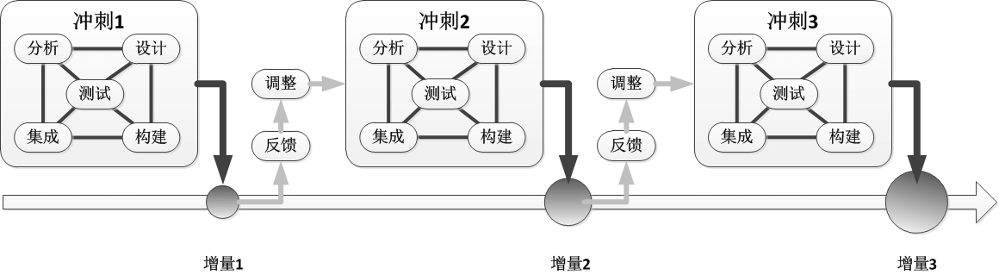

在Scrum中，并不是每次做一个阶段的工作，而是每次做一个特性，这样一来，在冲刺结束时就可以创建一个有价值的产品增量（产品的部分特性但不是全部）。

在收到对冲刺结果的反馈后，我们可以进行调整，在接下来的冲刺中可以选择开发其他特性或是修改用于构建下一组特性的过程。

在某些情况，冲刺完成的产品增量实际上并没有达到要求，作为对迭代开发和持续改进承诺的一部分，在今后的冲刺中可以安排重新修改这个特性，**这有助于解决事先不知道需要改进多少次的问题**。Scrum不需要事先确定迭代次数，在增量开发产品时，持续不断的反馈能做到迭代次数合理，经济合理。

## 关于敏捷过程（Agile Development）

**Scrum**、**Kanban**、**极限编程**[^XP]都属于敏捷过程，这里主要以Scrum方法为切入点来看敏捷过程，对于Kanban主要了解它生命周期的泳道、可视化看板就足够了，而极限编程则结合Scrum来看它所提倡的最佳实践。

### 价值观

#### 敏捷软件开发宣言

- <font size="5">个体和交互</font> <font size="5">**胜过**</font> 过程和工具
- <font size="5">可以工作的软件</font>  <font size="5">**胜过**</font>  面面俱到的文档
- <font size="5">客户合作</font> <font size="5">**胜过**</font> 合同谈判
- <font size="5">响应变化</font> <font size="5">**胜过**</font> 遵循计划

#### Scrum价值观

- 诚实
- 开放
- 勇气
- 尊重
- 专注
- 信任
- 授权
- 合作

### 原则

#### 敏捷宣言遵循的原则

- 我们最优先要做的是通过**尽早的、持续的交付有价值的软件**来使客户满意。
- 即使到了开发的后期，也**欢迎改变需求**、敏捷过程利用变化来为客户创造竞争优势。
- **经常性地交付**可以工作的软件，交付的间隔可以从几个星期到几个月，**交付的时间间隔越短越好**。
- 在整个项目开发期间，业务人员和开发人员必须天天都**在一起工作**。
- 围绕被**激励**起来的个体来构建项目。给他们提供所需的环境和支持，并且**信任**他们能够完成工作。
- 在团队内部，最具有效果并且富有效率的传递信息的方法，就是**面对面的交谈**。
- **工作的软件**是首要的**进度度量标准**。
- 敏捷过程提倡可持续的开发速度。责任人、开发者和用户应该能够**保持一个长期的、恒定的开发速度**。
- 不断地关注优秀的技能和好的设计会增强敏捷能力。
- 简单----使未完成的工作最大化的艺术----**简单是敏捷流程的根本**。
- 最好的架构、需求和设计出自于**自组织的团队**。
- 每隔一定时间，团队会在如何才能更有效地工作方面进行**反省**，然后相应地对自己的行为进行**调整**。

#### Scrum原则

- 可变性和不确定性
  - 积极采用有帮助的可变性
  - 采用**迭代**和**增量开发**
  - 通过检验、调整、适应和透明来利用可变性
  - 同时减少各种形式的不确定因素
- 预测和适应
  - **不到最后时刻，不轻易决定**
  - **承认无法一开始就把事情做对**
  - 偏好适应性、探索式的方法
  - 用经济合理的方法接受变化
  - 在预测型事前工作和适应型刚好及时的工作之间做出平衡
- 经验认知
  - 快速验证重要的假设
  - 利用多个认知循环并行的优势
  - 组织工作流程以获得快速反馈
- WIP[^WIP]（Work In Process，已开始但未完成的工作）
  - 使用经济合理的批量大小
  - 识别并管理库存以达到良好的流动
  - 关注闲置工作（工作停滞，没人干），而非闲置人员（没活儿干）
- 进度
  - 适应实时的信息并重新制定计划
  - 通过验证流动资产来测量进度
  - 专注于**以价值为中心的交付**
- 执行
  - **快速前进，但不匆忙**
  - 以质量为魂
  - **选用最小、够用的仪式**

### 敏捷过程与线性顺序开发模型的区别

这里所说的传统线性顺序开发模型，指的是瀑布模型。

对于产品的开发，一般包括了这些工作：需求分析、设计、构建、集成、测试。所谓**线性顺序**，可以这么去理解：以上提到的这些工作，一步步按顺序执行，每一步完成之后才能进入下一个步骤。

> 比如：对于线性顺序开发，在需求分析阶段，需要把产品的所有需求都分析到相同的、非常详细的程度，然后再进入设计阶段，并且再设计阶段也要完成所有的设计工作，然后再进入下一个阶段，以此类推。

而敏捷呢，以冲刺为单位来驱动项目的开发，对于需求，并不需要所有需求在相同时间都做到同样详细，而是采用逐步细化的策略，在每次冲刺，按优先级排列，及时把庞大、较少细节的需求分解成一组更小、更细的条目，把它加入冲刺中执行任务。以这种类似PDCA循环的不断冲刺迭代，通过快速循环获得快速反馈，最终交付客户满意、具有价值的产品。

> 在使用敏捷过程时，要避免把线性顺序开发的思维带入冲刺中，它的现象是，把每次冲刺当作一个小型的瀑布流程，先为该冲刺中的所有PBI完成分析，再对所有PBI进行设计，以此类推。这样最终可能导致，本轮冲刺最终所有PBI只完成了90%，而没有一个PBI完成了100%。

### 敏捷与传统开发模型如何选择的提示

敏捷并不是所有场合都适用的，敏捷也并非只有Scrum，还有Kanban等其它敏捷过程，它们也有不同的适用情景。

可以参考Cynefin框架判断问题处在什么“域”中、项目是否需求发展多变、预算与成本、失败所带来的风险等因素，结合实际情况来选择使用敏捷过程（Scrum、Kanban或其它）还是传统开发模型（瀑布模型、螺旋模型等），或者让它们结合使用。

### 敏捷带来的好处

- **可避免事先进行大量架构设计，抛弃过度设计**
- 解决客户需求的不断变化与高不确定性，提高客户满意度
- 投资回报提高
- 成本降低
- 迅速取得成果
- 有信心在复杂世界中取得成功
- 更加愉快

### 对于敏捷的误解

敏捷（Agile）使用的这个词包括翻译，其实有一定的问题，敏捷形容的是动作灵活迅速，而敏捷过程并非强调快。敏捷过程常见误解如下：

- ~~敏捷过程就是Scrum~~
- ~~敏捷项目不需要计划，也不需要分析和设计~~
- ~~不需要文档~~
- ~~敏捷适用于所有项目和所有团队~~
- ~~敏捷拥抱变化，可以随时变化~~
- ~~敏捷是自由的、无约束的~~
- ~~敏捷等于简化流程~~
- ~~敏捷过程都是标准化的过程，对于任何团队、项目都可以直接使用~~
- ~~**敏捷最大的误解**：敏捷≈更快地写代码~~

> 澄清：
>
> - Scrum只是敏捷的其中一种主流框架，很多快速的开发模式都可以看作是敏捷，比如Kanban、极限编程等
> - 敏捷计划的过程是一个**持续且变化的过程**
> - 敏捷是轻文档不是不需要文档
> - 敏捷强调自组织团队，每个人都需要为客户提供价值负责人和付出努力
> - **关注价值**而不是速度，是敏捷转型的精髓
> - 敏捷开发强调“**团队需要具备快速应对变化的能力，以适应市场，用户多变的需求**”，而不是“**团队需要提高研发速率，以完成两周一迭代**”
> - 对于敏捷过程，以Scrum来看，它**并不是标准化的过程**，不能保证在按照步骤一步一步执行后，就能在指定的时间和预算内产出让客户满意的高质量产品。相反，Scrum是一个用于组织和管理工作的框架，它建立在一套价值观、原则和实践之上，在其基础上，团队可以添加相关工程实践特有的实现方法以及在实现Scrum实践时所采取的特定方法，这样形成团队的特有Scrum版本，它才是适合团队的过程

#### 伪敏捷

“**挂羊头卖狗肉的敏捷**”指的是那些只实施了“敏捷流程和仪式”，但是却**缺乏敏捷思维的公司**。

> 要避免假敏捷，不要为了敏捷而敏捷，盲目执行，变得形式化。

### 真敏捷的三定律

可以根据以下三个定律来判断是否为真敏捷：

- **客户定律**：以为客户创造价值作为组织全部和最终目的
- **小团队定律**：假设所有的工作应都由**小型自组织团队**在**短周期**内完成并专注于**为客户创造价值**
- **网络定律**：不断努力努消除官僚主义和自上而下的层级制度，让公司作为一个互动的团队网络运行，专注于合作和为客户创造更多的价值

> Notes：之所以称为“**定律**”，意味着除非你遵守所有的这些“**定律**”，否则你的组织就不能称为敏捷

> **没有标签的敏捷（Agile Without The Label）**：“没有标签的敏捷”是致敬那些使用自身内部术语的最成功的敏捷践行者。换句话说，这些公司甚至不称自己为敏捷并且回避使用敏捷用语，有些敏捷用语，比如Scrum，本身就设计得不那么易于管理使用。因此，世界上大多数规模最大发展最快的公司比如亚马逊、苹果、脸书、谷歌、奈飞和微软——他们所做的大部分工作中都是公认的敏捷，尽管他们通常不使用标准敏捷语言。**业务敏捷**是他们成为世界上最有价值的公司的重要原因。
>
> From：[《Understanding Fake Agile》](https://www.forbes.com/sites/stevedenning/2019/05/23/understanding-fake-agile/?sh=7280f7394bbe) | [译文 - 《理解“假敏捷”》](https://zhuanlan.zhihu.com/p/398616779?utm_source=wechat_session&utm_medium=social&utm_oi=676230503762497536)

### 敏捷转型落地的关键

- 若要贯彻敏捷落地，首先就要做到**领导者的思维方式转型**
- 其次要促使**团队成员思维方式转变**
- 然后要**避免流程僵化**
- 最后重视**与各个利益干系人的衔接**

### 敏捷过程弱点或不稳定的地方

敏捷**不是银弹，更不是灵丹妙药**，敏捷不是为了否定传统瀑布模型而存在的，它除了有它适用的项目范围之外，也有其不足的地方，比如：

- 敏捷过程使用**自组织的团队**，过于**依赖成员个人能力**，对**沟通能力**要求高

- 敏捷采用“**轻文档**”，但是**很难准确的定义“轻量的“或必要的文档**，如果把握不准确，随着项目的深入，可能会出现混乱，而当团队有新成员加入时，也可能会导致上手困难


- 敏捷通常采用增量的交付方式，一次迭代的周期一般也比较短，这样有助于快交付价值，但当团队再不同周期内对各个组件进行开发时，整体的输出往往会变得非常零散，而不是一个内部紧密的整体，所以敏捷过程通常**很难把握整体产品的一致性**
- 以下这点可以说是传统开发模型和敏捷过程都普遍存在的一个问题。尽管敏捷过程一致在促进开发上的敏捷，降低了风险并提高了效率，但是在**部署、运维上仍然存在脱节**，多数团队在**部署、运维仍然停留在线性瀑布式结构上**，甚至采用落后的手动部署、手动测试，这会导致实际的**交付速度减慢**并且**产品潜在的缺陷也会暴露的越晚**。简单说，敏捷过程实现了“敏捷开发”但并未实现“敏捷部署”，而为了使软件开发的各方面都拥抱敏捷带来的好处，Patrick Debois提出了DevOps的概念，使开发与运维结合，同时实现“**敏捷开发**”与“**敏捷部署**”

## Kanban（看板）

看板（Kanban，来源于日语）最初是丰田汽车公司发明的，当时是从超级市场的运行机制中得到启示，将看板作为一种生产、运送指令的传递工具而被创造出来的，后来被用于软件工程上，这也是一种敏捷过程。

> 看板不是一个独立的过程解决方案，而是一种与现有过程重叠的方法，看板提倡以下要素：
>
> - 通过看板，让工作流程可视化
> - 限制每一步的WIP数量，确保所做的工作不超过自己的能力（容量）
> - 通过使用系统，度量并优化工作流程，实现持续改进

> 有些看板实践者指出，看板关注于**消除过重的负担**（采取的方法是让WIP[^WIP]与能力保持一致），减少流程中的反复无常，同时鼓励**采用渐进式变革**，这些特点决定着看板也适用于**复杂域**

这里主要记录Kanban的泳道以及任务卡片的相关内容

### 泳道（Swimlane）

一个软件的开发流程可以看作是一段自来水管道，特性需求从一个端进入，经过改进的软件从另一端涌出。在管道内部，存在着各种各样的工事，有的是非正式的临时工序，有的是正式的阶段性流程，而整个管道的吞吐量就代表着团队的工作效率，如果任务不流动就造成了阻塞，从而产生了瓶颈。

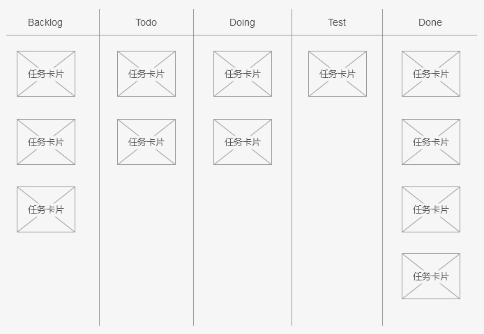

Kanban会**在泳道上，放置各种任务卡片**，完整的看板包含了5个泳道：

- Backlog：存放待开发的用户故事卡片
- Todo：存放当前冲刺阶段的待开发任务卡片
- Doing：存放当天开发中的任务卡片
- Test：存放已开发完毕，需要测试的任务卡片
- Done：存放已测试，且已验收通过的任务卡片

> Notes：更详细划分的话，可以划分为：
>
> - Backlog
> - Sprint Todo
> - Doing
> - Done
> - Test
> - Ready Online：等待运维发布
> - Onlined：发布上线

### 任务卡片

任务卡片在各个泳道中的流动就是燃尽图的动态表现，通过看板，我们能够很直观的发现项目瓶颈，使项目进度可视化。

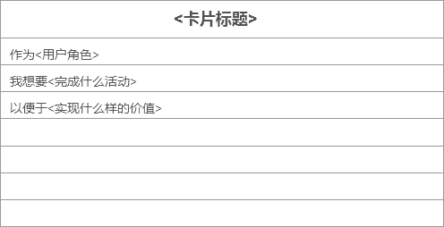

> Notes：任务卡片通常采用用户故事的形式

### 进度指示器

Scrum通常会使用**燃尽图（Burn-Down Chart）**来跟踪项目进展，这是一种基于估算的方式。在Kanban中通过进展指示器，来收集和跟踪工作流程的数据。

- 显示工作项已完成的进度
- 打点、方框或者字母的方式
- 总体进度或者每步进度
- 基于服务等级协议

### Kanban的优势

- 通过看板，我们能将冲刺任务限定在一个**已知的能力阙值**内，根据每天的任务交付速度来平衡团队的工作需求
- 看板提供了**可视化的直观管理**感受，每个人的任务一目了然，能够快速的暴露出影响团队效能的瓶颈，团队应该专注于解决问题以维持稳定的流量
- 看板能很好的展示下下游环节的当前状态，每个人**聚焦当前任务**，完成一个任务再开启下一个任务，拉动式生产，不堆积任务导致影响后面的环节
- 看板能够建立**稳定的任务节奏**，始终如一的可靠交付，这能够帮助团队和利益方合作伙伴建立稳定的信任关系

### 与Scrum的对比

| 关于             | Scrum                                                        | Kanban                                                       |
| ---------------- | ------------------------------------------------------------ | ------------------------------------------------------------ |
| 规划             | 会执行各种规划，并有每日会议                                 | 它没有固定的计划，也没有每日会议。在看板中，可以随时发生变化，即频繁发生变化 |
| 工作周期         | 每次冲刺为一次迭代，每次迭代都会产出一个可交付的产品增量，Scrum的冲刺遵循**PCDA循环规则**（计划、执行、检查、改进行动） | 连续流动，在看板工作周期中，一旦一件事完成，团队就会开始做另一件事，没有固定的交付时间 |
| 估算与成本       | 在Sprint规划期间，通过估算决定从产品待办事项中提取多少活动并添加Sprint Backlog，并以此估算成本 | 在看板中，不会估算任务，因此项目的总成本不准确               |
| 细化             | 每个Task都需要细化，以保证每个Sprint可以完成                 | 没有规定需要细化Task                                         |
| 检查和调整       | 每个冲刺最后都有一个评审、回顾和调整的机会                   | 没有具体的检查和调整机制                                     |
| 可交付的产品增量 | 每次Sprint结束都会得到一个可交付的产品增量                   | 它提供持续集成和交付，没有规定开发周期，也可以根据任务决定发布时间 |
| 角色和责任       | 有明确的角色定义，产品负责人、Scrum Master和开发团队         | 没有为团队成员分配预定义角色，所有团队成员都有责任合作提供有价值的产品 |
| 利息干系人       | 有积极的利益干系人和客户参与                                 | 不需要利益干系人或客户频繁参与                               |
| 事务性工作       | Scrum不太适合事务性工作                                      | 适合                                                         |
| 使用情景         | 适用于复杂的、迭代的**大型项目**，比如**新产品或功能的开发** | 更适合用于常常被打断的软件维护、支持和服务等**连续流工作**或**小型项目** |

> Scrum和看板都是敏捷开发方法，在认识到工作所处的域后，要分别考虑这两种方法的利与弊。在某些组织中，Scrum和看板都可以用来满足不同系统同时存在的要求。

> Scrum不太适合中断驱动型工作，在中断驱动的环境里，最好使用看板方法

### 延伸阅读

> - [《Azure Boards中的关键看板概念和术语》](https://docs.microsoft.com/zh-cn/azure/devops/boards/boards/kanban-key-concepts?view=azure-devops&tabs=agile-process)

## Scrum敏捷基本框架

Scrum是一个用于组织和管理工作的框架，它建立在一套价值观、原则和实践之上，在这个框架的基础上，各个组织可以在Scrum结构内部进行定制，添加相关工程实践特有的实现方式以及在实现Scrum实践时所采取的的特定方法，形成团队特有的、可行的Scrum过程版本。

> Scrum的实践体现在**具体角色**、**活动**、**敏捷工件**以及**相关规则**中


## Scrum角色

Scrum过程中存在以下三种角色：

- 产品负责人
- ScrumMaster
- 开发团队

其中**产品负责人**和**ScrumMaster**，可以兼任多个项目的产品负责人和ScrumMaster，也可以兼任其它角色比如开发人员，但是**最好不要同时兼任产品负责人和ScrumMaster**。

ScrumMaster与产品负责人的关系类似运动团队中，**教练**和**团队负责人**的关系，所以ScrumMaster担任的是**领导者**，而产品负责人担任的是**管理者**。

### 产品负责人

产品负责人是有授权的**产品领导力中心**，他是**唯一有权决定**要构建哪些特性并以何种顺序构建这些特性的人。产品负责人要保持一个清晰的构想并把它传达给每一为参与者，他的身份决定着他要对正在开发或维护的解决方案**全面负责**。如果项目较大，可以使用产品负责人组，但最好有一个人做决策和承担责任

#### 主要职责

- 管理经济效益
  - 版本层面的经济考量
  - 冲刺级别的经济考量
  - 产品列表的经济考量
- 参与规划活动
- 梳理产品列表
- 定义接收标准并验证这些标准是否得到满足
- 与开发团队协作
- 与利益干系人协作

#### 特征/能力

- 领域能力
  - 有预见性
  - 知道有些事是无法预见的
  - 具备业务和领域专长
- 人际交往能力
  - 和利益干系人关系好
  - 促成谈判/达成一致意见
  - 良好的沟通能力
  - 有正能量，会激励人
- 决策力
  - 得到授权，可以指定决策
  - 关键时刻敢于拍板
  - 有决断力
  - 从经济的视角权衡业务/技术能力
- 责任心
  - 承担产品责任
  - 参与并随时可以到场
  - 充当Scrum团队成员

### ScrumMaster（教练）

ScrumMaster帮助每个参与者理解并接受Scrum的价值观、原则和实践。

作为**教练**有**不断完善敏捷过程的义务**，也充当**润滑剂**，通过对产品负责人和开发团队这两个角色进行**指导**，**消除产品负责人和开发团队的隔阂**，使产品负责人能直接驱动开发团队。

作为**变革者**，他需要帮助团队**定义并遵守适合团队自己的敏捷流程**，从而确保工作完成。并且必须**积极推动变革**，帮助大家转变思维。

作为**辅助者**，还有责任保护团队不受外界干扰（“**保护伞**”），发挥领导作用，清楚阻碍团队生产率的障碍（为“**清道夫**”）。

另外需要注意ScrumMaster是领导者而不是管理者，他**没有管理权力**。

#### 主要职责

- 教练
- 服务型领导
- 过程权威
- “保护伞”
- “清道夫”
- “变革代言人”

#### 特征/能力

- 见多识广
- 善于提问
- 有耐心
- 有协作精神
- 保护团队
- 公开透明

### 开发团队

传统软件开发方法定义了不同的工作类型，如架构师、程序员、测试员、数据库管理员和界面设计师等。而Scrum定义的是开发团队的角色，这是一个由几种职位的人组成的**多样化跨职能团队**，简单来说就是前面提到的那几类人的**跨技能集合**。负责产品的设计、构建和测试。

开发团队进行**自我组织**，确定采用哪种最佳方式来实现产品负责人设定的目标。团队成员作为一个整体，必须具备多种技能以构建高质量、可工作的软件。

所以采用Scrum方法其实对开发成员的素质是有一定要求的，跨职能多样化的团队成员自组织，以最合适的方式完成工作。

#### 主要职责

开发团队的大部分时间都花在**冲刺执行**上

- 每日检视和调整
- 梳理产品列表
- 冲刺规划
- 检视和调整产品与过程

#### 特征/能力

- **自组织**：开发团队成员“**自组织**”的决定实现冲刺目标的**最佳方式**，没有项目经理告诉团队要怎么开展工作，自组织是系统自下而上，自发的属性，没有外部统治力量采用传统的自上而下，命令与控制的管理方式。举例子就是**大雁成群**的**V字飞行**，它们没有所谓的经理鸟，而是不同个体采用不同的方式彼此交互，遵循一个简单的，局部的，在不断反馈环境下作用的规则。这类系统拥有**非凡的稳定性**和**惊人的新颖性**。
- **跨职能**的多样化和全面化：团队成员拥有合适的技能，覆盖各个专业领域，并且总体上技能有一些重叠，团队有额外的灵活性，团队成员能够做多种类型的任务。
  - 跨职能、多样化
    - 跨职能的团队成员
    - 不同的学科背景
  - 多样化视角
    - 理解
    - 策略/启发
    - 心智模型
    - 偏好
  - 更好的成果
    - 更快的解决方案
    - 更好的解决方案
    - 更出色的判断
- **T型技能**：综合性T型技能团队，指有一定核心领域外的工作能力（**广度**，T的水平方向），核心领域内的职责，学科，特长（**深度**，T的垂直方向）
- **火枪手态度**：既“**人人为我，我为人人**”的态度，这强化这样一个观点：团队成员共同承担完成工作的责任，成败是整个团队的事情。没人会说：“我那部分做完了，你那部分没有，所以我们失败了”。这突出团队齐心协力的重要性。
- 高带宽沟通（广泛）
- 透明沟通
- 团队规模适中
- 专注、有责任感
- 工作节奏可持续
- 团队成员未定

## Scrum团队结构

Scrum的关键价值在于团队，正如敏捷宣言的核心价值之一是“**个体与交互**”。对于团队成员，如前面提到的开发团队所应该具备的能力时提到过：“**团队成员拥有合适的技能，覆盖各个专业领域，并且总体上技能有一些重叠，团队有额外的灵活性，团队成员能够做多种类型的任务**”。

### 团队规模问题

每个团队的规模要适中，按照Scrum过程，一般规则团队最好有五到九名成员。

对于团队**负责的产品数量问题**，团队需要**保持专注**、**有责任感**，同时兼顾多个产品很难做到保证质量和专注度，所以最好**不要同时负责超过两个产品**。

### 团队类型

团队组织方式可以有**特性团队**和**组件团队**两种。

#### 特性团队

特性团队是一个跨职能，跨组件的团队，能够从产品列表中抽取并完成最终客户想要的特性。

#### 组件团队

组件团队专注于开发组件或子系统，这些组件或子系统只能实现最终客户想要的部分特性，组件团队也只完成需要集成到最终用户特性中的部分工作。

#### 选择特性团队还是组件团队？

由上面可见，**特性**其实范围是比**组件**要大的。对于Scrum是更倾向于组件特性团队的，不过大多数团队都更喜欢组件团队，这往往是因为他们认为对于特定的代码区域，只有专业团才能做出安全而有效的改动。

对于是选择特性团队还是组件团队，没有一个普遍适用的方法。而大多数成功的组织采用的是**混合模式**，这样的效果可能更好，**以特性团队为主**， 把**组件团队作为资源集中使用**时更加经济合理，偶尔有个别组件团队。

> 一个成员可以既是特性团队成员又是组件团队成员

### 协调多个团队活动的方法

#### SoS（Scrum of Scrums）

如下图所示，SoS作为一种协调多个团队之间工作的方法，其实**是一种**类似Scrum团队在冲刺时每日例会的**会议**。只不过每日例会时只包含团队内的成员，而SoS是由各个团队的代表组成用来协调工作的。各个团队的参会者应当是**当时团队的最佳代言人**，另外SoS的会议时间长度最好**不要超过15分钟**。

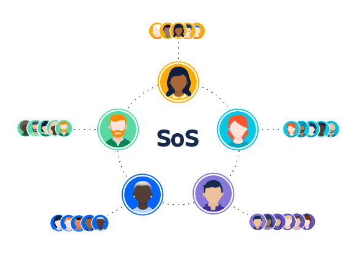

#### 版本火车（Agile Release Train，ART）

版本火车根据按照一个共同的节奏协调跨团队的合作，使多个团队的愿景、规划和相互依赖关系保持一致。火车的隐喻暗示特性“**出站**”时间有一个**公开的时刻表**，所有参与产品开发的团队都需要在约定的时间把东西放到火车上，版本火车总是准时出发，谁也不等，但是错过了本轮版本火车不要紧，因为后面还有下一列火车定点出发。

如下图（来自：Scrum精髓：敏捷转型指南），参与版本火车的团队所有冲刺持续期都一样长，并且所有冲刺的步调都一致，在完成几个固定数量的冲刺后，就可以得到[^PSI]。

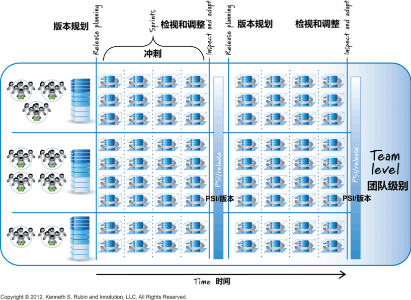

另外，我认为在只有一个团队，然后一个大解决方案存在多个项目的时候，也可以参考版本火车的做法。

## Scrum敏捷活动

一次Scrum完整的产品活动包括**规划**和**冲刺**。Scrum的**主要活动**是一次次的**冲刺**，在执行冲刺之前会执行**适度的规划**。

## Scrum规划活动

需要承认的是，我们可能**无法事先制定完美的计划**，这可能是由于考虑不周到、认知不足或中途需求发生变更等因素导致的，所以事先规划是有帮助的，但不宜过度。

### 规划原则

- **假设事先无法制定完美计划**：我们不相信能够在前期做好计划，因此也不会试图在前期做所有规划文件，但仍然需要在早期制定一些规划，以**取得前期规划与及时规划的平衡**。
- **事先规划有帮助，但不宜过度**
- **最后责任时刻才敲定计划**（不到最后责任时刻不做决定选择）：不成熟的决策除了代价非常高之外，还很危险。为了达到前期规划与及时规划之间的良好平衡，必须要**遵守最后责任时刻前仍可改变重要选项的原则**。这意味着我们会把适合<u>及时进的规划</u>留到有了最佳信息时再做。
- **注重响应变化和重新规划胜于遵循前期计划**，可以理解为**要重视持续规划**，而不要过于强调前期规划
- 正确管理WIP[^WIP]
- **提倡更小、更频繁的发布**
- 计划快速学习并在必要时调头：在获得认知或快速反馈后，如果我们判断出计划不可行，就应该转型或改变方向。

### 多层级规划

如下图，Scrum在开发产品时，需要在多个层级上制定计划。其中每层规划会根据**输入**工件进行规划活动，然后**输出**规划成果。基本上高层规划的输出可能会作为低层规划的输入，不过这不是绝对的。比如冲刺规划，本轮冲刺的成果可能会作为下次冲刺规划的输入，这就发生在同一层级的规划上。又比如，产品级规划的输出正是组合规划的重要输入。


#### 战略规划（Strategy Planning）

处于最高层的战略规划，是组织根据市场、业务等因素在产品战略方向上制定的规划。

#### 组合规划（Portfolio Planning）

产品组合规划（或组合管理），**组合**二字表明了，处理的是一个**集合**。这个规划活动用来确定组合中要完成哪些条目、按照**什么顺序完成**以及**持续多久时间**，这些条目可以是产品、产品增量或项目。组合规划是一个永无休止的活动，只要有产品需要研发或维护，就需要进行组合管理。

> 团队需要保持专注、责任感，同时兼顾多个产品很难做到保证质量和专注度，所以最好不要同时超过两个产品。


##### 输入

- **新构想的产品**（组合列表中的候选）：附带新产品构想阶段收集到的各种数据，例如成本、时限、价值和风险等。
- **流程中的产品**：附带流程中的产品自己的一套数据（例如中间顾客的反馈、更新成本、进度安排和范围预估等）、技术债的债务状况和有助于找到产品未来出路的市场相关数据等。

##### 输出

- **组合列表**：既已经确定优先顺序的未来产品的具体工作事项清单，它已经通过批准但未开始进行开发。
- **一系列活动中的产品**：包括已经批准并立即开发的新产品，也包括目前处于生产过程中的产品和已经批准可以继续开发的产品。

##### 活动

- **进度安排**
- **管理流入**
- **管理流出**
- **管理流程中的产品**

##### 流程相关策略

- 进度安排策略

  - **优先考虑生命周期利润**：生命周期利润指的是产品整个生命过程中可能产生的**所有利润总和**，评估它的两个最重要变量是**延期成本**和**持续时间**（常用来替代工作量和产品规模）。我们需要确定使用哪个变量来衡量有利于**判断优化组合内各个产品的优先顺序**是有效的，以确定**进度安排方法**（最短任务优先、延期成本高的优先或加权最短任务优先），使产品的整个生命周期利润最大化。
  - **计算延期成本**
  - **估算要准确，不比精确**：为了正确安排组合列表中各条目的优先顺序，需要理解它们的工作量或成本（因为成本影响着生命周期），在估算组合列表的成本时，**需要准确，而不是精确**，因为在做初始估算时，我们得到的数据很有限。可以考虑使用**T恤衫尺码**而非精确数字的方式来估算，每个**T恤尺寸（XS、S、M、L、XL）**对应于一个范围（根据实际情况来设定每个尺寸对应的范围）。这样做的好处是**快**，通常也**比较准确**，可以**传达出不确定性**，还能在组合层面提供可操作的信息，并且能够消除时间上的浪费，不会让人产生太高的期望或有一种不真实的安全感。

- 流入策略

  - 应用经济过滤器：根据设定的经济指标来讨论，保留或否决新的构想。
  - 到达率和离开率要平衡：控制好组合列表的规模，避免超载，导致不堪重负。
  - 快速拥抱新涌现的机会
  - **为更小、更频繁发布做计划**

- 流出策略

  - **关注闲置工作，而不是闲置人员**：闲置工作比闲置人员更浪费。在明确以下两点之后，才开始做新产品：新产品的良好开发流程；新产品不会扰乱其它WIP的流程。这种策略与下面的“设立WIP限制”结合使用。
  - **设立WIP[^WIP]限制**：量力而行，不要从组合列表里取出超过我们能力范围的产品。以团队为生产能力单位来设定WIP限制，已知有多少Scrum团队，已知他们有能力做哪些类型的产品，就可以推算出可以同时进行多少开发工作、做哪些类型的开发工作。
  - **等待整个团队一起行动**：Scrum的生产能力单位是团队，如果团队不完整，那就不应该开始做新的产品。

- WIP[^WIP]管理策略

  - **边际效益[^MarginalBenefit]透镜**

    - 行动决策
      - 保留：继续开发产品
      - 交付：停止产品开发，上市
      - 转向：接受我们学到的东西，然后改变方向
      - 终止：停止开发，结束这个产品
    - 决策流程示意图

    

#### 产品规划（Product Planning）

**产品级规划**也可以称为**构想（Envisioning）**，目的是**获得潜在产品的基本特性**并为创建该产品而**制定大致计划**。不论构建什么产品，在快要结束产品级规划时，都应当有一个**产品愿景**、一个**概要产品列表**（含有经过估算的用户故事）和一个**产品路线图**（可选），可能还会产出其它工件，让决策者能够信心十足地着手开发产品。

在Scrum中，我们认为**事先无法（或应该尝试）了解产品的所有细节**。但是：不提出产品构想，通常得不到拨款；需要细节相当丰富，足以帮助我们理解客户、特性和概要解决方案；需要大致了解产品需要多少成本。

我认为构想其实可以理解为**立项**，但**不要把**Scrum项目的**产品构想与**“重量级、重仪式、计划密集的**立项活动**”**混为一谈**。我们**不会花过多时间或精力来构想产品**，因为我们希望**快速前进**，**越过猜想阶段**（在这个阶段，我们<u>认为</u>自己知道客户的需要和可能的解决方案），**进入快速反馈阶段**（在一系列连续的冲刺中创造客户价值）。毕竟只有真正开始通过持续与复杂环境交互的循环来实现解决方案，我们才能基于实际情况获取经验认知，使产品得以存在并进而茁壮成长。构想要快速，高效，行动要快，**越早开始构建有形的产品，就越早能验证我们的理解和假设**。

产品级规划同样是一项**持续性的活动**，构想开始于团队某人对产品产生的某个**构思**，只要该构思通过了战略过滤器的筛选，就值得进一步研究和投入，然后就可以进入初步的构想了。

> - **提出想法**，包括概要**目标特性**、**目标客户**和**主要优势**
> - 在构想阶段可以考虑执行一次**知识获取冲刺**，以获取必要的知识
> - 在开发产品或服务时，愿景往往表述为利益干系人**如何得到商业价值**

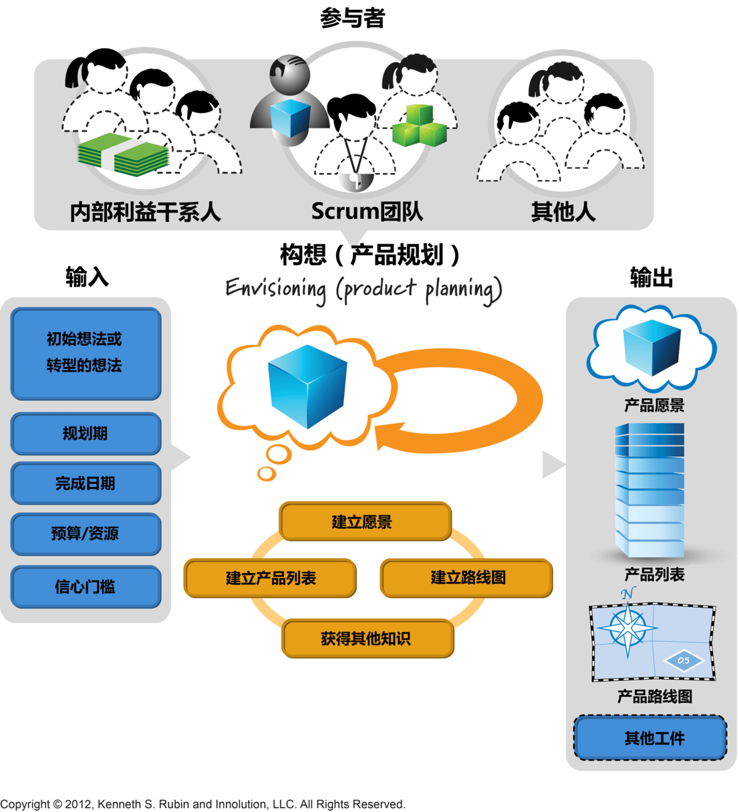

##### 输入

所有构想的输入是要同时考虑的，而不是按顺序考虑：

- **初始想法或转型的想法**
- 规划期
- 完成日期
- 预算/资源
- **信心门槛**（Confidence Threshold），它指的是针对构想“完成的定义”的一系列信息，决策者有这些信息作为依据才有足够信心做出**批准/驳回**投资后续开发的**决策**。信心门槛应该设置到恰到好处，不能过高也不能过低。

##### 输出

- **产品愿景**：描述要从哪些方面为用户或客户之类的利益干系人提供商业价值。愿景流行的格式一般有：
  - **电梯游说**：写一份30秒或1分钟的产品愿景快速宣传语。想象你和一个风投步入了电梯，必须把你的产品愿景讲给他听，争取在搭乘电梯这么短的时间内做到。
  - 产品数据表
  - **产品愿景盒子**：画出一个盒子，里面放着要交付的产品，提出三四个要点进行说明。
  - 用户大会简报
  - **新闻稿**：一有产品，就写一份新闻稿，写得好的新闻稿可以在一页或更少的篇幅内清楚传达出有报道价值的内容。
  - 杂志评论：草拟一份虚构的杂志评论。
- **概要产品列表**[^PBI]：产品规划产生的PBI，一般是粗略的、**初始史诗级别**的。描述PBI的方式有很多，比如用户故事（User Story）。
- **产品路线图**：它传递的信息是产品随着时间的推移如何以增量的方式构建和交付，以及驱动每一个版本的重要因素，可以采用**版本火车图表**来描述产品路线图。我们要关注的是**最小可发布特性集**[^MRF]的每一个版本，并且每个版本都有明确定义的**版本目标**，说明版本的目的和期望的产出。在制定产品路线图时，还要考虑概要架构或技术问题。对于时间跨度也需要考虑，可以考虑使用**固定周期的版本策略**。
- **其他工件**

##### 活动

- 建立愿景
- 创建概要产品列表
- 定义产品路线图，但如果只是为了一个单独的小版本制定计划，那么不需要产品路线图
- 其他活动以获得知识，这有助于达到目标信心阀值

##### 从经济合理的角度构想产品

构想经济要合理，准确（并不需要精确），总之尽可能的让构想合理与简化，刚好够用的事前计划和知识获取工作，做出当下最好的决策。

- 瞄准一个实际的信心阀值
- 关注短期收益
- 动作要快
- 花钱买经验认知
- 使用增量/誓行的资助方式
- 快速学习并调头（转向），即快速失败

#### 版本规划（Release Planning）

**产品规划**的目的是构想产品愿景（**包含哪些特性**），而**版本规划**的目的是**确定达成产品目标需要采取哪些具体的步骤**并且针对**增量交付**取得范围、日期和估算之间的**平衡**。

> 可以在PBI列表上用线，规划出不同的版本，并与产品路线图关联起来


##### 版本发布节奏

不同组织不同产品采用的版本发布节奏不尽相同，但每个组织、产品都必须确定一个合适的节奏，有规律地向客户交付特性，一般有以下几种节奏：

- **在完成多个冲刺后合并为一个版本发布**
- **每个冲刺发布一次**
- **在完成每个特性完成后立即发布**，这种其实就是所谓的**持续部署**（或**持续交付**）

##### 版本时间维度

版本计划必须有相关联的**时间维度**，可以用**完成该版本所需的冲刺数**来表达，大多数版本都比较大，包含的特性得在多个冲刺中完成

##### 版本规划的时间安排

版本规划不是一次性的，它是经常性的、每个冲刺都要做的**例行活动**。一个比较**合理的时间点**是，在构想/产品级规划之后就开始做版本规划。

初步的版本计划可能不完整或不精确，在做版本相关工作期间，随着经验认知“浮出水面”，**版本计划是可以改变的**。版本规划的修改可以在**每次冲刺评审时进行，也可以在平时为后续每一个冲刺做准备或执行每一个冲刺时进行**。

##### 版本规划的同义词

- **长期规划**：表明目标放眼于多个冲刺

- **里程碑[^Milestone]驱动的规划**：采用这个术语，是因为各版本一般与重大里程碑保持一致，例如与完成一个最小可行（适销）特性集[^MRF]保持一致。

##### 版本线

让**版本发布可视化**的一个简单方法是**在产品列表中画线**，线上方的所有条目是这个版本计划要做的，线下方的所有条目是这个版本不计划做的。在对产品有更深入的了解后，可以在产品列表中上下移动这条线。


##### 输入

- **产品构想**
- **产品列表**
- **产品路线图**
- **团队速率**：对于老团队，使用其已知速率。对于新团队，则需要在版本规划期间**预测团队的速率**，要注意的是，速率的估算要**准确但不需要精确**。

##### 输出

版本规划的输出统称为“**版本计划**”。

- 【**特性范围、固定成本**】或【**冲刺范围、成本范围**】：不同的**版本约束**，产出不同
- 明确的**最小可发布特性集**[^MRF]：每个版本都要有一个明确的MRF，在构想产品期间，可能已经定义了它最初的最小可发布特性集，即便如此，也要在版本规划期间审核各个MRF，确保它们从客户角度来看的确能够代表最小可行（适销）产品。
- **冲刺图**：说明冲刺包含的PBI[^PBI]。

##### 版本约束

版本规划的目标是确定下一个版本中最有价值的特性，确定预期质量。而**范围、日期和预算**等是最影响到达目标的重要变量。

我们可以根据产品规划来确定其中一个或多个约束，在Scrum中，我们认为**不可能事前确定所有特性和范围**，因此传统的计划驱动式预测开发方式的“固定一切”这种方式是行不通的，在做版本规划时，这些变量**至少有一个是可变的**。

可行的约束组合是**固定时间**或**固定范围**，其它可变。而**固定时间**大多数人认为**是最符合Scrum原则的**，一句话，日期和预算可以固定，但**范围必须灵活**。这与Scrum强调的**时间盒限制**高度吻合，为版本设置一个固定的时限，可以限定我们能够完成的工作量并强制人们在举棋不定的时候强制确定PBI[^PBI]的优先顺序。

持续版本规划的一个重要环节是**利用当前认知重新考虑约束条件（更新约束）**，看是否会再次取得平衡。开发任何产品期间中，我们都必须持续做出决定、重新考虑并进而推翻之前的决定。

确定了版本约束之后，就可以比较容易的**计算成本**了。

##### 活动

###### 梳理产品列表

版本规划的一个**基本活动**是**梳理产品列表**，使其能够体现我们的目标价值和质量。我们在构想（产品规划）阶段确定了一个**概要产品列表（也许是史诗故事）**并用它定义每个版本的最小可发布特性集[^MRF]。

如果产品规划产出的概要产品列表条目[^PBI]太大，不能用，为了**细化**可以组织一次用户故事写作研讨会。可以把它纳入版本计划会或者单独安排。

一旦故事足够小，团队就可以**进行估算**并交流彼此对成本的**初步想法**，接下来根据版本目标和约束对估算过的**故事排列优先顺序**，并确保最小可发布特性集[^MRF]始终能够被识别出来并得到大家的一致认同。

###### 细化最小可发布特性（MRF）

版本规划活动的一个重要工作是反复细致地重新评估和细化当前版本真正必须要有的MRF[^MRF]，从冲刺中得到快速反馈并获得经验认知后，我们会持续调整MRF。

在Scrum中由**产品负责人最终定义MRF**[^MRF]，也可以与合适的成员一起定义。

###### 冲刺映射（PBI归位）

**使近期PBI[^PBI]快速、尽早映射（或插入）特定的冲刺中**是很有帮助的。在进行**冲刺映射**之前，需要产品列表[^PBI]具有这三个特征：**详略得当的**、**估算合理**以及**排定优先顺序的**。

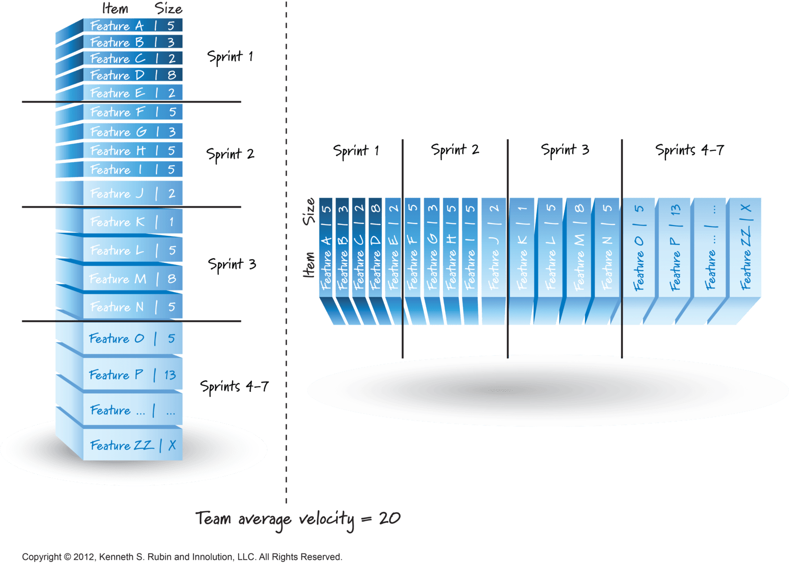

##### 版本进展沟通手段

主要使用某种形式的**燃尽图**和/或**燃起图**和/或**产品列表倒置的燃起图**作为主要的信息雷达，用它来展示版本的状态。

#### 冲刺规划与每日规划（Sprint Planning and Daily Planning）

这部分内容放到冲刺活动中记录

## Scrum冲刺活动

Scrum敏捷开发在最长一个月的迭代或周期中安排工作，这些迭代或周期称为“**冲刺（Sprint）**”。冲刺是在**时间盒**内完成的，**持续时间短且长度一致**，一般来说，冲刺开始后就要**锁定冲刺目标**，不允许对范围或人员等目标进行更改，最后每个冲刺都要完成一个**潜在可发布产品增量[^PSI]**，并且要达到团队一致认同的**完成定义**中要求的最终状态。

大多数团队在初采用敏捷过程时，前几个冲刺都不会做得很好，这没有关系，只希望下一个冲刺都能比前一个冲刺做得好。

冲刺活动流程与相关工件如下面两张图所示：


### Scrum冲刺活动与PDCA循环

Scrum的冲刺可以理解为是基于**PDCA**循环衍生出来的，即P（Plan，计划）、D（Do，执行）、C（Check，检查），A（Action，改进行动），它们的对应关系可以理解为：

- **P（Plan，计划）** <=> **冲刺规划**
- **D（Do，执行）** <=> **冲刺执行**
- **C（Check，检查）** <=> **冲刺评审**
- **A（Action，改进行动）** <=> **冲刺回顾**

### 冲刺规划（Sprint Planning）

每个冲刺都从**冲刺规划**开始，对Scrum团队在下一个冲刺中做哪些特定PBI[^PBI]达成一致意见，每个PBI[^PBI]会被分解成一系列经过估算的任务，这些任务共同组成了计划。而这些为完成PBI[^PBI]而必须完成的**任务级工作**，团队会为它们建立**冲刺列表**。这通常都遵循一个有用的**任务分解规则**，即分解后的任务都不会超过8个小时的工作量，有一些可能会稍微大一点。

> 与承诺的PBI相关的新任务可以随时加入冲刺列表，允许把未预见到的任务加入冲刺列表，这是因为它承认在冲刺规划期间我们无法完全定义整个任务集足已以承诺的PBI完成相关的设计、构建、集成和测试。所以在工作过程中，能够而且也**应该根据我们的理解来调整冲刺列表**。
>
> 但有条规则，如果该任务**体量比较小**可以在本次冲刺完成，那么可以加入Sprint Backlog（Sprint Todo）列表中，否则的话应该加入Product Backlog。

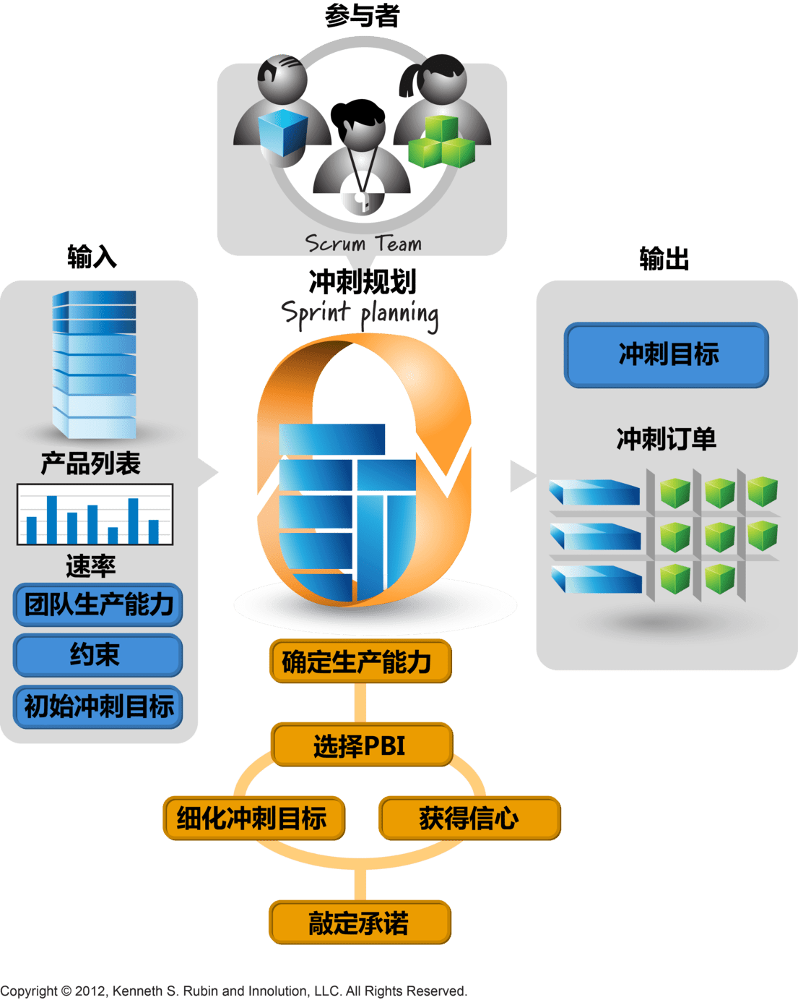

#### 输入

- **产品列表**：在冲刺计划前，最重要的PBI已经梳理到**就绪状态**（关于PBI的就绪状态，看产品列表篇中的定义），可以理解为足够详细和细化
- **团队速率**：团队的**历史速率**是团队在一个冲刺里能**实际完成多少任务的指标**
- 约束：识别出业务或技术的限制，这些限制可能严重影响团队的交付能力
- 团队生产能力（容量）：生产能力要考虑到团队成员，每个团队成员都有哪些技能以及下个冲刺中他们的可用情况
- **初始冲刺目标**：产品负责人希望在这个冲刺内完成的**业务目标**

#### 输出

- **冲刺目标**：可以理解为业务目标
- **冲刺列表**：分解后的**任务级工作**

#### 冲刺规划的两种方式

##### 两段式冲刺规划

在第1阶段（**确定工作内容【选择条目】**），开发团队确定其完成工作内容的**生产能力**，预估在冲刺结束时能完成的PBI[^PBI]，主要以**故事点**的数目为单位。

然后在第2阶段（**确定工作方式【获得交付信心】**），通过**制定计划**来获得有能力完成第1阶段预测条目的**信心**。具体是把PBI[^PBI]分解成一系列任务，估算每个任务需要的工作量，然后团队比较任务估算的小时数和团队以小时计的生产能力，看是否满足第1阶段承诺的生产能力。

如果团队发现选区的条目太多或太少，或者选取的条目由于种种原因限制而实际不能在一个冲刺里一起开发，则可以**调整预期**或**重新细化冲刺目标**，以满足现有生产能力和相关约束。


##### 一次性冲刺规划

这是最常见的一种方法，即**选择条目**和**获得交付信心**这两个活动**交替进行**。

使用这种方式时，开发团队先确定自己有多少生产能力可以用于完成工作。基于可用的生产能力，冲刺目标可能需要细化。接着，团队选择一个PBI[^PBI]，然后表示有信心在当前冲刺做完它。**重复这个过程**，直到团队没有余力再做更多工作，这时最终敲定承诺，结束冲刺规划活动。


#### 活动

##### 确定生产能力

每次冲刺规划要根据上一轮和实际情况**调整生产能力**（或者**团队速率**）。

**总体生产能力的组成**：

- **在该冲刺内用于完成PBI任务的生产能力**
- **其它冲刺活动**：冲刺规划、冲刺评审、冲刺回顾、产品列表梳理
- 其它冲刺无关的活动：支持、维护、做其他项目
- **冲刺缓冲**：需要预留一些缓冲时间，以防有些事情的进展不如计划的那么顺利
- 个人休假

**表示生产能力的做法**：

- 用**故事点**来表示
- 用**工时**来表示

##### 选取PBI

挑选PBI[^PBI]时不一定必须选取PBI顶部优先级高的，需要根据实际情况，如果它太大（尝试先细化），或者由于技术等原因暂时无法开始，那么可以先挑选其它合适的PBI。一个规则是：**绝对不开始做“完不成条目”**。

##### 获得信心

使用预测速率来看承诺是否实际

##### 细化冲刺目标

冲刺目标总结了冲刺的业务目标和价值，产品负责人要带着初步冲刺目标参加冲刺规划活动。不过，初始目标可以在冲刺规划期间重新优化，因为冲刺规划的参与者可以一起决定实际能够交付哪些PBI。

##### 敲定承诺

在完成冲刺规划之后，开发团队敲定承诺，表明团队在冲刺结束时能够交付业务价值。冲刺目标和选取的PBI就是这个承诺的具体体现。

### 每日规划（Daily Planning）

**每日规划**出现在团队的**每日例会**上，这是一个关键的**每日检视-调整活动**，每日例会有一定的时间范围，**最好不要超过15分钟**。这**不是用来解决问题**的，而是每人轮流回答以下问题，通过每日得到的**快速反馈**，让集体了解有多少工作要做、要开始做哪些条目以及各成员之间如何以最好的方式组织工作。

- 在上次每日例会之后我**完成了什么**？
- 在下次每日例会之前我**计划做什么工作**？
- 有什么**障碍**让我无法取得进展？

### 冲刺执行（Sprint Execution）

在Scrum团队完成冲刺计划并就下一个冲刺的内容达成一致意见后，开发团队就要在ScrumMaster的指导下，执行为了完成特性而所需的所有**任务级工作**。

冲刺执行有点像一个**迷你项目**，为了交付一个**潜在可发布产品增量[^PSI]**而必须完成所有的工作。在冲刺执行期间，开发团队成员**自组织**并想方设法达成**冲刺规划期间确定的目标**。**ScrumMaster**不会为团队分配工作或具体指导团队开展工作，**自组织团队**必须自己想办法。而**产品负责人**负责回答需要澄清的问题、检视工作进展、为团队提供反馈、在条件允许时讨论冲刺目标调整并验证PBI是否满足接收条件。

冲刺执行的理想原则是**见机行事**，充分利用团队的技能，**逐步明确任务规划**，而不是试着事先列出一个完整而详细的工作计划。在冲刺执行期，团队为了适应环境变化，**可以持续进行任务规划**。


#### 工作流程管理

##### 并行工作和蜂拥式

管理工作流程的一个重要环节是确定团队应该**并行做多少个PBI[^PBI]**才能最大化冲刺结束时交付的价值。同时做多个或少个都有可能造成浪费，为了达到合理的平衡，团队需要**做适量的条目**，力求充分利用团队的**T型技能**和**可用生产力**，但又**不至于负担过重**。目标是**减少完成单个条目的时间**，同时**最大化冲刺期间交付的总体价值**。

这种就是所谓的**蜂拥式（all-at-once，Swarming）**的开发方法。指**有余力的团队成员聚在一起合力完成一个已经开始的条目之后再继续转做其他条目**。拥有**火枪手态度**和**T型技能的团队**会采用**蜂拥式**。蜂拥式有助于团队保持**对目标的专注**，而不是任务，这意味着能更快完成更多工作。另外不要误以为蜂拥式是一个保证团队成员都100%忙碌的策略。

**蜂拥式**在每个冲刺都执行所有的必要活动，创建可工作的产品增量（产品的一部分而不是全部），**每个冲刺完成一部分分析、设计、构建、集成和测试工作**。这样的好处是可以快速验证我们在开发产品特性时所作的假设。


另外**不能**把**瀑布式思维**应用于冲刺级别，这是一种为**危险的方式**，把冲刺执行当做一个**迷你瀑布项目**，如果使用这种方式，我们一开始就会同时做所有PBI，首先分析这次冲刺要做的所有条目，然后按顺序完成设计、编码和测试。这十分危险，到最后可能每个特性只完成了90%，而没有任何一个特性完成到100%。

> 在执行单个任务时也要尽量避免瀑布式的思维。
>

##### 从哪个PBI开始

一般选择产品负责人认为优先级别最高的条目，但由于技术依赖或技术能力的限制，可能无法按照这个顺序来选，所以开发团队需要见机行事并做出合适的选择。

##### 如何安排任务

我们需要关注**价值交付思维**，拥有这个思维的团队成员**灵活**，组织任务并安排合适的人选来做这些任务。这样一来，等待时间少了，工作交换的规模和频率也少了。使用**快速循环**来创建测试、创建代码、执行测试、优化测试和代码，然后重复这个循环。这种方式能够使工作一直流动（没有阻塞的工作），也支持**快速反馈**，因此能够快速发现问题和解决问题，并使团队成员有机会**发展T型技能**，进而能够以**蜂拥式**完成一个条目。

> 冲刺任务使用**快速循环**得到**快速反馈**

#### 每日例会

**每日规划**出现在团队的**每日例会**上，这是一个关键的**每日检视-调整活动**，得到**快速反馈**，可以帮助团队以更快、更灵活的工作流完成解决方案。

> 最详尽的计划出现在团队的每日例会上。每日例会上，每个人会讲述在上次例会后做了什么，今天准备做什么，是否遇到任何阻碍。

#### 任务执行：强调技术实践

**敏捷开发**积极采用良好的**技术实践**，敏捷社区把一些成熟的技术实践总结起来并称为“**极限编程[^XP]**”，以下是极限编程总结的**十二个最佳实践**：

- 完整团队、现场客户 ( On-site Customer )：XP项目的所有参与者（开发人员，业务分析师，测试人员等）一起工作在一个开放的场所中，他们是同一个团队的成员，这个场所的墙壁上随意悬挂着大幅的、显著的图表以及其他一些显示他们进度的东西。还可以将使用正在构建的系统的一个或多个客户分配给开发团队，客户有助于指导开发，并有权优先考虑，还可以说明需求并回答开发人员可能遇到的任何问题。这确保了与客户进行有效的沟通，这样需要的文件就更少了。
- 规划策略、计划游戏（The Planning Game）：计划是持续的、循序渐进的。每两周，开发人员就为下两周估算候选特性的成本，而客户则根据成本和商务价值来选择要实现的特性。
- 客户测试（Customer Tests）：作为选择每个所期望的特性的一部分，客户定义出自动验收测试来表明该特性可以工作。
- **简洁设计**（Simple Design）：团队保持设计恰好和当前的系统功能相匹配，它通过了所有的测试，不包含任何重复，表达出了编写者想表达的所有东西，并且包含尽可能少的代码。
- 结对编程（Pair Programming）：所有的产品软件都是由两个软件、并排坐在一起在同一台机器上构建的。
- **测试驱动开发**（TDD，Test-Driven Development）：程序员以非常短的循环周期工作，他们先增加一个失败的测试，然后使之通过。
- **代码重构**（Refactoring）：随时改进糟糕的代码。保持代码尽可能的干净、具有表达力。
- **持续集成**（CI，Continuous Integration）：团队总是使系统完整地集成。
- 集体代码所有权（Collective Ownership）：任何结对的程序员都可以在任何时候改进任何代码。
- 编码标准、代码规范（Code Standards）：系统中所有的代码看起来就好像是被单独一个“**非常值得胜任的**”人编写的。
- **隐喻**（System Metaphor）：团队提出一个程序工作原理的公共景象。每个项目都有一个“名称系统”和描述，有助于指导各方之间的发展过程和交流。XP相信每个应用程序都应该具有基于简单隐喻的概念完整性，这就解释了系统工作的本质。例如，一个大的XP项目是克莱斯勒的工资系统。 这个项目的隐喻是，工资系统就像一条装配线，其中小时零件被转换成美元零件，所有零件都被组装并产生薪水。
- 可持续的速度、小型发布（Small Release）：团队只有持久才有获胜的希望，他们以能够长期维持的速度努力工作，他们保持精力，他们把项目看作是马拉松长跑，而不是全速短跑。

#### 沟通

冲刺执行时的沟通和传递信息，可以用**任务版**和/或**燃尽图**和/或**燃起图**作为主要的信息雷达，它们配合使用。

##### 任务版（Task Board）

对于任务版，另一种敏捷方法“**看板（Kanban）**”，它使用**详细信息来可视化工作流的不同阶段**，可以配合使用


##### 冲刺燃起图（Sprint Burnup Chart）

燃起图[^BurnupChart]直观地展现了时间与已完成的工作间的关系，让团队成员可以看见其工作成果，这算是一种激励。

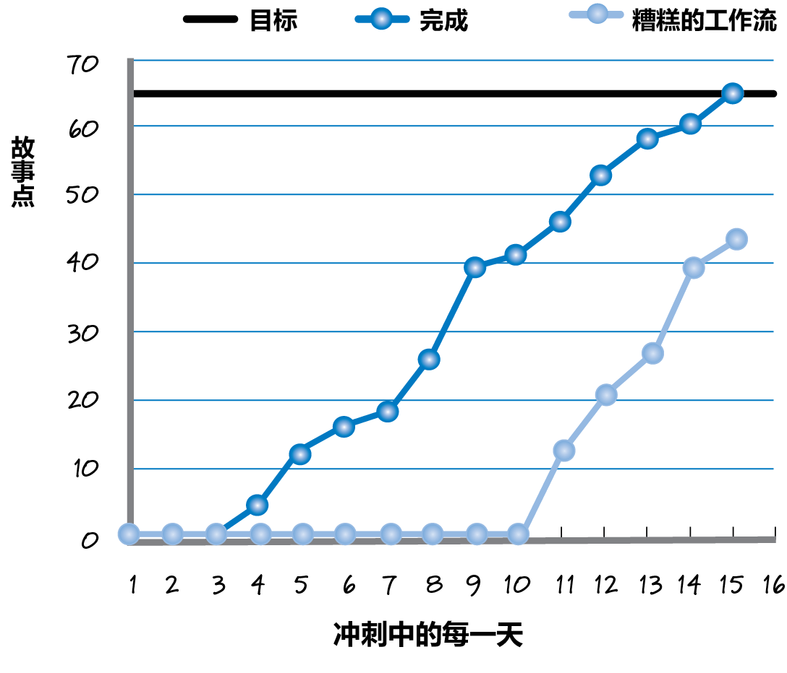

##### 冲刺燃尽图（Sprint Burndown Chart）

**燃尽图[^BurndownChart]也叫燃烧图**，Scrum提倡使用它来直观的展现项目总体进度，它展示了**时间与项目剩余总体工作量间的关系**。让人清晰直观的感受到随着时间的推移，项目所剩的工作量逐天减少。

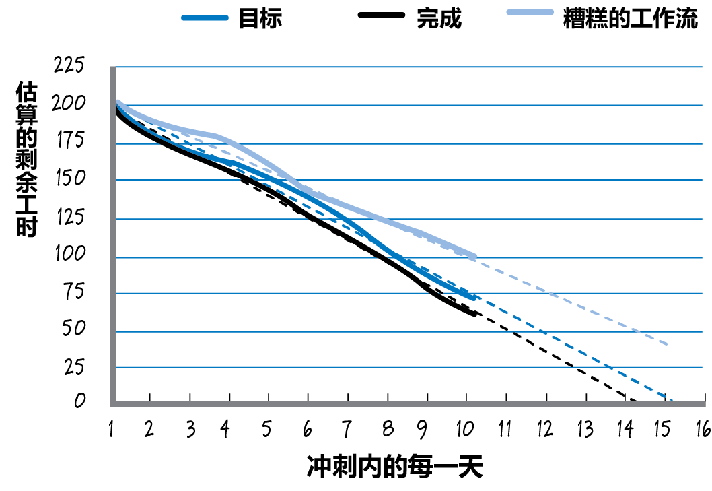

### 冲刺评审（Sprint Review）

临近冲刺结束时，团队要进行两个重要的“**检视-调整**”活动：**冲刺评审**的重点是**产品本身**，**冲刺回顾**考查的是**团队的产品构建过程**。

在冲刺评审期间，我们检视（并调整）工作成果（**潜在可发布产品增量**[^PSI]），冲刺评审发生在每个冲刺周期快要结束时，在冲刺执行之后、冲刺回顾之前（偶尔也发生在冲刺回顾之后）。

> 冲刺评审**只允许演示已完成的内容**，所以必须在冲刺评审之前执行**接收测试**，让团队指导哪些特性满足“**完成的定义**”

冲刺评审使每个可以对产品开发工作提出建议的人有机会**检视和调整当前构建的产品**。冲刺评审让人们清楚看到产品当前的状态，包括各种让人头疼的真相。此时可以提问、发表见解或给出建议，讨论结合当前实际最好采取哪些措施。

因为冲刺评审有助于确保组织正在创建成功的产品，所以它是Scrum框架中**最重要的认知循环之一**。而且，因为冲刺持续期很短，所以这个循环也很快，能够频繁**校正路线**，让产品开发沿着正确的方向前进。如果把这种反馈推迟到很后期，并且假设所有工作都要以某个基线计划来进展，我们会像很多人习以为常的那样惊讶、失望和沮丧。

执行冲刺评审的常见方法是：总结或概要说明冲刺目标中哪些完成了、哪些没有完成；演示潜在可发布产品增量[^PSI]；讨论产品当前状态；调整产品未来方向。

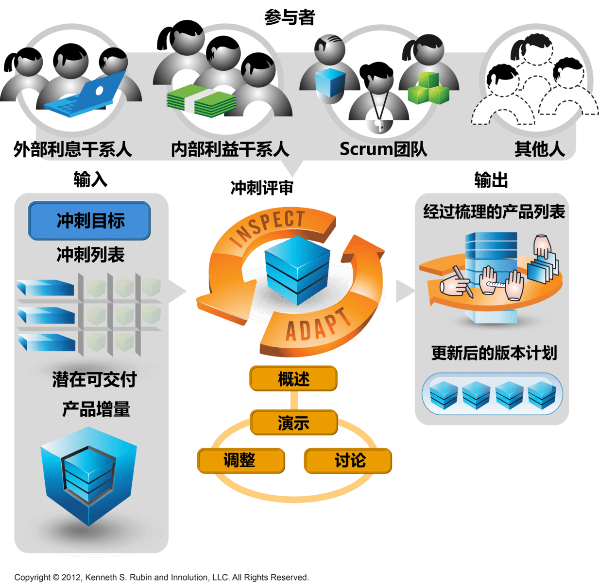

#### 准备工作

- 确定邀请谁参加
- 安排活动日程
- 确定冲刺工作已经完成：满足认同的完成的定义
- 为演示做准备
- 确定谁做什么

#### 活动

- 总结：概述在冲刺中实际产生的产品增量，这些信息以总结或概述的方式说明当前冲刺的成果，与冲刺目标进行对比。如果结果与目标不符，Scrum团队要给出解释。评审的目的是描述完成的目标，然后利用这些信息确定最佳前进路线。
- 演示：冲刺评审只允许演示已完成的内容，所以必须在冲刺评审之前执行**接收测试[^AT]**，让团队知道哪些特性满足“**完成的定义**”
- 讨论
- 调整

### 冲刺回顾（Sprint Retrospective）

**冲刺回顾**考查的是**团队的产品构建过程**。冲刺回顾使整个Scrum团队有机会停下急促的步伐，思考片刻。在回顾期间内，团队可以无拘无束地检查发生的事情，分析自己的工作方式，找出改进方法，制定改进计划。任何影响团队产品构建方式的事情都可以仔细检查、讨论，包括过程、实践、沟通、环境、工件、工具等。

冲刺回顾可以很简单，它是用来反思流程的，集体可以头脑风暴来提出了解，比如讨论以下问题：
1.  这个冲刺哪些地方做得好，需要继续发扬？
2.  这个冲刺哪些地方做得不好，今后要避免？
3.  我们要开始做什么或改进什么？

根据这些讨论，团队成员定制出一些可实施的改进措施，然后用改进后的过程开始下一个冲刺。

**冲刺回顾时参与者还要花一些时间复查上次回顾之后改进措施的落实情况**。

在回顾时得**讨论积累的技术债**，**确定的改进行动**，把每个行动所对应的任务填入冲刺列表，为了确保落实改进行动，不要把二者分开，一定要整合。

> 收敛一下雄心壮志，脚踏实地进行小步改进，不能野心勃勃


#### 准备工作

- 定义回顾重点：在回顾开始之前，确定重点并进行交流
- 选择练习活动
- 收集客观数据
- 安排回顾日程

#### 活动

- 营造氛围：让人们在表达意见时必须要有安全感
- 建立共同背景
- 事件时间线
- 得出见解：使用见解卡片，选择见解，确定改进措施
- 确定采取行动
- 贯彻执行

#### 冲刺回顾的十宗罪

冲刺回顾可能存在的问题：

- 不做回顾或参加的人很少
- 不着边际、空洞无物
- 对重大问题视而不见
- 引导者无能
- 郁闷
- 指责游戏
- 代替特定的过程改进
- 野心勃勃
- 没有贯彻执行

### 估算与冲刺速率

在规划和管理产品开发过程中，我们可能需要确定这些问题：“将要完成多少个特性？”、“什么时候做完？”、“需要花多少钱？”。为了回答这些问题，我们需要**估算**产品的**工作量大小**并测量出**工作速率**。

一个冲刺中其所有PBI[^PBI]**单个估值**相加即为该**版本的近似大小**。在一个冲刺内所有已完成PBI [^PBI]的大小之和即为该冲刺的**团队速率**。有了**大小估值**和**速率**，就可以用**大小除以速率**的方式，推导出**持续期**。

#### 估算

##### 估算的时机和单位

为了做好计划，大多数组织会在三个不同的细节层面做估算：

- **组合列表**：使用粗略、相对的估算，比如使用**T恤衫尺寸**
- **产品列表**：使用**故事点**或者**理想天数**，需要注意的是理想天不能直接对应自然天，因为可能存在一些需要磨合或者其它的情况
- **冲刺列表**：其实就是估算冲刺时的任务大小，一般可以使用**工时**

常见单位：

- **故事点**
- **理想天**：需要注意的是理想天不能直接对应自然天

##### PBI估算的原则

- 团队估算：大家一起估算
- 估算不是承诺
- 要准确，而不是精确：错误的、过于精确的估算纯属浪费
- 使用相对值，而不是绝对值：人们更擅长相对大小的估算

##### 规划扑克

对PBI[^PBI]大小进行评估时可以使用规划扑克，**规划扑克**是按大小排列PBI[^PBI]的一种技术，它基于**共识**来估算工作量。每个人根据自己的评估之后亮牌，如果不一致则进行讨论，他的价值在于讨论和分享各自的理解，激发团队个人对PBI[^PBI]细节的思考。

规划扑克基本概念：

- 基于共识
- 专家意见
- 激烈的讨论
- 相对大小
- 准确的分组或装箱
- 利用估算历史的优势

为了进行规划扑克活动，团队必须决定用什么数字范围或者序列来给估算进行赋值。因为目标是准确但不过分精确，所以我们并不倾向于使用所有的数字。相反，我们倾向于使用这样一组数值范围：在这个范围内的小的一端有更多数字，而在这个范围内的大的一端则有较少数字，它们之间的间隔更大。

在规划扑克中，我们不用平均数，也不使用数值范围（牌）之外的数字。目标不是为了妥协，而是让开发团队从团队的角度对故事的整体大小（工作量）达成共识。

下面是一个规划扑克，扑克牌的例子：


<center><font size="2">该图来自：《Scrum精髓：敏捷转型指南》</font></center>

#### 冲刺速率

**速率**是**每个冲刺完成的工作量**。速率是在冲刺结束时**由已完成的所有PBI[^PBI]大小之和来衡量**的。一个PBI要么已完成，要么未完成，产品负责人从未完成的条目中得不到任何价值，所以速率并不包含未完成的PBI的大小。

> - 对于冲刺速率，更有意义的是**速率范围**，即最高速与最低速
> - 每个冲刺的速率**尽量维持在相同水平**，可使项目规划活动可量化地进行

速率**衡量的是产出（交付的大小）**，而不是成果（交付的价值）。使用速率有**两个重要的目的**：

1. **版本大小**除以团队的**平均速率**就可以算出**需要多少个冲刺才能完成这个版本**
2. 速率可以用来帮助**确定团队在下一个冲刺中能完成多少工作量**

为便于做计划，速率用**范围**来表示往往最有用，例如：”这个团队通常每个冲刺能完成25到30个点。“，**使用范围值可以使我们准确但同时又不至于过分精确**。

对于有**历史速率数据**的团队，可以直接用来预测未来的速率。

而没有历史速率数据的，**预测团队速率**的一种常用方法是，让团队执行**冲刺计划（冲刺规划）**，确定团队能在一个单独的冲刺中完成承诺交付的PBI。如果承诺靠谱，我们就可以简单地把承诺完成的各个PBI估算结果的大小累加在一起，用它来作为团队的**预测速率**。

因为我们**真正需要的是速率范围**，所以可以让团队为**两个冲刺**做计划，然后把其中一个预估的速率数作为较大值，而另一个作为较小值（两个预估值很可能不一样）。或者我们可以凭直觉根据其他团队的历史数据来调整预估速率，然后把一个预估值转换成有两个预估值的范围。

在未知的情况下，先预测速率，一旦团队做过一个冲刺，我们就可以得到一个**实际的速率**了，此时应该**丢弃预测速率**而**使用实际速率**。而且，随着团队不断地冲刺，逐步建立实际的速率历史，我们应该计算平均值或者使用其他的统计方法，得到一个**速率范围**。

> **冲刺速率不是一成不变的**，比如随着团队的优化，速率可能会得到提升。而通常加班带来的一般是短期收益，与长期稳定相比往往没有价值，加班过多容易带来不好的影响。

### Scrum冲刺的基本特征

#### 时长限定

冲刺以时间盒概念为基础，用它来帮助**安排工作执行情况**和**管理工作范围**。每个冲刺都发生在一定的时间期限之内，**有明确的开始日期和结束日期**，称为一个**时间盒**。在这个时间盒之内，团队需要以稳定的步调完成一组与冲刺目标一致的工作。

> 不允许由于工作未完成而延长冲刺时间，这是不能正常工作或者存在改进机会的征兆。

使用时间盒的好处如下：

- 设定WIP[^WIP]数量限制
- 强制排列优先顺序
- 展示进度
- 避免不必要的完美主义
- 促进结束
- 增强可预测性

#### 持续期短

Scrum团队通常以**两周到一个月**左右的时间作为一次冲刺的周期，持续期算是比较短的了，这带来的好处是：

- 容易规划
- 反馈快
- 投入产出比高
- 错误有限
- 有助于“满血复活”
- 检查点多

#### 一致的持续期

通常，对于给定的开发工作，团队应该为冲刺选择**一致的冲刺持续期**，如果没有特殊理由，这个持续期应该保持不变。

使用相同的冲刺长度还可以利用**节奏感**带来的好处，**简化规划活动**。

#### 锁定冲刺目标

Scrum有一条重要的规则：**一旦制定冲刺目标，在冲刺执行开始后就不允许有任何变更对冲刺目标实际产生影响**。

##### 什么是冲刺目标？

每个冲刺都可以用通过冲刺目标来概括，冲刺目标描述当前冲刺的商业目的和价值。冲刺目标通常有清晰且单一的重点，不过有时冲刺目标可能是多方面的。

在冲刺计划过程中，开发团队应该帮助完善冲刺目标，就冲刺目标达成一致意见，并且用它来确定在冲刺结束前能够完成的PBI。

##### 共同承诺

冲刺目标是团队和产品负责人作出共同承诺的基础。团队承诺在当前冲刺结束之前完成目标，产品负责人承诺在冲刺执行过程中不变更目标。

##### 是变更，还是澄清

虽然冲刺目标不应该有实质上的变更，但是允许澄清这个目标。

- **变更**：变更是**工作或资源的变动**，在一个冲刺中加入或移除PBI或者大量更改冲刺中已有的PBI的范围，一般都可以看作是变更。有时对于在冲刺过程中要加入新特性，可以考虑为他创建新的PBI来记录，并将它**添加到团队下一个冲刺**要完成的列表中
- **澄清**：澄清是在冲刺执行期间**提供更多的细节**来帮助团队实现冲刺目标。在冲刺开始的时候，与PBI相关的所有细节不一定完全已知或明确说明。因此，团队在冲刺执行中提出要求澄清的问题，产品负责人回答这些问题，这是完全合理的

“锁定目标”这个规则似乎有悖于Scrum核心原则所说的“**应当乐于接受变化**”，我们确实要乐于接受变化，但要用一种**平衡的**、**经济合理的**方法。

##### 注重实效

“锁定目标”只是一个规则，并不是铁律，迫不得已时不需要盲目遵守锁定目标的规则，要更注重实效。

##### 异常终止

在有些情况可能需要提前终止冲刺，除了对士气有负面影响外，还会使快速、灵活的特性流混乱，使前面提到的持续期一致的冲刺毫无益处。终止冲刺应该是不得已而为之的最后手段。

#### 完成的定义[^DoD]

**每个冲刺的结果**是一个**潜在可发布产品增量**，其中“**潜在可发布**”并不意味着构建的增量真的交付给用户。交付是一个业务决策，通常和软件开发不在同一个节奏，在某些组织中，每个冲刺结束时都进行交付确实没有什么意义。

为了确定开发出的东西是潜在可发布的，Scrum团队必须有一个明确定义的，大家一致同一的“**完成的定义（Definition of Done，DoD）[^DoD]**”。从概念上看，完成的定义是，在宣布工作潜在可发布之前，要求团队**成功完成**的**各项工作检查**，如下图的样例：


<center><font size="2">该图来自：《Scrum精髓：敏捷转型指南》</font></center>

##### 什么是完成的定义？

在大多数情况下，**完成的定义**至少要产生一个产品功能的完整切片，即经过设计、构建、集成、测试并编写了文档，能够交付已验证的客户价值。但是，为了得到一个有用的**检查列表**，这些大级别的工作项需要进一步细化。完成的定义可以随时间进行演变。

> Notes：完成的定义有时被用来描述应用于所有PBI的接收标准

Scrum团队需要有一个健全的完成的定义，自信构建的产品增量质量高、可交付。**任何妥协**都会剥夺组织根据自身情况交付商业价值的机会并**欠下技术债**。

> 例如：假如到冲刺的最后一天还有一个严重的缺陷，这算不算完成？这不算完成，而且，我们一般不会把冲刺延长到计划的时间盒之外，也不会把这个冲刺延长一两天并在当前冲刺修复这个缺陷。取而代之的是，在冲刺计划结束的当前，把没有完成的PBI从当前冲刺移走，根据产品列表中现有其他条目的情况，以合适的顺序将它重新插入产品列表。这样一来，没有完成的条目就可能在未来的某个冲刺完成。

##### 完成的定义还是接收标准？

完成的定义[^DoD]适用于冲刺期间正在开发的产品增量。产品增量由一组PBI组成，所以**每个PBI必须与完成定义中的工作保持一致**。

引入冲刺的**每个PBI**都应该有一组由产品负责人指定的**满足条件（这个条目特定的接收标准）**。这些接收标准最终在接收测试中进行验证，产品负责人会确认并确定PBI的功能是否满足需要。

> 例如：如果PBI是“允许客户使用信用卡购买”满足条件就可能是“运通卡、Visa卡和万事达卡都可以用”，所以每个PBI都有自己特定的接收标准集。

这些特定标准是适用于完成定义检查列表中**完成标准的补充而不是取代**，检查列表适用于所有PBI。只有**同时满足**特定的条目**接收标准**和**冲刺级别的完成的定义[^DoD]**，**才能认为一个PBI已经完成**。

如果将通过接收标准的PBI称为完工（Done）容易造成混淆，就把它们称作已完成的（Completed）或者可以接受的（Accepted）。

> 要**在冲刺过程中验证接收标准**，而不是等冲刺评审时再验证。产品负责人需要在特性完成后做一些测试，发现错误和误解并让团队成员在冲刺评审之前修复。

##### 强完成的定义

有些团队采用“完成”和“完成-完成”的概念，在这里，“完成”指的是在完成的那个时间点“做了他们准备做的那部分工作”， 而“**完成-完成**”指的是“**做了客户认为完成的必须工作**”，这是两种不同的状态。

但对于团队来说，不需要两种状态，有些团队内化了这个思想：“**如果没有做完所有满足客户需要的工作就不能叫完成**”，对于他们来说**“完成”就意味着“完成-完成“**。

可以把“完成-完成”定义为“**强完成定义**”，当然我们通常说”完成“的时候，应该要明白，我们指的就是”强完成“。

## 敏捷相关核心工件

- User Story：用户故事
- PBI[^PBI]：产品待办列表条目
- Product Backlog：产品级待办列表，即产品列表
- Sprint Todo（Sprint Backlog）：冲刺级待办列表（在Scrum中称为Sprint Backlog，在Kanban中称为Todo，我们综合一下，称为Sprint Todo），即冲刺列表
- Sprint Task：任务级列表
- 就绪的定义[^DoR]
- 完成的定义[^DoD]
- 潜在可交付产品增量[^PSI]
- 冲刺燃尽图（Sprint Burndown Chart）
- 产品/发布燃尽图（Product/Release Burndown Chart）
- 持续可测量的数据统计，比如冲刺速率等

## DevOps

DevOps（Development和Operations的组合词），即**开发与运维一体化**，它跟敏捷过程同样都是一种**软件开发实践的方法论**，并且**DevOps通常是结合敏捷一起使用的**。DevOps由一套**文化理念**、**实践方法**和**工具链**支撑起来，用于促进开发（应用程序/软件工程）、技术运营和质量保障（QA）部门之间的**沟通**、协作与**整合**。DevOps非常注重**自动化**，通过自动化流程（“软件交付”和“架构变更”等多方面），来使构建、测试、发布软件能够更加地快捷、频繁和可靠。

> Notes：DevOps现在几乎已经成为了软件工程的代名词。

DevOps也可以看作**是敏捷开发的一种演化**，**弥补敏捷过程在部署方面的不足**，尽管开发人员使用敏捷降低了风险并提高了效率，但**部署仍停留在线性瀑布式结构**上。

相对以前传统开发模型和敏捷开发，把开发、IT 运营、质量工程和安全这些角色孤立起来。为了应对这种开发与部署之间的脱节，需要同时做到“**敏捷开发**”和“**敏捷部署**”，DevOps把“开发人员（Dev）”、“运维人员（Ops）”结合起来，重视他们之间的协调和合作，同时将人员、流程和方法连接在一起提供持续价值，从而更快、更可靠地交付软件。

为了让“开发人员”与“运维人员”更好的结合，通常需要组建**跨职能团队**，团队采用拥有**T型技能**的人员，他们既要懂开发，也要懂运维。

运维人员会在项目开发期间就介入到开发过程中，了解开发人员使用的系统架构和技术路线，从而制定适当的运维方案。而开发人员也会在运维的初期参与到系统部署中，并提供系统部署的优化建议。

在一些 DevOps 模式下，**质保和安全团队**也会与开发和运营团队更紧密地结合在一起，贯穿应用程序的整个生命周期。当安全是所有 DevOps 团队成员的工作重心时，被称为“**DevSecOps**”。

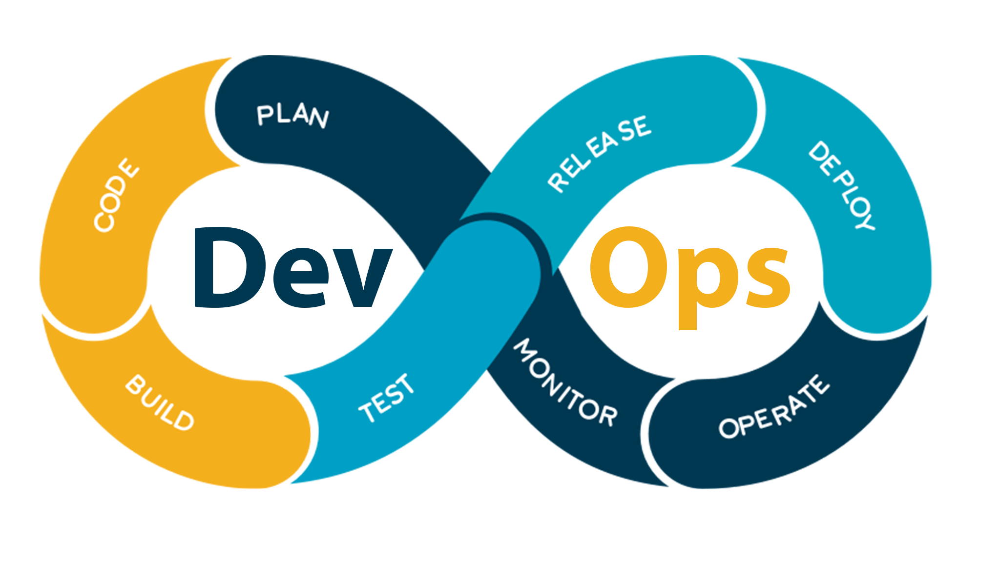

### DevOps提出的初衷

软件开发过程可采用大量手动操作，但这会导致大量代码错误。**开发团队和运营团队可能常常信息不同步**，而这可能会拖慢软件交付速度，辜负企业利益干系人的期望，这也是**传统瀑布模型和敏捷模型的短板**。

> 尽管敏捷过程一致在促进开发上的敏捷，相对传统瀑布模型降低了风险并提高了效率，但是在**部署、运维上仍然存在脱节**，多数团队在**部署、运维仍然停留在线性瀑布式结构上**，甚至采用落后的手动部署、手动测试，这会导致实际的**交付速度减慢**并且**产品潜在的缺陷也会暴露的越晚**。简单说，敏捷过程实现了“敏捷开发”但并未实现“敏捷部署”，而为了使软件开发的各方面都拥抱敏捷带来的好处，Patrick Debois提出了DevOps的概念，使开发与运维结合，同时实现“**敏捷开发**”与“**敏捷部署**”。

DevOps将开发和运营连接起来可增强可视性、使需求更为准确、改善沟通并加快发布。DevOps对于软件开发、部署和维护所涉的全部任务中都可提高效率。

### DevOps的优势

采用 DevOps 的文化、做法和工具的团队将获得高绩效，可以用更快的速度构建更好的产品以获得更高的客户满意度：

- 高速运转的速度
- 快速交付，发布更迅速，频率更高
- 保持系统稳定性和可靠性
- 缩短平均恢复时间
- 减少浪费
- 增强合作
- 安全性

### DevOps与敏捷如何彼此相关？

尽管 DevOps 和敏捷都是软件开发实践，但两者的侧重略有不同。DevOps 是注重为参与软件开发、部署和维护的所有利益干系人创造高效率的一种文化。而敏捷是一个精益生产过程，可帮助提供软件开发生产框架。敏捷通常特定于开发团队，而 DevOps 涵盖了所有参与软件生产和维护的利益干系人。**DevOps 和敏捷可结合使用以创建高效的软件开发环境**。

### 各部门之间的联系

DevOps可划分三类部门：

- 开发部门（Development）
- 运维部门（IT Operations）
- 质量保障部门（Quality Assurance）


### 生命周期


<center><font size="2"><a href="https://azure.microsoft.com/zh-cn/resources/cloud-computing-dictionary/what-is-devops/">该图来自：《什么是 DevOps？》 by Microsoft Azure</a></font></center>

#### 规划（Plan）

DevOps团队构思、定义和描述他们即将构建的应用程序和系统的特性和功能。团队在低粒度和高粒度级别上跟踪从单个产品任务到跨多个产品组合的任务进展。

DevOps 团队以敏捷和直观地方式进行规划的一些方法包括：

- 创建积压工作 (Backlog)
- 跟踪 bug
- 使用 scrum 管理敏捷软件开发
- 使用看板
- 使用仪表板直观呈现进度

#### 开发（Develop）

开发阶段包括开发软件代码的各个方面。 在此阶段，DevOps 团队执行以下任务：

- 选择开发环境
- 编写、测试、查看和集成代码
- 将代码构建到项目中以部署到各种环境中
- 使用版本控制工具（通常 为 Git）协作处理代码并并行工作

DevOps 团队寻求在不牺牲质量、稳定性和生产效率的情况下快速创新。为此，他们使用：

- 高效的工具
- 自动化单调和手动步骤
- 通过自动化测试和持续集成以小增量迭代

#### 交付（Deliver）

交付是一致可靠地将应用程序部署到生产环境的过程，理想情况下，通过持续交付（CD）完成，交付还包括部署和配置交付环境的基础基础结构。

#### 运维（Operate）

运营阶段包括维护、监视和对生产环境中的应用程序进行故障排除。在采用 DevOps 做法时，团队致力于确保系统的可靠性、高可用性，并在加强安全性和治理的同时实现零停机的目标。DevOps 团队希望在问题影响客户体验之前发现问题，并在问题发生时迅速解决问题。保持这种警惕性需要丰富的遥测、可操作的警报以及全面了解程序和基础系统。

#### 瀑布模型、敏捷模型和DevOps的生命周期对比

对比前面所说的瀑布式开发和敏捷开发，我们可以明显看出，DevOps贯穿了软件全生命周期，而不仅限于开发阶段，如下图对比所示：


### CAMS价值体系

- 文化（Culture）
- 自动化（Automation）
- 测量（Measurement）：指的是测量问题、事务的能力
- 分享（Sharing）：分享想法和问题是合作的核心

### DevOps基本原则之：The Three Ways（三大方法）

- 流动原则（Principles of Flow）：加快技术价值流的流速，实现开发到运维的快速流动，缩短交付周期
- 加大反馈循环（Principles of Feedback）：在工作流中运用持续快速的反馈机制，扩大反馈回路，防止问题复发，缩短问题检测周、实现快速修复，从源头上控制质量
- 持续学习与改进的原则（Principles of Continual Learning）：搭建企业组织文化，从而支持动态的、严格的、科学的改进

> Refs：
>
> -  [《The Three Ways of DevOps》](https://blog.indrek.io/articles/3-ways-of-devops/#:~:text=The%20Three%20Ways%20of%20DevOps%201%20Principles%20of,safer%20systems.%20...%203%20Principles%20of%20Continual%20Learning)
> -  《凤凰项目：一个IT运维的传奇故事》

### DevOps三大支柱

DevOps的三大支柱是**文化**、**最佳实践**以及相关**工具**

#### 文化

DevOps文化即**自动化**、**沟通**、**责任**、**责任分担**以及**增强协作**。 开发、IT 运维人员要作为一个团队开展协作。 这种文化应**营造**一种强调**尽早反馈**和**持续学习**且**允许试错**的**安全环境**。

DevOps团队通过短周期发布软件保持敏捷。因为进度是渐进式的，缩短发布周期可以让计划和风险管理更容易，同时也减少了对系统稳定性的影响。缩短发布周期还可以让组织适应和应对不断变化的客户需求和竞争压力。

此外，这种文化应赋予每个团队**全面的责任制**，同时提供完善的方法。

可总结为：

- 协作、可见性和一致性
- 范围和责任的转变
- 缩短发布周期
- 持续学习

#### 最佳实践

各个公司的 DevOps 标准和最佳实践各有不同。 即便是同一公司的不同团队采用的实践方式也不尽相同。 只要所采用的实践方式能够帮助公司更快地交付优质软件，那么 DevOps 的目标就实现了。 以下是转向 DevOps 时可采用的一些实践：

- 敏捷软件开发
- 精益项目管理（Lean）
- 版本控制（SCM | VCS | DVCS）
- 持续集成（Continuous Integration，CI）
- 持续部署（Continuous Deployment，CD）
- 持续交付（Continuous Delivery）:在持续部署的基础之上，将产品交付到线上环境
- **基础设施即代码（Infrastructure as Code，IaC）**：基础设施即代码是一种实践经验，无论是在本地还是在云中的基础设施，通过代码和软件部署技术（例如版本控制和持续集成）来预置和管理。简单的理解就是**使用代码来定义和管理基础设施，而不是使用手动流程**
- 监控和日志记录
- 沟通与合作
- 全面自动化
- 统一工具和平台
- 验证性学习

#### 工具


<center><font size="2"><a href="https://www.shalb.com/blog/what-is-devops-and-where-is-it-applied/">该图来自：《What is DevOps and where is it applied?》</a></font></center>


<center><font size="2"><a href="https://hoangdinhquang.me/a-note-on-devops-terminology/">该图来自：《A note on DevOps terminologies》</a></font></center>

### DevOps的的知识体系图

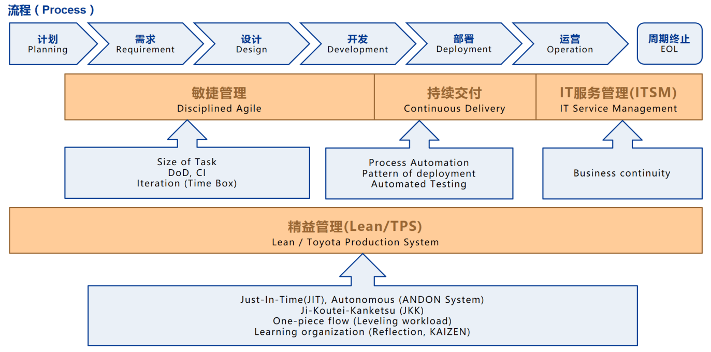

<center><font size="2"><a href="https://www.cnblogs.com/yinzhengjie2020/p/12437420.html">该图来自：《DevOps 简介》 by 尹正杰</a></font></center>

### 延伸阅读推荐

> - 《凤凰项目：一个IT运维的传奇故事》
>- [《Azure - DevOps教程 - 简介》](https://azure.microsoft.com/zh-cn/solutions/devops/tutorial/)
> - [《Amazon - What is DevOps》](https://aws.amazon.com/cn/devops/what-is-devops/)
> - [《JFrog - What is DevOps》](http://www.jfrogchina.com/devops-tools/what-is-devops/)

## Link-Cooperation项目敏捷流程

首先Link-Cooperation项目处于Cynefin框架的**复杂域（Complex）**中，Scrum框架适合于这复杂域，我们将以Scrum框架为基础，参考传统开发/测试模型、Kanban敏捷、极限编程、OKR目标管理法以及DevOps等方面，来**制定适合Link-Cooperation项目的开发与运维流程**，实现“**敏捷开发**”和“**敏捷部署**”。

我们**不需要“声称”或“强调”自己是敏捷**的，并且也会尽量**避免使用敏捷相关的术语**，这是因为我认为如果滥用敏捷的术语或者教条化的过分强调敏捷，最终会导致团队所谓的敏捷过程会变成**形式化**的**伪敏捷**。同时这也是为了让团队可以**跳出所谓敏捷的范畴**，使团队能从其它方法中吸取更多的实践经验。

> 另外这里不讨论有关软件安全、性能等方面的问题

### 价值观

- 团队成员之间互相**尊重**、**坦诚**、**信任**地**合作**
- 团队每人有承担责任的**勇气**
- 在适当的时机懂得**放权（授权）**
- 对新知识、新信息、新观点要**开放**性接纳，不能盲目否定
- 对待工作保持**专注**
- 个体和交互**胜过**过程和工具
- 可以工作的软件**胜过**面面俱到的文档
- 响应变化**胜过**遵循计划

### 原则

- 尽早、频繁、持续地进行有价值的交付
- 专注于以价值为中心的交付
- 提倡可持续的开发速度
- 积极响应需求变化
- 最有效率的沟通方式是面对面交谈
- 采用简洁设计
- 能工作的软件是首要的进度度量标准
- 敏捷依赖拥有T型技能的自组织团队
- 定期反省并进行改进与调整
- 不到最后时刻，不轻易下决定
- 承认我们无法一开始就把事情做对
- 快速前进，但不匆忙
- 抛开不必要的、繁琐的所谓“仪式”
- 避免不必要的完美主义
- 迫不得已时不需要盲目遵守锁定目标的规则，要更注重实效
- 一个产品，一个产品列表
- 不允许由于工作未完成而延长冲刺时间，这是不能正常工作或者存在改进机会的征兆
- 任何估算要准确不需要精确，可以考虑使用范围区间来描述
- 关注边际效益[^MarginalBenefit]
- 对于微服务架构设计，无论最终使用什么架构，都最好做到：一次开发就可以在各种其他架构、环境使用，而不需要重新开发，也不需要修改技术选型

### 团队规模与角色定义

目前团队只有两人，这里分别称为John[^John]和Phan[^Phan]。

我们参考Scrum框架，分出以下三个角色：

- 产品负责人：产品领导力中心，决定要构建哪些特性并以何种顺序构建这些特性，对正在开发或维护的解决方案**全面负责**
- 项目流程监管（对应Scrum的ScrumMaster）：充当教练和领导角色，**负责监管和指导整个开发流程**，调教和优化开发流程，**协调产品负责人和开发人员**
- 开发团队（对应Scrum的开发团队）：包括设计、开发、部署、测试等多项工作。**自组织**并且**跨职能多样化**的综合性**T型技能**开发团队，能够同时应对开发、测试和运维等多方面的问题

与Scrum过程一样，产品负责人和项目流程监管不同时兼任，但是它们都可以兼任开发人员。在这个项目上，John担任产品负责人和开发人员，Phan担任项目流程监管和开发人员。

### 项目拆分（产品组合）

Link-Cooperation将拆分成四个子项目：

- Link-Cooperation Server：服务端
- Link-Cooperation Web Manager Server：Link-Cooperation服务器集群的管理界面，放在master上，用于管理服务（启动、停止、重启）、监控服务器的资源（CPU、内存、网络、磁盘空间）、管理集群、数据统计等
- 小程序端（主要用作移动端）
- 跨平台桌面端（Windows、MacOS、Linux【主要考虑Ubuntu、Kali、CentOS的X环境】）

> 其中Link-Cooperation Web Manager Server可以保留到后续的版本再提上来。

### 项目约束

比如时间周期、平台等地方需要制定约束，这个留到后续讨论得到

### 技术债

技术债可以说是无法避免的，但是对于一些低级的技术债，我们完全可以通过良好的设计方法、采用良好的实践方法来规避掉。而那些确实无法避免，可能也无法预测的技术债我们要做好心理准备，并且要合理的管理和偿还这些技术债。

对于偿还技术债，我们不可以去做一个所谓的专门的“技术债偿还冲刺”，而是在适当的时机，按照优先级合理的把部分技术债加入到本轮冲刺的冲刺列表中，来逐步偿还技术债，同时要避免债累债。

对于如何让技术债在本项目中可视化，以及是否需要一个专门的列表来管理，我们后续沟通商量一下。

### 轻文档

与传统开发方法一样，文档在敏捷过程中同样是重要的，文档存在的本质目的其实就是**用于沟通**（与用户沟通、开发团队内部沟通、与接口使用者沟通...）。只不过敏捷开发强调**轻量级**、并且**具有价值**的文档。

敏捷开发宣言告诉我们要**“重沟通，轻文档”**，千万不能误解，这个**轻**并不是指”轻视、不需要“的意思，而是**轻量级**的意思。

文档可用于沟通，让开发人员有迹可循。例如，对于某个SDK，如果没有一分尽可能详细文档来描述API，随着时间的推移，SDK维护者可能会遗忘了SDK的大量细节，而对于SDK的使用者，在使用的时候可能根本无从下手。

我们的文档不需要面面俱到，更不需要拘泥于一些可有可无的细节，只在“**必要的时候**”留下“**准确**”、“**精简**”和“**有价值**”的文档。

不过轻文档可能存在潜在的问题，如果把握不好这个“轻”，那么有可能在未来，在沟通时提出的某些观点、知识点有可能会被忘记，或者如果有新成员加入，没有足够的文档，适应起来可能会非常困难。

我认为，可以在采用轻文档的同时，在**代码风格**、**注释风格**、**提交日志**以及**测试驱动开发**上面入手。采用简洁清晰、可读性强的编码风格，在采用轻注释的同时尽量保留有用的注释，提交日志要保持简洁清晰。测试驱动开发中，留下的测试用例可作为接口文档的一部分。

> 对于内部使用的接口可以采用代码即文档，不需要额外编写文档，这是因为内部使用一般迭代的比较快，那文档也需要更新的更加频繁，可能会浪费很多时间。但是对于外部文档，一份详尽的文档是非常有必要的

### 代码注释

注释是对代码的解释和说明，本质目的是为了**增强代码的可读性和可解释性**。对于注释我们也采用与文档类似的方式对待，尽可能的采用轻量的注释，不在没必要的地方留下**无用的注释**，留下的注释也要描述足够的**精简、准确、清晰明了**。

对于**内部接口**，在大多数时候注释都可以足够的轻量，甚至文档注释都可以省略掉。但是对于像SDK API，这些的**外部公开接口**，就需要尽可能的保留有用的注释，并且接口的文档注释也得描述清楚，不然别人可能根本无法使用。

如何**区分是否有必要留下注释**，需要一定经验，有些看起来可有可无的注释，其实是非常有必要的。比如，有些注释是用来**给代码逻辑做层次切割**的，如果少了，那么在阅读的时候，因为缺少了结构分层，会加大阅读难度，下面这段代码是一个例子：

```c++
Window create_main_view()
{
    // 实例化main view
    Window main_view;
    main_view.set_title("main view");
    main_view.set_size(500, 500);
    
    // 配置main view菜单
    Menu menu;
    menu.add_action("退出", on_quit);
    menu.add_action("打开", on_open);
    main_view.set_menu(menu);
    
    //
    // 配置客户区空间
    //
    
    // 加入画布
    Canvas canvas;
    canvas.set_size(300, 300);
    canvas.set_background(Black);
    main_view.add_widget(canvas);
    
    // 加入操作面板
    Panel panel;
    panel.add_action("放大", on_zoom_in);
    panel.add_action("缩小", on_zoom_out);
    main_view.add_widget(panel);
    
    return main_view;
}
```

试试把上面代码中的注释去掉，对比会发现，由于注释的存在分割了代码的层次，可以一眼就看完这个函数到底做了啥，而去掉注释后还得花更多的时间。

需要补充的一点是，对于代码的某些地方，比如一个函数，未实现但需要留下一个存根（桩），又或者在未来需要加入某些改动，最好补充一个todo注释。下面是一个例子：

```c++
/**
 * @fn shutdown
 *
 * @todo 加入关闭系统实现（包括Windows、Linux、OSX）
 */
void shutdown()
{
    throw Stub("shutdown function's stub");
}
```

### 需求与产品列表

我们的需求以轻量级**用户故事**的形式来记录，不需要在事前拟定“详尽完整”的需求文档，而是为其创建“**占位符**”，采取**逐步细化**的策略，随着项目的推移不断地**分解**放入不同的列表中，不管它放入哪一个列表中，我们都可以**用Item（条目）来称呼它**（不过要是在明确是哪一个列表的条目时，需要用其特定的**条目名称**来称呼）。

#### 条目基本类型

| 条目类型 | 例子                                                         |
| -------- | ------------------------------------------------------------ |
| 特性     | 作为客户服务代表，我希望为客户支持问题创建一个记录卡，这样可以记录和管理客户的支持请求 |
| 变更     | 作为客户服务代表，我希望搜索结果在默认情况下按照姓氏排序，不要按记录卡号排序，这样可以更容易查找支持记录卡 |
| 缺陷     | 修复缺陷跟踪系统中的缺陷#256，这样可以使客户在搜索项中输入特殊字符时不会出现异常 |
| 技术改进 | 迁移到最新版Oracle数据库管理系统                             |
| 获取知识 | 为两种架构同时创建原型或概念验证，执行三次测试，这样可以确定哪种方法更合适产品 |

#### 不同层级的条目列表

我们采用不同抽象层级的条目以及条目列表，它们的名称、使用的范围、粒度都不相同，但都是逐层往下不断细化和分解的。

| 条目层级        | 说明                                                   | 粒度大小与周期 |
| --------------- | ------------------------------------------------------ | -------------- |
| 史诗级（Epic）  | 可跨越一整个或多个版本，**史诗级的故事**               | 以月为单位     |
| 特性（Feature） | 对于单个冲刺而言还是太大了                             | 以周为单位     |
| 故事（Story）   | 也叫**冲刺故事**或**可实现故事**，可放入一次冲刺中做完 | 以天为单位     |
| 任务（Task）    | 具体到个人独立完成的工作                               | 以时为单位     |

| 条目列表             | 含义           | 说明                                                         |
| -------------------- | -------------- | ------------------------------------------------------------ |
| Product Backlog      | 产品待办列表   | 一个产品、一个产品列表                                       |
| Version Backlog      | 版本级待办列表 | 通过版本线划分Product Backlog                                |
| Sprint Todo          | 冲刺待办列表   | 可放入一个冲刺中完成的条目                                   |
| Sprint Task          | 冲刺任务       | 冲刺中可以时为单位的具体任务                                 |
| Doing（Do it Today） | 正在执行的任务 | 具体到团队个人的Todo列表中，**由成员从Sprint Task中自主挑选** |

> 除了Doing（Do it Today）之外的条目列表，我们可以考虑使用类似Tapd这样的支持Kanban的管理平台来维护。

#### 条目基本规则

任何**条目**都需要满足以下要求：

- 必须**简洁明了**、**突出重点**
- **满足**用户故事、目标制定的一些**关键性原则**
- 需要包含**确定信息**，以此为**接收标准**，这一般由产品负责人用来检查是否通过**接收测试**
- 需要制定**就绪的定义[^DoR]检查列表**，只有满足就绪的定义，才可放入一次冲刺中
- 需要**制定强完成的定义[^DoD]**，这与条目的**确定信息即接收标准**共同检查，条目是否达到完成状态
- 每个条目需要指明其**优先级**
- 不同层级上的条目，其**粒度大小不同**
- 条目都是**经过估算**的
- 对于所有的条目，一般都需要进行**编号**，如：Bug #256
- 条目是**涌现**的，只要产品不停止，条目列表永远不会被冻结，它可以根据不断涌入的、具有价值的信息**持续更新**
- 如果在一次冲刺中**涌现出新的任务**，如果体量较小，可以在本轮冲刺中完成的话，那么可以加入Sprint Todo中，否则应该加入Product Backlog或者Version Backlog
- 条目列表需要**持续不断地梳理**
- 在冲刺中，针对Sprint Todo、Sprint Task以及Doing，我们需要限定WIP[^WIP]的数目

#### 与OKR的映射

我们将敏捷与OKR目标管理法结合起来，建立了大小迭代模型，即OKR建立以季度为单位的大迭代，敏捷建立以冲刺为单位的小迭代。我们可以将上面制定的敏捷条目列表，与OKR中的KR、Todo进行映射。

我们可以考虑将**Product Backlog**或者**Version Backlog**与OKR中的**KR**建立映射，将**Sprint Todo**与OKR中的**Todo**建立映射。

> Worktile平台支持OKR管理

#### 条目管理方法

对于个人挑选的任务，即个人的**Doing列表**，我们使用**微软的Todo**来管理。

而对于Product Backlog、Sprint Todo以及Sprint Task我们后续再讨论具体怎么管理。

### 开发与运维活动

我们会把**开发、测试以及运维融合起来**，结合**OKR**、**敏捷**以及**DevOps**的**方法**、**原则**和**价值观**。

我们在规划上采用**多层级规划方法**，在开发上采用**蜂拥式（all-at-once，Swarming）**的运作方式。

#### 产品战略规划

这主要发生在产品的前期，团队以战略视角根据市场、业务等因素，来分析产品的可行性、目标用户、目标平台、前进方向等方面，我们主要以团队个人在白板上进行头脑风暴的方式进行描绘和记录。

> 具体执行方法，我们后续讨论过之后再进行补充。

#### 产品组合规划

一个产品可能会分割多个产品，它们组合在一起成为一个完整的产品组合，我们可以在这一步对产品进行拆分，划分出多个产品，给它们划分优先等级，估算需要持续的时间，并**为每个产品产生一个初始的产品列表（Product Backlog）**。

> 具体执行方法，我们后续讨论过之后再进行补充。

#### 产品头脑风暴

我们可以在特定时期进行头脑风暴，整理团队个人的一些想法，并以规划扑克的方式进行裁决。

> 具体执行方法，我们后续讨论过之后再进行补充。

#### 季度规划

我们要将**敏捷与OKR结合**，这其实建立了一个**大小迭代模型**，即**OKR**是一般以一个季度为周期的**大迭代**，敏捷使用的**冲刺**是一般以周为单位的**小迭代**。

我们在**每个季度**需要进行**季度规划**，对各个产品的**Product Backlog**或**Version Backlog**进行梳理，并**挑选出一系列条目**，作为**本季度的KR**。即将**Product Backlog**或**Version Backlog**将与OKR中的**KR（Key Results）**建立映射。

而OKR的Todo，我们可能会在每次冲刺时再不断细化，更新Todo。即**Sprint Todo**将与OKR中的**Todo**建立映射。

我们后续可以考虑下给我们自己的OKR加入奖励机制，作为对团队个人的激励。

> - 具体执行方法，我们后续讨论过之后再进行补充
> - 考虑是否需要再加一个新的工件：**季度安排列表（Key Results Backlog）**

#### 产品规划

我们无法**事先无法（或尝试）了解产品的所有细节**，所以**不会花过多的时间和精力做细致的产品规划**，而是**快速前进，越过猜想阶段，尽早进入快速反馈阶段**。**因为越早开始构建有形的产品，就能越早验证我们的理解和假设**。

产品规划是一项**持续性的活动**，通过产品规划，我们可以得到一个**概要产品列表**，里面的条目一般都是**粗略**、**初始史诗级**的。

> - 我们可以在这个前期执行一次**知识获取冲刺**，以获得必要的知识
> - 在提出项目之后，最好尽快进入，准备并开始阶段，不然对项目的热情可能很快被消耗没了

> 具体执行方法，我们后续讨论过之后再进行补充。

#### 版本规划

在**产品规划**上可以得到**产品的愿景（即包含哪些特性）**，而**版本规划**的目的是**确定达成产品目标需要采取哪些具体的步骤**并且针对**增量交付**取得范围、日期和估算之间的**平衡**。

我们在版本规划时，**需要梳理以及细化Product Backlog**，然后我们可以使用**版本线**，对**Product Backlog**进行划分，**划分出当前版本要做的条目**，然后整理得到**Version Backlog**，即**版本计划**，但是**版本计划是可变**的，在每次**冲刺检查、冲刺规划**时都可以对版本计划进行调整。

**每一个版本周期都是由多个冲刺合并而成的**，我们可以把每个版本定为一个**里程碑**。

我们也需要给版本制定**约束条件**，我们通常可以用**固定时间**进行约束，版本完成特性的总大小不能够超出团队的负荷。

> 具体执行方法，我们后续讨论过之后再进行补充。

#### 冲刺（Sprint）

敏捷冲刺活动其实就是从PDCA循环衍生而来的，包括**P（计划对应冲刺规划）**、**D（执行对应冲刺执行）**、**C（检查对应冲刺检查）**、**A（改进行动对应冲刺回顾）**。

##### 冲刺持续时间

我们以**三到四周**的时间作为一次**冲刺的时间盒**，具体我们后续实际冲刺几次后再确定一个固定的**时间盒长度**，稳定之后，我们的每次冲刺需要保持**持续时间一致**。

##### 目标锁定

在进入冲刺后需要**锁定目标**，但迫不得已时不需要盲目遵守锁定目标的规则，得从实际出发，要更**注重实效**。

##### 冲刺中涌现的任务

在执行冲刺时，肯定会有**问题涌现**出来，并且肯定有问题是**需要澄清**的。如果该新涌现的任务，其**体量较小，可在本轮冲刺中完成**，那么可以考虑将它加入Sprint Todo、Sprint Task或Doing中（需要看实际的细化程度和依赖关系）。否则可以**考虑将其插入其上层的某个列表中**。

##### 完成的定义

每个任务需要满足**强完成的定义[^DoD]**和其**接收标准**，我们才可以认为该任务已经完成。

我们**不允许由于工作未完成而延长冲刺时间**，这是不能正常工作或者存在改进机会的征兆。

##### 冲刺规划

我们在冲刺规划中会确定**冲刺列表（Sprint Todo）**，其中的条目是从更上层的条目列表中，经过**分解后的一系列经过估算的任务**。冲刺列表中的条目应该足够小，最好每个都不会超过8小时的工作量，不过允许稍大一些。另外能够加入冲刺列表的条目，应该都是**就绪的**，**满足就绪的定义**[^DoR]。

我们要非常重视对**任务的澄清**，一个任务执行的改动可能会牵连多方面，如果澄清或者了解不全面，那么在开发时不仅可能会迷失方向，同时大大增加了引入缺陷的可能。

##### 每日规划与例会

每日的规划和例会，可以让我们对前一天的工作进行检视和调整，沟通互相之间存在的问题，并确定今天的任务。

另外在进入冲刺执行后，这时Task都是已经足够细化到能以工时为单位了，但是仍然可能有很多的细节，是在实际开发前发现不到的。

> 我们不需要每天都进行，需要根据实际情况进行调整。

> 具体执行方法，我们后续讨论过之后再进行补充。

##### 冲刺执行

我们需要确定团队应该**并行做多少个PBI[^PBI]**才能最大化冲刺结束时交付的价值。为了达到合理的平衡，团队需要**做适量的条目**，力求充分利用团队的**T型技能**和**可用生产力**，但又**不至于负担过重**。我们的目标是**减少完成单个条目的时间**，同时**最大化冲刺期间交付的总体价值**。

我们采用**蜂拥式（all-at-once，Swarming）**的开发方法。这指**有余力的团队成员聚在一起合力完成一个已经开始的条目之后再继续转做其他条目**。这有助于团队保持**对目标的专注**，而不是任务，这意味着能更快完成更多工作。

> 拥有**火枪手态度**和**T型技能的团队**会采用**蜂拥式**。另外不要误以为蜂拥式是一个保证团队成员都100%忙碌的策略。

> 我们需要重视持续性测试，在执行任务时根据**探索性测试思维**，尽可能的让测试更加的全面，避免留下隐患

**蜂拥式**在每个冲刺都执行所有的必要活动，创建可工作的产品增量（产品的一部分而不是全部），**每个冲刺完成一部分分析、设计、构建、集成和测试工作**。这样的好处是可以快速验证我们在开发产品特性时所作的假设。


另外我们**不能**把**瀑布式思维**应用于冲刺级别，这是一种为**危险的方式**，把冲刺执行当做一个**迷你瀑布项目**，如果使用这种方式，我们一开始就会同时做所有PBI，首先分析这次冲刺要做的所有条目，然后按顺序完成设计、编码和测试。这十分危险，到最后可能每个特性只完成了90%，而没有任何一个特性完成到100%。

> 在执行单个任务时也要尽量避免瀑布式的思维。

##### 冲刺检查

冲刺检查的**重点是产品本身**，我们在此**检视并调整工作成果**（潜在可发布产品增量[^PSI]），并且**只演示已经完成的内容**，所以**在执行冲刺检查前，必须执行接收测试[^AT]**。另外需要讨论**哪些任务完成了**、**哪些任务没有完成**、**产品当前的状态**、**调整产品未来方向**。

有需要的话，我们还可以执行一次**Code Review（代码审查）**。

> 具体执行方法，我们后续讨论过之后再进行补充。

##### 冲刺回顾

我们会在每次冲刺**最后回顾本轮冲刺团队的产品构建过程**，分析自己的工作方式，找出改进方法，制定改进计划。任何影响团队产品构建方式的事情都可以仔细检查、讨论，包括过程、实践、沟通、环境、工件、工具等。

我们也得**讨论积累的技术债**，确定改进行动，把每个行动所对应的任务填入冲刺列表，为了确保落实改进行动，不要把二者分开，一定要整合。

**冲刺回顾时参与者还要花一些时间复查上次回顾之后改进措施的落实情况**。

> 收敛一下雄心壮志，脚踏实地进行小步改进，不能野心勃勃

> 具体执行方法，我们后续讨论过之后再进行补充。

#### 季度回顾

每个季度结束即一个OKR大迭代结束，我们需要对执行的结果进行评级、回顾、调整、改进。

> 具体执行方法，我们后续讨论过之后再进行补充。

#### 运维

我们将开发与运维结合的方式，主要靠相关的实践、原则、价值观以及一套自动化的DevOps来驱动的，做到持续集成、持续测试、持续发布、持续监控、持续运维。

> 具体执行方法，我们后续讨论过之后再进行补充。

### 项目跟踪

#### 速率跟踪

我们需要跟踪并维护冲刺的历史速率，并以此来调整我们在每次冲刺规划时制定Sprint Todo列表的范围，使我们每次冲刺的速率能够保持稳定，并且可顺利按计划完成。

> 具体跟踪的方法我们后续讨论再制定

#### 进度跟踪

进度的跟踪我们使用燃起图[^BurnupChart]或者燃尽图[^BurndownChart]来可视化管理，具体可以落实到整个产品、每个版本和每次的冲刺。

> 具体跟踪的方法我们后续讨论再制定

#### 技术债跟踪

> 具体跟踪的方法我们后续讨论再制定

#### 缺陷跟踪

我们所有的缺陷都需要跟踪，每个缺陷都需要**独立编号**并且指定其**缺陷的严重等级、优先级**。

> 具体跟踪的方法我们后续讨论再制定

### 代码风格化

- 我们需要**保持代码风格一致**，可以使用clang-format或类似的工具，在提交时或者集成到IDE环境中，让其自动完成代码风格的格式化
- 推荐一个规则，**全部制表符使用空格代替，统一每个Tab使用四个空格**

### 关于抽象

我们在开发时**尽量考虑依赖于抽象而不是具体的细节**，这可以大大提高我们项目的可扩展性、可移植性和复用性。

以日志接口为例子：我们需要在项目中打日志，那么最好可以先抽象出一套日志接口而不是直接依赖于某个具体的日志库，我们自己抽象的日志接口是稳定的，我们在项目中使用时，完全不关心它是怎么实现的，而在日志接口的实现层，可以依赖于某个具体的日志库（或者我们自己实现一套）。这样做的好处是，当我们需要替换掉原先依赖的日志库时，不需要修改项目中原本打日志的调用方法，需要修改的地方只在该日志接口的实现层。

### 测试与质量保证

以质量为魂，我们不仅仅要交付具有价值的产品，同时要保证其质量。项目存在缺陷是不可避免的事情，关键在于我们能够**尽量减少低级错误、及时发现、管理并处理缺陷**。

我们需要制定一套规则用于保证在开发、测试以及运维各阶段对缺陷的控制，以下是一个基本的框架，后续需要我们讨论并在实践中对其进行完善。

1. 采用**精益的测试计划**，强调测试的速度以及适应性，侧重其计划的**不断调整**以及**适应需求的变化**
2. 使用**探索性测试思维**，在测试计划之外，根据自身思维活动以及对被测试对象的理解，边学习、边设计、边执行、边思考，**根据具体情况随时调整测试策略**
3. 在开发时**采用良好的开发习惯和实践**，避免引入低级的错误
4. 采用**测试驱动开发[^TDD]实践**，以测试用例驱动进行开发，从一开始就编写可独立测试的代码
5. 协作时，在独立的特性分支中，需要开发新特性前，需要检查该任务是否满足**就绪的定义[^DoR]**，并且在认为特性开发完成之后，需要检查是否满足**强完成的定义[^DoD]**
6. 基于上一条，独立特性分支在Pull-Request前，程序员应进行**自测**，并且需要通过**静态代码扫描（lint）**分，在早期避免把缺陷和安全隐患合并到上层分支中。并且所有Pull-Request请求合并的分支，都需要通过测试之后才允许合并
7. 定期且及时的组织进行**Code Review（代码审查、代码复查、代码走查或代码走读）**，集团队力量来减少引入不良的编码习惯、优化实现方式
8. 考虑**提测**的条件和时机
9. 配合**CI平台（持续集成）**编写测试脚本以及由测试驱动开发留下的测试用例，采取**高度自动化测试**
10. 同样通过**CI平台（持续集成）**实现**持续化测试**，**把测试与产品质量融合入产品生命周期的各个阶段**，以保证通过**CD平台（持续部署）**达成有价值的高质量软件的**持续交付**，**持续的反馈**可以**使缺陷及时地暴露出来**，力求达到**质量和效率的平衡**
11. 增加**产品走查（Product Work-Through）**环节，团队一起从头到尾把新功能看一遍，更直观、快速地发现问题
12. **质量左移（测试左移）**，测试在早期尽早介入
13. **质量右移（测试右移）**，在产品上线后，仍然需要**持续对线上进行监控和预警**
14. 在缺陷修复完成之后，积极进行**回归测试**
15. 引入**构建验证测试（BVT）**，配合自动化测试工具，在版本构建后，先执行BVT测试，它充当于一个**哨兵**，验证基本的功能，通过BVT之后，才运行进入**深度的集成测试**，这样可以减少不必要的时间浪费
16. 引入**冒烟测试**，如果是在构建阶段，它是等同于BVT的，但它可以应用于任何阶段，也同样是充当哨兵的作用，比如在完成某个特性后，为了对其进行验证，先进行冒烟测试，通过之后再进入后续的测试
17. 对于要在发布版本中希望引入某些待验证的新特性，可以采用**灰度发布**的形式进行**灰度测试**，这可以考虑是否可使用**A/B测试**
18. 接入**缺陷跟踪和管理平台工具**
19. **缺陷编号管理**，例如：Bug #256
20. 引入**缺陷上报**，比如说，采用C++开发的产品，可以搭配**CrashDumper**，在程序崩溃后把CoreDump以及相关的日志、CallStack等信息上报到跟踪管理系统
21. 不同类型的测试，部署于**不同的产品环境**中进行

### 协作以及版本控制相关的实践

#### 分支模型

我们多人协作参考Git Flow采用多分支模型，所有人切到各自的分支上进行开发。

#### 拉取与合并代码

要经过Pull-Request审核之后才允许合并到正式分支上，每个人在每天开始工作时需要合并最新的代码，采用rebase的方式，这是为了让提交日志更加简洁，需要注意的时，除了自己的分支外不允许对其它任何分支执行rebase，也不允许对已经合并到正式分支的提交执行rebase。

对于可合并的提交，在Pull-Request前请考虑合并。

> 每天开始工作时先执行：`git pull origin <dev> --rebase`

#### 提交规范

所有的提交尽量简洁准确，并且需要注明该提交的操作所属的Scope（范围）。

#### 延伸阅读

关于更多Git实践请参考我以下几篇文章：

- [Commit Message规范记录](/2020/07/17/Commit-Message%E8%A7%84%E8%8C%83%E8%AE%B0%E5%BD%95/)
- [Git Flow分支模型](/2020/07/17/Git-Flow%E5%88%86%E6%94%AF%E6%A8%A1%E5%9E%8B/)
- [Git部分实践记录](/2021/05/08/Git%E9%83%A8%E5%88%86%E5%AE%9E%E8%B7%B5%E8%AE%B0%E5%BD%95/)

### 实践

#### 自定开发实践

- 为了方便描述和记录一些**接口调用流程**，尽量为其留下一些**时序图（Sequence Diagram）**
- 无论选用何种技术框架开发业务逻辑，都应该做到：**一次开发**就能在各种容器、测试环境或云服务提供商平台中部署，而不需要重新开发，更不需要改变已经选用的技术选型
- 在容器中，如果希望提供完整的隔离性，可以在宿主机第一层用VMWare、VirtualBox或KVM虚拟机，虚拟机上的第二层用Docker容器

> 后续不断补充

#### 应用极限编程的最佳实践

**敏捷开发**积极采用良好的**技术实践**，敏捷社区把一些成熟的技术实践总结起来并称为“**极限编程[^XP]**”，以下是极限编程总结的**十二个最佳实践**：

- 完整团队、现场客户 ( On-site Customer )：XP项目的所有参与者（开发人员，业务分析师，测试人员等）一起工作在一个开放的场所中，他们是同一个团队的成员，这个场所的墙壁上随意悬挂着大幅的、显著的图表以及其他一些显示他们进度的东西。还可以将使用正在构建的系统的一个或多个客户分配给开发团队，客户有助于指导开发，并有权优先考虑，还可以说明需求并回答开发人员可能遇到的任何问题。这确保了与客户进行有效的沟通，这样需要的文件就更少了。
- 规划策略、计划游戏（The Planning Game）：计划是持续的、循序渐进的。每两周，开发人员就为下两周估算候选特性的成本，而客户则根据成本和商务价值来选择要实现的特性。
- 客户测试（Customer Tests）：作为选择每个所期望的特性的一部分，客户定义出自动验收测试来表明该特性可以工作。
- **简洁设计**（Simple Design）：团队保持设计恰好和当前的系统功能相匹配，它通过了所有的测试，不包含任何重复，表达出了编写者想表达的所有东西，并且包含尽可能少的代码。
- 结对编程（Pair Programming）：所有的产品软件都是由两个软件、并排坐在一起在同一台机器上构建的。
- **测试驱动开发**（TDD，Test-Driven Development）：程序员以非常短的循环周期工作，他们先增加一个失败的测试，然后使之通过。
- **代码重构**（Refactoring）：随时改进糟糕的代码。保持代码尽可能的干净、具有表达力。
- **持续集成**（CI，Continuous Integration）：团队总是使系统完整地集成。
- 集体代码所有权（Collective Ownership）：任何结对的程序员都可以在任何时候改进任何代码。
- 编码标准、代码规范（Code Standards）：系统中所有的代码看起来就好像是被单独一个“**非常值得胜任的**”人编写的。
- **隐喻**（System Metaphor）：团队提出一个程序工作原理的公共景象。每个项目都有一个“名称系统”和描述，有助于指导各方之间的发展过程和交流。XP相信每个应用程序都应该具有基于简单隐喻的概念完整性，这就解释了系统工作的本质。例如，一个大的XP项目是克莱斯勒的工资系统。 这个项目的隐喻是，工资系统就像一条装配线，其中小时零件被转换成美元零件，所有零件都被组装并产生薪水。
- 可持续的速度、小型发布（Small Release）：团队只有持久才有获胜的希望，他们以能够长期维持的速度努力工作，他们保持精力，他们把项目看作是马拉松长跑，而不是全速短跑。

### DevOps工具

如下面两张图，DevOps存在在非常多的工具以及平台，我们需要挑选合适的工具/平台，按照目前已知的状况，Link-Cooperation项目需要以下方面考虑使用什么样的工具/平台：

- CI/CD：可以考虑Github Actions或者Jenkins，由于Trivas已经开始收费，我们不考虑它了
- 日志跟踪系统
- 日志分析工具（LogView）
- 缺陷跟踪和管理系统
- 在线协作白板（用于进行头脑风暴）：teamind
- OKR管理：Worktile
- 敏捷项目管理：PingCode、Worktile、Tapd
- Kanban任务卡管理：PingCode、Worktile、Tapd
- Task管理：微软To-Do
- 容器：Docker
- 版本控制托管平台：Github、Gitee、GitLab
- 云平台
- 集群管理
- 等...


<center><font size="2"><a href="https://www.shalb.com/blog/what-is-devops-and-where-is-it-applied/">该图来自：《What is DevOps and where is it applied?》</a></font></center>


<center><font size="2"><a href="https://hoangdinhquang.me/a-note-on-devops-terminology/">该图来自：《A note on DevOps terminologies》</a></font></center>

### 工件

目前我们可以确定以下一些工件：

- User Story：用户故事
- Item：条目
- Item DoR[^DoR]：条目的就绪定义检查列表
- Item DoD[^DoD]：条目的强完成定义检查列表
- Product Backlog：产品待办列表
- Version Backlog：版本待办列表
- Sprint Todo：冲刺级别待办列表
- Sprint Task：冲刺任务级列表
- Doing：具体到个人的正在执行任务列表，我们每个人使用微软的Todo来管理
- WIP[^WIP]：积压的工作
- 潜在可交付产品增量[^PSI]
- Sprint Burndown Chart：冲刺燃尽图
- Product/Release Burndown Chart：产品/发布燃尽图
- 冲刺历史速率
- 技术债列表

> Notes：一些条目我们需要对其进行**编号**，比如：Bug #256

### 接下来要做什么？

我们接下来需要执行一次认知冲刺，来细化我们的敏捷过程，因为以上过程其实还是不完整的，需要继续完善。

我们也需要在认知冲刺中做以下的任务：

- 确定相关的DevOps工具和平台
- 看看我们如何善用容器带来的好处，比如：用来部署集成、构建、测试环境
- 确定各个平台对HTTP 2.0以及HTTP 3.0（QUIC）的支持性
- 等...

> **记住：实践出真知！！！**

## 引用链接

[difference between incremental and iterative]: https://www.zentao.pm/agile-knowledge-share/Scrum-what-the-difference-between-incremental-and-iterative-development-845.html	"Scrum: what's the difference between incremental and iterative development?"
[Scrum of Scrums]: https://www.atlassian.com/agile/scrum/scrum-of-scrums	"Scrum of Scrums"
[OKR vs. KPI 一次读懂两大观念！]: https://www.hububble.co/blog/okr
[OKR落地全流程解析]: https://zhuanlan.zhihu.com/p/400696166
[深入浅出了解 OKR（九）：OKR 和 Scrum 共舞]: https://www.infoq.cn/article/fWkaSm2JFTlFLwKXIkVp
[深入浅出了解 OKR（十）：OKR 在敏捷转型中的实践]: https://www.infoq.cn/article/OFx8xxEVXtsIpYXldsqA
[OKR与敏捷 | 瀑布式目标与敏捷的冲突]: https://mp.weixin.qq.com/s?__biz=Mzg2MDA0NjAzNw==&mid=2247485046&idx=2&sn=97310e4293adacd623befbd9b5ba1a62&chksm=ce2d11ccf95a98da1e4c662e60bfa6689b22302c1c5262deeab9e408316a692e6961e062b117&scene=21#wechat_redirect
[敏捷与OKR实践（如何让OKR与敏捷计划共存）]: https://www.jianshu.com/p/6c06b288dbd
[make okrs and forecasts come alive]: https://blog.crisp.se/2019/12/03/jimmyjanlen/make-okrs-and-forecasts-come-alive
[《Understanding Fake Agile》]: https://www.forbes.com/sites/stevedenning/2019/05/23/understanding-fake-agile/?sh=7280f7394bbe
[以上译文：《理解“假敏捷》]: (https://zhuanlan.zhihu.com/p/398616779?utm_source=wechat_session&utm_medium=social&utm_oi=676230503762497536)
[《Azure Boards中的关键看板概念和术语》]: https://docs.microsoft.com/zh-cn/azure/devops/boards/boards/kanban-key-concepts?view=azure-devops&tabs=agile-process
[《The Three Ways of DevOps》]: https://blog.indrek.io/articles/3-ways-of-devops/#:~:text=The%20Three%20Ways%20of%20DevOps%201%20Principles%20of,safer%20systems.%20...%203%20Principles%20of%20Continual%20Learning
[《Azure - DevOps教程 - 简介》]: https://azure.microsoft.com/zh-cn/solutions/devops/tutorial/
[《Amazon - What is DevOps》]: https://aws.amazon.com/cn/devops/what-is-devops/
[《JFrog - What is DevOps》]: http://www.jfrogchina.com/devops-tools/what-is-devops/

## 参考书籍

- 《软件工程：原书第9版》
- 《敏捷软件测试：测试人员与敏捷团队的实践指南》
- 《凤凰项目：一个IT运维的传奇故事》
- 《敏捷软件开发：原则、模式与实践》
- 《Scrum精髓：敏捷转型指南》，官方内容样本https://innolution.com/essential-scrum/table-of-contents

## 词汇表

[^XP]: 极限编程（ExtremeProgramming，简称XP），敏捷开发的一种方法

[^John]: 兼任产品负责人和开发团队成员

[^Phan]: 兼任ScrumMaster和开发团队成员

[^PBI]: Product Backlog Item，产品列表条目

[^PSI]: Potentially Shippable Product Increment，潜在可交付增量

[^WIP]: Work In Process，积压的工作，进入开发过程但并没有完成，对客户或用户来说也不可用的工作。指产品或服务的所有当前在做得或在排队等待做的资产或工作成果

[^MMF]: Minimum Marketable Features，最小适销特性集（MMFs），与一个特性相关的最小功能集合，交付时客户必须能认可其价值（适销）。与“最小可发布特性集MRF”相对

[^MRF]: Minimum Releasable Features，最小可发布特性集（MRFs），（1）一个发布必须包含的特性的最小集合，使此版本能够发布。（2）由一组最小适销的特性组成的特性集。与“必须有的特性集（MVP）”同义

[^MVP]: Minimum Viable Product，最小可行产品（MVP），只包含能够部署的特性、没有其他特性的产品

[^MarginalBenefit]: 经济学上的概念，最需要的时候，效益是最大的，往后不断递减

[^UAT]: User Acceptance Test，用户接收测试，它支撑用户或客户

[^AT]: Acceptance Test，接收（验收，最好用接收的译法）测试，在敏捷过程中，它并不是在最后阶段才执行的，而是在开发过程中持续执行的，从在敏捷方法中所发挥的作用来看，接收测试时支撑团队和开发过程的，而UAT则是支撑用户或客户的，出现在开发过程之后。UAT侧重于验收，有已通过检验、可以付款的意思，而AT侧重于引导团队与干系人之间的沟通，指引开发过程沿着正确的方向前进

[^TDD]: Test-Driven Development，测试驱动开发，敏捷开发中的一种核心实践

[^Milestone]: 里程碑

[^DoD]: Definition of Done即完成的定义。（1）在冲刺结束时，团队宣布他们的工作成果能够变成“潜在可发布”之前，团队期望成功完成工作的检查列表。最小的完成的定义应该是能产生产品功能的一个完整切片，它应该是经过设计的、已经构建的、集成过的、测试过的并且提供了良好的文档，最终会交付经验证的客户价值。（2）此术语有时被用来描述应用于所有PBI的接收标准。（3）与“就绪的定义”相对

[^DoR]: Definition of Ready（DoR）即就绪的定义，一个包含条件的检查列表，在冲刺规划过程中，认为一个产品列表已经就绪可以放入一个冲刺之前，这个检查列表中的**条件必须满足**

[^BurnupChart]: 直观地展现了时间与已完成的工作间的关系，让团队成员可以看见其工作成果

[^BurndownChart]: 燃尽图可直观的展现项目总体进度，展示了时间与项目剩余总体工作量间的关系
