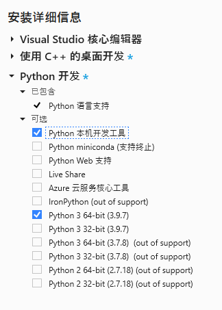
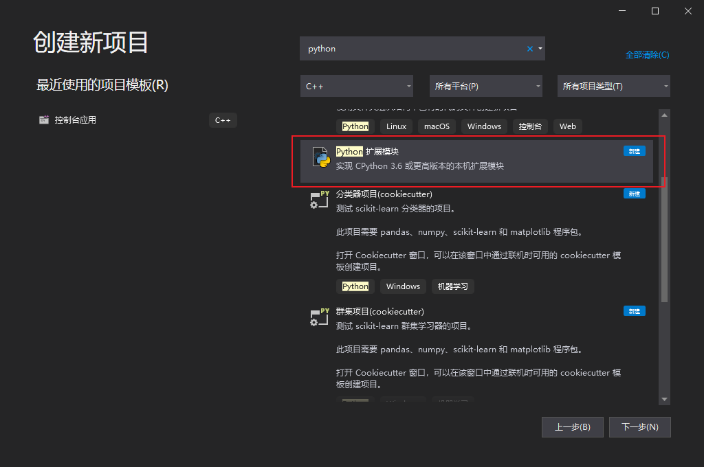
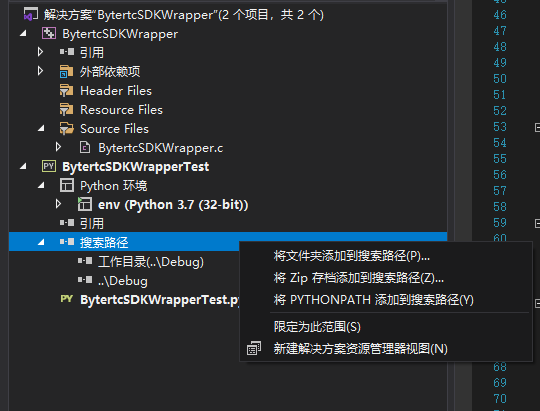

## Visual Studio依赖

在Visual Studio 2017之前版本需要手动搭建Python的pyd模块开发环境，Visual Studio 2017或更高版本，可安装Python开发工作负载，其内包含了Python本机开发工具，可以直接使用**Python 扩展模块**模板来初始化pyd项目。

## 以Python扩展模块模板创建项目

项目生成的实际上就是**dll模块**，不过会把**目标文件扩展名**修改为**pyd**，同时会把Python相关的**头文件**和**库文件**路径自动引入进来。另外该模板使用的调试器是**Python/Native Debugging**，调试时会启动一个Python Shell，并自动把项目模块import进来。

如果想要单独创建一个**测试用例**项目可以这么做，创建一个Python子项目，然后把pyd模块的**生成路径**包含进**搜索路径**中，不过一般可能没这个必要，看实际需求。

## 开发相关指引

- Python模块的公用头文件是Python.h
- 写pyd模块的目的有可能是为某个还没有Python Binding的库编写Wrapper，那么可以在项目中把该库的头文件和库文件路径引入进来
- 需要注意32位或64位匹配
- 具体的开发方式以及结构组织请直接看官方文档

> 相关开发手册和Example可以查看以下链接：
>
> - [创建适用于 Python 的 C++ 扩展](https://docs.microsoft.com/zh-cn/visualstudio/python/working-with-c-cpp-python-in-visual-studio?view=vs-2022)
> - [microsoft/python-sample-vs-cpp-extension](https://github.com/Microsoft/python-sample-vs-cpp-extension)
> - [Python/C API 参考手册](https://docs.python.org/zh-cn/3/c-api/index.html)
> - [扩展和嵌入 Python 解释器](https://docs.python.org/zh-cn/3/extending/index.html)

