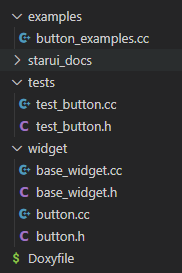

# 命名规则

> 需要从可读性、方便识别、减少码字时间和能准确表达含义等方面来考虑
>

## 项目命名

视情况挑选以下三种方式的其中一种：

- Link-Cooperation

- StarUI

- starui

## 文件夹（模块）命名

使用小写英文，拆分子文件夹来分层级

Examples：

```Plain Text
fs/afs
fs/efs
fs/exfat
...
```

## 源文件和头文件命名

采用小写英文+下划线分割，另外对于C++的源文件，我们统一采用.cc后缀

Examples：

```C++
widget.h
widget.cc

radio_button.cc
radio_button.cc

service_message.cc
service_message.cc
```

## namesapce命名

统一采用小写英文字母

Examples：

```C++
namespace starui
{
    namespace component
    {
    	
    }
}
```

## 宏

### 头文件保护宏

使用`__[模块路径_模块名]_H`的命名规则，其中[]内的使用大写英文+下划线分割的方法

Examples：

```C++
#ifndef __STARUI_WIDGET_BUTTON_H
#define __STARUI_WIDGET_BUTTON_H

// ...

#endif  // #ifndef __STARUI_WIDGET_BUTTON_H
```

### 宏定义

使用大写英文+下划线分割的方法

Examples：

```C++
#define USER_NAME "phantom"
```

### 宏函数

视情况使用函数相同的命名规则或者大写英文+下划线分割的方法

Examples：

```C++
#define RELEASE_OBJECT(obj) { \
            obj->release();   \
        }

#define shoot_it(me, other) me->shoot(other)
```

## 结构体

结构体名采用与类相同的驼峰法进行命名，然后结构体的数据使用小写英文+下划线的命名方法

Examples：

```C++
struct HumanBeing
{
    int         age;
    std::string first_name;
    std::string second_name;
};
```

## enum和enum class命名

枚举体名和其成员都采用与类相同的驼峰法

Examples：

```C++
enum class DeviceType
{
    AudioMic,
    AudioSpeaker,
    Monitor,
    Keyboard,
    GamePad,
};
```

## 所有类型的常量

不管是全局范围内的常量、函数/方法内的常量、或者类的常量，都统一采用大写英文+下划线分割的规则

Examples：

```C++
static const int USER_ID = 0;

class Bar
{
    public:
        const int VERSION_MAJOR_NUMBER = 1;
};

void foo()
{
    const int DIV_FACTOR = 3;
}
```

## 函数

采用小写英文+下划线分割

Examples：

```C++
void create_service()
{

}

void create_empty_folder()
{

}
```

## 函数参数和局部变量

采用小写英文+下划线分割

Examples：

```C++
bool create_user(const std::string& user_name)
{
    auto user_server = UserServer::instance();
    return user_server->create_user(user_name);
}
```

## 函数内静态变量

使用s_前缀，后续部分采用小写英文+下划线分割

Examples：

```C++
int counter()
{
    static int s_count = 0;
    return ++s_count;
}
```

## 全局变量

使用g_前缀，后续部分采用小写英文+下划线分割

Examples：

```C++
static int g_counter = 0;

void foo()
{

}
```

## 类命名

类名采用驼峰法

Examples：

```C++
class HumanBeing
{

};
```

### 类成员方法

采用与普通函数同样的命名规则，小写英文+下划线分割

Examples：

```C++
class HumanBeging
{
    void run_to()
    {
    }
};
```

### 类静态方法

采用与成员方法同样的命名规则

Examples：

```C++
class HumanBeging
{
    static void kill()
    {
    }
};
```

### 类成员数据

不管是public、private还是protected，都采用_为前缀，后续部分小写英文+下划线的命名规则

Examples：

```C++
class HumanBeging
{
    private:
        int         _age;
        std::string _first_name;
        std::string _second_name;
};
```

### 类成员数据的getter和setter

getter采用成员数据去掉前缀来命名，setter采用修改前缀为set_

Examples：

```C++
class HumanBeging
{
    public:
        int age()
        {
            return _age;
        }

        void set_age(int age)
        {
            _age = age;
        }

    private:
        int _age;
};
```

### 类静态数据

静态数据采用两个下划线__为前缀，后续部分小写英文+下划线的命名规则

Examples：

```C++
class HumanBegin
{
    private:
        int         _age;
        std::string _first_name;
        std::string _second_name;

        static int __count;
};

int HumanBeging::__count = 0;
```

## 接口命名规范

驼峰法+Interface

Examples：

```C++
class ControllerInterface
{

};
```

# 注释规范

我把注释分为两种，一种是代码说明注释，另一种是文档注释。前者提供代码说明（比如做层次切割），后者则是用于辅助doxygen生成接口文档的，注释的规范我们参考JavaDoc规范。

> 另外以下不给出完整的例子，详细的例子我们放到编码规范内
>

## 代码说明注释和文档注释的区分

代码说明注释：

```C++
//

/* */
```

上面两种形式的注释，doxygen是不会为其产出文档的

文档注释：

```C++
///

/**
 *
 */
```

## 代码说明注释

```C++
// 第一种，单行注释

//
// 第二种，单行注释
//

//
// 第三种
// 多行注释
//

/*
        第四种（前面一个tab）
        多行注释
*/

// 对于多行注释，我们首推第三种做法
```

关于代码层次切割

```C++
// 使用以下方式进行多个层次切割

//
// 多个操作组合1
//

// 操作1
foo();

// 操作2
bar();

//
// 多个操作组合2
//

// 操作3
foo();

// 操作4
bar();

/* Block End */

// 下面并非<多个操作组合2>中的操作，上面使用Block End标记上面的操作结束
bar();

//
// 如果操作组合后没有其它独立的操作，或者是一个新的操作组合
// 这种情况不需要Block End来标记结束
//
```

Examples：

```C++
Window create_main_view()
{
    // 实例化main view
    Window main_view;
    main_view.set_title("main view");
    main_view.set_size(500, 500);
    
    // 配置main view菜单
    Menu menu;
    menu.add_action("退出", on_quit);
    menu.add_action("打开", on_open);
    main_view.set_menu(menu);
    
    //
    // 配置客户区空间
    //
    
    // 加入画布
    Canvas canvas;
    canvas.set_size(300, 300);
    canvas.set_background(Black);
    main_view.add_widget(canvas);
    
    // 加入操作面板
    Panel panel;
    panel.add_action("放大", on_zoom_in);
    panel.add_action("缩小", on_zoom_out);
    main_view.add_widget(panel);

    //
    // 绑定事件
    //

    // 绑定画布事件
    canvas.bind(Widget.Paint, paint);

    // 绑定面板事件
    panel.bind(Widget.clicked, clicked);

    /* Block End */

    //
    // Notes: 下面将检查窗口是否存在，如果
    // 已经存在，那么将销毁
    //

    if (Window.exist(main_view.title()) {
        Window.destroy(main_view.title());
    }
    
    return main_view;
}
```

## 文档注释

我们需要的文档注释包括：

- 文件头注释，用于描述该文件、其生成时间、作者等

- 函数注释，说明函数用途、参数、作者、注意事项、用例等

- 类注释

- 成员方法注释

- 成员数据注释

- 结构体注释

- 枚举体注释

- 接口注释

- 等…

我们参考JavaDoc的注释规范，在适当的地方可以插入一些html标签，另外doxygen也支持markdown。

关于多国语言处理，可以使用doxygen的if、else命令，不过目前我们不需要考虑这个。

对于C++，主要的文档注释留在头文件上，源文件只需要适当的少量注释。

### 基本Tags

> JavaDoc Tag可以参考：
>
> [javadoc-The Java API Documentation Generator](https://docs.oracle.com/javase/7/docs/technotes/tools/windows/javadoc.html#javadoctags)
>
> Doxygen Command：
>
> [Doxygen Manual: Special Commands](https://doxygen.nl/manual/commands.html)

tag主要使用javadoc与doxygen预定义的，我们统一以@[tag_name]来开始一个tag，下面例子中所有以@开头的，都是一个tag，通过doxygen会把这些tag的内容输出到产出文档中。

Examples：

```C++
/**
 * @file button.h
 * @author your name (you@domain.com)
 * @brief 
 * @version 0.1
 * @date 2022-10-23
 * @note
 * <p>it's a notes</p>
 * <strong>it's a strong note</strong>
 * 
 * @copyright Copyright (c) 2022
 * 
 */

#ifndef __STARUI_BUTTON_H
#define __STARUI_BUTTON_H

// ...

#endif  // #ifndef __STARUI_BUTTON_H
```

我们挑选的基本的Tag列表（还有一些Tag在别的地方进行说明）：

| Tag         | **专有作用域** | **是否必须**                 | **含义**                                                     | **例子**                                       |
| ----------- | -------------- | ---------------------------- | ------------------------------------------------------------ | ---------------------------------------------- |
| @file       | 文件头注释     | 文件头注释必须               | 文件头注释指定了该Tag才能生成对应的File注释                  | @file button.h                                 |
| @author     |                | 对于文件注释必须，其它非必须 | 标记作者以及邮箱，可使用多个author tag来标记多个作者         | @author your name (you@domain)                 |
| @brief      |                |                              | brief对应简述，详细的描述应该放在/**下面的第一行开始，或者放到details中 | @brief It’s a opensource library               |
| @details    |                |                              | 详细描述，或放在/**下面的第一行开始                          | @details 这是详细描述                          |
| @date       |                |                              | 创建日期                                                     | @date 2022-10-23                               |
| @version    |                | 尽量别用                     | 版本号，可以通过变量控制，不过我们基本不需要使用这个tag，因为比较难控制 | @version 0.1.0                                 |
| @since      |                | 最好在关键接口上都加上       | 自什么版本开始引入的                                         | @since 0.1                                     |
| @see        |                |                              | 引用                                                         | @see starui.Image                              |
| @copyright  | 文件头注释     | 文件头注释必须               | 我们的许可证不写在这里，这里只写版权                         | @copyright Copyright (c) 2022 Link-Cooperation |
| @deprecated |                |                              | 标记被弃用，最好放到最末尾                                   | @deprecated 该接口跟新接口冲突                 |
| {@link}     |                |                              | 嵌入引用                                                     | @brief it's StarUI Button {@link starui.Image} |

额外提示信息Tag列表

| Tag        | **专有作用域** | **是否必须** | **含义** | **例子**                    |
| ---------- | -------------- | ------------ | -------- | --------------------------- |
| @note      |                |              | 注解     | @note 这是一个注解          |
| @remark    |                |              | 备注     | @remark 这是一个备注        |
| @attention |                |              | 注意事项 | @attention 这是一个注意事项 |
| @warning   |                |              | 警告     | @warning 这是一个警告       |
| @bug       |                |              | 存在bug  | @bug 这里存在一个XXX Bug    |

## 锚点以及引用

```C++
/**
 * @brief 按钮类
 * @anchor Button_Example
 * @par Example
 * @code
 * Button button;
 * @endcode
 */
class Button
{
    public:
        /**
         * @brief 构造按钮类 @ref Button_Example
         */
        Button();
};
```

### Todo列表

```C++
/**
 * @brief it's StarUI Button
 * @todo
 *  - 加入圆角
 *  - 加入透明度
 */
class Button
{
};
```

### 提供Example代码

```C++
/**
 * 执行任务
 * @code
 * button.doing();
 * @endcode 
 * 
 * @brief 执行任务
 * 
 * @par Examples
 * @code
 * button.doing();
 * @endcode
 * 
 */
void doing()
{
    // 我们可以在两个地方加，一个是在details上，另一个是加一个Examples par（段落）
}
```

### 指示Example位置

```C++
// 需要把button_examples.cc或其所在路径加入EXAMPLE_PATH中

// button.h

class Button
{
};
/// @example button_examples.cc

// button_examples.cc

void create_push_button()
{
    Button button;
}
```

## 指示测试用例

```C++
/**
 * @test test_button.cc
 * @test TestButton
 */
class Button
{
};
```

## 指示可能抛出的异常

```C++
// @exception、@throw、@throws等效

class Button
{
    public:
        /**
         * @brief 创建按钮
         * @exception std::exception 普通异常
         * @throw std::out_of_range 超出范围
         * @throws std::invalid_argument 无效参数
         */
        void create();
}
```

## 分组

```C++
/// @name 功能宏定义
/// @{

/**
 * @brief 小于
 */
#define LESS(a, b) a < b

/**
 * @brief 大于
 */
#define GREATER(a, b) a > b

/// @}

/// @name 常量宏定义
/// @{

/// ID
#define ID 1

/// COUNT
#define COUNT 10

/// @}
```

## 名字空间

我们的规则是：

- 命名空间首次出现时需要加上@brief，后续不需要

- 两个父子层级关系的namespace，不使用空行分割

以下例子命名空间结构为：

```C++
namespace starui
{
    namespace widget {
    }
}
```

widget.h

```C++
/**
 * @namespace starui
 * @brief starui
 */
namespace starui
{
/**
 * @namespace starui.widget
 * @brief widget
 */
namespace widget
{

/**
 * @brief Base Widget Class
 * @ingroup Widget
 */
class BaseWidget
{

};

} // namespace widget
} // namespace starui
```

button.h

```C++
#include <widget.h>

/// @namespace starui
namespace starui
{
/// @namespace starui.widget
namespace widget
{

/**
 * @brief it's StarUI Button
 */
class Button : public BaseWidget
{
};

}  // namespace widget
}  // namespace starui
```

## 模块

模块相关的规则：

- group配合名字空间一起使用

- 不使用@addtogroup，而是使用@defgroup，把它放在模块入口的尾部

- 需要加入模块的地方使用@ingroup

下面是几个例子

例子1：

widget.h

```C++
/**
 * @namespace starui
 * @brief starui
 */
namespace starui
{
/**
 * @namespace starui.widget
 * @brief widget
 * @ingroup Widget
 */
namespace widget
{

/**
 * @brief Base Widget Class
 * @ingroup Widget
 */
class BaseWidget
{

};

} // namespace widget
} // namespace starui

/**
 * @defgroup Widget
 * @brief StarUI's Widget
 */
```

button.h

```C++
#include <widget.h>

/// @namespace starui
namespace starui
{
/// @namespace starui.widget
namespace widget
{

/**
 * @brief it's StarUI Button {@link starui.Image}
 * @ingroup Widget
 */
class Button : public BaseWidget
{
};

}  // namespace widget
}  // namespace starui
```

例子2：

最好别用这种做法，会让代码看起来非常混乱

```C++
/// @defgroup Render
/// @brief Render Module
/// @{

/**
 * @namespace render
 * @brief Render Something
 */
namespace render
{

/**
 * @brief BaseRender
 * @ingroup Render
 */
class BaseRender
{

};

} // namespace render

/// @}
```

## 宏

看下面的例子，对于直接在宏前面加注释，是不需要@def Tag的，在其它地方补充注释的话，才需要@def。像结构体（@struct）、枚举(@enum)、函数(@fn)等都是类似的，所以这些的说明就都跳过了。

```C++
/**
 * @brief 小于
 */
#define LESS(a, b) a < b

#define GREATER(a, b) a > b

/**
 * @brief 圆周率
 * @def PI
 */
#define PI 3.14

#define ID 100

/**
 * @def GREATER(a, b)
 * @brief 大于
 */

/**
 * @def ID
 * @brief 标记符
 */
```

## 枚举体

```C++
/**
 * @brief 设备类型
 * @details 音视频设备类型
 */
enum class DeviceType
{
    /// 音频
    Audio,
    /// 视频
    Video
};
```

## 结构体

```C++
/**
 * @brief 描述设备参数
 */
struct Device
{
    /// 设备Id
    int id;

    /// 设备名
    char name[250];
};
```

## 函数

对于参数我们使用[in]、[out]和[in out]，来表示其输入或输出。

对于返回值，@return、@returns和@result三个是等效的，我们一般使用@return即可，如果需要对返回值分情况进行解释，可补充@retval

```C++
enum class Status
{
    /// 成功
    Ok,

    /// 失败
    Failed
};

/**
 * @brief Create a system instance
 * 
 * @param [in] id 系统类型id
 * @param [in] user_name 用户名
 * @param [out] instance 实例句柄
 * @param [in out] status 初始状态以及当前状态. For more information, see {@link Status}.
 * @return int 状态码
 *  - 0: 成功
 *  - 1: 失败
 */
int create_system(int id, const std::string& user_name, void* instance, Status* status)
{
    return 0;
}

/**
 * @brief Create a system instance
 * 
 * @param [in] id 系统类型id
 * @param [in] user_name 用户名
 * @param [out] instance 实例句柄
 * @param [in out] status 初始状态以及当前状态
 * @return int 状态码
 * @retval 0 成功
 * @retval 1 失败
 */
int create_system_2(int id, const std::string& user_name, void* instance, int* status)
{
    return 0;
}

/**
 * @brief Create a system instance
 * 
 * @param [in] id 系统类型id
 * @param [in] user_name 用户名
 * @param [out] instance 实例句柄
 * @param [in out] status 初始状态以及当前状态
 * @returns {@link Status} 状态码
 * @retval Status::Ok
 * @retval Status::Failed
 */
Status create_system_3(int id, const std::string& user_name, void* instance, int* status)
{
    return Status::Ok;
}
```

## Doxygen相关参考

> Doxygen手册：
>
> [Doxygen Manual: Overview](https://doxygen.nl/manual/index.html)
>
> Doxygen命令：
>
> [Doxygen Manual: Special Commands](https://doxygen.nl/manual/commands.html)

## JavaDoc相关参考

> JavaDoc：
>
> [How to Write Doc Comments for the Javadoc Tool](https://www.oracle.com/technical-resources/articles/java/javadoc-tool.html)
>
> JavaDocTags：
>
> [javadoc-The Java API Documentation Generator](https://docs.oracle.com/javase/7/docs/technotes/tools/windows/javadoc.html#javadoctags)
>
> JavaDoc - The Java API Documentation Generator：
>
> [javadoc-The Java API Documentation Generator](https://docs.oracle.com/javase/7/docs/technotes/tools/windows/javadoc.html)


#  编码规范

直接看例子，目录结构如下：



## widget

### widget/base_widget.h

```C++
/**
 * 定义StarUI所有UI组件的基础类
 * 
 * @file base_widget.h
 * @author phantom (phantom@inc.com)
 * @brief Widget基础类
 * @date 2022-10-23
 * 
 * @copyright Copyright (c) 2022 StarUI
 * 
 */

#ifndef __STARUI_BASE_WIDGET_H
#define __STARUI_BASE_WIDGET_H

/**
 * @namespace starui
 * @brief starui
 */
namespace starui
{
/**
 * @namespace starui.widget
 * @brief widget
 * @ingroup Widget
 */
namespace widget
{

/**
 * @brief StarUI组件基础类
 * @note 在构建时parent不能为空
 * @bug
 *  - 目前在启动时有概率崩溃
 *  - 界面响应卡顿
 * @todo
 *  - 修复卡顿问题
 *  - 引入查找子元素功能
 */
class BaseWidget
{
    public:
        /**
         * @brief Construct a new Base Widget object
         * 
         * @param parent 
         */
        BaseWidget(BaseWidget* parent);

        /**
         * @brief Destroy the Base Widget object
         * 
         */
        virtual ~BaseWidget();

        /**
         * @brief 获取父组件
         * 
         * @return BaseWidget* 
         */
        BaseWidget* parent() const;

    protected:
        /// 父组件
        BaseWidget* _parent;
};

} // namespace widget
} // namespace starui

/**
 * @defgroup Widget
 * @brief StarUI的Widget模块
 */

#endif // #ifndef __STARUI_BASE_WIDGET_H
```

### widget/base_widget.cc

```C++
/**
 * @file base_widget.cc
 * @author phantom (phantom@inc.com)
 * @brief Widget基础类
 * @date 2022-10-23
 * 
 * @copyright Copyright (c) 2022 StarUI
 * 
 */

#include <widget/base_widget.h>

namespace starui
{
namespace widget
{

BaseWidget::BaseWidget(BaseWidget* parent)
 : _parent(parent)
{

}

BaseWidget::~BaseWidget()
{

}

BaseWidget* BaseWidget::parent() const
{
    return _parent;
}

} // namespace widget
} // namespace starui
```

### widget/button.h

```C++
/**
 * StarUI按钮组件
 * 
 * @file Button.h
 * @author phantom (phantom@inc.com)
 * @brief 按钮组件
 * @date 2022-10-23
 * 
 * @copyright Copyright (c) 2022 StarUI
 * 
 */

#ifndef __STARUI_BUTTON_H
#define __STARUI_BUTTON_H

#include <widget/base_widget.h>

#include <string>

/// @namespace starui
namespace starui
{
/// namespace starui.widget
namespace widget
{

/**
 * @brief 封装按钮类型
 * @todo
 *  - 后续补充更多的按钮类型
 */
enum class ButtonType
{
    /// 普通按钮
    PushButton,

    /// 复选按钮
    CheckBox
};

/**
 * @brief 封装按钮命中测试结果
 */
enum class HitResult
{
    /// 命中
    Hitted,

    /// 未命中
    NotHitted
};

/**
 * @brief 封装Point
 */
typedef struct
{
    /// x坐标
    int x;

    /// y坐标
    int y;
} Point, *PPoint;

/**
 * @brief 封装矩形区域
 */
typedef struct
{
    /// x坐标
    int x;

    /// y坐标
    int y;

    /// 宽
    int width;

    /// 高
    int height;
} Rect, *PRect;

/**
 * StarUI所有按钮的共同祖先
 * 
 * @brief StarUI按钮
 * @ingroup Widget
 * @par Example
 * @code
 * Button button("hello", ButtonType)
 * Rect area = {0};
 * area.width = 100;
 * area.height = 300;
 * button.update_area(area);
 * @endcode
 * @test TestButton
 */
class Button : public BaseWidget
{
    public:
        /**
         * @brief Construct a new Button object
         * 
         * @param [in] text 
         * @param [in] type For more information, see {@link ButtonType}
         */
        Button(const std::string& text, ButtonType type);

        /**
         * @brief 获取按钮文本
         * 
         * @return std::string 
         */
        std::string text() const;

        /**
         * @brief 修改按钮文本
         * 
         * @param [in] text 新文本
         */
        void set_text(const std::string& text);

        /**
         * @brief 获取按钮类型
         * 
         * @return ButtonType 
         */
        ButtonType type() const;

        /**
         * @brief 更换按钮类型
         * @deprecated 按钮类型在创建后，我们不允许修改
         * 
         * @param [in] type 新按钮类型. For more information, see {@link ButtonType}
         */
        void change_type(ButtonType type);

        /**
         * @brief 获取按钮区域
         * 
         * @return Rect 
         */
        Rect area() const;

        /**
         * @brief 更新按钮区域
         * 
         * @param [in] rect 新区域. For more information, see {@link Rect}
         */
        void update_area(const Rect& rect);

        /**
         * @brief 执行命中测试
         * 
         * @param [in] pt 测试Point. For more information, see {@link Point}
         * @return HitResult @{link HitResult}
         */
        HitResult hit_test(const Point& pt) const;

        /**
         * @brief 获取按钮状态
         * 
         * @return int
         * @retval 0 禁用
         * @retval 1 启用
         */
        int status() const;

    protected:
        std::string _text; /// 按钮文本        
        ButtonType  _type; /// 按钮类型
        Rect        _area; /// 按钮区域
};
/// @example button_examples.cc

} // namespace widget
} // namespace starui

#endif // #ifndef __STARUI_BUTTON_H
```

### widget/button.cc

```C++
/**
 * @file Button.cc
 * @author phantom (phantom@inc.com)
 * @brief 按钮组件
 * @date 2022-10-23
 * 
 * @copyright Copyright (c) 2022 StarUI
 * 
 */

#include <widget/button.h>

namespace starui
{
namespace widget
{

Button::Button(const std::string& text, ButtonType type)
 : _parent(nullptr),
   _text(text),
   _type(type)
{

}

std::string Button::text() const
{
    return _text;
}

void Button::set_text(const std::string& text)
{
    _text = text;
}

ButtonType Button::type() const
{
    return _type;
}

void Button::change_type(ButtonType type)
{
    _type = type;
}

Rect Button::area() const
{
    return _area;
}

void Button::update_area(const Rect& rect)
{
    _area = rect;
}

HitResult Button::hit_test(const Point& pt) const
{
    return HitResult::Hitted;
}

/**
 * @note 目前只返回0
 */
int Button::status() const
{
    return 0;
}

} // namespace widget
} // namespace starui
```

## tests

### tests/test_button.h

```C++
/**
 * 我们将使用googletest编写按钮的单元测试
 * 不过这只是一个演示代码，所以并未真正使用googletest
 * 
 * @file test_button.h
 * @author phantom (phantom@inc.com)
 * @brief 测试按钮
 * @date 2022-10-23
 * 
 * @copyright Copyright (c) 2022 StarUI
 * 
 */

#ifndef __STARUI_TEST_BUTTON_H
#define __STARUI_TEST_BUTTON_H

/**
 * @brief 测试StarUI按钮
 */
class TestButton
{
    void test_create_button();
};

#endif // #ifndef __STARUI_TEST_BUTTON_H
```

### tests/test_button.cc

```C++
/**
 * @file test_button.cc
 * @author phantom (phantom@inc.com)
 * @brief StarUI按钮测试用例
 * @date 2022-10-23
 * 
 * @copyright Copyright (c) 2022 StarUI
 * 
 */

#include <tests/test_button.h>

#include <widget/button.h>

void TestButton::test_create_button()
{
    starui::widget::Button button("hello", starui::widget::ButtonType::PushButton);
}
```

## examples

### examples/button_examples.cc

```C++
/**
 * @file button_examples.cc
 * @author phantom (phantom@inc.com)
 * @brief StarUI按钮使用例子
 * @date 2022-10-23
 * 
 * @copyright Copyright (c) 2022 StarUI
 * 
 */

#include <widget/button.h>

void example_create_push_button()
{
    starui::widget::Button button("hello", starui::widget::ButtonType::PushButton);
}
```

## Doxyfile

精简版（去掉默认未改动的参数）：

```C++
PROJECT_NAME           = StarUI
PROJECT_NUMBER         = 0.1.0
PROJECT_BRIEF          = "StarUI it's a tiny opensource ui library"
OUTPUT_DIRECTORY       = starui_docs
INPUT                  = .
RECURSIVE              = YES
EXAMPLE_PATH           = examples
SOURCE_BROWSER         = YES
```

完整版：

```C++
DOXYFILE_ENCODING      = UTF-8
PROJECT_NAME           = StarUI
PROJECT_NUMBER         = 0.1.0
PROJECT_BRIEF          = "StarUI it's a tiny opensource ui library"
PROJECT_LOGO           =
OUTPUT_DIRECTORY       = starui_docs
CREATE_SUBDIRS         = NO
CREATE_SUBDIRS_LEVEL   = 8
ALLOW_UNICODE_NAMES    = NO
OUTPUT_LANGUAGE        = English
BRIEF_MEMBER_DESC      = YES
REPEAT_BRIEF           = YES
ABBREVIATE_BRIEF       = "The $name class" \\
                         "The $name widget" \\
                         "The $name file" \\
                         is \\
                         provides \\
                         specifies \\
                         contains \\
                         represents \\
                         a \\
                         an \\
                         the
ALWAYS_DETAILED_SEC    = NO
INLINE_INHERITED_MEMB  = NO
FULL_PATH_NAMES        = YES
STRIP_FROM_PATH        =
STRIP_FROM_INC_PATH    =
SHORT_NAMES            = NO
JAVADOC_AUTOBRIEF      = NO
JAVADOC_BANNER         = NO
QT_AUTOBRIEF           = NO
MULTILINE_CPP_IS_BRIEF = NO
PYTHON_DOCSTRING       = YES
INHERIT_DOCS           = YES
SEPARATE_MEMBER_PAGES  = NO
TAB_SIZE               = 4
ALIASES                =
OPTIMIZE_OUTPUT_FOR_C  = NO
OPTIMIZE_OUTPUT_JAVA   = NO
OPTIMIZE_FOR_FORTRAN   = NO
OPTIMIZE_OUTPUT_VHDL   = NO
OPTIMIZE_OUTPUT_SLICE  = NO
EXTENSION_MAPPING      =
MARKDOWN_SUPPORT       = YES
TOC_INCLUDE_HEADINGS   = 5
AUTOLINK_SUPPORT       = YES
BUILTIN_STL_SUPPORT    = NO
CPP_CLI_SUPPORT        = NO
SIP_SUPPORT            = NO
IDL_PROPERTY_SUPPORT   = YES
DISTRIBUTE_GROUP_DOC   = NO
GROUP_NESTED_COMPOUNDS = NO
SUBGROUPING            = YES
INLINE_GROUPED_CLASSES = NO
INLINE_SIMPLE_STRUCTS  = NO
TYPEDEF_HIDES_STRUCT   = NO
LOOKUP_CACHE_SIZE      = 0
NUM_PROC_THREADS       = 1
EXTRACT_ALL            = NO
EXTRACT_PRIVATE        = NO
EXTRACT_PRIV_VIRTUAL   = NO
EXTRACT_PACKAGE        = NO
EXTRACT_STATIC         = NO
EXTRACT_LOCAL_CLASSES  = YES
EXTRACT_LOCAL_METHODS  = NO
EXTRACT_ANON_NSPACES   = NO
RESOLVE_UNNAMED_PARAMS = YES
HIDE_UNDOC_MEMBERS     = NO
HIDE_UNDOC_CLASSES     = NO
HIDE_FRIEND_COMPOUNDS  = NO
HIDE_IN_BODY_DOCS      = NO
INTERNAL_DOCS          = NO
CASE_SENSE_NAMES       = SYSTEM
HIDE_SCOPE_NAMES       = NO
HIDE_COMPOUND_REFERENCE= NO
SHOW_HEADERFILE        = YES
SHOW_INCLUDE_FILES     = YES
SHOW_GROUPED_MEMB_INC  = NO
FORCE_LOCAL_INCLUDES   = NO
INLINE_INFO            = YES
SORT_MEMBER_DOCS       = YES
SORT_BRIEF_DOCS        = NO
SORT_MEMBERS_CTORS_1ST = NO
SORT_GROUP_NAMES       = NO
SORT_BY_SCOPE_NAME     = NO
STRICT_PROTO_MATCHING  = NO
GENERATE_TODOLIST      = YES
GENERATE_TESTLIST      = YES
GENERATE_BUGLIST       = YES
GENERATE_DEPRECATEDLIST= YES
ENABLED_SECTIONS       =
MAX_INITIALIZER_LINES  = 30
SHOW_USED_FILES        = YES
SHOW_FILES             = YES
SHOW_NAMESPACES        = YES
FILE_VERSION_FILTER    =
LAYOUT_FILE            =
CITE_BIB_FILES         =
QUIET                  = NO
WARNINGS               = YES
WARN_IF_UNDOCUMENTED   = YES
WARN_IF_DOC_ERROR      = YES
WARN_IF_INCOMPLETE_DOC = YES
WARN_NO_PARAMDOC       = NO
WARN_AS_ERROR          = NO
WARN_FORMAT            = "$file:$line: $text"
WARN_LINE_FORMAT       = "at line $line of file $file"
WARN_LOGFILE           =
INPUT                  = .
INPUT_ENCODING         = UTF-8
INPUT_FILE_ENCODING    =
FILE_PATTERNS          = *.c \\
                         *.cc \\
                         *.cxx \\
                         *.cpp \\
                         *.c++ \\
                         *.java \\
                         *.ii \\
                         *.ixx \\
                         *.ipp \\
                         *.i++ \\
                         *.inl \\
                         *.idl \\
                         *.ddl \\
                         *.odl \\
                         *.h \\
                         *.hh \\
                         *.hxx \\
                         *.hpp \\
                         *.h++ \\
                         *.l \\
                         *.cs \\
                         *.d \\
                         *.php \\
                         *.php4 \\
                         *.php5 \\
                         *.phtml \\
                         *.inc \\
                         *.m \\
                         *.markdown \\
                         *.md \\
                         *.mm \\
                         *.dox \\
                         *.py \\
                         *.pyw \\
                         *.f90 \\
                         *.f95 \\
                         *.f03 \\
                         *.f08 \\
                         *.f18 \\
                         *.f \\
                         *.for \\
                         *.vhd \\
                         *.vhdl \\
                         *.ucf \\
                         *.qsf \\
                         *.ice
RECURSIVE              = YES
EXCLUDE                =
EXCLUDE_SYMLINKS       = NO
EXCLUDE_PATTERNS       =
EXCLUDE_SYMBOLS        =
EXAMPLE_PATH           = examples
EXAMPLE_PATTERNS       = *
EXAMPLE_RECURSIVE      = NO
IMAGE_PATH             =
INPUT_FILTER           =
FILTER_PATTERNS        =
FILTER_SOURCE_FILES    = NO
FILTER_SOURCE_PATTERNS =
USE_MDFILE_AS_MAINPAGE =
FORTRAN_COMMENT_AFTER  = 72
SOURCE_BROWSER         = YES
INLINE_SOURCES         = NO
STRIP_CODE_COMMENTS    = YES
REFERENCED_BY_RELATION = NO
REFERENCES_RELATION    = NO
REFERENCES_LINK_SOURCE = YES
SOURCE_TOOLTIPS        = YES
USE_HTAGS              = NO
VERBATIM_HEADERS       = YES
CLANG_ASSISTED_PARSING = NO
CLANG_ADD_INC_PATHS    = YES
CLANG_OPTIONS          =
CLANG_DATABASE_PATH    =
ALPHABETICAL_INDEX     = YES
IGNORE_PREFIX          =
GENERATE_HTML          = YES
HTML_OUTPUT            = html
HTML_FILE_EXTENSION    = .html
HTML_HEADER            =
HTML_FOOTER            =
HTML_STYLESHEET        =
HTML_EXTRA_STYLESHEET  =
HTML_EXTRA_FILES       =
HTML_COLORSTYLE        = AUTO_LIGHT
HTML_COLORSTYLE_HUE    = 220
HTML_COLORSTYLE_SAT    = 100
HTML_COLORSTYLE_GAMMA  = 80
HTML_TIMESTAMP         = NO
HTML_DYNAMIC_MENUS     = YES
HTML_DYNAMIC_SECTIONS  = NO
HTML_INDEX_NUM_ENTRIES = 100
GENERATE_DOCSET        = NO
DOCSET_FEEDNAME        = "Doxygen generated docs"
DOCSET_FEEDURL         =
DOCSET_BUNDLE_ID       = org.doxygen.Project
DOCSET_PUBLISHER_ID    = org.doxygen.Publisher
DOCSET_PUBLISHER_NAME  = Publisher
GENERATE_HTMLHELP      = NO
CHM_FILE               =
HHC_LOCATION           =
GENERATE_CHI           = NO
CHM_INDEX_ENCODING     =
BINARY_TOC             = NO
TOC_EXPAND             = NO
GENERATE_QHP           = NO
QCH_FILE               =
QHP_NAMESPACE          = org.doxygen.Project
QHP_VIRTUAL_FOLDER     = doc
QHP_CUST_FILTER_NAME   =
QHP_CUST_FILTER_ATTRS  =
QHP_SECT_FILTER_ATTRS  =
QHG_LOCATION           =
GENERATE_ECLIPSEHELP   = NO
ECLIPSE_DOC_ID         = org.doxygen.Project
DISABLE_INDEX          = NO
GENERATE_TREEVIEW      = NO
FULL_SIDEBAR           = NO
ENUM_VALUES_PER_LINE   = 4
TREEVIEW_WIDTH         = 250
EXT_LINKS_IN_WINDOW    = NO
OBFUSCATE_EMAILS       = YES
HTML_FORMULA_FORMAT    = png
FORMULA_FONTSIZE       = 10
FORMULA_MACROFILE      =
USE_MATHJAX            = NO
MATHJAX_VERSION        = MathJax_2
MATHJAX_FORMAT         = HTML-CSS
MATHJAX_RELPATH        =
MATHJAX_EXTENSIONS     =
MATHJAX_CODEFILE       =
SEARCHENGINE           = YES
SERVER_BASED_SEARCH    = NO
EXTERNAL_SEARCH        = NO
SEARCHENGINE_URL       =
SEARCHDATA_FILE        = searchdata.xml
EXTERNAL_SEARCH_ID     =
EXTRA_SEARCH_MAPPINGS  =
GENERATE_LATEX         = YES
LATEX_OUTPUT           = latex
LATEX_CMD_NAME         =
MAKEINDEX_CMD_NAME     = makeindex
LATEX_MAKEINDEX_CMD    = makeindex
COMPACT_LATEX          = NO
PAPER_TYPE             = a4
EXTRA_PACKAGES         =
LATEX_HEADER           =
LATEX_FOOTER           =
LATEX_EXTRA_STYLESHEET =
LATEX_EXTRA_FILES      =
PDF_HYPERLINKS         = YES
USE_PDFLATEX           = YES
LATEX_BATCHMODE        = NO
LATEX_HIDE_INDICES     = NO
LATEX_BIB_STYLE        = plain
LATEX_TIMESTAMP        = NO
LATEX_EMOJI_DIRECTORY  =
GENERATE_RTF           = NO
RTF_OUTPUT             = rtf
COMPACT_RTF            = NO
RTF_HYPERLINKS         = NO
RTF_STYLESHEET_FILE    =
RTF_EXTENSIONS_FILE    =
GENERATE_MAN           = NO
MAN_OUTPUT             = man
MAN_EXTENSION          = .3
MAN_SUBDIR             =
MAN_LINKS              = NO
GENERATE_XML           = NO
XML_OUTPUT             = xml
XML_PROGRAMLISTING     = YES
XML_NS_MEMB_FILE_SCOPE = NO
GENERATE_DOCBOOK       = NO
DOCBOOK_OUTPUT         = docbook
GENERATE_AUTOGEN_DEF   = NO
GENERATE_PERLMOD       = NO
PERLMOD_LATEX          = NO
PERLMOD_PRETTY         = YES
PERLMOD_MAKEVAR_PREFIX =
ENABLE_PREPROCESSING   = YES
MACRO_EXPANSION        = NO
EXPAND_ONLY_PREDEF     = NO
SEARCH_INCLUDES        = YES
INCLUDE_PATH           =
INCLUDE_FILE_PATTERNS  =
PREDEFINED             =
EXPAND_AS_DEFINED      =
SKIP_FUNCTION_MACROS   = YES
TAGFILES               =
GENERATE_TAGFILE       =
ALLEXTERNALS           = NO
EXTERNAL_GROUPS        = YES
EXTERNAL_PAGES         = YES
DIA_PATH               =
HIDE_UNDOC_RELATIONS   = YES
HAVE_DOT               = NO
DOT_NUM_THREADS        = 0
DOT_COMMON_ATTR        = "fontname=Helvetica,fontsize=10"
DOT_EDGE_ATTR          = "labelfontname=Helvetica,labelfontsize=10"
DOT_NODE_ATTR          = "shape=box,height=0.2,width=0.4"
DOT_FONTPATH           =
CLASS_GRAPH            = YES
COLLABORATION_GRAPH    = YES
GROUP_GRAPHS           = YES
UML_LOOK               = NO
UML_LIMIT_NUM_FIELDS   = 10
DOT_UML_DETAILS        = NO
DOT_WRAP_THRESHOLD     = 17
TEMPLATE_RELATIONS     = NO
INCLUDE_GRAPH          = YES
INCLUDED_BY_GRAPH      = YES
CALL_GRAPH             = NO
CALLER_GRAPH           = NO
GRAPHICAL_HIERARCHY    = YES
DIRECTORY_GRAPH        = YES
DIR_GRAPH_MAX_DEPTH    = 1
DOT_IMAGE_FORMAT       = png
INTERACTIVE_SVG        = NO
DOT_PATH               =
DOTFILE_DIRS           =
MSCFILE_DIRS           =
DIAFILE_DIRS           =
PLANTUML_JAR_PATH      =
PLANTUML_CFG_FILE      =
PLANTUML_INCLUDE_PATH  =
DOT_GRAPH_MAX_NODES    = 50
MAX_DOT_GRAPH_DEPTH    = 0
DOT_MULTI_TARGETS      = NO
GENERATE_LEGEND        = YES
DOT_CLEANUP            = YES
```

## 生成文档

```C++
doxygen ./Doxyfile
```
