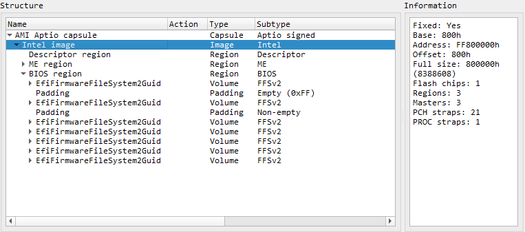
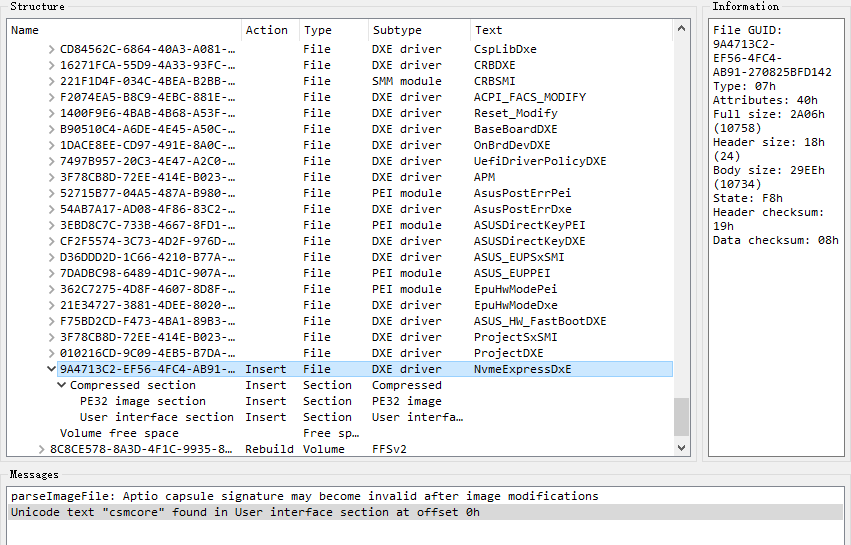
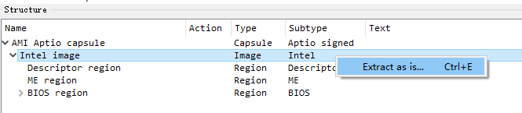

这有一张 M.2 接口的 NVM Express SSD（Non-Volatile Memory Express，这是一种用于固态存储设备的协议和接口标准，一般主板通过 M.2 接口走 PCIe 总线来进行连接） 需要插在旧主板 Asus Z87-A 上使用，但是这张主板并没有 M.2 接口，UEFI BIOS 也没有 NVME DXE 驱动，所以在开机引导的时候无法识别 NVME SSD。

让这张旧板使用 NVME SSD 跑系统的基本思路是，使用 M.2 转 PCIe 的转接卡来把硬盘接到主板上，然后将 NVMeExpressDxE 驱动刷进 Z87-A 最新的 UEFI BIOS 固件中，并更新主板的固件，使 BIOS 在选择引导设备的时候能够识别到 NVME SSD 设备。

## 编译 NVM Express UEFI DXE 驱动

NVM Express 驱动的官方目录在 [NVM Express Drivers](https://nvmexpress.org/drivers/)，源码位置在 [NvmExpressDxe](https://github.com/tianocore/edk2/tree/master/MdeModulePkg/Bus/Pci/NvmExpressDxe)，DXE 驱动使用一种叫 EBC（EFI Byte Code）的虚拟指令集，是跨平台的，可通过以下方式获得：

- 通过 [EDK II](https://github.com/tianocore/edk2) 来编译
- 直接下载 [NVMeExpressDxE.ffs](https://raw.githubusercontent.com/12CrazyPaul21/12CrazyPaul21.github.io/master/source/data/nvme/NVMeExpressDxE.ffs)，或压缩版  [NVMeExpressDxE_compressed.ffs](https://raw.githubusercontent.com/12CrazyPaul21/12CrazyPaul21.github.io/master/source/data/nvme/NVMeExpressDxE_compressed.ffs)
- 去其它存在 NVMeExpressDxE 驱动的主板固件中提取出来也可行

## 最新的 Z87-A UEFI BIOS 固件包

到 [Z87-A BIOS & 固件](https://www.asus.com.cn/supportonly/z87-a/helpdesk_bios/) 下载 `Z87-A BIOS 2103`，这是官方最新版本的 .cap 固件包（AMI Aptio Capsule），包名为 `Z87-A-ASUS-2103.CAP`

## 将 NVMeExpressDxE.ffs 模块插入到固件内

这里使用 UEFITool 来操作（[UEFITool 0.28.0](https://github.com/LongSoft/UEFITool/releases/tag/0.28.0)，注意带 NE 后缀的包不能修改该固件，0.28.0 已经是有修改能力的最新包了，具体可看该 [issue](https://github.com/LongSoft/UEFITool/issues/67)），不过这个工具在插入 ffs 的时候没有提供压缩功能，如果需要对模块进行压缩再插入的话可以使用 MMTool，或者直接使用压缩过的 ffs。

### 1. 使用 UEFITool 打开 cap 包

打开后可以看到 cap 包的结构，可看作两个部分，分别是 Capsule Header 与 Image。Header 部分包含了有关 Capsule（这里是 AMI Aptio 类型的 Capsule）文件的元数据（版本信息、签名以及大小等信息），这用于在更新固件时对 Capsule 文件进行验证（比如完整性和数字签名是否合法）以及提取固件体。Image 部分则是实际写入固件 Flash 芯片的固件体，后续我们把 NVMeExpressDxE.ffs 插入固件体后，需要把这部分给 dump 出来，原因之后说明。

从该固件体的结构可以看到，固件分成了三个 Region（UEFI 固件内存区域，可分为多个区域，比如这里的 Descriptor Region 包含了固件的元数据信息，ME Region 包含了 Intel ME 的固件，BIOS Region 则是实际的 UEFI BIOS 固件的区域），每个区域内可划分为一个或多个 FV（Firmware Volume，固件卷），通常会根据实际的分类与不同阶段的依赖，将文件放置在特定的卷中（比如 NVRAM Volume 包含了配置信息，DXE 驱动一般会集中放在一个或多个 FV 中，PEI Module 也类似），FV 内文件的组织方式是这样的，其内部有一个或多个 FFS Image（EFI Firmware File System，固件文件系统），FFS Image 包含一个或多个 EFI Section，而 EFI Section 内可以包含一个或多个文件（比如 PE32 Image、Raw File 等）

### 2. 定位 NVMeExpressDxE.ffs 插入位置

使用 UEFITool 搜索 CSMCORE（该 DXE 提供 Legacy BIOS 兼容模式，使 BIOS 可使用 MBR 方式引导系统）所在的 FV，因为该 FV 通常就是大多数 DXE 驱动集合的卷，之所以使用 CSMCORE 来定位，是因为通常都是这么做的，如果找不到 CSMCORE 的话，也可以搜索其它常见的 DXE 驱动，或者直接手动找 DXE 非常多的 FV。找到 DXE 集合的 FV 后，就可以在该 FV 的末尾将 NVMeExpressDxE.ffs 插入了。

这里是将压缩过的 NVMeExpressDxE_compressed.ffs 插入了固件中

### 3. 导出固件

先 `CTRL + S` 保存一遍副本为 `Z87-A-ASUS-2103-NVME.CAP`，然后再将固件主体导出去，后缀名选择 `.rom` 或者 `.bin` 都没问题。之所以要导出固件主体，而不是直接使用 .cap 固件包（AMI Aptio Capsule）进行升级，是因为 Capsule 文件是经过数字签名的，直接向里面加入新模块无法通过更新固件时的校验，所以需要通过烧录器，直接把固件体烧录进存储 UEFI BIOS 固件的芯片内。

## 将固件烧录进 Flash 芯片

Z87-A 存放 UEFI BIOS 固件的 Flash 芯片使用型号的是 WINBOND 25Q64FVAIQ（其中 25 指的是 SPI NOR Flash 系列，Q64 说明芯片容量是 64 Mbit，约 8 MB的大小，后面的字母集包括了时钟频率等信息），位置在 PCIEX16_2 接口的附近，是使用 DIP 封装的直插式芯片，可以拔出来。

该芯片可以使用 CH341A 编程器，来将之前导出的 ` .rom / .bin` 固件体烧录进去，注意将芯片插进去之前要注意芯片的方向以及引脚的位置必须与 CH341A 编程器设定的匹配，最好看下编程器的说明书，如果芯片发热，应该立马拔出来，否则可能导致芯片被烧掉，另外如果不想拔芯片的话，也可以使用烧录夹来接引脚。至于 CH341A 编程器的烧录软件可以在买的时候问店家要。

## 插入转接卡

我这里使用的是一张绿联的 M.2 NVMe 扩展卡，它是一张 PCIe 4.0 x16 类型的卡，Z87-A 主板的 PCIe 都是 3.0 的，不过由于 PCIe 是向下兼容的，所以也可以用，虽然不能发挥出这张卡跑 PCIe 4.0 的性能。将固态硬盘接上扩展卡后，插到主板 PCIe x16 的接口上。

## 引导 NVMe 驱动器

重启然后进入 BIOS 的 Advanced Mode，如果能在 `启动设备选择` 中看到 `PATA SS:` 之类的字眼就说明成功了，这时候可以按照一般的方式来使用该固态硬盘，将它用做系统盘。

那么 UEFI BIOS 是在什么时候识别出 NVME 设备并为其加载驱动的呢？简单说，UEFI BIOS 在 PEI 阶段（Pre EFI Initialization，EFI 前期初始化）进行早期初始化时，会对硬件进行基本的初始化与识别，并将这些信息存储到一张 HOB（Hand-Off Block）列表中传递给 DXE 阶段（Driver Execution Environment，执行驱动环境）使用，这些信息可能包括内存映射、PCI 设备等信息，DXE 阶段可以根据这些信息来加载适当的 DXE 驱动程序，可参考 [Communicate with DXE Modules](https://tianocore-docs.github.io/edk2-ModuleWriteGuide/draft/7_pre-efi_initialization_modules/76_communicate_with_dxe_modules.html)。