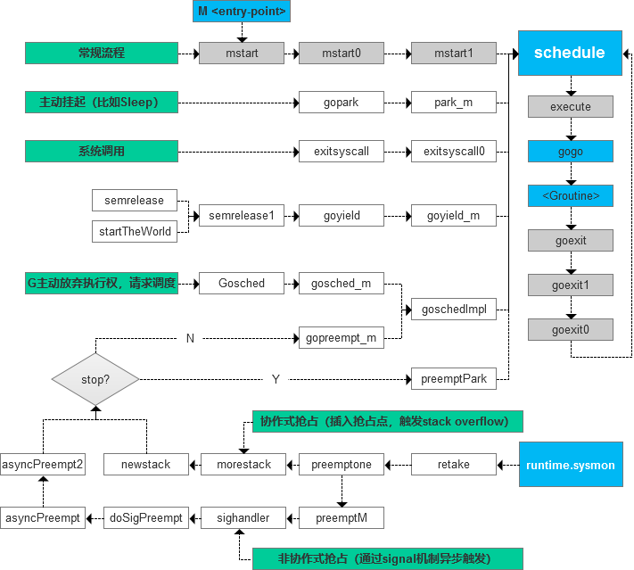

golang 提供轻量的**协作式与非协作式抢占调度**的用户级线程，也就是 golang coroutine（golang 协程），简称 **goroutine**，可以通过关键字 `go` 像下面这样很方便的启动 goroutine

```go
go func() {
	fmt.Println("im a coroutine")
}()
go worker()
```

## 内核级线程与用户级线程

在类 Unix 操作系统中，有一个叫**内核调度实体（KSE，Kernel Scheduling Entity）** 的概念，这是能被操作系统内核调度器进行调度的最小调度单元，也就是**内核级线程（KLT，Kernel Level Thread）** ，每个线程都有它自身的上下文（Context），操作系统的内核需要与硬件中断配合，在分配给线程的时间片到期后，由中断触发，在内核态中完成线程上下文的切换，从而实现多线程并发。

**用户级线程（ULT，User Level Thread）** 的管理全权由用户态的调度器完成，相比之下，更加轻量、上下文切换的成本更低，能更加灵活的分配和动态管理线程栈的大小，虽然用户级线程仍然需要内核级线程驱动，但是操作系统无法感知到用户态线程的存在。用户级线程要是实现抢占式调度的话，通常需要启动一个独立的内核级线程或者定时器来监控，这是因为用户级线程在用户态中，无法直接依赖中断切换上下文，当一个协程在运行时间超出被分到的时间片仍未结束或者主动让出执行权的时候，由监视器来辅助触发抢占，否则其它协程需要持续等待。

内核级线程多数操作需要从用户态进入内核态进行，完成之后再回到用户态，在创建、销毁、上下文切换和体积上，成本相对用户级线程都显得更高，要想创建巨量的工作线程，由于操作系统的限制，对于内核级线程来说，几乎是不可能的，而用户级线程则可以，而且在同等数量级别的情况下，给操作系统带来的负担比内核级线程要更轻，所以在有高并发需求的时候，用户级线程可能是更优的选择。

用户级线程在设计时与内核级线程的关系模型主要有下面三种：

- One to One（1:1）：一个用户级线程对应一个内核级线程
- Many to One（M:1）：多个用户级线程对应一个内核级线程
- Many to Many（M:N）：用户级线程与内核级线程多对多，这是一种兼顾上面两种模型优点的混合型模型，也是 goroutine 底层使用的模型

## GMP模型

> **文章使用的 golang 版本是：go version go1.20.10 linux/amd64**
>
> 可以用 `go env GOROOT` 确认源码位置
>
> 主要相关联的代码有：
> - src/runtime/proc.go
> - src/runtime/runtime2.go
> - src/runtime/os_linux.go
> - src/runtime/sys_linux_amd64.s
> - src/runtime/asm_amd64.s
>
> golang使用的是类 plan9 风格的汇编（assembly ）指令（https://go.dev/doc/asm）

### GMP

- **G**（**G**oroutine）：golang 的**用户级线程（协程）实体**
- **P**（**P**rocessor）：为调度器抽象出来的**逻辑处理器**
- **M**（**M**achine）：**关联着**一个真实的**操作系统线程**，也可以说关联着一个内核级线程或者说内核调度实体（KSE）

```go
file: src/runtime/proc.go

// Goroutine scheduler
// The scheduler's job is to distribute ready-to-run goroutines over worker threads.
//
// The main concepts are:
// G - goroutine.
// M - worker thread, or machine.
// P - processor, a resource that is required to execute Go code.
//     M must have an associated P to execute Go code, however it can be
//     blocked or in a syscall w/o an associated P.
```

#### G（Goroutine）

goroutine 是 golang **调度或执行的最小单元实体**，当一个 goroutine 运行结束，G 不会被直接销毁，而是进入到 `gFree pool` 中，等待被复用。除了通过 `go function()` 这种方法创建的常规 goroutine 之外，还有一些比较特殊的 G，比如与 M 相关联的 **G0** 和 **gsignal**，G0 后面会提到，而 gsignal 是每个 M 用于**处理信号**（signal）的 goroutine

##### G 实体

```go
file: src/runtime/runtime2.go

const (
    //
	// G status
    //

	_Gidle = iota // 0
	_Grunnable // 1
	_Grunning // 2
	_Gsyscall // 3
	_Gwaiting // 4
	_Gmoribund_unused // 5
	_Gdead // 6
	_Genqueue_unused // 7
	_Gcopystack // 8
	_Gpreempted // 9
	_Gscan          = 0x1000
	_Gscanrunnable  = _Gscan + _Grunnable  // 0x1001
	_Gscanrunning   = _Gscan + _Grunning   // 0x1002
	_Gscansyscall   = _Gscan + _Gsyscall   // 0x1003
	_Gscanwaiting   = _Gscan + _Gwaiting   // 0x1004
	_Gscanpreempted = _Gscan + _Gpreempted // 0x1009
)

// goroutine上下文
type gobuf struct {
	// The offsets of sp, pc, and g are known to (hard-coded in) libmach.
	//
	// ctxt is unusual with respect to GC: it may be a
	// heap-allocated funcval, so GC needs to track it, but it
	// needs to be set and cleared from assembly, where it's
	// difficult to have write barriers. However, ctxt is really a
	// saved, live register, and we only ever exchange it between
	// the real register and the gobuf. Hence, we treat it as a
	// root during stack scanning, which means assembly that saves
	// and restores it doesn't need write barriers. It's still
	// typed as a pointer so that any other writes from Go get
	// write barriers.
	sp   uintptr
	pc   uintptr
	g    guintptr
	ctxt unsafe.Pointer
	ret  uintptr
	lr   uintptr
	bp   uintptr // for framepointer-enabled architectures
}

// 仅列出部分成员
type g struct {
    // 栈信息
	stack       stack   // offset known to runtime/cgo
	stackguard0 uintptr // offset known to liblink
	stackguard1 uintptr // offset known to liblink
    // ...

    // 关联的M
	m         *m      // current m; offset known to arm liblink
    // 调度器相关的上下文，包括pc、sp寄存器等信息
    sched     gobuf
    // ...

    // goroutine 的入口参数
    param        unsafe.Pointer
    // goroutine 当前状态
    atomicstatus atomic.Uint32
    stackLock    uint32 // sigprof/scang lock; TODO: fold in to atomicstatus
    // goroutine id
	goid         uint64
    // ...

    // 抢占相关
	preempt       bool // preemption signal, duplicates stackguard0 = stackpreempt
	preemptStop   bool // transition to _Gpreempted on preemption; otherwise, just deschedule
	preemptShrink bool // shrink stack at synchronous safe point
    // ...
    
    // goroutine 入口地址，实际没啥用，实际调度使用的是sched中记录的pc
	startpc        uintptr         // pc of goroutine function
    // ...
}
```

##### G0

G0（零号 goroutine）是随着 M 一起创建的，每一个 M 都有这样一个相关联的 G0。G0 特殊的地方，这里主要提以下几点：

1. 常规的 G 是需要进入可运行队列（下面将提到的 LRQ 和 GRQ ）排队，而 G0 是不需要的，看到一些文章说 G0 也得进 LRQ，应该是错的，首先 G0 与 M 是绑定的，而且调度器就是在 G0 中跑的，根本没有必要，从代码上也没发现 G0 有进入队列中
2. G0 必定与一个 M 关联在一起，随着 M 一起创建和销毁
3. G0 一般都不需要指定 `startpc`，因为如果 M 是给一个不会关联 P 的独立线程用的话，直接指定 M 的入口就可以了，而如果 M 关联 P 执行调度的话，调度器逻辑就是在 G0 中跑的
4. 常规 G 使用的是用户栈（user stack），初始大小较小（一般为 2 KB）、可动态伸缩。而根据操作系统的类型，G0 使用的有可能是默认且固定大小的系统栈（system stack），不过 M0 的 G0 使用的必定是系统栈
5. 与常规 G 不一样，G0 的栈空间不会被 GC 处理
6. 执行中的 G0 不会被抢占，而常规 G 可能会

##### 创建 G

通过 `runtime.newproc` 可创建一个新的 goroutine，`newproc` 接受一个 goroutine 入口地址，像 `go function()` 这样启动一个新的 goroutine的话，编译器会自动生成类似下面的汇编指令，插入到执行 `go function()` 的地方。需要注意的是，`newproc` 会设定 goroutine 的返回位置为 `goexit`，具体怎么做的可以看 `newproc1` 的实现。

```assembly
lea rax, ptr [rip+0x21c2c]
call $runtime.newproc
```

> **note:** 对于 golang 主线程（M0）的 G0，以及运行时初始化时为 runtime.main 创建的 goroutine（这是除 M0-G0 之外的第一个 goroutine），并非通过 `go function()` 这种方式创建，它们两个的创建方法也不一样，在文章的后续会重新提到

```go
file: src/runtime/proc.go

// Create a new g running fn.
// Put it on the queue of g's waiting to run.
// The compiler turns a go statement into a call to this.
func newproc(fn *funcval) {
	gp := getg()
	pc := getcallerpc()
	systemstack(func() {
		newg := newproc1(fn, gp, pc)

		pp := getg().m.p.ptr()

        // 插入到可运行队列中，具体逻辑后面讨论
		runqput(pp, newg, true)

		if mainStarted {
			wakep()
		}
	})
}

// Create a new g in state _Grunnable, starting at fn. callerpc is the
// address of the go statement that created this. The caller is responsible
// for adding the new g to the scheduler.
func newproc1(fn *funcval, callergp *g, callerpc uintptr) *g {
	if fn == nil {
		fatal("go of nil func value")
	}
	mp := acquirem() // disable preemption because we hold M and P in local vars.
	pp := mp.p.ptr()
	newg := gfget(pp)
	if newg == nil {
        // 实例化G实体并分配栈
        // _StackMin = 2KB
		newg = malg(_StackMin)
		casgstatus(newg, _Gidle, _Gdead)
		allgadd(newg) // publishes with a g->status of Gdead so GC scanner doesn't look at uninitialized stack.
	}
	// ...

	totalSize := uintptr(4*goarch.PtrSize + sys.MinFrameSize) // extra space in case of reads slightly beyond frame
	totalSize = alignUp(totalSize, sys.StackAlign)
	sp := newg.stack.hi - totalSize
	spArg := sp
	if usesLR {
		// caller's LR
		*(*uintptr)(unsafe.Pointer(sp)) = 0
		prepGoExitFrame(sp)
		spArg += sys.MinFrameSize
	}

	memclrNoHeapPointers(unsafe.Pointer(&newg.sched), unsafe.Sizeof(newg.sched))
	newg.sched.sp = sp
	newg.stktopsp = sp

    // 这里设定新goroutine执行完毕返回的点是goexit
	newg.sched.pc = abi.FuncPCABI0(goexit) + sys.PCQuantum // +PCQuantum so that previous instruction is in same function
	newg.sched.g = guintptr(unsafe.Pointer(newg))
    // 将goroutine入口地址更新到进newg.sched中
    // 实际调度使用的就是g.sched.pc
	gostartcallfn(&newg.sched, fn)
	newg.gopc = callerpc
	newg.ancestors = saveAncestors(callergp)
    // 记录goroutine的入口地址，仅用于记录
	newg.startpc = fn.fn
	// ...

	return newg
}
```

```go
file: src/runtime/stack.go

// adjust Gobuf as if it executed a call to fn
// and then stopped before the first instruction in fn.
func gostartcallfn(gobuf *gobuf, fv *funcval) {
	var fn unsafe.Pointer
	if fv != nil {
		fn = unsafe.Pointer(fv.fn)
	} else {
		fn = unsafe.Pointer(abi.FuncPCABIInternal(nilfunc))
	}
	gostartcall(gobuf, fn, unsafe.Pointer(fv))
}
```

```go
file: src/runtime/sys_x86.go

// adjust Gobuf as if it executed a call to fn with context ctxt
// and then stopped before the first instruction in fn.
func gostartcall(buf *gobuf, fn, ctxt unsafe.Pointer) {
	sp := buf.sp
    
    // 需要特别注意的是
    // 这里将buf先前记录的pc指针放进了栈
    // 当新pc指向的函数执行完毕，返回的就是先前记录的pc
    // 对于newproc而言，这个返回点就是goexit
	sp -= goarch.PtrSize
	*(*uintptr)(unsafe.Pointer(sp)) = buf.pc

    buf.sp = sp
    
    // 登记入口函数地址
	buf.pc = uintptr(fn)
	buf.ctxt = ctxt
}
```

##### G 的栈空间

每个存活的（non-dead）G 都关联着一个栈，golang 有两种类型的栈空间，分别是：

- **系统栈（system stack）**：随着系统线程的创建，由系统分配，大小是所处系统环境的默认值大小，运行中大小固定，不能伸缩，正在使用系统栈的 G 不能被抢占，也不会被 GC 扫描。M0 的 G0，使用的必定是这种类型的栈，其它 M 的 G0，会根据操作系统的类型决定是否使用系统栈，不过即使使用空间池分配的栈空间，G0 的栈都具有相似的属性，即不能被抢占，也不会被 GC 回收
- **信号栈（signal stack）**：这种栈是用于 gsignal 的，类似系统栈，空间也不能够增长
- **用户栈（user stack）**：这是从 golang 运行时维护在**堆（heap）** 上的**空间池（stackpool）** ，分配给 G 的栈空间，初始大小比较小（一般为 2 KB），可动态伸缩，GC 会扫描用户栈中的对象，常规 G 使用的都是用户栈。在执行用户栈空间分配的时候，**需要先进入系统栈（systemstack） 环境中**，这主要是为了使分配过程不被抢占、避免所处栈空间扩张

###### 栈动态伸缩机制

早期运行时使用的控制栈**扩容（more stack）** 和**缩容（shrink stack）** 的方法是**分段栈机制（segmented stacks）**，即扩张操作是创建一个新的栈空间，彼此链接但不连续，这个过程称为**栈分裂（stack split）**，这种机制存在**热分裂问题（hot split problem）**，频繁分裂与收缩的额外开销对性能产生影响，于是在目前运行时采用的伸缩机制是**连续栈机制（continuous stacks）**，扩张操作并非执行栈分裂，而是**栈拷贝（stack copying）**，即创建一个两倍于原本栈空间大小的新栈，然后将旧栈的内容拷贝到新栈中，所有栈中的指针会被运行时更新。

> 栈分裂存在的热分裂问题（hot split problem）：假设当前栈即将用满，那么调用一个会执行扩容检查的函数时，会执行栈分裂从而对栈进行扩容，该函数返回时又会执行缩容，这种情况下，如果需要在一个循环中多次调用这个函数的话，就会导致频繁的分裂与缩容

分段栈与连续栈的区别除了上面提到的扩张操作不同外，缩容上也不同，分段栈缩容会释放分裂时分配的新空间，而连续栈则不会。

它们的共同点是，执行扩展操作的检查都是由编译器插入的，对于没有插入 `go:nosplit` 指示器的函数，编译器可能会给函数入口插入检查栈溢出可能的代码，如果需要扩容就会调用 `morestack`。

###### M0 的 G0

M0-G0 的栈信息在程序启动的初期就配置好了，这是操作系统给主线程分配的系统栈

```assembly
file: src/runtime/asm_amd64.s

TEXT runtime·rt0_go(SB),NOSPLIT|TOPFRAME,$0
	// copy arguments forward on an even stack
	MOVQ	DI, AX		// argc
	MOVQ	SI, BX		// argv
	SUBQ	$(5*8), SP		// 3args 2auto
	ANDQ	$~15, SP
	MOVQ	AX, 24(SP)
	MOVQ	BX, 32(SP)

	// 登记M0-G0的栈信息
	// create istack out of the given (operating system) stack.
	// _cgo_init may update stackguard.
	MOVQ	$runtime·g0(SB), DI
	LEAQ	(-64*1024+104)(SP), BX
	MOVQ	BX, g_stackguard0(DI)
	MOVQ	BX, g_stackguard1(DI)
	MOVQ	BX, (g_stack+stack_lo)(DI)
	MOVQ	SP, (g_stack+stack_hi)(DI)
	// ...
```

###### 其它 M 的 G0

在实例化 G0 的时候，用 `mStackIsSystemAllocated` 来判断是否由系统来分配栈空间。

从下面代码可以看出，对于 Windows、Darwin 等系统，返回的是 true，也就是让操作系统来分配线程的栈空间。而Linux 环境返回的是 false，也就是说，在 Linux 环境创建一个新的 M 时，其内核线程的栈并不是系统分配的，这是因为 golang 在 Linux 环境创建线程的方法是调用 **56 号系统调用**（syscall），即 `sys_clone`，用这种方法创建新线程的话，需要手动管理线程的栈空间，golang 运行时会使用与用户栈一样的分配方式来管理，不过同样将其看作是一个系统栈（system stack）。

G0 的实例化与栈分配在 `malg` 中，具体的实现跟文章的下一节一起看

```go
file: src/runtime/proc.go

func newm(fn func(), pp *p, id int64) {
    // ...
	mp := allocm(pp, fn, id)
	// ...
}

// 对于非M0的G0，linux环境并非是使用系统分配的栈
// mStackIsSystemAllocated indicates whether this runtime starts on a
// system-allocated stack.
func mStackIsSystemAllocated() bool {
	switch GOOS {
	case "aix", "darwin", "plan9", "illumos", "ios", "solaris", "windows":
		return true
	case "openbsd":
		switch GOARCH {
		case "386", "amd64", "arm", "arm64":
			return true
		}
	}
	return false
}

func allocm(pp *p, fn func(), id int64) *m {
    // ...

    // 调用malg实例化一个G
	// In case of cgo or Solaris or illumos or Darwin, pthread_create will make us a stack.
	// Windows and Plan 9 will layout sched stack on OS stack.
	if iscgo || mStackIsSystemAllocated() {
        // 使用系统分配的栈（系统栈）
		mp.g0 = malg(-1)
	} else {
        // 非系统分配，与常规用户栈同样的分配方式
        // Linux环境分配8KB
		mp.g0 = malg(8192 * sys.StackGuardMultiplier)
	}
	// ...
}
```

###### 常规 G

创建常规 G 时会先调用 `gfget` 尝试从全局的 G 空闲列表中获取一个，如果有的话，由于该 G 在之前已经初始化过，栈空间已经分配好了，所以不需要重复分配。但是如果没有空闲 G 的话，就会跟 G0 一样通过 `malg` 创建一个，传入的 `stacksize` 是 `_StackMin`，顾名思义，初始的用户栈是 golang 中最小的栈空间，`_StackMin` 定义为 `2048 KB`，在程序运行的过程中，G 的用户栈大小可能会动态伸缩

```go
file: src/runtime/proc.go

func newproc(fn *funcval) {
	gp := getg()
	pc := getcallerpc()
	systemstack(func() {
		newg := newproc1(fn, gp, pc)
		// ...
	})
}

func newproc1(fn *funcval, callergp *g, callerpc uintptr) *g {
	// ...

    // 先尝试从空闲列表获取
	newg := gfget(pp)
	if newg == nil {
        // 创建一个用户栈大小为_StackMin的G
		newg = malg(_StackMin)
		casgstatus(newg, _Gidle, _Gdead)
		allgadd(newg) // publishes with a g->status of Gdead so GC scanner doesn't look at uninitialized stack.
	}
    
    // ...
}
```

`malg` 的实现很简单，首先实例化一个 `g` 实体，然后如果 `stacksize` 大于等于 0 的话，就需要 runtime 调用 `stackalloc` 为其分配用户栈空间。`stackalloc` 调用前需要先进入到 `systemstack` 环境中，避免分配过程被抢占和避免所处栈空间扩张

```go
file: src/runtime/proc.go

// Allocate a new g, with a stack big enough for stacksize bytes.
func malg(stacksize int32) *g {
	newg := new(g)
	if stacksize >= 0 {
		stacksize = round2(_StackSystem + stacksize)
		systemstack(func() {
			newg.stack = stackalloc(uint32(stacksize))
		})
		newg.stackguard0 = newg.stack.lo + _StackGuard
		newg.stackguard1 = ^uintptr(0)
		// Clear the bottom word of the stack. We record g
		// there on gsignal stack during VDSO on ARM and ARM64.
		*(*uintptr)(unsafe.Pointer(newg.stack.lo)) = 0
	}
	return newg
}
```

对于 `stackalloc` 的实现以及栈的其它管理操作，比如扩容（more stack）、缩容（shrink stack），不是文章的重点，所以不深究，留意 `stackalloc` 的以下几点就行了：

- 该方法使用了 `go:systemstack` 标记，即调用必须在系统栈中
- 不能在常规 G 中调用，必须是 G0
- 栈大小必须是 2 的 N 次方
- 对于容量较小的空间，先尝试使用关联 G 的 P 的 `mcache` 栈缓存池进行分配，空间不足则从全局池中分配，对于 P0，直接使用全局的 `stackpool` 池进行分配
- 大空间使用 `stackLarge` 池分配，空间不足则直接从系统堆中分配

```go
file: src/runtime/stack.go

// stackalloc allocates an n byte stack.
//
// stackalloc must run on the system stack because it uses per-P
// resources and must not split the stack.
//
//go:systemstack
func stackalloc(n uint32) stack {
	// Stackalloc must be called on scheduler stack, so that we
	// never try to grow the stack during the code that stackalloc runs.
	// Doing so would cause a deadlock (issue 1547).
	thisg := getg()
	if thisg != thisg.m.g0 {
		throw("stackalloc not on scheduler stack")
	}
	if n&(n-1) != 0 {
		throw("stack size not a power of 2")
	}
	if stackDebug >= 1 {
		print("stackalloc ", n, "\n")
	}

    // 判断是否使用系统调用分配代替在堆（heap）中分配
	if debug.efence != 0 || stackFromSystem != 0 {
		n = uint32(alignUp(uintptr(n), physPageSize))
		v := sysAlloc(uintptr(n), &memstats.stacks_sys)
		if v == nil {
			throw("out of memory (stackalloc)")
		}
		return stack{uintptr(v), uintptr(v) + uintptr(n)}
	}

	// Small stacks are allocated with a fixed-size free-list allocator.
	// If we need a stack of a bigger size, we fall back on allocating
	// a dedicated span.
	var v unsafe.Pointer
	if n < _FixedStack<<_NumStackOrders && n < _StackCacheSize {
		order := uint8(0)
		n2 := n
		for n2 > _FixedStack {
			order++
			n2 >>= 1
		}
		var x gclinkptr
		if stackNoCache != 0 || thisg.m.p == 0 || thisg.m.preemptoff != "" {
            // 对于P0直接使用stackpool
			// thisg.m.p == 0 can happen in the guts of exitsyscall
			// or procresize. Just get a stack from the global pool.
			// Also don't touch stackcache during gc
			// as it's flushed concurrently.
			lock(&stackpool[order].item.mu)
			x = stackpoolalloc(order)
			unlock(&stackpool[order].item.mu)
		} else {
			c := thisg.m.p.ptr().mcache
			x = c.stackcache[order].list
			if x.ptr() == nil {
				stackcacherefill(c, order)
				x = c.stackcache[order].list
			}
			c.stackcache[order].list = x.ptr().next
			c.stackcache[order].size -= uintptr(n)
		}
		v = unsafe.Pointer(x)
	} else {
		var s *mspan
		npage := uintptr(n) >> _PageShift
		log2npage := stacklog2(npage)

		// Try to get a stack from the large stack cache.
		lock(&stackLarge.lock)
		if !stackLarge.free[log2npage].isEmpty() {
			s = stackLarge.free[log2npage].first
			stackLarge.free[log2npage].remove(s)
		}
		unlock(&stackLarge.lock)

		lockWithRankMayAcquire(&mheap_.lock, lockRankMheap)

		if s == nil {
			// Allocate a new stack from the heap.
			s = mheap_.allocManual(npage, spanAllocStack)
			if s == nil {
				throw("out of memory")
			}
			osStackAlloc(s)
			s.elemsize = uintptr(n)
		}
		v = unsafe.Pointer(s.base())
	}
	// ...

	return stack{uintptr(v), uintptr(v) + uintptr(n)}
}
```

##### 执行 G

被调度器调度的 G，会通过 `gogo(&gp.sched)` 执行（`schedule` -> `execute` -> `gogo`），其中 `gp.sched` 是 G 当前的上下文，类型为 `gobuf`，包含了该 goroutine 当前运行位置的 pc 指针、sp 指针等信息。`gogo` 的实现也不是 golang 代码，它在 `src/runtime/stubs.go` 中打了个 stub，实际的代码是处理器架构相关的汇编指令

```go
file: src/runtime/stubs.go

func gogo(buf *gobuf)
```

```assembly
file: src/runtime/asm_amd64.s

#include "go_asm.h"
#include "go_tls.h"

/*
 *  go-routine
 */

// func gogo(buf *gobuf)
// restore state from Gobuf; longjmp
TEXT runtime·gogo(SB), NOSPLIT, $0-8
	MOVQ	buf+0(FP), BX		// gobuf
	MOVQ	gobuf_g(BX), DX
	MOVQ	0(DX), CX		// make sure g != nil
	JMP	gogo<>(SB)

TEXT gogo<>(SB), NOSPLIT, $0
	get_tls(CX)
	MOVQ	DX, g(CX)
	MOVQ	DX, R14		// set the g register
	MOVQ	gobuf_sp(BX), SP	// restore SP
	MOVQ	gobuf_ret(BX), AX
	MOVQ	gobuf_ctxt(BX), DX
	MOVQ	gobuf_bp(BX), BP
	MOVQ	$0, gobuf_sp(BX)	// clear to help garbage collector
	MOVQ	$0, gobuf_ret(BX)
	MOVQ	$0, gobuf_ctxt(BX)
	MOVQ	$0, gobuf_bp(BX)
	MOVQ	gobuf_pc(BX), BX
	JMP	BX
```

##### 常规 G 的返回点

常规的 G 执行完毕的返回点就是 `runtime.goexit`，实现返回到这个位置的基本思路是这样的（上面列出的 `gostartcall` 里面也提到过）：用 `jmp` 指令模仿 `call` 指令的实现，因为 `call` 在跳转到目标地址之前，会把 `call` 的下一条指令的地址压入栈，那么可以先把 `goexit` 的地址先压入栈中，然后再用 `jmp` 来直接跳转。`goexit0` 会将执行结束的 G 放入空闲列表中，然后开始下一轮的 `schedule`。

```assembly
file: src/runtime/asm_amd64.s

// The top-most function running on a goroutine
// returns to goexit+PCQuantum.
TEXT runtime·goexit(SB),NOSPLIT|TOPFRAME,$0-0
	BYTE	$0x90	// NOP
	CALL	runtime·goexit1(SB)	// does not return
	// traceback from goexit1 must hit code range of goexit
	BYTE	$0x90	// NOP
```

```go
file: src/runtime/proc.go

// Finishes execution of the current goroutine.
func goexit1() {
	if raceenabled {
		racegoend()
	}
	if trace.enabled {
		traceGoEnd()
	}
	mcall(goexit0)
}

// goexit continuation on g0.
func goexit0(gp *g) {
	mp := getg().m
	pp := mp.p.ptr()

	casgstatus(gp, _Grunning, _Gdead)
	gcController.addScannableStack(pp, -int64(gp.stack.hi-gp.stack.lo))
	if isSystemGoroutine(gp, false) {
		sched.ngsys.Add(-1)
	}
	gp.m = nil
	locked := gp.lockedm != 0
	gp.lockedm = 0
	mp.lockedg = 0
	gp.preemptStop = false
	gp.paniconfault = false
	gp._defer = nil // should be true already but just in case.
	gp._panic = nil // non-nil for Goexit during panic. points at stack-allocated data.
	gp.writebuf = nil
	gp.waitreason = waitReasonZero
	gp.param = nil
	gp.labels = nil
	gp.timer = nil

	if gcBlackenEnabled != 0 && gp.gcAssistBytes > 0 {
		// Flush assist credit to the global pool. This gives
		// better information to pacing if the application is
		// rapidly creating an exiting goroutines.
		assistWorkPerByte := gcController.assistWorkPerByte.Load()
		scanCredit := int64(assistWorkPerByte * float64(gp.gcAssistBytes))
		gcController.bgScanCredit.Add(scanCredit)
		gp.gcAssistBytes = 0
	}

	dropg()

	if GOARCH == "wasm" { // no threads yet on wasm
		gfput(pp, gp)
		schedule() // never returns
	}

	if mp.lockedInt != 0 {
		print("invalid m->lockedInt = ", mp.lockedInt, "\n")
		throw("internal lockOSThread error")
	}
	gfput(pp, gp)
	if locked {
		// The goroutine may have locked this thread because
		// it put it in an unusual kernel state. Kill it
		// rather than returning it to the thread pool.

		// Return to mstart, which will release the P and exit
		// the thread.
		if GOOS != "plan9" { // See golang.org/issue/22227.
			gogo(&mp.g0.sched)
		} else {
			// Clear lockedExt on plan9 since we may end up re-using
			// this thread.
			mp.lockedExt = 0
		}
	}
    
    // 进入下一轮调度
	schedule()
}
```

##### 获取当前 G

在 runtime 中，可通过 `getg` 获取当前 M 的 G，这个函数的代码实现并不在 runtime 中，只是在 runtime 中打了一个 stub，实际的实现是由 golang 的编译器完成的，这是通过 TLS 存储的

```go
file: src/runtime/stubs.go

// getg returns the pointer to the current g.
// The compiler rewrites calls to this function into instructions
// that fetch the g directly (from TLS or from the dedicated register).
func getg() *g
```

```go
file: src/cmd/compile/internal/amd64/ssa.go

func getgFromTLS(s *ssagen.State, r int16) {
	// See the comments in cmd/internal/obj/x86/obj6.go
	// near CanUse1InsnTLS for a detailed explanation of these instructions.
	if x86.CanUse1InsnTLS(base.Ctxt) {
		// MOVQ (TLS), r
		// ...
	} else {
		// MOVQ TLS, r
		// MOVQ (r)(TLS*1), r
		// ...
	}
}

func ssaGenValue(s *ssagen.State, v *ssa.Value) {
    switch v.Op {
        // ...
	case ssa.OpAMD64LoweredGetG:
		// ...
        r := v.Reg()
		getgFromTLS(s, r)
	case ssa.OpAMD64CALLstatic, ssa.OpAMD64CALLtail:
		// ...
		getgFromTLS(s, x86.REG_R14)
        // ...
    }
}
```

#### P（Processor）

P 通过一个 **LRQ（本地可运行队列）** 维护着一组**就绪中的常规 G**，尽管说 P 是为调度器抽象出来的**逻辑处理器**，但 P 其实并不具备真正执行调度和驱动 G 的能力，它必须 attach 到一个 M 上，实际上就是在 M 的 G0 上完成调度和驱动常规 G 的，而 P 在调度这件事上更多的是为 M 的提供调度相关的信息。

golang 程序中 P 的最大数目默认与 CPU 核心数相同，也可以通过 `runtime.GOMAXPROCS` 或者 `GOMAXPROCS` 环境变量来修改，P 的数量相当于对 golang 程序的并发或并行能力做了限定。

##### P 实体

```go
file: src/runtime/runtime2.go

const (
    //
	// P status
    //

	_Pidle = iota
	_Prunning
	_Psyscall
	_Pgcstop
	_Pdead
)

type p struct {
	id          int32
	status      uint32 // one of pidle/prunning/...
    // ...

    // 每次调度累积
    schedtick   uint32     // incremented on every scheduler call
    // 每次syscall累积
	syscalltick uint32     // incremented on every system call
    // 上次sysmon检查时候的tick信息
	sysmontick  sysmontick // last tick observed by sysmon
    // 关联的M
	m           muintptr   // back-link to associated m (nil if idle)
    // 每个P独立的线程栈缓存池
	mcache      *mcache
	// ...

    // LRQ 队列，为一个数组，数量上限为256
	// Queue of runnable goroutines. Accessed without lock.
	runqhead uint32
	runqtail uint32
	runq     [256]guintptr
	runnext guintptr
	// ...

    // 指示是否应该抢占，尽快进入到调度器中，不管是否有G还在运行当中
	// preempt is set to indicate that this P should be enter the
	// scheduler ASAP (regardless of what G is running on it).
	preempt bool
	// ...
}
```

```go
file: src/runtime/proc.go

type sysmontick struct {
	schedtick   uint32
	schedwhen   int64
	syscalltick uint32
	syscallwhen int64
}
```

##### 创建 P

在 processros 数目发生变化的时候，`runtime.procresize` 会被调用，它负责刷新 P，这个时机有两个：一是 runtime 初始化调度器的时候（调用 `runtime.schedinit`，这发生在进入 M0 之前），二是通过 `runtime.GOMAXPROCS` 或者 `GOMAXPROCS` 环境变量来修改的时候。需要注意的是，创建 P 的时候，不一定立马为其创建并关联 M。

```go
file: src/runtime/proc.go

var (
	// ..
    // 与关联P0的mcache
	mcache0      *mcache
	// ...
)

// init initializes pp, which may be a freshly allocated p or a
// previously destroyed p, and transitions it to status _Pgcstop.
func (pp *p) init(id int32) {
	pp.id = id
	pp.status = _Pgcstop
	pp.sudogcache = pp.sudogbuf[:0]
	pp.deferpool = pp.deferpoolbuf[:0]
	pp.wbBuf.reset()
	if pp.mcache == nil {
		if id == 0 {
			if mcache0 == nil {
				throw("missing mcache?")
			}
            // P0的mcache是一个全局变量
			// Use the bootstrap mcache0. Only one P will get
			// mcache0: the one with ID 0.
			pp.mcache = mcache0
		} else {
			pp.mcache = allocmcache()
		}
	}
	// ...
}

// destroy releases all of the resources associated with pp and
// transitions it to status _Pdead.
//
// sched.lock must be held and the world must be stopped.
func (pp *p) destroy() {
	// ...
}

// Change number of processors.
//
// sched.lock must be held, and the world must be stopped.
//
// gcworkbufs must not be being modified by either the GC or the write barrier
// code, so the GC must not be running if the number of Ps actually changes.
//
// Returns list of Ps with local work, they need to be scheduled by the caller.
func procresize(nprocs int32) *p {
	//...

    // 更新runtime.allp
	// Grow allp if necessary.
	if nprocs > int32(len(allp)) {
		// Synchronize with retake, which could be running
		// concurrently since it doesn't run on a P.
		lock(&allpLock)
		if nprocs <= int32(cap(allp)) {
			allp = allp[:nprocs]
		} else {
			nallp := make([]*p, nprocs)
			// Copy everything up to allp's cap so we
			// never lose old allocated Ps.
			copy(nallp, allp[:cap(allp)])
			allp = nallp
		}

		if maskWords <= int32(cap(idlepMask)) {
			idlepMask = idlepMask[:maskWords]
			timerpMask = timerpMask[:maskWords]
		} else {
			nidlepMask := make([]uint32, maskWords)
			// No need to copy beyond len, old Ps are irrelevant.
			copy(nidlepMask, idlepMask)
			idlepMask = nidlepMask

			ntimerpMask := make([]uint32, maskWords)
			copy(ntimerpMask, timerpMask)
			timerpMask = ntimerpMask
		}
		unlock(&allpLock)
	}
    
	// initialize new P's
	for i := old; i < nprocs; i++ {
		pp := allp[i]
		if pp == nil {
			pp = new(p)
		}
		pp.init(i)
		atomicstorep(unsafe.Pointer(&allp[i]), unsafe.Pointer(pp))
	}

	// ...
}
```

#### M（Machine）

M 关联着系统线程，它的运行可以说是由操作系统调度的，每个 M 都必定与一个操作系统线程和一个 G0 相关，从创建直到摧毁，它们的关联是不变的。如果一个 M 关联了一个 P，可将它看作是整个 golang 程序中的一个子调度器，这个子调度器为 P 执行实际的调度逻辑，给 LRQ 队列中所有 G 进行调度和驱动，可以将 M 理解为对一台拥有处理器的计算机的抽象。

> 运行中的 golang 程序，M 的数量通常都不会少于 P，除了关联着 P 的 M 外，还有一些辅助或待机用的 M。比如一个`runtime.gomaxprocs` 设定为 4 的 golang 程序，起码都有 5 个 M，其中 4 个会与 P 相关联，用于调度，第 5 个则是 sysmon 的 M，这个 M 不会关联 P。

##### M 实体

```go
file: src/runtime/runtime2.go

type m struct {
	g0      *g     // goroutine with scheduling stack
	// ...

	// Fields not known to debuggers.
	procid        uint64            // for debuggers, but offset not hard-coded
    // ...

	mstartfn      func()
	curg          *g       // current running goroutine
	caughtsig     guintptr // goroutine running during fatal signal
	p             puintptr // attached p for executing go code (nil if not executing go code)
	nextp         puintptr
	oldp          puintptr // the p that was attached before executing a syscall
	id            int64
	// ...

	alllink       *m // on allm
	// ...
}
```

##### 创建 M

在 runtime 中，通过 `runtime.newm` 创建 M，`newm` 会实例化一个 M 和 G0 实体，还会启动一个系统线程。函数签名是 `func newm(fn func(), pp *p, id int64)`，如果 `pp` 参数不为 `nil` 的话，那么新建的 M 会与这个 P 进行关联，为它执行调度，这样的 M 可看作是一个**调度器**。如果 `pp` 为 `nil`，`fn` 不为 `nil` 的话，M 可以认为就是一个普通的系统线程，用来执行一些特定的任务，比如 runtime 的监视器 `sysmon`，它通过 `newm(sysmon, nil, -1)` 启动了一个线程来对 runtime 进行监视。另外，golang 程序的 M0（"主线程"）比较特殊，它不是通过 `newm` 创建的，这个在文章后面会提到。

```go
file: src/runtime/proc.go

func newm(fn func(), pp *p, id int64) {
    // ...

	mp := allocm(pp, fn, id)
	mp.nextp.set(pp)
	// ...

	newm1(mp)
    // ...
}

func allocm(pp *p, fn func(), id int64) *m {
    // ...

	mp := new(m)
    // m启动入口
	mp.mstartfn = fn
    
    // 为m分配id并将mp登记到runtime.allm中、初始化gsingal等
    // gsignal也是一个goroutine，也有自己的栈
	mcommoninit(mp, id)

    // 创建g0
	// In case of cgo or Solaris or illumos or Darwin, pthread_create will make us a stack.
	// Windows and Plan 9 will layout sched stack on OS stack.
	if iscgo || mStackIsSystemAllocated() {
		mp.g0 = malg(-1)
	} else {
		mp.g0 = malg(8192 * sys.StackGuardMultiplier)
	}
	mp.g0.m = mp
    // ...

	return mp
}

func newm1(mp *m) {
	// ...
	execLock.rlock() // Prevent process clone.
    // newosproc与操作系统原生调用相关，创建一个系统线程
	newosproc(mp)
	execLock.runlock()
}
```

newosproc不同操作系统有不同实现，但线程的入口点都是`runtime.mstart` ，以下是 Linux 的实现，使用 56 号系统调用（sys_clone）来创建实际的内核级线程，这个调用需要传入手动管理的栈帧

```go
file: src/runtime/os_linux.go

const (
    cloneFlags = _CLONE_VM | /* share memory */
        _CLONE_FS | /* share cwd, etc */
        _CLONE_FILES | /* share fd table */
        _CLONE_SIGHAND | /* share sig handler table */
        _CLONE_SYSVSEM | /* share SysV semaphore undo lists (see issue #20763) */
        _CLONE_THREAD /* revisit - okay for now */
)

func newosproc(mp *m) {
    // 获取栈顶
	stk := unsafe.Pointer(mp.g0.stack.hi)
	// ...

    // 线程入口点: mstart
	// Disable signals during clone, so that the new thread starts
	// with signals disabled. It will enable them in minit.
	var oset sigset
	sigprocmask(_SIG_SETMASK, &sigset_all, &oset)
	ret := retryOnEAGAIN(func() int32 {
        // 执行56号syscall(系统调用)创建线程，即sys_clone
		r := clone(cloneFlags, stk, unsafe.Pointer(mp), unsafe.Pointer(mp.g0), unsafe.Pointer(abi.FuncPCABI0(mstart)))
		if r >= 0 {
			return 0
		}
		return -r
	})
	sigprocmask(_SIG_SETMASK, &oset, nil)
    // ...
}
```

##### M 的入口点

`runtime.mstart` 是 M 关联的内核线程的入口点（对于 M0 也一样），`mstart` 使用汇编写的，与处理器架构相关，在 `src/runtime/proc.go` 中的声明只是一个 stub，不过最后它都会调用 `runtime.mstart0`，所以这里不关心 `mstart` 的实现，因为基本都是直接转到 `mstart0` 的。在 `mstart1` 中，如果 M 的 `mstartfn` 非nil，那么 `mstartfn` 会先被调用（有的特殊用途的 M 进入到 `mstartfn` 之后不会返回，而是一直执行），否则直接进入到 `schedule` 执行调度逻辑

```go
file: src/runtime/proc.go

// mstart0 is the Go entry-point for new Ms.
// This must not split the stack because we may not even have stack
// bounds set up yet.
//
// May run during STW (because it doesn't have a P yet), so write
// barriers are not allowed.
//
//go:nosplit
//go:nowritebarrierrec
func mstart0() {
    // note: 去掉了部分注释
    
	gp := getg()

	osStack := gp.stack.lo == 0
	if osStack {
		size := gp.stack.hi
		if size == 0 {
			size = 8192 * sys.StackGuardMultiplier
		}
		gp.stack.hi = uintptr(noescape(unsafe.Pointer(&size)))
		gp.stack.lo = gp.stack.hi - size + 1024
	}
	// Initialize stack guard so that we can start calling regular Go code.
	gp.stackguard0 = gp.stack.lo + _StackGuard
    // This is the g0, so we can also call go:systemstack
	// functions, which check stackguard1.
	gp.stackguard1 = gp.stackguard0

	mstart1()

	// Exit this thread.
	if mStackIsSystemAllocated() {
		osStack = true
	}
	mexit(osStack)
}

// The go:noinline is to guarantee the getcallerpc/getcallersp below are safe,
// so that we can set up g0.sched to return to the call of mstart1 above.
//
//go:noinline
func mstart1() {
	gp := getg()

	if gp != gp.m.g0 {
		throw("bad runtime·mstart")
	}

    // Set up m.g0.sched as a label returning to just
	// after the mstart1 call in mstart0 above, for use by goexit0 and mcall.
	// We're never coming back to mstart1 after we call schedule,
	// so other calls can reuse the current frame.
	// And goexit0 does a gogo that needs to return from mstart1
	// and let mstart0 exit the thread.
	gp.sched.g = guintptr(unsafe.Pointer(gp))
	gp.sched.pc = getcallerpc()
	gp.sched.sp = getcallersp()

	asminit()
    
    // 初始化signal、登记tid
	minit()

    // 安装signal handler，只为M0安装
	// Install signal handlers; after minit so that minit can
	// prepare the thread to be able to handle the signals.
	if gp.m == &m0 {
		mstartm0()
	}

    // 如果M的mstartfn不为nil的话，那么进入mstartfn里面执行
	if fn := gp.m.mstartfn; fn != nil {
        // 有些 M 这里永远不会返回，比如 runtime.sysmon
		fn()
	}

	if gp.m != &m0 {
		acquirep(gp.m.nextp.ptr())
		gp.m.nextp = 0
	}
    
    // 执行调度，具体后面再看
	schedule()
}

// mstartm0 implements part of mstart1 that only runs on the m0.
//
// Write barriers are allowed here because we know the GC can't be
// running yet, so they'll be no-ops.
//
//go:yeswritebarrierrec
func mstartm0() {
	// Create an extra M for callbacks on threads not created by Go.
	// An extra M is also needed on Windows for callbacks created by
	// syscall.NewCallback. See issue #6751 for details.
	if (iscgo || GOOS == "windows") && !cgoHasExtraM {
		cgoHasExtraM = true
		newextram()
	}
	initsig(false)
}
```

##### 为 P 申请 M

在 runtime 中，如果需要申请一个 M 来关联 P 的话，一般是调用 `runtime.startm` ，这个方法会先查找有没有空闲的 M，如果没有的话才会调用 `runtime.newm` 新建一个 M

```go
file: src/runtime/proc.go

// 尝试从M空闲列表中获取一个M
// Try to get an m from midle list.
// sched.lock must be held.
// May run during STW, so write barriers are not allowed.
//
//go:nowritebarrierrec
func mget() *m {
	assertLockHeld(&sched.lock)

	mp := sched.midle.ptr()
	if mp != nil {
		sched.midle = mp.schedlink
		sched.nmidle--
	}
	return mp
}

// Schedules some M to run the p (creates an M if necessary).
// If p==nil, tries to get an idle P, if no idle P's does nothing.
// May run with m.p==nil, so write barriers are not allowed.
// If spinning is set, the caller has incremented nmspinning and must provide a
// P. startm will set m.spinning in the newly started M.
//
// Callers passing a non-nil P must call from a non-preemptible context. See
// comment on acquirem below.
//
// Argument lockheld indicates whether the caller already acquired the
// scheduler lock. Callers holding the lock when making the call must pass
// true. The lock might be temporarily dropped, but will be reacquired before
// returning.
//
// Must not have write barriers because this may be called without a P.
//
//go:nowritebarrierrec
func startm(pp *p, spinning, lockheld bool) {
	// ...
	mp := acquirem()
	if !lockheld {
		lock(&sched.lock)
	}
	if pp == nil {
		if spinning {
			// TODO(prattmic): All remaining calls to this function
			// with _p_ == nil could be cleaned up to find a P
			// before calling startm.
			throw("startm: P required for spinning=true")
		}
		pp, _ = pidleget(0)
		if pp == nil {
			if !lockheld {
				unlock(&sched.lock)
			}
			releasem(mp)
			return
		}
	}
    // 尝试从M的空闲列表获取一个M
	nmp := mget()
	if nmp == nil {
		// ...

		var fn func()
		if spinning {
			// The caller incremented nmspinning, so set m.spinning in the new M.
			fn = mspinning
		}
        
        // 没有空闲的M，创建一个新的
		newm(fn, pp, id)

		if lockheld {
			lock(&sched.lock)
		}
		// Ownership transfer of pp committed by start in newm.
		// Preemption is now safe.
		releasem(mp)
		return
	}
	// ...
}
```

#### M0 与其 G0、G1 的创建与启动

M0 和 其 G0 实体是一个全局变量，定义在 `src/runtime/proc.go` 中，并不是通过 `newm` 和 `newproc` 创建的，M0 关联着的内核线程实际上就是程序的主线程，golang 程序初始化阶段，在 `runtime.rt0_go` （不同操作系统和处理器架构实现不同）中，会初始化 G0 的栈信息，给 `runtime.m0` 和 `runtime.g0` 这两个全局变量互相绑定，执行一系列初始化，创建一定数量的 P，并给 M0 绑定一个 P，此外，还会创建一个新的 G，这个 G1 入口指定的是 `runtime.main`，之后会启动 M0，执行调度，从而驱动第一个常规 G，也就是 G1，进入到 `runtime.main` 中。

```go
file: src/runtime/proc.go

var (
	m0           m
	g0           g
    // 这个mcache0是关联P0的缓存池
	mcache0      *mcache
	raceprocctx0 uintptr
)
```

```assembly
file: src/runtime/asm_amd64.s // 对应amd64架构

// 包含一些偏移量的宏定义
#include "go_asm.h"

// 包含了获取当前线程tls（Thread Local Storage，线程局部存储）的宏
#include "go_tls.h"

// SB：Static Base Pointer，Global Symbols，这是一个伪寄存器，可以用来声明或者表示全局函数或全局变量

TEXT runtime·rt0_go(SB),NOSPLIT|TOPFRAME,$0
	// ...
	
	// 配置M0-G0的栈信息，这是系统栈
	// create istack out of the given (operating system) stack.
	// _cgo_init may update stackguard.
	MOVQ	$runtime·g0(SB), DI
	LEAQ	(-64*1024+104)(SP), BX
	MOVQ	BX, g_stackguard0(DI)
	MOVQ	BX, g_stackguard1(DI)
	MOVQ	BX, (g_stack+stack_lo)(DI)
	MOVQ	SP, (g_stack+stack_hi)(DI)
	// ...

ok:
	// set the per-goroutine and per-mach "registers"
	get_tls(BX)
	LEAQ	runtime·g0(SB), CX
	// 将runtime.g0地址存入tls中保存g0的字段
	MOVQ	CX, g(BX)
	LEAQ	runtime·m0(SB), AX

	// 互相绑定m0和g0
	// m_g0和g_m都是定义在go_asm.h中的偏移量
	// save m->g0 = g0
	MOVQ	CX, m_g0(AX)
	// save m0 to g0->m
	MOVQ	AX, g_m(CX)

	CLD				// convention is D is always left cleared
	// ...

	CALL	runtime·check(SB)

	MOVL	24(SP), AX		// copy argc
	MOVL	AX, 0(SP)
	MOVQ	32(SP), AX		// copy argv
	MOVQ	AX, 8(SP)
	CALL	runtime·args(SB)
	CALL	runtime·osinit(SB)
	// schedinit里面除了其它的初始化外，还是会给M0和G0进一步初始化
	// 另外还会根据runtime.gomaxprocs记录的最大逻辑处理器数目
	// 来初始化一定数量的P，也会给M0绑定一个P
	CALL	runtime·schedinit(SB)

	// 创建M0的G1，这个G0的入口startpc是runtime·mainPC，实际指向的是runtime.main（可看下面的注释）
	// create a new goroutine to start program
	MOVQ	$runtime·mainPC(SB), AX		// entry
	PUSHQ	AX
	// 需要注意的，这里是创建G1，并非G0
	CALL	runtime·newproc(SB)
	POPQ	AX

	// 启动M0，对于G0实际并没有它的入口点，因为现在就处于M0的G0中
	// 进入mstart后，会执行调度，进入G1的入口，也就是runtime.main
	// start this M
	CALL	runtime·mstart(SB)

	CALL	runtime·abort(SB)	// mstart should never return
	RET
	// ...

// mainPC is a function value for runtime.main, to be passed to newproc.
// The reference to runtime.main is made via ABIInternal, since the
// actual function (not the ABI0 wrapper) is needed by newproc.
DATA	runtime·mainPC+0(SB)/8,$runtime·main<ABIInternal>(SB)
GLOBL	runtime·mainPC(SB),RODATA,$8
```

### LRQ与GRQ

常规流程中，当一个 goroutine （非 G0 ）刚创建的时候，会先尝试加入到当前 M 关联的 P 的 LRQ 队列中，如果该 LRQ 满了，会将队列中原先的头一半和新创建的 G 转移到 GRQ 中，在这个 GRQ 队列内的 G，暂时不能够被调度然后执行，它需要被分配给某个 LRQ（本地可运行队列）有空闲位置的 P，在 LRQ 队列中的 G 才有机会被调度。golang 的调度器存在着一些保持高效的机制，所以这两个队列以及 M 和 P 的管理是灵活的，但可以认为队列头部的 G 的优先级更高。需要注意的是，**G0 都不需要进入 LRQ 或者 GRQ 队列中**。

#### 全局可运行队列（GRQ，Global Runnable Queue）

它维护着整个 golang 程序中所有未被分配给某个 P 的常规 G，这些 G 暂时都不会得到被调度的机会。GRQ 被维护在全局调度器实体中（`runtime.sched`），对于所有的 M 来说，它是共享的，所以需要上锁访问。从下面的代码可以看到，数量的类型是 `int32`，可以说能够容纳的 G 的数量理论上限非常大。

```go
file: src/runtime/runtime2.go

type schedt struct {
	// ...

	// Global runnable queue.
	runq     gQueue
	runqsize int32
	// ...
}
```

##### GRQ 访问操作

GRQ 不是一个严格意义的 FIFO（先入先出）队列，它的访问方式是灵活的，可以根据调度器的需要，将一个 G 放进队头或队尾，也可以将一组（batch）G 放入队尾，不过获取的方式只有一种，那就是从队头开始，将一组 G 放入 P 的 LRQ 中。

```go
file: src/runtime/proc.go

// Put gp on the global runnable queue.
// sched.lock must be held.
// May run during STW, so write barriers are not allowed.
//
//go:nowritebarrierrec
func globrunqput(gp *g) {
	assertLockHeld(&sched.lock)

	sched.runq.pushBack(gp)
	sched.runqsize++
}

// Put gp at the head of the global runnable queue.
// sched.lock must be held.
// May run during STW, so write barriers are not allowed.
//
//go:nowritebarrierrec
func globrunqputhead(gp *g) {
	assertLockHeld(&sched.lock)

	sched.runq.push(gp)
	sched.runqsize++
}

// Put a batch of runnable goroutines on the global runnable queue.
// This clears *batch.
// sched.lock must be held.
// May run during STW, so write barriers are not allowed.
//
//go:nowritebarrierrec
func globrunqputbatch(batch *gQueue, n int32) {
	assertLockHeld(&sched.lock)

	sched.runq.pushBackAll(*batch)
	sched.runqsize += n
	*batch = gQueue{}
}

// Try get a batch of G's from the global runnable queue.
// sched.lock must be held.
func globrunqget(pp *p, max int32) *g {
	assertLockHeld(&sched.lock)

	if sched.runqsize == 0 {
		return nil
	}

	n := sched.runqsize/gomaxprocs + 1
	if n > sched.runqsize {
		n = sched.runqsize
	}
	if max > 0 && n > max {
		n = max
	}
	if n > int32(len(pp.runq))/2 {
		n = int32(len(pp.runq)) / 2
	}

	sched.runqsize -= n

	gp := sched.runq.pop()
	n--
	for ; n > 0; n-- {
		gp1 := sched.runq.pop()
		runqput(pp, gp1, false)
	}
	return gp
}
```

#### 本地可运行队列（LRQ，Local Runnable Queue）

由 P 实体维护，是与 P 相关联的一组**就绪中的常规 G**，G 要想得到调度进入到运行状态，必须先进入到某个 LRQ 队列中等待被调度，这个队列的实际数据结构是一个数组，数量上限是 256。

一般情况下，一个 LRQ 中的所有 G，会按顺序轮流被分配到一小段时间片，运行一段时间（如果时间片到期，G 仍未结束，那么会被抢占），LRQ 不需要带锁访问，部分访问操作是原子的（所以有些操作可能会自旋）

```go
file: src/runtime/runtime2.go

type p struct {
	// ...

	// Queue of runnable goroutines. Accessed without lock.
	runqhead uint32
	runqtail uint32
	runq     [256]guintptr
	// ...
}
```

##### LRQ 访问操作

```go
file: src/runtime/proc.go

// runqempty reports whether pp has no Gs on its local run queue.
// It never returns true spuriously.
func runqempty(pp *p) bool {
	// Defend against a race where 1) pp has G1 in runqnext but runqhead == runqtail,
	// 2) runqput on pp kicks G1 to the runq, 3) runqget on pp empties runqnext.
	// Simply observing that runqhead == runqtail and then observing that runqnext == nil
	// does not mean the queue is empty.
	for {
		head := atomic.Load(&pp.runqhead)
		tail := atomic.Load(&pp.runqtail)
		runnext := atomic.Loaduintptr((*uintptr)(unsafe.Pointer(&pp.runnext)))
		if tail == atomic.Load(&pp.runqtail) {
			return head == tail && runnext == 0
		}
	}
}

// runqput tries to put g on the local runnable queue.
// If next is false, runqput adds g to the tail of the runnable queue.
// If next is true, runqput puts g in the pp.runnext slot.
// If the run queue is full, runnext puts g on the global queue.
// Executed only by the owner P.
func runqput(pp *p, gp *g, next bool) {
	if randomizeScheduler && next && fastrandn(2) == 0 {
		next = false
	}

	if next {
	retryNext:
        // runnext的优先级比LRQ中的高
		oldnext := pp.runnext
        
        // 如果next为true，会放到pp.runnext slot中，在下一次调度被执行
		if !pp.runnext.cas(oldnext, guintptr(unsafe.Pointer(gp))) {
			goto retryNext
		}
		if oldnext == 0 {
			return
		}
		// Kick the old runnext out to the regular run queue.
        // 将原先的runnext按常规流程放入可运行队列中
		gp = oldnext.ptr()
	}

retry:
	h := atomic.LoadAcq(&pp.runqhead) // load-acquire, synchronize with consumers
	t := pp.runqtail
	if t-h < uint32(len(pp.runq)) {
        // 如果LRQ未满，将gp放入LRQ队尾中
		pp.runq[t%uint32(len(pp.runq))].set(gp)
		atomic.StoreRel(&pp.runqtail, t+1) // store-release, makes the item available for consumption
		return
	}
    
    // 如果LRQ已满，则调用runqputslow，将gp放入GRQ中
	if runqputslow(pp, gp, h, t) {
		return
	}
	// the queue is not full, now the put above must succeed
	goto retry
}

// Put g and a batch of work from local runnable queue on global queue.
// Executed only by the owner P.
func runqputslow(pp *p, gp *g, h, t uint32) bool {
	var batch [len(pp.runq)/2 + 1]*g

	// First, grab a batch from local queue.
	n := t - h
	n = n / 2
	if n != uint32(len(pp.runq)/2) {
		throw("runqputslow: queue is not full")
	}
    // 将原先LRQ中的一半G记录到batch中
	for i := uint32(0); i < n; i++ {
		batch[i] = pp.runq[(h+i)%uint32(len(pp.runq))].ptr()
	}
    // 移动p的runqhead
	if !atomic.CasRel(&pp.runqhead, h, h+n) { // cas-release, commits consume
		return false
	}
    // 将新g放入batch中
	batch[n] = gp

    // 将batch中的G位置打散
	if randomizeScheduler {
		for i := uint32(1); i <= n; i++ {
			j := fastrandn(i + 1)
			batch[i], batch[j] = batch[j], batch[i]
		}
	}

	// Link the goroutines.
	for i := uint32(0); i < n; i++ {
		batch[i].schedlink.set(batch[i+1])
	}
	var q gQueue
	q.head.set(batch[0])
	q.tail.set(batch[n])

	// Now put the batch on global queue.
	lock(&sched.lock)
    // 将batch转移到GRQ中
	globrunqputbatch(&q, int32(n+1))
	unlock(&sched.lock)
	return true
}

// runqputbatch tries to put all the G's on q on the local runnable queue.
// If the queue is full, they are put on the global queue; in that case
// this will temporarily acquire the scheduler lock.
// Executed only by the owner P.
func runqputbatch(pp *p, q *gQueue, qsize int) {
    // 将一组G放入LRQ中，如果已满则放入GRQ
    // ...
}

// Get g from local runnable queue.
// If inheritTime is true, gp should inherit the remaining time in the
// current time slice. Otherwise, it should start a new time slice.
// Executed only by the owner P.
func runqget(pp *p) (gp *g, inheritTime bool) {
	// If there's a runnext, it's the next G to run.
	next := pp.runnext
	// If the runnext is non-0 and the CAS fails, it could only have been stolen by another P,
	// because other Ps can race to set runnext to 0, but only the current P can set it to non-0.
	// Hence, there's no need to retry this CAS if it fails.
	if next != 0 && pp.runnext.cas(next, 0) {
		return next.ptr(), true
	}

    // 从LRQ队头获取G，这里存在自旋操作
    // 如果LRQ非空，执行atomic.CasRel失败的话，那么就会自旋
    // 直到队列为空或者atomic.CasRel原子操作执行成功
    
	for {
		h := atomic.LoadAcq(&pp.runqhead) // load-acquire, synchronize with other consumers
		t := pp.runqtail
		if t == h {
			return nil, false
		}
		gp := pp.runq[h%uint32(len(pp.runq))].ptr()
		if atomic.CasRel(&pp.runqhead, h, h+1) { // cas-release, commits consume
			return gp, false
		}
	}
}

// runqdrain drains the local runnable queue of pp and returns all goroutines in it.
// Executed only by the owner P.
func runqdrain(pp *p) (drainQ gQueue, n uint32) {
	// 耗尽P中LRQ的所有G，并打包返回
    // 这主要是给GC调用的，GC会把这部分G转移到GRQ中去（通过globrunqputbatch）
    // ...
}

// Grabs a batch of goroutines from pp's runnable queue into batch.
// Batch is a ring buffer starting at batchHead.
// Returns number of grabbed goroutines.
// Can be executed by any P.
func runqgrab(pp *p, batch *[256]guintptr, batchHead uint32, stealRunNextG bool) uint32 {
	// ...
}

// 从p2的LRQ中steal一半的G，供work stealing使用
// Steal half of elements from local runnable queue of p2
// and put onto local runnable queue of p.
// Returns one of the stolen elements (or nil if failed).
func runqsteal(pp, p2 *p, stealRunNextG bool) *g {
	// ...
}
```

### Scheduler（调度器）

golang 在全局上维护着一个 `schedt` 单例（定义在 `src/runtime/runtime2.go` 中，type 为 `schedt`，变量名为 `runtime.sched` ），它维护了调度器的一些全局信息，其中包括了 GRQ （全局可运行队列）、空闲 M、空闲 P 等信息，由于是整个 golang 程序中所有 M 共享的，所以访问它的操作基本都需要上锁。

可将 `runtime.sched` 看作是 golang **全局调度器**（scheduler）的实体，每个关联着 P 的 M 都会各自在它的 G0 中调用 `runtime.schedule` 来进行一次调度，M 可以看作是运行着一个**局部调度器**（scheduler）。虽然全局调度器 `runtime.sched` 没有实际调度 G，但是所有的局部调度器和一些调度机制，通过全局调度器实体提供的信息进行协调。（**note**：golang 中并没有全局、局部调度器这样的概念，这么说只是为了便于理解）

#### schedt 实体

```go
file: src/runtime/runtime2.go

type schedt struct {
	// ...

	lock mutex

	// When increasing nmidle, nmidlelocked, nmsys, or nmfreed, be
	// sure to call checkdead().

    // 空闲M列表等...
	midle        muintptr // idle m's waiting for work
	nmidle       int32    // number of idle m's waiting for work
	nmidlelocked int32    // number of locked m's waiting for work
	mnext        int64    // number of m's that have been created and next M ID
	maxmcount    int32    // maximum number of m's allowed (or die)
	nmsys        int32    // number of system m's not counted for deadlock
	nmfreed      int64    // cumulative number of freed m's

	ngsys atomic.Int32 // number of system goroutines

    // 空闲P列表
	pidle        puintptr // idle p's
	npidle       atomic.Int32
    // 自旋中的M的数量
	nmspinning   atomic.Int32  // See "Worker thread parking/unparking" comment in proc.go.
    // 是否需要进入自旋状态
	needspinning atomic.Uint32 // See "Delicate dance" comment in proc.go. Boolean. Must hold sched.lock to set to 1.

    // GRQ 全局可运行列表
	// Global runnable queue.
	runq     gQueue
	runqsize int32
    // ...

    // 等待被释放的M的列表
	// freem is the list of m's waiting to be freed when their
	// m.exited is set. Linked through m.freelink.
	freem *m
    // ...

    // 上次修改gomaxprocs的时间戳
	procresizetime int64 // nanotime() of last change to gomaxprocs
	// ...
}
// ...

var (
    // 所有M条目
	allm       *m
    // 当前设定最大逻辑处理器数目
	gomaxprocs int32
    // cpu核心数
	ncpu       int32
    // ...

    // 全局调度器信息实体
	sched      schedt
    // ...

    // 所有P
	allp []*p
	// 空闲P掩码，每个P一位
	idlepMask pMask
	// timer掩码，每个P一位
	timerpMask pMask
    // ...
)
```

#### schedule

调用 `runtime.schedule` 执行的是**一轮调度**，它内部不是一个循环，它在找到一个可调度的 G 之后，会调用 `execute` 来执行 G，`execute` 又会调用 `gogo` 实际跳转到 G 的当前 pc，`gogo` 使用的是 `jmp` 指令来跳转，由于返回点 `goexit` 已经提前被 `gostartcall` 放入了 G 的栈中，当 G 执行完毕的时候，会返回到 `goexit`，在 `goexit0` 中又会调用 `schedule` 执行下一轮调度。

如果说 M 在目前没有找到一个可调度的 G，那么该 M 会有两种可能的状态：

- 休眠，直到被唤醒
- 自旋（spinning），这种状态下 M 会短暂循环检查直到有可用的 G，让 M 自旋有一定的条件，自旋是在 `findRunnable` 内

```go
file: src/runtime/proc.go

// One round of scheduler: find a runnable goroutine and execute it.
// Never returns.
func schedule() {
	mp := getg().m
	// ...

top:
	pp := mp.p.ptr()
	pp.preempt = false

    // 自旋状态必须当前P的LRQ为空
	// Safety check: if we are spinning, the run queue should be empty.
	// Check this before calling checkTimers, as that might call
	// goready to put a ready goroutine on the local run queue.
	if mp.spinning && (pp.runnext != 0 || pp.runqhead != pp.runqtail) {
		throw("schedule: spinning with local work")
	}

    // 1. findRunnable必定返回一个G，如果没有它不会返回的，要么将M休眠，要么自旋
	gp, inheritTime, tryWakeP := findRunnable() // blocks until work is available

	// This thread is going to run a goroutine and is not spinning anymore,
	// so if it was marked as spinning we need to reset it now and potentially
	// start a new spinning M.
	if mp.spinning {
        // 重置自旋状态
		resetspinning()
	}
    // ...

	// If about to schedule a not-normal goroutine (a GCworker or tracereader),
	// wake a P if there is one.
	if tryWakeP {
		wakep()
	}
	if gp.lockedm != 0 {
		// Hands off own p to the locked m,
		// then blocks waiting for a new p.
		startlockedm(gp)
		goto top
	}

    // 2. 找到可运行的G，那么执行它
	execute(gp, inheritTime)
}
```

#### findRunnable

`findRunnable` 用于给调度器 `schedule` 寻找一个可运行的 G（并不一定是我们常规程序创建的 G），找不到的话，它是不会返回的，而是让 M 休眠或者 `findRunnable` 内部自旋，基本步骤如下：

1. 如果需要响应 GC 的 STW（Stop The World），那么休眠 M
2. 如果启用了 trace 并且存在 traceReader 或者 gcController 中有可用的 GC Worker，那么返回 traceReader 或者 GC Worker
3. 调度器**每调度 61次**，到这一步会直接检查 **GRQ** 中是否有可运行的 G，有的话取出一个，将其返回
4. 通过 `runqget` 尝试从当前 P 的 **LRQ** 中获取一个 G，有则将其返回
5. 通过 `globrunqget` 尝试从 **GRQ** 中取出一个 G，有则将其返回
6. 检查 **netpoll** 是否有就绪中的 G，有则将其返回
7. 如果当前 M 已处于自旋状态，或者正在自旋的 M 的数量少于非空闲的 P 的数量的一半的时候，将 M 切为**自旋状态**，并调用 `stealWork` 执行 **work stealing（工作窃取）**，尝试从别 P 中窃取工作，窃取成功则将其返回
8. 如果处于 GC mark 阶段，尝试从 gcBgMarkWorkerPool 中找工作节点，有则将其返回
9. 再次通过 `globrunqget` 尝试从 **GRQ** 中取出一个 G，有则将其返回
10. 如果当前 M 非自旋状态，且 `sched.needspinning` 为 1，那么 M 将切为**自旋状态**，并且跳转回步骤 1
11. 调用 `releasep` **将当前P与当前M取消关联**，并调用 `pidleput` **将 P 放到空闲列表中**，然后进入下一步
12. 如果当前 M 处于自旋状态，**寻找一个空闲的 P**，如果找到则调用 `acquirep` 将其**与当前 M 相关联**，并跳转回步骤 1
13. 再次检查 **netpoll**
14. 如果以上步骤都没有找到可运行 G 的话，**调用 stopm 休眠当前M**，当再次被唤醒的时候，跳转回步骤 1

```go
file: src/runtime/proc.go

// Finds a runnable goroutine to execute.
// Tries to steal from other P's, get g from local or global queue, poll network.
// tryWakeP indicates that the returned goroutine is not normal (GC worker, trace
// reader) so the caller should try to wake a P.
func findRunnable() (gp *g, inheritTime, tryWakeP bool) {
	mp := getg().m

	// The conditions here and in handoffp must agree: if
	// findrunnable would return a G to run, handoffp must start
	// an M.

top:
	pp := mp.p.ptr()
    
    // 检查GC是否需要STW（Stop The World）
	if sched.gcwaiting.Load() {
        // 响应GC，让当前M休眠
		gcstopm()
		goto top
	}
	if pp.runSafePointFn != 0 {
		runSafePointFn()
	}

	// now and pollUntil are saved for work stealing later,
	// which may steal timers. It's important that between now
	// and then, nothing blocks, so these numbers remain mostly
	// relevant.
	now, pollUntil, _ := checkTimers(pp, 0)

	// Try to schedule the trace reader.
	if trace.enabled || trace.shutdown {
		gp := traceReader()
		if gp != nil {
            // 如果启用了trace，并且存在traceReader，那么返回该G
			casgstatus(gp, _Gwaiting, _Grunnable)
			traceGoUnpark(gp, 0)
			return gp, false, true
		}
	}

	// Try to schedule a GC worker.
	if gcBlackenEnabled != 0 {
        // 检查是否有GC的G需要调度
		gp, tnow := gcController.findRunnableGCWorker(pp, now)
		if gp != nil {
			return gp, false, true
		}
		now = tnow
	}

    // 调度器每调度61次，会直接检查GRQ中是否有可运行的G
    // 有的话从GRQ中取出一个可运行的G来调度
	// Check the global runnable queue once in a while to ensure fairness.
	// Otherwise two goroutines can completely occupy the local runqueue
	// by constantly respawning each other.
	if pp.schedtick%61 == 0 && sched.runqsize > 0 {
		lock(&sched.lock)
		gp := globrunqget(pp, 1)
		unlock(&sched.lock)
		if gp != nil {
			return gp, false, false
		}
	}

	// Wake up the finalizer G.
	if fingStatus.Load()&(fingWait|fingWake) == fingWait|fingWake {
		if gp := wakefing(); gp != nil {
			ready(gp, 0, true)
		}
	}
	if *cgo_yield != nil {
		asmcgocall(*cgo_yield, nil)
	}

    // 检查当前LRQ是否有可运行的G
	// local runq
	if gp, inheritTime := runqget(pp); gp != nil {
		return gp, inheritTime, false
	}

    // 如果LRQ为空则尝试从GRQ获取G
	// global runq
	if sched.runqsize != 0 {
		lock(&sched.lock)
		gp := globrunqget(pp, 0)
		unlock(&sched.lock)
		if gp != nil {
			return gp, false, false
		}
	}

    // 检查netpoll中是否有就绪的G
	// Poll network.
	// This netpoll is only an optimization before we resort to stealing.
	// We can safely skip it if there are no waiters or a thread is blocked
	// in netpoll already. If there is any kind of logical race with that
	// blocked thread (e.g. it has already returned from netpoll, but does
	// not set lastpoll yet), this thread will do blocking netpoll below
	// anyway.
	if netpollinited() && netpollWaiters.Load() > 0 && sched.lastpoll.Load() != 0 {
		if list := netpoll(0); !list.empty() { // non-blocking
			gp := list.pop()
			injectglist(&list)
			casgstatus(gp, _Gwaiting, _Grunnable)
			if trace.enabled {
				traceGoUnpark(gp, 0)
			}
			return gp, false, false
		}
	}

    // 当前M正在自旋
    // 或者正在自旋的M的数量少于非空闲的P的数量的一半的时候
    // 进行work stealing，从别的P中窃取工作
	// Spinning Ms: steal work from other Ps.
	//
	// Limit the number of spinning Ms to half the number of busy Ps.
	// This is necessary to prevent excessive CPU consumption when
	// GOMAXPROCS>>1 but the program parallelism is low.
	if mp.spinning || 2*sched.nmspinning.Load() < gomaxprocs-sched.npidle.Load() {
		if !mp.spinning {
			mp.becomeSpinning()
		}

        // work stealing 尝试从别的P中窃取工作
		gp, inheritTime, tnow, w, newWork := stealWork(now)
		if gp != nil {
			// Successfully stole.
			return gp, inheritTime, false
		}
		if newWork {
			// There may be new timer or GC work; restart to
			// discover.
			goto top
		}

		now = tnow
		if w != 0 && (pollUntil == 0 || w < pollUntil) {
			// Earlier timer to wait for.
			pollUntil = w
		}
	}

    // 如果处于GC mark阶段，那么现在可以安全的让GC扫描和将对象标记为黑色
    // 如果gcBgMarkWorkerPool中有可运行的工作节点，那么将其进行调度
	// We have nothing to do.
	//
	// If we're in the GC mark phase, can safely scan and blacken objects,
	// and have work to do, run idle-time marking rather than give up the P.
	if gcBlackenEnabled != 0 && gcMarkWorkAvailable(pp) && gcController.addIdleMarkWorker() {
		node := (*gcBgMarkWorkerNode)(gcBgMarkWorkerPool.pop())
		if node != nil {
			pp.gcMarkWorkerMode = gcMarkWorkerIdleMode
			gp := node.gp.ptr()
			casgstatus(gp, _Gwaiting, _Grunnable)
			if trace.enabled {
				traceGoUnpark(gp, 0)
			}
			return gp, false, false
		}
		gcController.removeIdleMarkWorker()
	}
	// ...

	// Before we drop our P, make a snapshot of the allp slice,
	// which can change underfoot once we no longer block
	// safe-points. We don't need to snapshot the contents because
	// everything up to cap(allp) is immutable.
	allpSnapshot := allp
	// Also snapshot masks. Value changes are OK, but we can't allow
	// len to change out from under us.
	idlepMaskSnapshot := idlepMask
	timerpMaskSnapshot := timerpMask

	// return P and block
	lock(&sched.lock)
	if sched.gcwaiting.Load() || pp.runSafePointFn != 0 {
		unlock(&sched.lock)
		goto top
	}
    // 再次检查GRQ
	if sched.runqsize != 0 {
		gp := globrunqget(pp, 0)
		unlock(&sched.lock)
		return gp, false, false
	}
    // 如果现在非自旋状态，并且needspinning为1的话，那么切为自旋并转到findRunnable的开头
    // 当pidlegetSpinning被调用，而sched.pidle（P空闲列表）为空时，needspinning会被设置为1
	if !mp.spinning && sched.needspinning.Load() == 1 {
		// See "Delicate dance" comment below.
		mp.becomeSpinning()
		unlock(&sched.lock)
		goto top
	}
    
    // 将当前P与当前M取消关联，并将P放到空闲列表中
	if releasep() != pp {
		throw("findrunnable: wrong p")
	}
	now = pidleput(pp, now)
	unlock(&sched.lock)

	// Delicate dance: thread transitions from spinning to non-spinning
	// state, potentially concurrently with submission of new work. We must
	// drop nmspinning first and then check all sources again (with
	// #StoreLoad memory barrier in between). If we do it the other way
	// around, another thread can submit work after we've checked all
	// sources but before we drop nmspinning; as a result nobody will
	// unpark a thread to run the work.
	//
	// This applies to the following sources of work:
	//
	// * Goroutines added to a per-P run queue.
	// * New/modified-earlier timers on a per-P timer heap.
	// * Idle-priority GC work (barring golang.org/issue/19112).
	//
	// If we discover new work below, we need to restore m.spinning as a
	// signal for resetspinning to unpark a new worker thread (because
	// there can be more than one starving goroutine).
	//
	// However, if after discovering new work we also observe no idle Ps
	// (either here or in resetspinning), we have a problem. We may be
	// racing with a non-spinning M in the block above, having found no
	// work and preparing to release its P and park. Allowing that P to go
	// idle will result in loss of work conservation (idle P while there is
	// runnable work). This could result in complete deadlock in the
	// unlikely event that we discover new work (from netpoll) right as we
	// are racing with _all_ other Ps going idle.
	//
	// We use sched.needspinning to synchronize with non-spinning Ms going
	// idle. If needspinning is set when they are about to drop their P,
	// they abort the drop and instead become a new spinning M on our
	// behalf. If we are not racing and the system is truly fully loaded
	// then no spinning threads are required, and the next thread to
	// naturally become spinning will clear the flag.
	//
	// Also see "Worker thread parking/unparking" comment at the top of the
	// file.
	wasSpinning := mp.spinning
	if mp.spinning {
        // 自旋中

        mp.spinning = false
		if sched.nmspinning.Add(-1) < 0 {
			throw("findrunnable: negative nmspinning")
		}

		// Note the for correctness, only the last M transitioning from
		// spinning to non-spinning must perform these rechecks to
		// ensure no missed work. However, the runtime has some cases
		// of transient increments of nmspinning that are decremented
		// without going through this path, so we must be conservative
		// and perform the check on all spinning Ms.
		//
		// See https://go.dev/issue/43997.

        // 再次检查所有的P，寻找空闲的P
		// Check all runqueues once again.
		pp := checkRunqsNoP(allpSnapshot, idlepMaskSnapshot)
		if pp != nil {
            // 将空闲的P与当前M相关联
			acquirep(pp)
			mp.becomeSpinning()
			goto top
		}

        // 再次检查GC worker
		// Check for idle-priority GC work again.
		pp, gp := checkIdleGCNoP()
		if pp != nil {
			acquirep(pp)
			mp.becomeSpinning()

			// Run the idle worker.
			pp.gcMarkWorkerMode = gcMarkWorkerIdleMode
			casgstatus(gp, _Gwaiting, _Grunnable)
			if trace.enabled {
				traceGoUnpark(gp, 0)
			}
			return gp, false, false
		}

		// Finally, check for timer creation or expiry concurrently with
		// transitioning from spinning to non-spinning.
		//
		// Note that we cannot use checkTimers here because it calls
		// adjusttimers which may need to allocate memory, and that isn't
		// allowed when we don't have an active P.
		pollUntil = checkTimersNoP(allpSnapshot, timerpMaskSnapshot, pollUntil)
	}

    // 再次检查netpoll
	// Poll network until next timer.
	if netpollinited() && (netpollWaiters.Load() > 0 || pollUntil != 0) && sched.lastpoll.Swap(0) != 0 {
		// ...
	} else if pollUntil != 0 && netpollinited() {
		// ...
	}

    // 如果以上步骤都没有找到可运行G的话，休眠当前M
    // M再次被唤醒的时候，goto到开头，重新检查
	stopm()
	goto top
}
```

##### stopm

```go
file: src/runtime/proc.go

// Stops execution of the current m until new work is available.
// Returns with acquired P.
func stopm() {
	gp := getg()

	if gp.m.locks != 0 {
		throw("stopm holding locks")
	}
	if gp.m.p != 0 {
		throw("stopm holding p")
	}
	if gp.m.spinning {
		throw("stopm spinning")
	}

	lock(&sched.lock)
	mput(gp.m)
	unlock(&sched.lock)
	mPark()
	acquirep(gp.m.nextp.ptr())
	gp.m.nextp = 0
}

// 将M放入空闲列表中
// Put mp on midle list.
// sched.lock must be held.
// May run during STW, so write barriers are not allowed.
//
//go:nowritebarrierrec
func mput(mp *m) {
	assertLockHeld(&sched.lock)

	mp.schedlink = sched.midle
	sched.midle.set(mp)
	sched.nmidle++
	checkdead()
}

// 让当前线程休眠，直到被唤醒
// mPark causes a thread to park itself, returning once woken.
//
//go:nosplit
func mPark() {
	gp := getg()
	notesleep(&gp.m.park)
	noteclear(&gp.m.park)
}

// 将P与当前M相关联
// Associate p and the current m.
//
// This function is allowed to have write barriers even if the caller
// isn't because it immediately acquires pp.
//
//go:yeswritebarrierrec
func acquirep(pp *p) {
	// Do the part that isn't allowed to have write barriers.
	wirep(pp)

	// Have p; write barriers now allowed.

	// Perform deferred mcache flush before this P can allocate
	// from a potentially stale mcache.
	pp.mcache.prepareForSweep()

	if trace.enabled {
		traceProcStart()
	}
}
```

##### work stealing（工作窃取）

work stealing 的基本思路是，尝试四次工作窃取，每一轮随机挑选一个非空闲 P，然后调用 `runqsteal` 尝试从它的 LRQ 中窃取一半，并返回一个可运行的 G，第四次有些不一样，会检查 P 的 timerMask 位，不过这里不分析这部分逻辑。

```go
file: src/runtime/proc.go

// stealWork attempts to steal a runnable goroutine or timer from any P.
//
// If newWork is true, new work may have been readied.
//
// If now is not 0 it is the current time. stealWork returns the passed time or
// the current time if now was passed as 0.
func stealWork(now int64) (gp *g, inheritTime bool, rnow, pollUntil int64, newWork bool) {
	pp := getg().m.p.ptr()

	ranTimer := false

	const stealTries = 4
	for i := 0; i < stealTries; i++ {
		stealTimersOrRunNextG := i == stealTries-1

		for enum := stealOrder.start(fastrand()); !enum.done(); enum.next() {
			if sched.gcwaiting.Load() {
				// GC work may be available.
				return nil, false, now, pollUntil, true
			}
			p2 := allp[enum.position()]
			if pp == p2 {
				continue
			}

			// Steal timers from p2. This call to checkTimers is the only place
			// where we might hold a lock on a different P's timers. We do this
			// once on the last pass before checking runnext because stealing
			// from the other P's runnext should be the last resort, so if there
			// are timers to steal do that first.
			//
			// We only check timers on one of the stealing iterations because
			// the time stored in now doesn't change in this loop and checking
			// the timers for each P more than once with the same value of now
			// is probably a waste of time.
			//
			// timerpMask tells us whether the P may have timers at all. If it
			// can't, no need to check at all.
			if stealTimersOrRunNextG && timerpMask.read(enum.position()) {
				tnow, w, ran := checkTimers(p2, now)
				now = tnow
				if w != 0 && (pollUntil == 0 || w < pollUntil) {
					pollUntil = w
				}
				if ran {
					// Running the timers may have
					// made an arbitrary number of G's
					// ready and added them to this P's
					// local run queue. That invalidates
					// the assumption of runqsteal
					// that it always has room to add
					// stolen G's. So check now if there
					// is a local G to run.
					if gp, inheritTime := runqget(pp); gp != nil {
						return gp, inheritTime, now, pollUntil, ranTimer
					}
					ranTimer = true
				}
			}

			// Don't bother to attempt to steal if p2 is idle.
			if !idlepMask.read(enum.position()) {
				if gp := runqsteal(pp, p2, stealTimersOrRunNextG); gp != nil {
					return gp, false, now, pollUntil, ranTimer
				}
			}
		}
	}

	// No goroutines found to steal. Regardless, running a timer may have
	// made some goroutine ready that we missed. Indicate the next timer to
	// wait for.
	return nil, false, now, pollUntil, ranTimer
}

// 从p2的LRQ中steal一半的G，供work stealing使用
// Steal half of elements from local runnable queue of p2
// and put onto local runnable queue of p.
// Returns one of the stolen elements (or nil if failed).
func runqsteal(pp, p2 *p, stealRunNextG bool) *g {
	t := pp.runqtail
	n := runqgrab(p2, &pp.runq, t, stealRunNextG)
	if n == 0 {
		return nil
	}
	n--
	gp := pp.runq[(t+n)%uint32(len(pp.runq))].ptr()
	if n == 0 {
		return gp
	}
	h := atomic.LoadAcq(&pp.runqhead) // load-acquire, synchronize with consumers
	if t-h+n >= uint32(len(pp.runq)) {
		throw("runqsteal: runq overflow")
	}
	atomic.StoreRel(&pp.runqtail, t+n) // store-release, makes the item available for consumption
	return gp
}
```

#### execute

`execute` 会调用 `gogo` 切换到目标 G 执行，当 G 运行结束后，会以 `goexit` 为返回点，进入到 `goexit0` 之后，会重新调用 `schedule` 进入下一轮的调度。（`gogo` 和 `goexit` 的实现在前面的篇幅已经列出来了，这里不重复）

```go
file: src/runtime/proc.go

// Schedules gp to run on the current M.
// If inheritTime is true, gp inherits the remaining time in the
// current time slice. Otherwise, it starts a new time slice.
// Never returns.
//
// Write barriers are allowed because this is called immediately after
// acquiring a P in several places.
//
//go:yeswritebarrierrec
func execute(gp *g, inheritTime bool) {
	mp := getg().m

	if goroutineProfile.active {
		// Make sure that gp has had its stack written out to the goroutine
		// profile, exactly as it was when the goroutine profiler first stopped
		// the world.
		tryRecordGoroutineProfile(gp, osyield)
	}

	// Assign gp.m before entering _Grunning so running Gs have an M.
	mp.curg = gp
	gp.m = mp
    // 切换G的状态为_Grunning
	casgstatus(gp, _Grunnable, _Grunning)
	gp.waitsince = 0
	gp.preempt = false
	gp.stackguard0 = gp.stack.lo + _StackGuard
	if !inheritTime {
		mp.p.ptr().schedtick++
	}

	// Check whether the profiler needs to be turned on or off.
	hz := sched.profilehz
	if mp.profilehz != hz {
		setThreadCPUProfiler(hz)
	}
    // ...

	gogo(&gp.sched)
}
```

## 运行时监视器 sysmon

sysmon 是在 golang runtime 初始化初期启动的一个独立线程（它永远不会与一个 P 关联），它的函数体是一个无限循环，每隔一段时间会执行一系列检查，包括检查是否需要执行 GC、对长时间运行的 G 执行抢占（preempt），给因执行了系统调用（syscall）而阻塞的 P 进行 hand off 等。这里重点看 sysmon 怎么实现 preempt 和 hand off 的，其它的不关心

```go
file: src/runtime/proc.go

// M0-G1
// The main goroutine.
func main() {
	// ...

	if GOARCH != "wasm" { // no threads on wasm yet, so no sysmon
        // 由于runtime.main是在G1中，而非G0
        // 所以需要切换到系统栈执行newm
        // newm创建一个M的同时也得为其创建G0
        // 期间需要执行stackalloc为G0分配栈空间
        // 该方法使用go:systemstack指示器，会被编译器生成代码动态检查
        // 也就是说stackalloc必须在系统栈中运行
		systemstack(func() {
			newm(sysmon, nil, -1)
		})
	}

	// ...
}

// Always runs without a P, so write barriers are not allowed.
//
//go:nowritebarrierrec
func sysmon() {
	lock(&sched.lock)
	sched.nmsys++
	checkdead()
	unlock(&sched.lock)

	lasttrace := int64(0)
	idle := 0 // how many cycles in succession we had not wokeup somebody
	delay := uint32(0)

	for {
		if idle == 0 { // start with 20us sleep...
			delay = 20
		} else if idle > 50 { // start doubling the sleep after 1ms...
			delay *= 2
		}
		if delay > 10*1000 { // up to 10ms
			delay = 10 * 1000
		}
		usleep(delay)
		// ...

		lock(&sched.sysmonlock)
		// Update now in case we blocked on sysmonnote or spent a long time
		// blocked on schedlock or sysmonlock above.
		now = nanotime()
		// ...

		// retake P's blocked in syscalls
		// and preempt long running G's
		if retake(now) != 0 {
			idle = 0
		} else {
			idle++
		}
		// ...

		unlock(&sched.sysmonlock)
	}
}
```

`sysmon` 进入到 `retake` 中检测是否需要抢占（preempt）或 hand off，这是针对 P 的，如果 G 长时间运行中是因为执行了系统调用（syscall）而阻塞了，那么无法进行抢占，这时候可能会执行 hand off

```go
file: src/runtime/proc.go

type sysmontick struct {
	schedtick   uint32
	schedwhen   int64
	syscalltick uint32
	syscallwhen int64
}

// forcePreemptNS is the time slice given to a G before it is
// preempted.
const forcePreemptNS = 10 * 1000 * 1000 // 10ms

func retake(now int64) uint32 {
	n := 0
	// Prevent allp slice changes. This lock will be completely
	// uncontended unless we're already stopping the world.
	lock(&allpLock)
    // 遍历所有P
	// We can't use a range loop over allp because we may
	// temporarily drop the allpLock. Hence, we need to re-fetch
	// allp each time around the loop.
	for i := 0; i < len(allp); i++ {
		pp := allp[i]
		if pp == nil {
			// This can happen if procresize has grown
			// allp but not yet created new Ps.
			continue
		}
        
        // 获取P当前用于sysmon的滴答记录
		pd := &pp.sysmontick
        
        // 获取P的当前状态
		s := pp.status
		sysretake := false

        if s == _Prunning || s == _Psyscall {
			// Preempt G if it's running for too long.
            // schedtick在每次调度累积一次
            // 当pp.sysmontick.schedtick不等于pp.schedtick的时候
            // 说明它们不是在同一轮调度中的记录
            // 如果相等的话，那么now - pd.schedwhen就代表本轮调度已经运行的时间
			t := int64(pp.schedtick)
			if int64(pd.schedtick) != t {
				pd.schedtick = uint32(t)
				pd.schedwhen = now
			} else if pd.schedwhen+forcePreemptNS <= now {
                // 本轮调度运行时间过长，超过了10ms（forcePreemptNS）
                // 需要执行抢占，如果是因为syscall导致的，无法进行抢占
				preemptone(pp)
				// In case of syscall, preemptone() doesn't
				// work, because there is no M wired to P.
				sysretake = true
			}
		}

		if s == _Psyscall {
			// Retake P from syscall if it's there for more than 1 sysmon tick (at least 20us).
            // 这部分逻辑类似于上面检查G运行时间的，不过这是针对syscall
			t := int64(pp.syscalltick)
			if !sysretake && int64(pd.syscalltick) != t {
				pd.syscalltick = uint32(t)
				pd.syscallwhen = now
				continue
			}
            // 满足下面条件的话不会进行hand off
            // 当前P的LRQ为空、不存在的自旋M或空闲P、syscall执行时间未超过10ms
			// On the one hand we don't want to retake Ps if there is no other work to do,
			// but on the other hand we want to retake them eventually
			// because they can prevent the sysmon thread from deep sleep.
			if runqempty(pp) && sched.nmspinning.Load()+sched.npidle.Load() > 0 && pd.syscallwhen+10*1000*1000 > now {
				continue
			}
			// Drop allpLock so we can take sched.lock.
			unlock(&allpLock)
			// Need to decrement number of idle locked M's
			// (pretending that one more is running) before the CAS.
			// Otherwise the M from which we retake can exit the syscall,
			// increment nmidle and report deadlock.
			incidlelocked(-1)
			if atomic.Cas(&pp.status, s, _Pidle) {
                // 将当前P切换为_Pidle状态，并执行hand off
				// ...
                
				n++
				pp.syscalltick++
                
                // 执行hand off
				handoffp(pp)
			}
			incidlelocked(1)
			lock(&allpLock)
		}
	}
	unlock(&allpLock)
	return uint32(n)
}
```

### 抢占（preemption）

由于 `sysmon` 的存在，golang 支持**抢占式调度（Preemptive Scheduling）**，常规 G 在每次被调度的时候，相当于被分配了一个 `10ms` 的**时间片（time slice）**，超过就会被抢占，避免 G 长时间运行，导致同 LRQ 的其它 G 得不到运行（饿死）。

当前版本的 golang 支持**协作式抢占（cooperative preemption）** 和**非协作式抢占（non-cooperative preemption）**，两种方式的抢占都不是立即完成的。

> [Proposal: Non-cooperative goroutine preemption](https://github.com/golang/proposal/blob/5b63da9579c3b19294be614dcad33e20a9a4ad22/design/24543-non-cooperative-preemption.md)

```go
file: src/runtime/proc.go

// Tell the goroutine running on processor P to stop.
// This function is purely best-effort. It can incorrectly fail to inform the
// goroutine. It can inform the wrong goroutine. Even if it informs the
// correct goroutine, that goroutine might ignore the request if it is
// simultaneously executing newstack.
// No lock needs to be held.
// Returns true if preemption request was issued.
// The actual preemption will happen at some point in the future
// and will be indicated by the gp->status no longer being
// Grunning
func preemptone(pp *p) bool {
	mp := pp.m.ptr()
	if mp == nil || mp == getg().m {
		return false
	}
	gp := mp.curg
	if gp == nil || gp == mp.g0 {
		return false
	}

	gp.preempt = true

    // 触发协作式抢占
	// Every call in a goroutine checks for stack overflow by
	// comparing the current stack pointer to gp->stackguard0.
	// Setting gp->stackguard0 to StackPreempt folds
	// preemption into the normal stack overflow check.
	gp.stackguard0 = stackPreempt

    // 非协作式抢占
	// Request an async preemption of this P.
	if preemptMSupported && debug.asyncpreemptoff == 0 {
		pp.preempt = true
		preemptM(mp)
	}

	return true
}
```

#### 协作式抢占（cooperative preemption）

这种方式的抢占依赖`preemptone` 的以下代码

```go
file: src/runtime/proc.go

func preemptone(pp *p) bool {
	// ...

	gp.preempt = true
	gp.stackguard0 = stackPreempt

	// ...
}
```

go 的编译器会自动在适当的函数入口插入**协作抢占点（cooperative preemption points）**，这对程序员来说是透明的，不过这本来是用于检查栈溢出（stack overflow），判断是否需要对栈进行扩张用的，这会调用 `runtime.morestack` （在 G0 中执行），而 `morestack` 又会调用 `newstack` ，这种方式的抢占就发生在 `newstack` 中

```assembly
file: src/runtime/asm_amd64.s

// Called during function prolog when more stack is needed.
//
// The traceback routines see morestack on a g0 as being
// the top of a stack (for example, morestack calling newstack
// calling the scheduler calling newm calling gc), so we must
// record an argument size. For that purpose, it has no arguments.
TEXT runtime·morestack(SB),NOSPLIT,$0-0
	// Cannot grow scheduler stack (m->g0).
	get_tls(CX)
	MOVQ	g(CX), BX
	MOVQ	g_m(BX), BX
	MOVQ	m_g0(BX), SI
	CMPQ	g(CX), SI
	JNE	3(PC)
	CALL	runtime·badmorestackg0(SB)
	CALL	runtime·abort(SB)

	// Cannot grow signal stack (m->gsignal).
	MOVQ	m_gsignal(BX), SI
	CMPQ	g(CX), SI
	JNE	3(PC)
	CALL	runtime·badmorestackgsignal(SB)
	CALL	runtime·abort(SB)

	// Called from f.
	// Set m->morebuf to f's caller.
	NOP	SP	// tell vet SP changed - stop checking offsets
	MOVQ	8(SP), AX	// f's caller's PC
	MOVQ	AX, (m_morebuf+gobuf_pc)(BX)
	LEAQ	16(SP), AX	// f's caller's SP
	MOVQ	AX, (m_morebuf+gobuf_sp)(BX)
	get_tls(CX)
	MOVQ	g(CX), SI
	MOVQ	SI, (m_morebuf+gobuf_g)(BX)

	// Set g->sched to context in f.
	MOVQ	0(SP), AX // f's PC
	MOVQ	AX, (g_sched+gobuf_pc)(SI)
	LEAQ	8(SP), AX // f's SP
	MOVQ	AX, (g_sched+gobuf_sp)(SI)
	MOVQ	BP, (g_sched+gobuf_bp)(SI)
	MOVQ	DX, (g_sched+gobuf_ctxt)(SI)

	// Call newstack on m->g0's stack.
	MOVQ	m_g0(BX), BX
	MOVQ	BX, g(CX)
	MOVQ	(g_sched+gobuf_sp)(BX), SP
	CALL	runtime·newstack(SB)
	CALL	runtime·abort(SB)	// crash if newstack returns
	RET
```

```go
file: src/runtime/stack.go

// Called from runtime·morestack when more stack is needed.
// Allocate larger stack and relocate to new stack.
// Stack growth is multiplicative, for constant amortized cost.
//
// g->atomicstatus will be Grunning or Gscanrunning upon entry.
// If the scheduler is trying to stop this g, then it will set preemptStop.
//
// This must be nowritebarrierrec because it can be called as part of
// stack growth from other nowritebarrierrec functions, but the
// compiler doesn't check this.
//
//go:nowritebarrierrec
func newstack() {
	thisg := getg()
	// ...

	// NOTE: stackguard0 may change underfoot, if another thread
	// is about to try to preempt gp. Read it just once and use that same
	// value now and below.
	stackguard0 := atomic.Loaduintptr(&gp.stackguard0)

	// Be conservative about where we preempt.
	// We are interested in preempting user Go code, not runtime code.
	// If we're holding locks, mallocing, or preemption is disabled, don't
	// preempt.
	// This check is very early in newstack so that even the status change
	// from Grunning to Gwaiting and back doesn't happen in this case.
	// That status change by itself can be viewed as a small preemption,
	// because the GC might change Gwaiting to Gscanwaiting, and then
	// this goroutine has to wait for the GC to finish before continuing.
	// If the GC is in some way dependent on this goroutine (for example,
	// it needs a lock held by the goroutine), that small preemption turns
	// into a real deadlock.
    // 以stackguard0字段是否为stackPreempt来判断是否需要触发抢占
	preempt := stackguard0 == stackPreempt
	if preempt {
        // 检查当前状态是否可安全的而进行抢占
		if !canPreemptM(thisg.m) {
			// Let the goroutine keep running for now.
			// gp->preempt is set, so it will be preempted next time.
			gp.stackguard0 = gp.stack.lo + _StackGuard
			gogo(&gp.sched) // never return
		}
	}
    // ...

	if preempt {
		if gp == thisg.m.g0 {
			throw("runtime: preempt g0")
		}
		if thisg.m.p == 0 && thisg.m.locks == 0 {
			throw("runtime: g is running but p is not")
		}

		if gp.preemptShrink {
			// We're at a synchronous safe point now, so
			// do the pending stack shrink.
			gp.preemptShrink = false
			shrinkstack(gp)
		}

        // If the scheduler is trying to stop this g, then it will set preemptStop
		if gp.preemptStop {
			preemptPark(gp) // never returns
		}

        // 执行抢占
		// Act like goroutine called runtime.Gosched.
		gopreempt_m(gp) // never return
	}
	// ...

	gogo(&gp.sched)
}
```

```go
file: src/runtime/proc.go

func gopreempt_m(gp *g) {
	if trace.enabled {
		traceGoPreempt()
	}
	goschedImpl(gp)
}

func goschedImpl(gp *g) {
	status := readgstatus(gp)
	if status&^_Gscan != _Grunning {
		dumpgstatus(gp)
		throw("bad g status")
	}
    // 将当前G的状态从运行中切为可运行
	casgstatus(gp, _Grunning, _Grunnable)
    
    // 将g与其m的关联去掉
	dropg()
    
    // 将g放入GRQ队列中
	lock(&sched.lock)
	globrunqput(gp)
	unlock(&sched.lock)

    // 执行调度
	schedule()
}

// dropg removes the association between m and the current goroutine m->curg (gp for short).
// Typically a caller sets gp's status away from Grunning and then
// immediately calls dropg to finish the job. The caller is also responsible
// for arranging that gp will be restarted using ready at an
// appropriate time. After calling dropg and arranging for gp to be
// readied later, the caller can do other work but eventually should
// call schedule to restart the scheduling of goroutines on this m.
func dropg() {
	gp := getg()

	setMNoWB(&gp.m.curg.m, nil)
	setGNoWB(&gp.m.curg, nil)
}
```

#### 非协作式抢占（non-cooperative preemption）

协作式抢占依赖于协作抢占点（cooperative preemption points），这有可能会得不到触发，新版 golang 引入了**基于信号**机制的，**非协作式抢占（non-cooperative preemption）**，也称为异步抢占。

```go
file: src/runtime/proc.go

func preemptone(pp *p) bool {
	// ...

    // 非协作式抢占
	// Request an async preemption of this P.
	if preemptMSupported && debug.asyncpreemptoff == 0 {
		pp.preempt = true
		preemptM(mp)
	}

	return true
}
```

```go
file: src/runtime/signal_unix.go

const preemptMSupported = true

// sigPreempt is the signal used for non-cooperative preemption.
//
// There's no good way to choose this signal, but there are some
// heuristics:
//
// 1. It should be a signal that's passed-through by debuggers by
// default. On Linux, this is SIGALRM, SIGURG, SIGCHLD, SIGIO,
// SIGVTALRM, SIGPROF, and SIGWINCH, plus some glibc-internal signals.
//
// 2. It shouldn't be used internally by libc in mixed Go/C binaries
// because libc may assume it's the only thing that can handle these
// signals. For example SIGCANCEL or SIGSETXID.
//
// 3. It should be a signal that can happen spuriously without
// consequences. For example, SIGALRM is a bad choice because the
// signal handler can't tell if it was caused by the real process
// alarm or not (arguably this means the signal is broken, but I
// digress). SIGUSR1 and SIGUSR2 are also bad because those are often
// used in meaningful ways by applications.
//
// 4. We need to deal with platforms without real-time signals (like
// macOS), so those are out.
//
// We use SIGURG because it meets all of these criteria, is extremely
// unlikely to be used by an application for its "real" meaning (both
// because out-of-band data is basically unused and because SIGURG
// doesn't report which socket has the condition, making it pretty
// useless), and even if it is, the application has to be ready for
// spurious SIGURG. SIGIO wouldn't be a bad choice either, but is more
// likely to be used for real.
const sigPreempt = _SIGURG

// preemptM sends a preemption request to mp. This request may be
// handled asynchronously and may be coalesced with other requests to
// the M. When the request is received, if the running G or P are
// marked for preemption and the goroutine is at an asynchronous
// safe-point, it will preempt the goroutine. It always atomically
// increments mp.preemptGen after handling a preemption request.
func preemptM(mp *m) {
	// On Darwin, don't try to preempt threads during exec.
	// Issue #41702.
	if GOOS == "darwin" || GOOS == "ios" {
		execLock.rlock()
	}

	if mp.signalPending.CompareAndSwap(0, 1) {
		if GOOS == "darwin" || GOOS == "ios" {
			pendingPreemptSignals.Add(1)
		}

		// If multiple threads are preempting the same M, it may send many
		// signals to the same M such that it hardly make progress, causing
		// live-lock problem. Apparently this could happen on darwin. See
		// issue #37741.
		// Only send a signal if there isn't already one pending.
        // 给M发送sigPreempt信号
		signalM(mp, sigPreempt)
	}

	if GOOS == "darwin" || GOOS == "ios" {
		execLock.runlock()
	}
}

file: src/runtime/os_linux.go

// signalM sends a signal to mp.
func signalM(mp *m, sig int) {
	tgkill(getpid(), int(mp.procid), sig)
}
```

##### sigPreempt 信号处理

signal handler 通过 `runtime.initsig` 安装，实际的处理器是 `runtime.sighandler`

```go
src/runtime/signal_unix.go

// sighandler is invoked when a signal occurs. The global g will be
// set to a gsignal goroutine and we will be running on the alternate
// signal stack. The parameter gp will be the value of the global g
// when the signal occurred. The sig, info, and ctxt parameters are
// from the system signal handler: they are the parameters passed when
// the SA is passed to the sigaction system call.
//
// The garbage collector may have stopped the world, so write barriers
// are not allowed.
//
//go:nowritebarrierrec
func sighandler(sig uint32, info *siginfo, ctxt unsafe.Pointer, gp *g) {
	// The g executing the signal handler. This is almost always
	// mp.gsignal. See delayedSignal for an exception.
	gsignal := getg()
	mp := gsignal.m
	c := &sigctxt{info, ctxt}
	// ...

	if sig == sigPreempt && debug.asyncpreemptoff == 0 && !delayedSignal {
		// Might be a preemption signal.
		doSigPreempt(gp, c)
		// Even if this was definitely a preemption signal, it
		// may have been coalesced with another signal, so we
		// still let it through to the application.
	}
	// ...
}

// doSigPreempt handles a preemption signal on gp.
func doSigPreempt(gp *g, ctxt *sigctxt) {
	// Check if this G wants to be preempted and is safe to
	// preempt.
	if wantAsyncPreempt(gp) {
		if ok, newpc := isAsyncSafePoint(gp, ctxt.sigpc(), ctxt.sigsp(), ctxt.siglr()); ok {
			// Adjust the PC and inject a call to asyncPreempt.
			ctxt.pushCall(abi.FuncPCABI0(asyncPreempt), newpc)
		}
	}

	// Acknowledge the preemption.
	gp.m.preemptGen.Add(1)
	gp.m.signalPending.Store(0)

	if GOOS == "darwin" || GOOS == "ios" {
		pendingPreemptSignals.Add(-1)
	}
}
```

```go
file: src/runtime/preempt.go

// asyncPreempt保存所有寄存器并调用asyncPreempt2
// asyncPreempt saves all user registers and calls asyncPreempt2.
//
// When stack scanning encounters an asyncPreempt frame, it scans that
// frame and its parent frame conservatively.
//
// asyncPreempt is implemented in assembly.
func asyncPreempt()

//go:nosplit
func asyncPreempt2() {
	gp := getg()
	gp.asyncSafePoint = true
	if gp.preemptStop {
		mcall(preemptPark)
	} else {
        // gopreempt_m的实现在协作式抢占中已经看过了，这里不重复
		mcall(gopreempt_m)
	}
	gp.asyncSafePoint = false
}
```

```assembly
file: src/runtime/preempt_amd64.s

TEXT ·asyncPreempt(SB),NOSPLIT|NOFRAME,$0-0
	PUSHQ BP
	MOVQ SP, BP
	// Save flags before clobbering them
	PUSHFQ
	// obj doesn't understand ADD/SUB on SP, but does understand ADJSP
	ADJSP $368
	// But vet doesn't know ADJSP, so suppress vet stack checking
	NOP SP
	MOVQ AX, 0(SP)
	MOVQ CX, 8(SP)
	MOVQ DX, 16(SP)
	MOVQ BX, 24(SP)
	MOVQ SI, 32(SP)
	MOVQ DI, 40(SP)
	MOVQ R8, 48(SP)
	MOVQ R9, 56(SP)
	MOVQ R10, 64(SP)
	MOVQ R11, 72(SP)
	MOVQ R12, 80(SP)
	MOVQ R13, 88(SP)
	MOVQ R14, 96(SP)
	MOVQ R15, 104(SP)
	#ifdef GOOS_darwin
	#ifndef hasAVX
	CMPB internal∕cpu·X86+const_offsetX86HasAVX(SB), $0
	JE 2(PC)
	#endif
	VZEROUPPER
	#endif
	MOVUPS X0, 112(SP)
	MOVUPS X1, 128(SP)
	MOVUPS X2, 144(SP)
	MOVUPS X3, 160(SP)
	MOVUPS X4, 176(SP)
	MOVUPS X5, 192(SP)
	MOVUPS X6, 208(SP)
	MOVUPS X7, 224(SP)
	MOVUPS X8, 240(SP)
	MOVUPS X9, 256(SP)
	MOVUPS X10, 272(SP)
	MOVUPS X11, 288(SP)
	MOVUPS X12, 304(SP)
	MOVUPS X13, 320(SP)
	MOVUPS X14, 336(SP)
	MOVUPS X15, 352(SP)
	CALL ·asyncPreempt2(SB)
	MOVUPS 352(SP), X15
	MOVUPS 336(SP), X14
	MOVUPS 320(SP), X13
	MOVUPS 304(SP), X12
	MOVUPS 288(SP), X11
	MOVUPS 272(SP), X10
	MOVUPS 256(SP), X9
	MOVUPS 240(SP), X8
	MOVUPS 224(SP), X7
	MOVUPS 208(SP), X6
	MOVUPS 192(SP), X5
	MOVUPS 176(SP), X4
	MOVUPS 160(SP), X3
	MOVUPS 144(SP), X2
	MOVUPS 128(SP), X1
	MOVUPS 112(SP), X0
	MOVQ 104(SP), R15
	MOVQ 96(SP), R14
	MOVQ 88(SP), R13
	MOVQ 80(SP), R12
	MOVQ 72(SP), R11
	MOVQ 64(SP), R10
	MOVQ 56(SP), R9
	MOVQ 48(SP), R8
	MOVQ 40(SP), DI
	MOVQ 32(SP), SI
	MOVQ 24(SP), BX
	MOVQ 16(SP), DX
	MOVQ 8(SP), CX
	MOVQ 0(SP), AX
	ADJSP $-368
	POPFQ
	POPQ BP
	RET
```

### hand off

`hand off` 指的是，当前 M 如果因为**系统调用（syscall）** 而阻塞了，就将其 P 移交出去，与其它的 M 进行关联，执行 `hand off` 有前提条件，必须全部满足：

- 当前 P 的 LRQ 为空（Q：LRQ 为空的话，那当前 G 在哪？A：正在运行的 G，放在 `m.curg` 中，不在 LRQ 内）
- 不存在处于自旋状态的 M
- 没有空闲的 P
- 当前系统调用（syscall）执行的时间超过 `10ms`

```go
file: src/runtime/proc.go

// Hands off P from syscall or locked M.
// Always runs without a P, so write barriers are not allowed.
//
//go:nowritebarrierrec
func handoffp(pp *p) {
	// handoffp must start an M in any situation where
	// findrunnable would return a G to run on pp.

	// if it has local work, start it straight away
	if !runqempty(pp) || sched.runqsize != 0 {
		startm(pp, false, false)
		return
	}
	// if there's trace work to do, start it straight away
	if (trace.enabled || trace.shutdown) && traceReaderAvailable() != nil {
		startm(pp, false, false)
		return
	}
	// if it has GC work, start it straight away
	if gcBlackenEnabled != 0 && gcMarkWorkAvailable(pp) {
		startm(pp, false, false)
		return
	}
	// no local work, check that there are no spinning/idle M's,
	// otherwise our help is not required
	if sched.nmspinning.Load()+sched.npidle.Load() == 0 && sched.nmspinning.CompareAndSwap(0, 1) { // TODO: fast atomic
		sched.needspinning.Store(0)
		startm(pp, true, false)
		return
	}
	lock(&sched.lock)
	if sched.gcwaiting.Load() {
		pp.status = _Pgcstop
		sched.stopwait--
		if sched.stopwait == 0 {
			notewakeup(&sched.stopnote)
		}
		unlock(&sched.lock)
		return
	}
	if pp.runSafePointFn != 0 && atomic.Cas(&pp.runSafePointFn, 1, 0) {
		sched.safePointFn(pp)
		sched.safePointWait--
		if sched.safePointWait == 0 {
			notewakeup(&sched.safePointNote)
		}
	}
	if sched.runqsize != 0 {
		unlock(&sched.lock)
		startm(pp, false, false)
		return
	}
	// If this is the last running P and nobody is polling network,
	// need to wakeup another M to poll network.
	if sched.npidle.Load() == gomaxprocs-1 && sched.lastpoll.Load() != 0 {
		unlock(&sched.lock)
		startm(pp, false, false)
		return
	}

	// The scheduler lock cannot be held when calling wakeNetPoller below
	// because wakeNetPoller may call wakep which may call startm.
	when := nobarrierWakeTime(pp)
	pidleput(pp, 0)
	unlock(&sched.lock)

	if when != 0 {
		wakeNetPoller(when)
	}
}
```
## systemstack 与 mcall

在 runtime 中有时候需要执行一些特殊的任务，这些任务执行过程中可能临时有以下某些要求：

- 执行过程中**不允许被抢占**
- **不能使** G 所处的**栈容量扩张**，且栈有足够大的空间
- 如果切换了栈空间，那么不能对原本 G 所处的用户栈有影响
- 所处栈内容不能被 GC 扫描
- 在满足以上一个或多个条件情况下，需要确保**完成任务后，仍然是原来的 goroutine 环境**

在**系统栈（system stack）** 上运行的代码是**隐式不可抢占**的，且 **GC（垃圾收集器）不会扫描系统栈（system stack）**，G0 使用的就是系统栈空间，也就是说要执行满足上面条件的特殊任务，可以使当前 G 临时切换为所处 M 的 G0 上下文中执行。运行时中，有一些方法使用了 `go:systemstack` 编译器指示（compiler directive），强调方法必须在系统栈中运行，这会被编译器生成的代码在运行时动态检测。

运行时中，通常使用 `systemstack`，`mcall` 或 `asmcgocall` 方法来使处于用户栈的 G 临时切换到系统栈来执行这些特殊任务。这三个方法都能切换到系统栈（所处 M 的 G0 上下文）中执行，在函数内会保存当前上下文并切换为 G0 上下文，之后立马跳转到目标任务执行（非异步回调），不过它们适用的情景不太一样：

- `asmcgocall` 主要用于 `cgo` （这里不讨论）
- `systemstack` 在执行完目标任务后会恢复回原本的 G 上下文并继续执行
- `mcall` 的话则永远不会返回到原本的调用位置，等于是直接切换到了 G0 执行来任务，不过它会把切换前的常规 G 的指针传给目标任务，后续需要上下文切换回去的话可以通过调用 `gogo` 来完成，比如 `recovery` 就是通过这样的机制来完成

```go
file: src/runtime/stubs.go

// mcall switches from the g to the g0 stack and invokes fn(g),
// where g is the goroutine that made the call.
// mcall saves g's current PC/SP in g->sched so that it can be restored later.
// It is up to fn to arrange for that later execution, typically by recording
// g in a data structure, causing something to call ready(g) later.
// mcall returns to the original goroutine g later, when g has been rescheduled.
// fn must not return at all; typically it ends by calling schedule, to let the m
// run other goroutines.
//
// mcall can only be called from g stacks (not g0, not gsignal).
//
// This must NOT be go:noescape: if fn is a stack-allocated closure,
// fn puts g on a run queue, and g executes before fn returns, the
// closure will be invalidated while it is still executing.
func mcall(fn func(*g))

// systemstack runs fn on a system stack.
// If systemstack is called from the per-OS-thread (g0) stack, or
// if systemstack is called from the signal handling (gsignal) stack,
// systemstack calls fn directly and returns.
// Otherwise, systemstack is being called from the limited stack
// of an ordinary goroutine. In this case, systemstack switches
// to the per-OS-thread stack, calls fn, and switches back.
// It is common to use a func literal as the argument, in order
// to share inputs and outputs with the code around the call
// to system stack:
//
//	... set up y ...
//	systemstack(func() {
//		x = bigcall(y)
//	})
//	... use x ...
//
//go:noescape
func systemstack(fn func())
```

```assembly
file: src/runtime/asm_amd64,s

// func mcall(fn func(*g))
// Switch to m->g0's stack, call fn(g).
// Fn must never return. It should gogo(&g->sched)
// to keep running g.
TEXT runtime·mcall<ABIInternal>(SB), NOSPLIT, $0-8
	MOVQ	AX, DX	// DX = fn

	// save state in g->sched
	MOVQ	0(SP), BX	// caller's PC
	MOVQ	BX, (g_sched+gobuf_pc)(R14)
	LEAQ	fn+0(FP), BX	// caller's SP
	MOVQ	BX, (g_sched+gobuf_sp)(R14)
	MOVQ	BP, (g_sched+gobuf_bp)(R14)

	// switch to m->g0 & its stack, call fn
	MOVQ	g_m(R14), BX
	MOVQ	m_g0(BX), SI	// SI = g.m.g0
	CMPQ	SI, R14	// if g == m->g0 call badmcall
	JNE	goodm
	JMP	runtime·badmcall(SB)
goodm:
	MOVQ	R14, AX		// AX (and arg 0) = g
	MOVQ	SI, R14		// g = g.m.g0
	get_tls(CX)		// Set G in TLS
	MOVQ	R14, g(CX)
	MOVQ	(g_sched+gobuf_sp)(R14), SP	// sp = g0.sched.sp
	PUSHQ	AX	// open up space for fn's arg spill slot
	MOVQ	0(DX), R12
	CALL	R12		// fn(g)
	POPQ	AX
	JMP	runtime·badmcall2(SB)
	RET

// systemstack_switch is a dummy routine that systemstack leaves at the bottom
// of the G stack. We need to distinguish the routine that
// lives at the bottom of the G stack from the one that lives
// at the top of the system stack because the one at the top of
// the system stack terminates the stack walk (see topofstack()).
TEXT runtime·systemstack_switch(SB), NOSPLIT, $0-0
	RET

// func systemstack(fn func())
TEXT runtime·systemstack(SB), NOSPLIT, $0-8
	MOVQ	fn+0(FP), DI	// DI = fn
	get_tls(CX)
	MOVQ	g(CX), AX	// AX = g
	MOVQ	g_m(AX), BX	// BX = m

	CMPQ	AX, m_gsignal(BX)
	JEQ	noswitch

	MOVQ	m_g0(BX), DX	// DX = g0
	CMPQ	AX, DX
	JEQ	noswitch

	CMPQ	AX, m_curg(BX)
	JNE	bad

	// switch stacks
	// save our state in g->sched. Pretend to
	// be systemstack_switch if the G stack is scanned.
	CALL	gosave_systemstack_switch<>(SB)

	// switch to g0
	MOVQ	DX, g(CX)
	MOVQ	DX, R14 // set the g register
	MOVQ	(g_sched+gobuf_sp)(DX), BX
	MOVQ	BX, SP

	// call target function
	MOVQ	DI, DX
	MOVQ	0(DI), DI
	CALL	DI

	// switch back to g
	get_tls(CX)
	MOVQ	g(CX), AX
	MOVQ	g_m(AX), BX
	MOVQ	m_curg(BX), AX
	MOVQ	AX, g(CX)
	MOVQ	(g_sched+gobuf_sp)(AX), SP
	MOVQ	$0, (g_sched+gobuf_sp)(AX)
	RET

noswitch:
	// already on m stack; tail call the function
	// Using a tail call here cleans up tracebacks since we won't stop
	// at an intermediate systemstack.
	MOVQ	DI, DX
	MOVQ	0(DI), DI
	JMP	DI

bad:
	// Bad: g is not gsignal, not g0, not curg. What is it?
	MOVQ	$runtime·badsystemstack(SB), AX
	CALL	AX
	INT	$3
```

## Gosched、Goexit

`runtime.Gosched` 可以让当前 G 主动让出执行权

```go
file: src/runtime/proc.go

// Gosched yields the processor, allowing other goroutines to run. It does not
// suspend the current goroutine, so execution resumes automatically.

func Gosched() {
    checkTimeouts()
    mcall(gosched_m)
}

// Gosched continuation on g0.
func gosched_m(gp *g) {
    if trace.enabled {
        traceGoSched()
    }
    goschedImpl(gp)
}
```

`runtime.Goexit` 则是主动退出当前 G

```go
file: src/runtime/panic.go

// Goexit terminates the goroutine that calls it. No other goroutine is affected.
// Goexit runs all deferred calls before terminating the goroutine. Because Goexit
// is not a panic, any recover calls in those deferred functions will return nil.
//
// Calling Goexit from the main goroutine terminates that goroutine
// without func main returning. Since func main has not returned,
// the program continues execution of other goroutines.
// If all other goroutines exit, the program crashes.
func Goexit() {
	// Run all deferred functions for the current goroutine.
	// This code is similar to gopanic, see that implementation
	// for detailed comments.
	gp := getg()

	// Create a panic object for Goexit, so we can recognize when it might be
	// bypassed by a recover().
	var p _panic
	p.goexit = true
	p.link = gp._panic
	gp._panic = (*_panic)(noescape(unsafe.Pointer(&p)))

	addOneOpenDeferFrame(gp, getcallerpc(), unsafe.Pointer(getcallersp()))
	for {
		d := gp._defer
		if d == nil {
			break
		}
		if d.started {
			if d._panic != nil {
				d._panic.aborted = true
				d._panic = nil
			}
			if !d.openDefer {
				d.fn = nil
				gp._defer = d.link
				freedefer(d)
				continue
			}
		}
		d.started = true
		d._panic = (*_panic)(noescape(unsafe.Pointer(&p)))
		if d.openDefer {
			done := runOpenDeferFrame(d)
			if !done {
				// We should always run all defers in the frame,
				// since there is no panic associated with this
				// defer that can be recovered.
				throw("unfinished open-coded defers in Goexit")
			}
			if p.aborted {
				// Since our current defer caused a panic and may
				// have been already freed, just restart scanning
				// for open-coded defers from this frame again.
				addOneOpenDeferFrame(gp, getcallerpc(), unsafe.Pointer(getcallersp()))
			} else {
				addOneOpenDeferFrame(gp, 0, nil)
			}
		} else {
			// Save the pc/sp in deferCallSave(), so we can "recover" back to this
			// loop if necessary.
			deferCallSave(&p, d.fn)
		}
		if p.aborted {
			// We had a recursive panic in the defer d we started, and
			// then did a recover in a defer that was further down the
			// defer chain than d. In the case of an outstanding Goexit,
			// we force the recover to return back to this loop. d will
			// have already been freed if completed, so just continue
			// immediately to the next defer on the chain.
			p.aborted = false
			continue
		}
		if gp._defer != d {
			throw("bad defer entry in Goexit")
		}
		d._panic = nil
		d.fn = nil
		gp._defer = d.link
		freedefer(d)
		// Note: we ignore recovers here because Goexit isn't a panic
	}
	goexit1()
}
```
## 可视化跟踪调度器信息

### GODEBUG

```go
package main

import "runtime"

func working() {
 for {
 }
}

func main() {
  runtime.GOMAXPROCS(1)

  go working()
  go working()

  select {}
}
```

```shell
# schedtrace=1000  每1000毫秒输出一次
# scheddetail=1    输出详细信息
GODEBUG=schedtrace=1000,scheddetail=1 go run .
```

```shell
SCHED 1001ms: gomaxprocs=1 idleprocs=0 threads=6 spinningthreads=0 needspinning=1 idlethreads=4 runqueue=1 gcwaiting=false nmidlelocked=0 stopwait=0 sysmonwait=false
  P0: status=1 schedtick=51 syscalltick=0 m=0 runqsize=0 gfreecnt=0 timerslen=0
  M5: p=nil curg=nil mallocing=0 throwing=0 preemptoff= locks=0 dying=0 spinning=false blocked=true lockedg=nil
  M4: p=nil curg=nil mallocing=0 throwing=0 preemptoff= locks=0 dying=0 spinning=false blocked=true lockedg=nil
  M3: p=nil curg=nil mallocing=0 throwing=0 preemptoff= locks=0 dying=0 spinning=false blocked=true lockedg=nil
  M2: p=nil curg=nil mallocing=0 throwing=0 preemptoff= locks=0 dying=0 spinning=false blocked=true lockedg=nil
  M1: p=nil curg=nil mallocing=0 throwing=0 preemptoff= locks=2 dying=0 spinning=false blocked=false lockedg=nil
  M0: p=0 curg=nil mallocing=0 throwing=0 preemptoff= locks=1 dying=0 spinning=false blocked=false lockedg=nil
  G1: status=4(select (no cases)) m=nil lockedm=nil
  G2: status=4(force gc (idle)) m=nil lockedm=nil
  G3: status=4(GC sweep wait) m=nil lockedm=nil
  G4: status=4(GC scavenge wait) m=nil lockedm=nil
  G5: status=1() m=nil lockedm=nil
  G6: status=1() m=nil lockedm=nil
```

### trace

这种方法需要在代码中插入 `trace` 代码

```go
// 这是trace的一个简单例子
// runtime/trace的更多用法可看 https://pkg.go.dev/runtime/trace

package main

import (
  "os"
  "context"
  "runtime"
  "runtime/trace"
  "sync"
)

func main() {
  runtime.GOMAXPROCS(1)

  file, _ := os.Create("test.trace")
  defer file.Close()

  trace.Start(file)
  defer trace.Stop()

  var wg sync.WaitGroup

  for i := 0; i < 2; i++ {
    wg.Add(1)
    go func() {
      defer wg.Done()
      for j := 0; j < 1000; j++ {
      }
    }()
  }

  wg.Wait()
}
```

```shell
# 程序启动之后就会生成 test.trace
go run .
# 浏览器访问http://127.0.0.1:37917，即可可视化查看trace信息
go tool trace test.trace
# xxxx/xx/xx xx:xx:xx Parsing trace...
# xxxx/xx/xx xx:xx:xx Splitting trace...
# xxxx/xx/xx xx:xx:xx Opening browser. Trace viewer is listening on http://127.0.0.1:37917
```

## GMP 模型关系图


<center><font size="2">GMP 模型</font></center>


<center><font size="2">调度触发时机（schedule points）</font></center>

## GMP 调度机制总结

- golang 使用 M（用户级线程）：N（内核级线程） 的协程模型，支持协作式和非协作式抢占
- G、P、M 分别代表协程、逻辑处理器、真实工作线程
- 可以用类比的方式来理解 GMP，即将每一个 M 抽象地理解为一台拥有单个核心（P）的计算机机器，由于仅单核心，所以无法做到并行，但是该机器支持协作式和非协作式抢占调度，所以可以并发驱动多个线程（G）
- G0 与常规 G 不一样，G0 与 M 关联在一起，使用的是系统栈，不会被抢占，也不需要进入可运行队列中排队
- 运行时中有的情景需要切换到系统栈上下文中，可以通过 `mcall` 或 `systemstack`，它们都是切换到 G0，不过前者不会直接返回原本的 G，后者会
- G 之间可以使用 `channel` 来通信
- 每个线程会通过 TLS 记录当前 G 的信息，可以用统一的方法（`getg`）来获取
- P 维护着一个 LRQ，全局调度器信息维护 GRQ，分别代表本地可运行队列和全局可运行队列
- P 的数目默认与处理器核心数相同，可以通过 `runtime.GOMAXPROCS` 或者 `GOMAXPROCS` 环境变量来修改，P 的数量相当于对 golang 程序的并发或并行能力做了限定
- M0、M0-G0 是运行时的全局变量，P 在初始化或 `GOMAXPROCS` 发生变化时，由 `procresize` 刷新，运行时初始化阶段会对 M0、M0-G0、P0 初始化，并启动一个 G1，入口为 `runtime.main`，`sysmon` 和 golang 主程序入口 `main_main` 会由它启动和调度
- 实际的调度逻辑由与 P 关联的 M 的 G0 调用 `schedule` 执行，这执行的是一轮调度，该函数会通过 `findRunnable` 找到一个可运行的 G，如果找不到 `findRunnable` 不会返回，找到之后会调用 `execute`、`gogo` 来驱动 G
- `findRunnable` 有一定的规则使得效率最大化，包括自旋（spinning）、工作窃取（work stealing）等，如果实在找不到可运行的 G，会调用 `stopm` 使 M 暂时休眠
- 抢占和 hand off 是由 `sysmon` 辅助的，抢占是为了避免一个 G 运行时间过长导致其它 G 饥饿，而 hand off 是当一个 M 由于系统调用阻塞时，将 P 移交出去，这两个机制都是为了使工作效率最大化
- golang 提供协作式和非协作式抢占，协作式是利用编译器在适当的地方插入协作抢占点，然后通过 stack overflow 的检查来实现，而非协作式（或异步协作）则是利用信号机制实现
- 常规 G 在创建的时候，运行时会提前将返回点 `goexit` 写入 G 的用户栈栈帧中，当 G 运行结束后会跳转到 `goexit` 中，`goexit` 会在完成退出处理后（将结束的 G 放入空闲列表中），再次调用 `schedule` 执行调度